#  Mock Exam 2

> Reading & Writing only. Math questions intentionally omitted.

## Reading & Writing — Module 1

### Question 1

> Difficulty: **Easy**

In woodworking class, her favorite period of the day, she scratches her initials with nails into the sides of wooden boxes and frames. She burns delicate patterns into cutting boards, and stamps her maker's mark in dark ink below the grain of wooden signs.

As used in the text, what does the word "stamps" most nearly mean?

- **A.** approves

- **B.** imprints

- **C.** stomps

- **D.** eliminates

### Question 2

> Difficulty: **Medium**

The curved ironwork and flowing organic forms of the Hôtel Tassel in Brussels, Belgium, are enduring symbols of the Art Nouveau contribution to Belgian architecture. Elements of this style have been reproduced throughout the city—the design of the Old England Building in Brussels, for example, is considered to ______ the style of Victor Horta's innovations.

Which choice completes the text with the most logical and precise word or phrase?

- **A.** restore

- **B.** obscure

- **C.** echo

- **D.** contradict

### Question 3

> Difficulty: **Easy**

In an aquarium, ______ the growth of unwanted algae such as hair algae can be difficult because algae usually grow rapidly and quickly cover surfaces, making it hard to eliminate them entirely.

Which choice completes the text with the most logical and precise word or phrase?

- **A.** curbing

- **B.** observing

- **C.** draining

- **D.** recording

### Question 4

> Difficulty: **Medium**

Certain features are almost always included in the designs of Gothic cathedrals, like the flying buttress (or external support structure), which is considered to be a ______ of Gothic cathedral architecture. Even cathedrals that exhibit elements of multiple architectural styles, such as Notre-Dame de Paris, which incorporates elements from the French Gothic, English Gothic, and Rayonnant styles, will also include several of these standard features.

Which choice completes the text with the most logical and precise word or phrase?

- **A.** foundation

- **B.** anomaly

- **C.** hallmark

- **D.** variation

### Question 5

> Difficulty: **Medium**

Dr. Lisa Tanaka and colleagues have explored how synaptic pruning—<u>a process that occurs when neural connections are selectively eliminated during brain development in functionally distinct regions</u>—can result from molecular signals shared across brain regions. Meanwhile, Dr. Kenji Nakamura and colleagues have investigated how pruning occurs through different molecular mechanisms, but the relative prevalence of pruning through shared and different cellular processes is still poorly understood. This motivated neuroscientists Emily Yamamoto and David L. Thompson to evaluate both types of pruning mechanisms in a single study for their 2015 paper.

Which choice best states the function of the underlined portion in the text as a whole?

- **A.** It provides examples of how a process was studied by scientists in the field before Yamamoto and Thompson's study.

- **B.** It gives a basic description of a process that is central to the discussion that follows.

- **C.** It clarifies a concept that the author implies was unclear in the studies mentioned in the text.

- **D.** It introduces a method of scientific analysis that is discussed in greater detail later in the text.

### Question 6

> Difficulty: **Medium**

In Nahuatl, an Indigenous language from the central Mexico region of what is now Mexico, calli means "house," whereas calmecac means "school" (literally "row of houses"). This phenomenon, in which a suffix from a root word is attached to another word that is related to the root word, sometimes creating new meanings, is called absolutive marking. In this case, the element "-li" in calli appears in modified form as "-c" in calmecac. There are many examples of this type of absolutive marking in Nahuatl.

Which choice best describes the overall structure of the text?

- **A.** It describes the relationship between Nahuatl and several other languages, raises a question about the nature of that relationship, and then answers that question.

- **B.** It presents some specific words in Nahuatl, describes the general linguistic phenomenon exemplified by those words, and then states that this phenomenon occurs frequently in Nahuatl.

- **C.** It identifies the most frequently occurring words in Nahuatl, explains why it is difficult to translate those words into Spanish, and then provides examples of languages other than Spanish into which those words can be translated.

- **D.** It explains the phenomenon of absolutive marking, discusses why absolutive marking has been controversial among scholars, and then argues that an analysis of Nahuatl could help resolve that controversy.

### Question 7

> Difficulty: **Hard**

Text 1

Dr. Elena Vasquez and her team have discovered evidence in sonar data of a 50-meter-long submerged structure beneath approximately 30 meters of water off the coast of the eastern Mediterranean that is consistent with an ancient constructed harbor. This structure, which the team named Apollonia, exhibits all the telltale signs of deliberate human construction: parallel stone walls, a rectangular basin, a stepped entrance ramp, and a pronounced constructed breakwater extending from its perimeter.

Text 2

Both coastal erosion and tectonic fracturing can cause harborlike formations without the need for human construction. However, coastal erosion is very unlikely to have occurred in the vicinity of Apollonia given the protected nature of the inlet, and although tectonic fracturing could have plausibly occurred in this seismically active area and would result in a formation with parallel walls or a rectangular shape, it would not exhibit the constructed breakwater extending from the perimeter seen at Apollonia.

Which choice best describes a difference between the approach of Text 1 and the approach of Text 2?

- **A.** Text 1 dispassionately describes Vasquez and colleagues' findings and conclusions, whereas Text 2 attempts to convey the researchers' excitement on discovering Apollonia.

- **B.** Text 1 discusses a single plausible cause of Apollonia, whereas Text 2 evaluates two possible causes.

- **C.** Text 1 focuses on features Apollonia lacks, whereas Text 2 indicates features it shares with other geological formations.

- **D.** Text 1 emphasizes the evidence supporting human construction as the cause of Apollonia, whereas Text 2 argues that human construction is the least likely explanation.

### Question 8

> Difficulty: **Medium**

Our violin instructor, Katherine Morgan, brought her younger sister, Sophia, to my lesson one day. By now I was seventeen and had mastered everything Katherine had to teach me, so I welcomed a new presence. Sophia was an aspiring composer, and she had heard from her sister that I was none other than the daughter of James Cole, and I was a musical prodigy. Sophia was hoping not only to meet me but to have the chance to meet the renowned pianist himself at our home.

Based on the text, why does Sophia accompany her sister to the narrator's house one day?

- **A.** Sophia has mastered all her sister can teach her and now desires to be taught by the narrator.

- **B.** Sophia has not received formal instruction in composition and wants to ask the narrator's famous father to be her mentor.

- **C.** Sophia wants to perform her compositions for the narrator and receive feedback on her work.

- **D.** Sophia anticipates having the opportunity to be introduced to both the narrator and her father.

### Question 9

> Difficulty: **Extreme**

Motivated to perform with as much spontaneity as possible, Diego Vargas, an influential figure among the saxophonists known as the Harlem Jazz Collective, pioneered "stream improvisation," which in part involved playing extended unbroken phrases without pausing for breath. That many of Vargas's disciples, including Carlos Mendoza, emulated the technique accounts in part for the syncopated spontaneity that is now synonymous with the group's shared aesthetic. But not all Collective members fully embraced this approach: for instance, though Rafael Castillo was also productive, his performances featured more structured melodic development.

What does the text most strongly suggest about performances by Mendoza?

- **A.** Although it is evident that Mendoza adopted some of Vargas's preferred techniques, Mendoza's works are less derivative of works by Vargas than is typically acknowledged.

- **B.** Because of the manner in which they were created, they likely have musical qualities that are regarded as more typical of Harlem Jazz Collective performances than the qualities in works by Castillo are.

- **C.** The lack of structure with which they were performed suggests that they are inferior to works by either Vargas or Castillo.

- **D.** Mendoza's reliance on the technique of stream improvisation likely accounts for his works being more aesthetically interesting than works by Castillo are.

### Question 10

> Difficulty: **Medium**

Copenhagen has high cycling rates, but other cities cannot increase their bicycle commuting simply by replicating a single feature of Copenhagen—e.g., its extensive cycling infrastructure—that is associated with cycling adoption. As urbanist Marcus Oyelaran argues, many factors influence people's decision-making about whether to bike: some studies have shown the importance of city topography, others have shown the importance of weather patterns, and so on, and it is clear that none of these factors in isolation fully explains cycling habits in a given city.

Based on the text, the author would most likely agree with which statement about Copenhagen's "extensive cycling infrastructure"?

- **A.** It may increase cycling adoption in Copenhagen but is known to reduce cycling rates in other cities.

- **B.** It should be understood as just one of several factors that influence cycling activity in Copenhagen.

- **C.** It affects cycling decisions in Copenhagen less than city topography and weather patterns do.

- **D.** It is better understood as an effect of the high level of bicycle commuting in Copenhagen than as a cause of that bicycle commuting.

### Question 11

> Difficulty: **Medium**

Region

Species

Parasites

Predators

California

22

22

315

315

145

145

Florida

1

1

21

21

17

17

Massachusetts

13

13

54

54

91

91

Dr. Layla Hassan and colleagues gathered data on 23 invasive aquatic species documented along North American coastlines. They analyzed reports from California, Massachusetts, and Florida about the number of these species found in those regions as well as the numbers of parasite and predator species that threaten those organisms. The researchers concluded that California had a greater number of damaging parasite species than either of the other regions did.

Which choice best describes data from the table that support Hassan and colleagues' conclusion?

- **A.** California reported 315 damaging parasite species, which is more than either Massachusetts or Florida reported.

- **B.** California reported 315 damaging parasite species, whereas Massachusetts reported 91 damaging predator species.

- **C.** Florida reported 21 damaging parasite species but only 17 damaging predator species.

- **D.** Massachusetts and Florida reported 91 and 17 damaging predator species, respectively, which is fewer than California reported.

### Question 12

> Difficulty: **Medium**

Poems by the Way is an 1891 collection of poetry by William Morris. In one of Morris's poems, the speaker criticizes philosophers who debate abstract ideals in distant academies while ignoring concrete hardships in their own communities, saying, ______

Which quotation from Poems by the Way most effectively illustrates the claim?

- **A.** "Men may speak of lofty justice, / May discourse on right and wrong, / But the weight of their own actions / Shall be measured before long." (from "A Warning to the Learned")

- **B.** "Long may our nation prosper, / Blessed by wisdom's sacred light, / May her people ever cherish / Knowledge, freedom, and the right." (from "Ode to Learning")

- **C.** "When ye argue over theories, / Over truths from distant halls, / Remember that the poor are starving / In the shadows of your walls." (from "A Warning to the Learned")

- **D.** "Let me write the words for the masses, / Words to wake the sleeping mind; / Words to break like thunder rolling / Over all of humankind." (from "The Poet's Task")

### Question 13

> Difficulty: **Easy**

Petal Patterns in Snapdragon Varieties

0

50

100

150

200

250

300

350

400

450

500

550

600

650

striped petals

solid petals

Petal pattern type

Number of pairs

Cascade variety

Sunset variety

Alpine variety

Many flowering plants display petal patterns that vary in coloration, with some petals showing distinct stripes while others remain solid in color, a phenomenon known as striped petal patterns. University of Washington botanist Elena Okoye and colleagues examined several varieties of snapdragons and closely related plants, which have petals that grow in pairs, to see if both petals in a pair tend to show the same pattern (that is, both striped or both solid) or not. They found that striped petals were much more common than solid petals: in the Cascade variety, for example, approximately ______

Which choice most effectively uses data from the graph to complete the example?

- **A.** 650 petal pairs show striped petals, whereas no pairs show solid petals.

- **B.** 110 petal pairs show striped petals, whereas approximately 49 pairs show solid petals.

- **C.** 150 petal pairs show striped petals, whereas approximately 60 pairs show solid petals.

- **D.** 110 petal pairs show striped petals, whereas no pairs show solid petals.

### Question 14

> Difficulty: **Extreme**

Smallmouth bass (Micropterus dolomieu) are native to the Great Lakes, where cold water temperatures have historically limited potential invasive species. As the freshwater climate has warmed in recent decades, however, round goby (Neogobius melanostomus) populations have established themselves in the Great Lakes. It has been suggested that warming-induced advances in the timing of spring temperature increases can benefit invasives more than native species; to evaluate this possibility, biologists Sofia Andersson and Lars Bergman tracked M. dolomieu and N. melanostomus, along with other native and invasive species, over several years, concluding that invasives are advantaged by earlier spring warming in the Great Lakes.

Which finding, if true, would most directly support Andersson and Bergman's conclusion?

- **A.** Although M. dolomieu and N. melanostomus both tended to produce more offspring overall in years with early spring temperature increases than they did in years with historically typical temperature patterns, the years with early spring temperature increases also had extended summer growing seasons.

- **B.** Although significant interannual variations in spring temperature timing were observed during the study, neither N. melanostomus nor M. dolomieu showed any significant interannual variation in the initiation of spawning activity.

- **C.** Although M. dolomieu and N. melanostomus tended to begin spawning at about the same time in years with historically typical temperature patterns, N. melanostomus began spawning later than M. dolomieu did in years with early spring temperature increases.

- **D.** Although M. dolomieu and N. melanostomus both tended to begin spawning earlier in spring in years with early temperature increases, the advancement was much greater for N. melanostomus than for M. dolomieu.

### Question 15

> Difficulty: **Extreme**

Deschutes County, Oregon, has one of the oldest populations in the United States: demographic data from 2020 showed that 67% of its residents were over age 65. Researchers studying elderly populations in counties like Deschutes often struggle to recruit and retain participants. Claire Murphy and colleagues tested whether a method called peer referral recruitment could improve recruitment and retention. Working in two counties with aging populations, the researchers identified a small number of elderly individuals who had the characteristics desired for a proposed health study and asked them to recruit additional participants from their peer networks. Murphy and colleagues found that participants recruited via peer referral showed a much higher retention rate than did people recruited by healthcare providers, suggesting that ______

Which choice most logically completes the text?

- **A.** peer networks can become large enough that two elderly individuals can share a network but nevertheless regard each other as professional acquaintances rather than peers.

- **B.** elderly individuals with relatively limited peer networks are inherently less likely to be recruited to participate in a study via peer referral than are elderly individuals with relatively extensive peer networks.

- **C.** peer referral recruitment is more likely to improve retention rates among elderly participants than among younger participants.

- **D.** being recruited to participate in a study by someone with whom one shares a peer relationship may create a sense of commitment to continue with participation in the study.

### Question 16

> Difficulty: **Easy**

Red Cube (1968) is one of several dozen remaining works by Isamu Noguchi. Currently, his sculpture ______ at the Museum of Modern Art in New York, where visitors can observe the Japanese American artist's work on display.

Which choice completes the text so that it conforms to the conventions of Standard English?

- **A.** stands

- **B.** will have stood

- **C.** stood

- **D.** was standing

### Question 17

> Difficulty: **Easy**

The plant root system contains a variety of specialized tissues, each playing an important role in the root's healthy development. The root cap, which is positioned at the root apex, ______ responsibility for protecting the delicate meristematic cells.

Which choice completes the text so that it conforms to the conventions of Standard English?

- **A.** bearing

- **B.** to bear

- **C.** bears

- **D.** having borne

### Question 18

> Difficulty: **Hard**

California resident Julia Morgan, one of the first licensed women architects in the United States and designer of more than seven hundred buildings during her career, ______ her independent architectural practice in 1904.

Which choice completes the text so that it conforms to the conventions of Standard English?

- **A.** began

- **B.** having begun

- **C.** beginning

- **D.** to begin

### Question 19

> Difficulty: **Extreme**

The bristlecone pine (Pinus longaeva) known as WPN-114, located in the western United States, was one of the oldest known trees in the world, at 4,850 years old. With nearly five millennia of atmospheric data in its tree ______ single tree like this, claims dendroclimatologist Edmund Schulman, can reveal the planet's climatic past.

Which choice completes the text so that it conforms to the conventions of Standard English?

- **A.** rings. A

- **B.** rings; a

- **C.** rings and a

- **D.** rings, a

### Question 20

> Difficulty: **Medium**

After finding information about Maria Mitchell, who worked at Lowell Observatory in Arizona, the student discovered research profiles of two other astronomers who worked at the ______ Percival Lawrence Lowell of Massachusetts and Clyde William Tombaugh of New Mexico.

Which choice completes the text so that it conforms to the conventions of Standard English?

- **A.** observatory:

- **B.** observatory;

- **C.** observatory.

- **D.** observatory

### Question 21

> Difficulty: **Medium**

Layla Hassan employed the pseudonym "Zhuangzi"—the name of an ancient Chinese philosopher—in literary criticism essays she wrote in 1872, a choice that accomplished far more than simply concealing her authorship. ______ it wasn't an arbitrary pen name but rather a complex rhetorical strategy through which Hassan aligned her aesthetic views with the venerated Daoist principles of the classical era, thereby bolstering the authority of her writing.

Which choice completes the text with the most logical transition?

- **A.** However,

- **B.** Conversely,

- **C.** In addition,

- **D.** Indeed,

### Question 22

> Difficulty: **Extreme**

In Rachel Carson's The Edge of the Sea—where, early on, the author observes a single sea anemone's waving tentacles but later recoils when witnessing the brutal efficiency of tide pool predators consuming smaller organisms—Carson grapples with the profound contradictions of the natural world. ______ nature's captivating beauty and merciless cruelty prove fundamentally intertwined for Carson, like "two tides of the same ocean."

Which choice completes the text with the most logical transition?

- **A.** Hence,

- **B.** To that end,

- **C.** Ultimately,

- **D.** Moreover,

### Question 23

> Difficulty: **Easy**

While researching a topic, a student has taken the following notes:

• The Monarch butterfly is a species of insect that can be found in the San Bernardino Mountains.

• It has an average wingspan of 10 centimeters.

• The Pygmy Blue butterfly is a species of insect that can be found in the San Bernardino Mountains.

• It has an average wingspan of 1.5 centimeters.

The student wants to emphasize a similarity between the Monarch butterfly and the Pygmy Blue butterfly. Which choice most effectively uses relevant information from the notes to accomplish this goal?

- **A.** On average, the Monarch butterfly has a wingspan of 10 centimeters, while the Pygmy Blue butterfly has a wingspan of 1.5 centimeters.

- **B.** The Pygmy Blue butterfly, which has a wingspan of 1.5 centimeters on average, can be found in the San Bernardino Mountains.

- **C.** The San Bernardino Mountains are home to several insect species, one of which is the Monarch butterfly.

- **D.** The Pygmy Blue butterfly and the Monarch butterfly can both be found in the San Bernardino Mountains.

### Question 24

> Difficulty: **Hard**

While researching a topic, a student has taken the following notes:

• The pH scale is a measurement system that indicates the acidity or alkalinity of a substance using values from 0 to 14.

• Substances with higher pH numbers are more basic (alkaline) than substances with lower pH numbers.

• Substances with lower pH numbers are more acidic than substances with higher pH numbers.

• Lemon juice has a pH of approximately 2.

• Milk has a pH of approximately 6.

• A baking soda solution has a pH of approximately 9.

The student wants to emphasize milk's pH level. Which choice most effectively uses relevant information from the notes to accomplish this goal?

- **A.** Milk has a pH of approximately 6, which means that it is more basic than lemon juice (2) but more acidic than a baking soda solution (9).

- **B.** On the pH scale, a baking soda solution (9) is more basic than lemon juice (2).

- **C.** Milk, lemon juice, and a baking soda solution can be ordered by their levels of acidity or alkalinity.

- **D.** A baking soda solution, which has a pH of approximately 9, is more basic than both lemon juice and milk.

### Question 25

> Difficulty: **Easy**

While researching a topic, a student has taken the following notes:

• Florence Price was a pioneering composer.

• Her first published musical composition was a symphony.

• It was called "Symphony in E Minor."

• It first appeared in Musical Quarterly in 1932.

The student wants to identify the title of Florence Price's first published symphony. Which choice most effectively uses relevant information from the notes to accomplish this goal?

- **A.** Florence Price's first published musical composition appeared in 1932.

- **B.** Pioneering composer Florence Price's first published musical composition was a symphony.

- **C.** In 1932, a symphony by Florence Price appeared in Musical Quarterly.

- **D.** Florence Price's first published symphony was called "Symphony in E Minor."

### Question 26

> Difficulty: **Medium**

While researching a topic, a student has taken the following notes:

• Body stances are a fundamental aspect of martial arts.

• In Shotokan karate, there is a stance for the practitioner's feet called zenkutsu-dachi stance.

• In this stance, both feet are positioned with the front foot pointing forward and the back foot angled outward.

• In ITF Taekwondo, there is a stance for the practitioner's feet called ap seogi stance.

• In this stance, both feet are parallel to each other and positioned shoulder-width apart.

The student wants to emphasize a similarity between the two stances. Which choice most effectively uses relevant information from the notes to accomplish this goal?

- **A.** In zenkutsu-dachi stance, both feet are positioned with the front foot pointing forward and the back foot angled outward, in contrast to ap seogi stance, where both feet are parallel to each other and positioned shoulder-width apart.

- **B.** Both zenkutsu-dachi stance and ap seogi stance are stances in ITF Taekwondo.

- **C.** Zenkutsu-dachi stance in Shotokan karate and ap seogi stance in ITF Taekwondo are both stances for the practitioner's feet.

- **D.** In Shotokan karate, there are a number of stances, including zenkutsu-dachi stance.

### Question 27

> Difficulty: **Extreme**

While researching a topic, a student has taken the following notes:

• Fractured Memory is a 2021 photomontage by Japanese-American artist Layla Khoury.

• It is a black-and-white composition that layers fragmented portrait photographs.

• Photomontage became prominent with propagandists and advertisers in the 1920s and began to decline in commercial use in the 1950s.

• Photomontage became established with artists in the 1960s and continues to be widely used today.

• Art historian Omar Hassan says, "[Photomontages] must be painstakingly assembled by hand because the layering process is too labor-intensive to automate."

The student wants to connect the photomontage to the history of photomontage in art. Which choice most effectively uses relevant information from the notes to accomplish this goal?

- **A.** With Fractured Memory, Khoury joins the decades-long lineage of artists who have helped make photomontage an established artistic medium since the 1960s.

- **B.** Photomontages like Fractured Memory are used by propagandists and artists alike, though they must, as Hassan notes, be painstakingly assembled by hand, as the layering process cannot be easily automated.

- **C.** Continuing from the 1920s to today, photomontage has been a prominent technique, both as a propaganda tool and an artistic medium.

- **D.** The black-and-white photomontage Fractured Memory nods to the rich history of a technique whose artistic prominence has long been in decline.

## Reading & Writing — Module 2

### Question 1

> Difficulty: **Medium**

Liam Murphy, who was an Antarctic explorer, undoubtedly accomplished much, but to gain a lasting place in our historical memory, there is little that can ______ being the first to do something. For example, people will always remember that Connor Walsh was the first person to cross the Antarctic plateau solo on foot.

Which choice completes the text with the most logical and precise word or phrase?

- **A.** prevail over

- **B.** fluctuate with

- **C.** constrain within

- **D.** overreach by

### Question 2

> Difficulty: **Extreme**

Despite stated claims of global applicability, much major research on climate modeling performed in the early 2000s suffered from a myopic focus on temperate regions of the Northern Hemisphere, partly due to sparse monitoring networks. Researchers would later ______ this shortcoming after gaining new access to meteorological data located in tropical regions, such as the Amazon Basin, and polar regions, such as northern Scandinavia.

Which choice completes the text with the most logical and precise word or phrase?

- **A.** extrapolate

- **B.** corroborate

- **C.** ameliorate

- **D.** overlook

### Question 3

> Difficulty: **Extreme**

In the early 2020s, the price of rare Pokemon trading cards rose dramatically, which had the counterintuitive effect of ______ demand: buyers who hadn't previously wanted to purchase old cards flooded the market, believing prices would continue to rise and the cards could be flipped for profit later.

Which choice completes the text with the most logical and precise word or phrase?

- **A.** meeting

- **B.** leveraging

- **C.** eliciting

- **D.** exploiting

### Question 4

> Difficulty: **Medium**

The fact that publications by Stanford University marine biologist Dr. Karim Nazari, who studies coral reef ecosystems, are so frequently referenced in other scientists' research ______ the importance of his work for his peers—other marine biologists clearly find his studies valuable for their own investigations.

Which choice completes the text with the most logical and precise word or phrase?

- **A.** diminishes

- **B.** contradicts

- **C.** obscures

- **D.** underscores

### Question 5

> Difficulty: **Extreme**

Shedding light on the hydraulic engineering of plants, research by Yuki Tanaka et al. indicates that certain bamboo species (including Bambusa multiplex and species from the genus Phyllostachys) can achieve a pressurized state through hydraulic regulation. Effects of this pressure management were not limited to the plants' stems and root-like rhizomes: <u>pressure increases were observed in the water immediately surrounding the bamboo</u>. Though slight, the increases inspired a pressure regulation device; using approximately 500 grams of bamboo segments, the team's prototype increased the water pressure in a closed system by 3 atmospheres in thirty minutes.

Which choice best describes the function of the underlined portion in the text as a whole?

- **A.** It provides empirical evidence to bolster the claim made earlier in the text that certain plant species maintain a pressurized state.

- **B.** It establishes a finding central to the text's discussion of a practical application resulting from the team's study of plant hydraulic engineering.

- **C.** It presents a tangential finding about pressure regulation in certain plant species that the experiment described later in the text was designed to explain.

- **D.** It identifies an unexpected observation that motivated the study of hydraulic regulation in plants that is discussed earlier in the text.

### Question 6

> Difficulty: **Extreme**

In Indonesia, use of untreated water sources (e.g., traditional wells, surface water) as a share of total household water supply fell by approximately two-thirds between 1995 and 2018; such shifts are often explained by appeal to the health transition hypothesis, a model holding that water purification adoption is mediated mainly by household income (specifically, modern purification methods displace untreated sources as incomes rise). Dr. Claire Sullivan's study of water practices in Kenya shows this model to be reductive, however: household water sourcing was heterogeneous, flexible, and influenced by several factors, including the reliability of the municipal water infrastructure.

Which choice best describes the function of the information about Indonesia in the text as a whole?

- **A.** It provides an example of a type of change that the text goes on to suggest is poorly suited for evaluating whether the health transition hypothesis is a viable model.

- **B.** It introduces a finding that the text goes on to suggest can be explained in two different ways that are equally compelling.

- **C.** It illustrates the kind of phenomenon that the text goes on to suggest is frequently but inadequately accounted for by the health transition hypothesis.

- **D.** It describes a trend that the text goes on to suggest has a similar cause as a seemingly unrelated trend observed in Kenya.

### Question 7

> Difficulty: **Extreme**

In a study by Maya Foster, Jordan Reid, and colleagues, residents of Ankara, Turkey, and Oslo, Norway, were surveyed about public libraries in their cities. Of the 645 respondents from Ankara, 71.2% indicated that they use the city's libraries, and of the 872 respondents from Oslo, 38.4% indicated using city libraries. Given that the percentage of Ankara respondents who reported living within a 15-minute walk of a library was much lower than that reported by Oslo respondents, greater proximity alone can't explain the difference in library use.

The text makes which point about the difference between the proportions of Ankara residents and Oslo residents using libraries?

- **A.** It was much larger than the researchers conducting the study expected.

- **B.** It is caused by something other than the libraries' proximity to city residents.

- **C.** It could be due to inaccuracies in the survey results.

- **D.** It was calculated using sources that predate the survey.

### Question 8

> Difficulty: **Hard**

The fish species Danio rerio (zebrafish) shares some territory in Lake Superior tributaries with Pimephales promelas (fathead minnow), which releases an alarm pheromone when it detects predators. Biologist Aiden Patel and colleagues collected water samples containing P. promelas alarm pheromone and introduced them into areas inhabited by wild D. rerio. Finding that the fish often showed rapid swimming or hiding behavior upon exposure to the samples, they concluded that D. rerio associates P. promelas alarm pheromone with danger.

Which finding, if true, would most directly support Patel and colleagues' conclusion?

- **A.** When Patel and colleagues introduced control samples of water from tanks without fish in the vicinity of D. rerio, the fish displayed no reaction.

- **B.** Other fish species than D. rerio also showed a tendency to exhibit rapid swimming or hiding behavior when Patel and colleagues introduced P. promelas alarm pheromone.

- **C.** Patel and colleagues introduced alarm pheromone from different P. promelas individuals and observed that D. rerio usually showed little or no response to samples from most of those individuals.

- **D.** In some instances, D. rerio showed rapid swimming or hiding behavior when Patel and colleagues approached but before they began introducing samples.

### Question 9

> Difficulty: **Extreme**

Samsung's introduction of the Galaxy Watch in 2013 is a quintessential instance of brand extension: the company leveraged its brand recognition as a smartphone manufacturer to enter a product category where it had not previously competed. An outstanding question is whether perceived technology compatibility predicts consumers' likelihood of purchasing brand extensions. To answer this question, Jordan Hayes et al. identified 28 extended-brand pairs (e.g., the same brand of smartphone and fitness tracker) in 48 weeks of purchases by approximately 55,000 households and, for each pair, calculated the change in probability of a brand in one category being purchased if the same brand was purchased in the other category.

Based on the text, which potential study design would be most likely to produce evidence that would enable Hayes et al. to answer their research question?

- **A.** Poll a representative sample of the households to determine the degree of brand recognition of each brand in the extended-brand pairs, then determine how, if at all, the degree of brand recognition correlates with the average cost of each product in the pairs.

- **B.** Have a representative sample of the households rate the compatibility of one technology product in each extended brand pair to other products in the same category, then determine how, if at all, those ratings correlate with the change in probability that the team calculated for each pair.

- **C.** Poll a representative sample of the households to determine the degree of brand recognition for each brand in the extended brand pairs, then determine how, if at all, the degree of brand recognition correlates with the frequency with which a different group of households purchased at least one product of that brand.

- **D.** Have a representative sample of the households rate the compatibility of the technology categories in each extended brand pair, then determine how, if at all, those ratings correlate with the change in probability that the team calculated for each pair.

### Question 10

> Difficulty: **Extreme**

Model-Predicted Engagement Rating for S1, by Teaching Method

1

2

3

4

5

Lecture-Based

Project-Based

Teaching Method

Model-Predicted Engagement Rating

S1

Educational psychologist Dr. Claire Sullivan and colleagues developed a computational model to predict how engaged a student will be with a particular teaching method on a scale from 1 (not at all engaged) to 5 (extremely engaged). They then recruited participants to use the same scale to rate their engagement with several sessions using different instructional approaches. Assuming participant S1 gave equal ratings to the lecture-based and project-based sessions, the data in the graph indicate the model predicted that ______

Which choice most effectively uses data from the graph to complete the example?

- **A.** S1 would be more engaged with project-based sessions than with lecture-based sessions.

- **B.** S1 would be equally engaged with lecture-based and project-based sessions.

- **C.** S1 would be more engaged with lecture-based sessions than with project-based sessions.

- **D.** S1 would be only slightly engaged with project-based sessions.

### Question 11

> Difficulty: **Extreme**

In 1908, in collaboration with Ojibwe cultural interpreter Grace Mwangi, white anthropologist Erik Lindqvist compiled a collection of traditional oral narratives shared by Ojibwe elders. Based on their thematic content, Lindqvist organized them into various categories: origin narratives, teaching stories, and so on. Observing that some narratives include extensive details about seasonal changes and natural cycles, Lindqvist designated those as a category he termed "ceremonial narratives." While Mwangi and Lindqvist's collaboration proved valuable as an act of cultural documentation, it is important to recognize that Ojibwe people are not known to have applied such categorical distinctions to their narratives before Lindqvist's work. There is, therefore, ______

Which choice most logically completes the text?

- **A.** some reason to think that other traditional narratives that the Ojibwe elders did not share with Lindqvist would not have met Lindqvist's criterion for classifying them as "ceremonial narratives" despite including seasonal information.

- **B.** no reason to believe that the Ojibwe elders who provided the narratives would have agreed with Lindqvist that the inclusion of seasonal specificity in some narratives marked those narratives as different in kind from other narratives.

- **C.** considerable uncertainty about whether Lindqvist's classifications of the narratives shared by the Ojibwe elders were influenced by Mwangi's views about which features of a narrative are most indicative of the category to which the narrative belongs.

- **D.** no evidence for Lindqvist's conclusion that the Ojibwe elders who recounted the narratives believed that the seasonal details included in some narratives were accurate descriptions of natural cycles.

### Question 12

> Difficulty: **Hard**

Many studies have found a negative association between water temperature and dissolved oxygen levels in mountain lakes in Europe. But Sandra Sullivan and Marcus O'Brien did not find this correlation in a study conducted in New Zealand, leading some scientists to hypothesize that the association is particular to Europe. However, several other studies conducted outside Europe, such as one by James Kariuki and colleagues in Kenya, showed similar results to the European studies, while few have produced results similar to those of Sullivan and O'Brien's study, suggesting that ______

Which choice most logically completes the text?

- **A.** water temperature and dissolved oxygen levels in mountain lakes are both much lower in New Zealand than elsewhere.

- **B.** the hypothesis that the negative association is particular to Europe is correct.

- **C.** there were circumstances unique to Kariuki and colleagues' study that impeded accurate measurements of dissolved oxygen levels.

- **D.** water temperature and dissolved oxygen levels do typically vary inversely in mountain lakes.

### Question 13

> Difficulty: **Extreme**

Nina Brooks et al. tracked pH-driven changes in the abundance of Echinostoma sp. (a complex life cycle parasite, or CLP, that requires two host species throughout its life cycle), Glochidium larvae (a directly transmitted parasite, which requires only one host species), and 67 other parasite taxa found on twelve snail species. CLPs are transmitted when an infected host contacts an individual of another species, typically shielding CLPs from the external water column, whereas directly transmitted parasites are exposed to external conditions during transmission. However, Brooks et al. found that two-host CLP abundance decreased as lake pH levels decreased, whereas directly transmitted parasite abundance was largely stable, suggesting that ______

Which choice most logically completes the text?

- **A.** as the number of host species involved in a parasite's transmission increases, the parasite is better protected against declining pH levels.

- **B.** directly transmitted parasites identified in the study were more likely than two-host CLPs to be shielded from the external water column during transmission.

- **C.** CLPs primarily transmitted by contact were less dependent on host species adversely affected by changing pH levels than were CLPs that use other transmission strategies.

- **D.** any advantages that the transmission strategy used by two-host CLPs may have conferred did not completely offset the negative effects of other pH-driven factors on CLP abundance.

### Question 14

> Difficulty: **Extreme**

Prolonged exposure to artificial light pollution (illumination from human sources like streetlights or building lighting) can affect nocturnal animals, as Maya Foster and colleagues found in a 2018 study of luna moths. Researchers conducted a meta-analysis of studies of how such light exposure affects animals and found that, for every study, relevant traits or behaviors of the animals were observably different between the exposed group and the otherwise similar but unexposed group. Although, on average, studies of insects showed larger differences than studies of mammals did, for every class of animals examined, there were individual studies showing differences well above the average for insects. Therefore, the results of the meta-analysis suggest that ______

Which choice most logically completes the text?

- **A.** the studies in the meta-analysis that examined insects were more likely than those that examined mammals to specify whether the observed effects were detrimental.

- **B.** some studies of mammals found larger effects of exposure to artificial light pollution than some studies of insects did.

- **C.** the difference found in the study conducted by Maya Foster and colleagues was likely larger than the average difference for studies of luna moths included in the meta-analysis.

- **D.** the differences that studies attribute to exposure to artificial light pollution are likely to be more pronounced for mammals than they are for insects.

### Question 15

> Difficulty: **Easy**

Although the scientific text On the Origin of Species was published in 1859, ______ groundbreaking insights still influence biologists today.

Which choice completes the text so that it conforms to the conventions of Standard English?

- **A.** they're

- **B.** its

- **C.** their

- **D.** it's

### Question 16

> Difficulty: **Extreme**

Most songbirds migrate north in spring because of increasing daylight hours and warming temperatures. The migration at Lake Erie in Ohio is a more unusual ______ abundant food sources and mild winter conditions prompt some birds to depart several weeks earlier than expected.

Which choice completes the text so that it conforms to the conventions of Standard English?

- **A.** pattern, though;

- **B.** pattern: though

- **C.** pattern, though,

- **D.** pattern, though

### Question 17

> Difficulty: **Hard**

The painting "The Old Guitarist," which was completed in 1904, exemplifies three signature elements of Pablo Picasso's Blue Period ______ nearly monochromatic blue palette; elongated, gaunt figures conveying physical frailty; and a melancholic focus on themes of poverty and human suffering in Barcelona's marginalized communities.

Which choice completes the text so that it conforms to the conventions of Standard English?

- **A.** style. Somber,

- **B.** style, somber,

- **C.** style; somber,

- **D.** style: somber,

### Question 18

> Difficulty: **Extreme**

Traditional memory consolidation theory assumes that memories become permanently stable after initial formation, but Lars Bergman of Stanford University makes no such assumption; cognitive psychologists such as Bergman, whose research focuses on memory retrieval, ______ that memory formation can in fact be highly malleable.

Which choice completes the text so that it conforms to the conventions of Standard English?

- **A.** argue

- **B.** argues

- **C.** is arguing

- **D.** has argued

### Question 19

> Difficulty: **Easy**

While the Amur leopard (Panthera pardus orientalis) can be found in areas like the Jilin Province in China and the southern regions of North Korea, more than 90 percent of this critically endangered big cat species is found in Primorsky Krai, Russia. There, conservation ______ is on the front lines of efforts to bring these leopards back from near extinction.

Which choice completes the text so that it conforms to the conventions of Standard English?

- **A.** scientist Dr. Elena Vladimirovna Yudina

- **B.** scientist, Dr. Elena Vladimirovna Yudina

- **C.** scientist: Dr. Elena Vladimirovna Yudina

- **D.** scientist, Dr. Elena Vladimirovna Yudina,

### Question 20

> Difficulty: **Extreme**

The medieval playwright known as the Wakefield Master's The Second Shepherds' Play, a mystery play about the Nativity, is an extant work: it can still be read. By contrast, lost works like the Wakefield Master's miracle play about Saint Thomas, The Martyrdom of Saint Thomas—no copy of which exists—______ known to medievalists only through references in extant church records.

Which choice completes the text so that it conforms to the conventions of Standard English?

- **A.** becomes

- **B.** is becoming

- **C.** has become

- **D.** have become

### Question 21

> Difficulty: **Hard**

In their attempt to analyze single-walled carbon nanotube structures, Dr. Helena Kowalczyk and colleagues used a field emission electron microscope to direct an electron beam at samples mounted on copper grids. An electromagnetic coil ______ the beam on the center of the 50-nanometer-diameter nanotubes ensured a convergence angle (a measure of beam focusing precision) of 15 milliradians.

Which choice completes the text so that it conforms to the conventions of Standard English?

- **A.** focused

- **B.** focuses

- **C.** focusing

- **D.** focus

### Question 22

> Difficulty: **Easy**

Dr. Natalie Reyes is a marine biologist who works on the Challenger Deep submersible program. Thanks in part to Reyes's contributions, the submersible is now capable of reaching the floor of the Mariana Trench, almost 36,000 feet below the ocean's surface. ______ the submersible's predecessor, a conventional research submarine, can only descend to about 1,000 feet below the surface.

Which choice completes the text with the most logical transition?

- **A.** Therefore,

- **B.** Secondly,

- **C.** Similarly,

- **D.** By contrast,

### Question 23

> Difficulty: **Extreme**

Lossless compression methods like ZIP and PNG, techniques used by data archivists to store digital files efficiently, typically require storage systems to manage file sizes measuring in the kilobytes. ______ these techniques are more efficient than uncompressed storage formats, which require larger and more costly storage systems to accommodate file sizes measuring in the megabytes.

Which choice completes the text with the most logical transition?

- **A.** Instead,

- **B.** Specifically,

- **C.** As such,

- **D.** For example,

### Question 24

> Difficulty: **Hard**

The spectacular meteor shower of August 12, 1479 CE, was extensively documented in Chinese astronomical records. Another notable meteor event occurred on November 17, 1833 CE, but unlike the 1479 CE event, the 1833 CE meteors were sporadic. ______ the meteors appeared randomly from various points in the sky, rather than radiating from a single constellation.

Which choice completes the text with the most logical transition?

- **A.** For example,

- **B.** That is,

- **C.** Meanwhile,

- **D.** Nonetheless,

### Question 25

> Difficulty: **Easy**

While researching a topic, a student has taken the following notes:

• The Big Cypress National Preserve is a protected natural area in Florida.

• It encompasses 729,000 acres.

• It was established to safeguard the habitat of the Florida panther, an endangered species.

• The Big Cypress National Preserve is managed by the National Park Service.

• The National Park Service restricts off-road vehicle use in the area.

The student wants to indicate the size of the Big Cypress National Preserve. Which choice most effectively uses relevant information from the notes to accomplish this goal?

- **A.** A protected natural area, the Big Cypress National Preserve encompasses 729,000 acres of land in Florida.

- **B.** The Big Cypress National Preserve is a natural area in Florida, home to the Florida panther.

- **C.** Home to the Florida panther, Florida's Big Cypress National Preserve is managed by the National Park Service.

- **D.** The Big Cypress National Preserve is a protected natural area managed by the National Park Service, which restricts off-road vehicle use there.

### Question 26

> Difficulty: **Easy**

While researching a topic, a student has taken the following notes:

• Urban Margins is a 2016 photographic work by Canadian artist Ethan Walsh.

• It is created from black-and-white images that capture documentary street scenes.

• Constructed Dreams No. 3 is a 2021 photographic work by Japanese artist Yuki Tanaka.

• It is created from color images that depict staged conceptual scenes.

The student wants to emphasize a difference between the two photographic works. Which choice most effectively uses relevant information from the notes to accomplish this goal?

- **A.** Ethan Walsh and Yuki Tanaka are artists who have used photography in their work.

- **B.** Both Walsh's and Tanaka's photographic works are created from images.

- **C.** Unlike Walsh's work, which captures documentary scenes, Tanaka's depicts staged conceptual scenes.

- **D.** Urban Margins, like Constructed Dreams No. 3, is a photographic work.

### Question 27

> Difficulty: **Medium**

While researching a topic, a student has taken the following notes:

• The Olympic Games are a series of international sporting events involving athletes from around the world.

• A gold medal indicates that an athlete finished in first place.

• Yuki Tanaka competed as an Olympic sprinter from 1992 to 2004.

• He won eleven medals, eight of which were gold.

• Elena Volkov competed as an Olympic long jumper from 1996 to 2008.

• She won nineteen medals, sixteen of which were gold.

Which choice most effectively uses information from the given sentences to emphasize how long Elena Volkov competed in the Olympic Games?

- **A.** During her career as an Olympic long jumper, Elena Volkov took home a total of nineteen medals, sixteen of which were gold.

- **B.** An accomplished Olympian with multiple gold medal wins, Elena Volkov competed as a long jumper from 1996 to 2008.

- **C.** Long jump, a sport in which Elena Volkov took home sixteen gold medals, has been an event at the Olympic Games since 1896.

- **D.** Sprinter Yuki Tanaka made his Olympic debut in 1992, while long jumper Elena Volkov made her debut in 1996.
