# CookSAT Practice Test 1

Captured from CookSAT on 2026-08-09.

Difficulty labels reproduce the site metadata. Visuals marked **Recreated visual** were redrawn from CookSAT’s structured table/graph data for clarity; no source image was supplied by the page.

## Reading and Writing

### Module 1

#### Question 1 — Easy

**Passage / prompt:**

Marcus grabs his water bottle from his bag and takes a quick sip. I give him a subtle thumbs-up from my seat. He does a small nod and grins widely. This is where Marcus <u>genuinely</u> shines. When Marcus is in front of an audience, it's as if he becomes another person, a more confident version of himself.

**Question:**

As used in the text, what does the word "<u>genuinely</u>" most nearly mean?

**Answer choices:**

A. reluctantly
B. barely
C. truly
D. carelessly

#### Question 2 — Easy

**Passage / prompt:**

The discoveries of pottery sherds by Dr. Layla Hassan's team of archaeologists have been ______: the decorated bowl fragment, which the group of researchers found at the excavation site in 2005, is just one of over ninety that they have unearthed, while many archaeologists have been happy to discover only one or two.

**Question:**

Which choice completes the text with the most logical and precise word or phrase?

**Answer choices:**

A. inferior
B. random
C. likely
D. plentiful

#### Question 3 — Medium

**Passage / prompt:**

Certain features are almost always present in the designs of Shinto shrines, like the torii gate (a symbolic boundary marker), which is considered to be a ______ of shrine architecture. Even shrines that exhibit elements of multiple architectural styles, such as Fushimi Inari Taisha, which incorporates elements from both Shinto and Buddhist traditions, will also include several of these traditional elements.

**Question:**

Which choice completes the text with the most logical and precise word or phrase?

**Answer choices:**

A. imitation
B. innovation
C. hallmark
D. departure

#### Question 4 — Extreme

**Passage / prompt:**

______ traditional stellar classification systems (frameworks of spectral characteristics, such as luminosity patterns and chemical signatures, hypothesized to have independently evolved as a result of gravitational dynamics in stellar formation) and recent empirical observations from advanced telescopes have led some astronomers to express reservations about the accuracy of those classifications.

**Question:**

Which choice completes the text with the most logical and precise word or phrase?

**Answer choices:**

A. Proclamations of
B. Affinities between
C. Recurrences of
D. Discrepancies between

#### Question 5 — Medium

**Passage / prompt:**

<u>C3 photosynthesis involves the direct conversion of carbon dioxide into sugars during daylight hours with stomata open; CAM photosynthesis, in contrast, involves the storage of carbon dioxide at night when stomata are open, followed by sugar production during the day with stomata closed.</u> While CAM photosynthesis is common among plants in arid environments—such as the succulents Opuntia ficus-indica and Agave americana—it has rarely been documented among plants in temperate climates. However, new research suggests that CAM photosynthesis is more widespread in temperate climate plants than previously documented.

**Question:**

Which choice best states the function of the underlined sentence in the text as a whole?

**Answer choices:**

A. It explains a biological process by contrasting it with a somewhat similar process.
B. It proposes a direction for future research into a biological phenomenon.
C. It argues that two biological phenomena are more similar than they may initially appear to be.
D. It explains why a common perception of a biological process is flawed.

#### Question 6 — Extreme

**Passage / prompt:**

In a study by Lars Pedersen, Sofia Martelli, and colleagues, commuters in Copenhagen, Denmark, and Rome, Italy, were surveyed about bicycle commuting in their cities. Of the 1,045 respondents from Copenhagen, 68.4% indicated that they regularly commute by bicycle, and of the 892 respondents from Rome, 31.2% indicated regularly commuting by bicycle. Given that the percentage of Copenhagen respondents who reported having access to dedicated bike parking facilities near their workplaces was much lower than that reported by Rome respondents, the difference in bicycle commuting rates can't be explained by Copenhagen commuters having more access to dedicated bike parking facilities near workplaces.

**Question:**

Which choice best describes the overall structure of the text?

**Answer choices:**

A. A study of bicycle commuting in Copenhagen is described, and then a similar study of bicycle commuting in Rome is analyzed to corroborate the findings of the Copenhagen study.
B. An unresolved question about transportation planning is described, and then examples from a study of Copenhagen and Rome are used to answer that question.
C. An unexpected finding is described, and then that finding is attributed to the method used to collect survey data in Copenhagen and Rome.
D. A study involving surveys in Copenhagen and Rome is introduced, and then a possible explanation for some of the results is considered and rejected.

#### Question 7 — Medium

**Passage / prompt:**

The Paper Daughters is a 2010 novel by Chinese American writer Claire Sullivan. It explores how historical events affect immigrant families in urban San Francisco. The Paper Daughters is typical of Sullivan's work. Her writing usually focuses on portrayals of daily experiences in Chinese American communities. Yet some of her novels have suspenseful plots and take place outside Chinese American communities. For example, her 2015 novel Island of Secrets is essentially mystery thriller fiction, and the mysterious events in its plot are set largely on a remote island in the Philippines.

**Question:**

According to the text, what is one way that Island of Secrets differs from most of Sullivan's work?

**Answer choices:**

A. It has been adapted into a movie.
B. It isn't set in an urban Chinese American community.
C. It contains very little dialogue.
D. Its main characters are Chinese American.

#### Question 8 — Medium

**Passage / prompt:**

Even at nine-thirty in the morning, the restaurant was humming with activity. The dim sum chef was already stationed at the steaming cart near the Golden Dragon's entrance, expertly pinching translucent dumpling wrappers into delicate pleats that glistened under the overhead lights. All the tables had been set for the morning rush and, Maya Nair noted sheepishly, all the servers were already moving through the dining room, offering dishes with practiced, courteous smiles on their composed faces in crisp, pressed uniforms.

**Question:**

Based on the text, what can most reasonably be inferred about Maya Nair?

**Answer choices:**

A. Maya Nair is embarrassed about arriving to work later than other servers being observed.
B. Maya Nair is captivated by pleated dumpling wrappers while walking to work as a server.
C. Maya Nair is overwhelmed by a restaurant after seeing the chaos of other servers offering dishes.
D. Maya Nair is pleased about being at work after seeing servers who are content with their positions.

#### Question 9 — Easy

**Passage / prompt:**

Dr. Lisa Nakamura and colleagues tracked bird populations at three observation sites in Chicago's urban parks from 2015 to 2023. Although a total of only 42 American robins were observed at site 3, that was not the lowest count at any site: ______

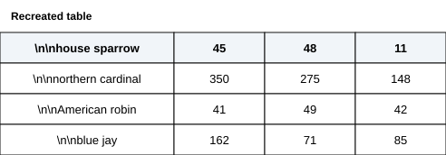

*Recreated visual (table).*

**Question:**

Which choice most effectively uses data from the table to complete the assertion?

**Answer choices:**

A. there were 350 northern cardinals observed at site 1.
B. there were 11 house sparrows observed at site 3.
C. there were 11 northern cardinals observed at site 3.
D. there were 71 blue jays observed at site 2.

#### Question 10 — Extreme

**Passage / prompt:**

Psychologists Nina Brooks, Chioma Okafor, and colleagues investigated cross-cultural recognition of genuine (authentic) expressions of surprise and posed (deliberately produced) expressions of surprise. Study participants from 23 societies, including those in Japan and Peru, viewed randomized photographs of 24 genuine surprise expressions captured from individuals in naturally surprising situations and 24 posed surprise expressions produced separately by 24 different individuals in response to an instruction to display surprise. Analysis of the participants' evaluations of the expressions prompted the team to conclude that the ability to distinguish between genuine and posed expressions of surprise appears to be universal across cultures.

**Question:**

Which potential finding from the team's study, if true, would most directly support the team's conclusion?

**Answer choices:**

A. An assessment of the effect of demographic variables on judgments of expression type in Japan, Peru, and the other societies in the study revealed that participants' evaluations were correlated with the educational levels of the societies in which participants live.
B. A variety of people from Japan and Peru evaluated the photographs in the study, and no significant differences in listeners' judgments of expression types were found.
C. Facial muscle movements in genuine surprise expressions, such as eyebrow elevation and eye widening, have measurable variations both within and across societies.
D. The overall rate of correct judgments by participants was 67%, substantially better than chance, and genuine and posed expressions were recognized at similar rates in Japan, Peru, and the other societies in the study.

#### Question 11 — Extreme

**Passage / prompt:**

Magnetic field disruptions near a landmark vary in intensity with the landmark's size and position, and migratory birds detect these disruptions to navigate around the landmarks. Using models of three bird-eye configurations—lateral (eyes positioned far apart on sides of head), intermediate, and frontal (eyes positioned close together on front of head)—Henrik Mouritsen, Kasper Thorup, and Roswitha Wiltschko showed that as disruption intensity increases, magnetic signal variations detected in the retina increase for lateral-eyed birds but remain low for frontal-eyed birds. A second research team has therefore predicted that during nighttime migration, a bird will be more likely to avoid a landmark when the associated magnetic signal variations detected in the bird's retina are greater.

**Question:**

Which finding, if true, would most directly support the second research team's prediction?

**Answer choices:**

A. A study using landmarks that created strong magnetic disruptions during nighttime migration found that some individuals of the lateral-eyed American woodcock (Scolopax minor) collided with the landmarks more often than other individuals of the same species did.
B. A study using landmarks that created strong magnetic disruptions during nighttime migration found that the lateral-eyed American woodcock (Scolopax minor) collided with the landmarks just as often as the frontal-eyed barn owl (Tyto alba) did.
C. A study using landmarks that created strong magnetic disruptions during nighttime migration found that the frontal-eyed barn owl (Tyto alba) collided with landmarks more often than the lateral-eyed American woodcock (Scolopax minor) did.
D. A study using landmarks that created strong magnetic disruptions during nighttime migration found that the barn owl (Tyto alba), which has frontally-positioned eyes, collided with more than half of the landmarks.

#### Question 12 — Extreme

**Passage / prompt:**

Chlorophyll a (Chl a) is a pigment that primarily aids in light absorption and energy conversion across the thylakoid membrane in photosynthetic tissue; these are necessary functions in photosynthetic organisms, including aquatic macrophytes. Carrying out these functions typically requires Chl a to be expressed at high levels, evidenced by green plant tissue. The table shows the average Chl a levels and their standard deviations (indicating how dispersed the Chl a levels of individual plants are in relation to the average) of three aquatic plant species, as calculated by Layla Nazari et al. Based on the data, the researchers concluded that for some aquatic plant species, light absorption and energy conversion may occur with negligible assistance from Chl a.

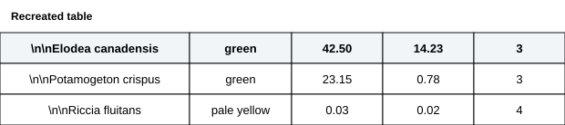

*Recreated visual (table).*

**Question:**

Which choice most effectively uses data from the table to support Nazari et al.'s conclusion?

**Answer choices:**

A. On average, E. canadensis had higher Chl a levels in their photosynthetic tissue than P. crispus and R. fluitans had.
B. Less variation in Chl a levels was observed among R. fluitans individuals than among E. canadensis and P. crispus individuals.
C. Greater average Chl a levels in a certain species were associated with greater variance in Chl a levels among individuals of that species.
D. R. fluitans had very low Chl a levels in their photosynthetic tissue.

#### Question 13 — Hard

**Passage / prompt:**

Long-distance migration is widespread among songbird species. Among studies of migratory behavior in North American songbirds, Elena M. Patterson's 1989 study of wild-caught warblers reported no tendency toward long-distance migration, while K.J. Barrett and Maya Collins's 1993 study of wild-caught thrushes did. However, the latter study included only 18 individuals, and a meta-analysis of avian-migration studies demonstrated that a minimum sample size of 195 individuals is required to be confident that a finding of population-level migration tendency is not mere statistical noise. The claim of long-distance migration in the 1993 study should therefore be treated skeptically given that ______

**Question:**

Which choice most logically completes the text?

**Answer choices:**

A. long-distance migration does not occur frequently enough among thrushes to reliably appear in a sample of only 18 individuals.
B. the sample size on which the claim is based is far below the threshold identified in the meta-analysis.
C. the study that did not find long-distance migration in warblers was also based on an insufficient population size.
D. the apparent difference between the two studies' results may be partly attributable to the 1989 study using a different standard to determine migration distance than the 1993 study did.

#### Question 14 — Extreme

**Passage / prompt:**

Before the 1905 publication of his paper on special relativity, Albert Einstein developed his theory in a research journal and personal letters. In them he first expressed one of relativity's principles: that the measurement of time depends on the observer's reference frame. He also listed works he studied, such as Ernst Mach's Science of Mechanics. A spring 1904 entry in Einstein's journal mentions the concept of relative simultaneity "as inference from Poincaré," referring to an 1898 lecture by mathematician Henri Poincaré asserting that absolute time cannot be measured. A later journal entry, dated June 1904, mentions "the puzzle of coordinate time." This suggests that ______

**Question:**

Which choice most logically completes the text?

**Answer choices:**

A. sometime in or before June 1904, Einstein determined that a postulate rooted in mathematics might also be applicable to physics.
B. in early spring 1904, Einstein realized that Poincaré's ideas regarding time measurement derived from observations of physical phenomena in nature.
C. though some of Einstein's journal entries relating to his theory of special relativity date from 1904, others must have been written as late as 1905.
D. a key concept in Einstein's theory of special relativity was first articulated by mathematicians only after Einstein's June 1904 journal entry.

#### Question 15 — Easy

**Passage / prompt:**

When we arrived in Wiltshire, England, we ______ a massive stone circle arrangement. Later that day, our tour guide remarked that such megalithic monuments are found throughout the British Isles.

**Question:**

Which choice completes the text so that it conforms to the conventions of Standard English?

**Answer choices:**

A. spot
B. spotted
C. will spot
D. are spotting

#### Question 16 — Extreme

**Passage / prompt:**

On March 15, 2019, a Colorado-based research team—Dr. James K. Patterson, Dr. Sarah Reddy, and Dr. Michael Reeves—compiled precipitation data from several sites in Wyoming's Bighorn Mountains. At Station B7, the site with the lowest elevation, the precipitation levels varied slightly throughout the day, recording ______ and 4.1 mm at 3:00 p.m.

**Question:**

Which choice completes the text so that it conforms to the conventions of Standard English?

**Answer choices:**

A. 2.3 mm at 2:00 a.m., 5.7 mm at 9:45 a.m.,
B. 2.3 mm at 2:00 a.m. 5.7 mm at 9:45 a.m.,
C. 2.3 mm, at 2:00 a.m. 5.7 mm, at 9:45 a.m.
D. 2.3 mm at 2:00 a.m. 5.7 mm at 9:45 a.m.

#### Question 17 — Hard

**Passage / prompt:**

A sound absorber is a type of material that serves to minimize reverberation—unwanted sound wave reflection that occurs when acoustic energy encounters hard surfaces in enclosed spaces. Though modern acoustical engineers commonly use absorbers like polyurethane foam in their designs, absorbers that have been utilized for centuries, such as wool fabric and wood panels, ______ used to this day by engineers as well.

**Question:**

Which choice completes the text so that it conforms to the conventions of Standard English?

**Answer choices:**

A. are
B. were
C. were being
D. would have been

#### Question 18 — Medium

**Passage / prompt:**

Valentina Morales, born in 1962, is a composer and conductor from Hanoi, Vietnam. Over the past decade, more composers from Vietnam, including Morales, ______ to gain recognition outside the Southeast Asian nation's borders.

**Question:**

Which choice completes the text so that it conforms to the conventions of Standard English?

**Answer choices:**

A. is beginning
B. have begun
C. has begun
D. begins

#### Question 19 — Extreme

**Passage / prompt:**

Among the world's tallest mountains are Mount Kilimanjaro, ranked ______ and Pico de Orizaba, ranked nineteenth.

**Question:**

Which choice completes the text so that it conforms to the conventions of Standard English?

**Answer choices:**

A. fourth in height, Mount McKinley; ranked tenth,
B. fourth in height Mount McKinley, ranked tenth
C. fourth in height; Mount McKinley, ranked tenth;
D. fourth in height; Mount McKinley; ranked tenth;

#### Question 20 — Extreme

**Passage / prompt:**

Was the legendary British king Arthur, ruler of Camelot and leader of the Knights of the Round Table, based on a real person? That was the question posed by the historian Geoffrey Ashe (twentieth century CE). Ashe claimed that King Arthur and the other Arthurian figures were based on actual Romano-British chieftains, accounts of whose military campaigns, recounted and embellished over time, ______ legends—a position later known as the historicist approach.

**Question:**

Which choice completes the text so that it conforms to the conventions of Standard English?

**Answer choices:**

A. having eventually become
B. to eventually become
C. eventually became
D. eventually becoming

#### Question 21 — Medium

**Passage / prompt:**

In 1928, scientists first identified vitamin C as a nutrient found in citrus fruits, which they knew promoted health—and, they assumed, existed only in plants. ______ researchers would discover significant concentrations of vitamin C in animal liver tissue, but this finding wouldn't emerge until years later.

**Question:**

Which choice completes the text with the most logical transition?

**Answer choices:**

A. In other words,
B. Eventually,
C. For example,
D. Earlier,

#### Question 22 — Extreme

**Passage / prompt:**

Adaptive modularity, in which buildings are designed to be easily reconfigured for different uses, was one of the central principles of Nia Mwangi's architectural philosophy. The approach marked a radical departure from the design philosophies of Mwangi's late twentieth-century contemporaries. ______ resulting in her building designs, like Metamorphic Plaza, being received not merely as experimental structures but as groundbreaking achievements.

**Question:**

Which choice completes the text with the most logical transition?

**Answer choices:**

A. Accordingly, Mwangi founded her namesake architecture firm in 1984,
B. Specifically, Mwangi was an accomplished engineer as well as an architect,
C. Moreover, Mwangi implemented her concepts with great precision and vision,
D. In contrast, Mwangi gained a reputation as an unpredictable iconoclast,

#### Question 23 — Extreme

**Passage / prompt:**

Many international film festivals feature opening night selections—high-profile film premieres—to showcase cinema traditions of the host country. These selections included a documentary about fado music, a Portuguese folk tradition, and a film about the Japanese tea ceremony. ______ they were chosen as opening night selections at film festivals in Lisbon, Portugal, and Tokyo, Japan, respectively.

**Question:**

Which choice completes the text with the most logical transition?

**Answer choices:**

A. Fittingly,
B. By contrast,
C. Additionally,
D. Nevertheless,

#### Question 24 — Medium

**Passage / prompt:**

While researching a topic, a student has taken the following notes:
- Elena Volkov and Marcus Osei are both professional musicians.
- Composer Sofia Morales scored the films Beneath the Clouds (2021) and The Silent Harbor (2022).
- Elena Volkov played violin on Sofia Morales’s film scores.
- Marcus Osei played French horn on Sofia Morales’s film scores.

**Question:**

The student wants to emphasize a difference between Elena Volkov and Marcus Osei. Which choice most effectively uses relevant information from the notes to accomplish this goal?

**Answer choices:**

A. Elena Volkov and Marcus Osei have both lent their musical talents to film scores by Sofia Morales.
B. Beneath the Clouds and The Silent Harbor, released in 2021 and 2022, respectively, are films scored by composer Sofia Morales.
C. Elena Volkov played on Sofia Morales's second feature film, The Silent Harbor, which was released one year after her film Beneath the Clouds.
D. Both musicians have played on Sofia Morales film scores, but Elena Volkov played violin, whereas Marcus Osei played French horn.

#### Question 25 — Easy

**Passage / prompt:**

While researching a topic, a student has taken the following notes:
- A strait is a narrow channel of water connecting two larger bodies of water.
- A strait separates two landmasses.
- The Strait of Gibraltar is located in Southern Europe.
- The Strait of Hormuz connects the Persian Gulf to the Gulf of Oman.
- Both the Strait of Gibraltar and the Strait of Hormuz connect two larger bodies of water while separating two landmasses.

**Question:**

The student wants to emphasize a similarity between the Strait of Gibraltar and the Strait of Hormuz. Which choice most effectively uses relevant information from the notes to accomplish this goal?

**Answer choices:**

A. A strait, or channel, is a narrow waterway that connects two larger bodies of water while separating two landmasses.
B. The Strait of Gibraltar and the Strait of Hormuz both connect two larger bodies of water while separating two landmasses.
C. The Strait of Hormuz connects the Persian Gulf to the Gulf of Oman.
D. The Strait of Gibraltar is a channel, located in Southern Europe.

#### Question 26 — Easy

**Passage / prompt:**

While researching a topic, a student has taken the following notes:
- Sonata form is a musical structure used in classical composition.
- It includes several distinct sections within a musical piece.
- The exposition is one section of sonata form.
- Other sections include the development and the recapitulation.

**Question:**

The student wants to provide an example of a section in sonata form. Which choice most effectively uses relevant information from the notes to accomplish this goal?

**Answer choices:**

A. In musical composition, some sections are parts of a piece.
B. The exposition is an example of a section in sonata form.
C. Sonata form includes several sections in a musical piece.
D. Musical structure is an important part of composition, including sonata form.

#### Question 27 — Medium

**Passage / prompt:**

While researching a topic, a student has taken the following notes:
- Gesha is a rare and highly sought-after coffee variety.
- Samples of Gesha coffee were sourced from Yirgacheffe, Ethiopia.
- Aromatic complexity refers to a layered, multidimensional scent profile in foods.
- It is produced by volatile aromatic compounds.
- Participants in a sensory study evaluated samples of Gesha and found its aromatic complexity to be high.

**Question:**

The student wants to emphasize the aromatic complexity of Gesha. Which choice most effectively uses relevant information from the notes to accomplish this goal?

**Answer choices:**

A. Aromatic complexity is a layered, multidimensional scent profile produced by compounds in foods such as aged cheese and toasted nuts.
B. Samples of Gesha, a rare coffee variety, have been sourced from Yirgacheffe, Ethiopia.
C. Participants in a research study found the aromatic complexity of Gesha, a rare coffee variety, to be high.
D. Aromatic complexity is produced by compounds in Gesha, aged cheese, and toasted nuts.

### Module 2

#### Question 1 — Medium

**Passage / prompt:**

An emerging researcher in environmental policy spoke at a recent scientific symposium about what motivated her to pursue a career in environmental science. The presenter credited much of her inspiration to ______ Rachel Carson's work in Silent Spring, which was among the presenter's most influential texts during college.

**Question:**

Which choice completes the text with the most logical and precise word or phrase?

**Answer choices:**

A. an indifference to
B. a constraint on
C. a skepticism of
D. an affinity for

#### Question 2 — Medium

**Passage / prompt:**

The British Museum in London houses over 8 million objects from across human history. Museum visitors looking to ______ their cultural experience should explore London's landmarks, where they can find treasures ranging from Henry Moore's sculpture Locking Piece at Kensington Gardens to the historic Tower Bridge spanning the River Thames.

**Question:**

Which choice completes the text with the most logical and precise word or phrase?

**Answer choices:**

A. supplement
B. satisfy
C. provoke
D. mitigate

#### Question 3 — Easy

**Passage / prompt:**

The people inhabiting the Stone Age sites now known as Gesher Benot Ya'aqov and Wonderwerk Cave likely began using fire-making tools as a means of cooking food and providing warmth, but Priya Reddy et al. argue that as fire-making became ______, its purpose shifted from the purely practical. Once creating fire turned into a widespread, routine practice, variations in fire-making techniques could take on social and ritual significance.

**Question:**

Which choice completes the text with the most logical and precise word or phrase?

**Answer choices:**

A. commonplace
B. intermittent
C. contentious
D. practical

#### Question 4 — Hard

**Passage / prompt:**

In the midst of these moments of seeming idleness, an idea will crystallize, a composition I want to capture, a color palette, an angle, a subject for a series, a perspective. A breakthrough or insight can occur while wandering through the city or studying the work of other photographers. By doing "nothing" and simply observing, I am actually <u>visualizing</u>, even if no photographs are taken.

**Question:**

Based on the text, what does Hassan most likely mean when he states that he is "<u>visualizing</u>"?

**Answer choices:**

A. He is fooling himself about his genuine commitment to a project.
B. He is collecting reference materials to incorporate in his photography.
C. He is participating in an essential part of his creative process.
D. He is being comforted by experiencing the artistic achievements of others.

#### Question 5 — Hard

**Passage / prompt:**

Some researchers posit that the valley networks found in Mars's Tharsis region date to the planet's early Noachian period around 3.5 billion years ago. A study conducted by David R. Montgomery et al. found, however, that the formation age (the age determined by crater density analysis and erosion patterns in the geological formation) of the valley networks in the Tharsis region is 1.2 billion years; Montgomery et al. further found that the formation age of valley networks in the Martian highlands generally is approximately 1.5 billion years.

**Question:**

Which choice best describes the overall structure of the text?

**Answer choices:**

A. It presents a possibility that some researchers have raised, then describes a study that clarifies their reasons for doing so.
B. It explains a view some researchers have advanced, then discusses study results that led them to reconsider that view.
C. It describes an idea that some researchers have put forward, then presents study results that are incompatible with that idea.
D. It identifies a discrepancy between a hypothesis some researchers have proposed and related research findings, then explains that discrepancy.

#### Question 6 — Hard

**Passage / prompt:**

The following text is from Sara Mansour's 1934 poem "Respite."

We climbed to a high valley,
My companion and I.
Our deepest thoughts were never voiced,
But each understood all the other felt.
She told me how still her mind had grown
Freed from the <u>sirens and smoke.</u>
"The gentle thrush," I said, "softens his evening song
To match the peacefulness of this quiet place."

**Question:**

Which choice best describes the function of the reference to "sirens and smoke" in the text as a whole?

**Answer choices:**

A. It symbolizes the speaker's companion's view that urban energy and social connection are essential elements of a meaningful life.
B. It demonstrates how the speaker and her companion can share a deep understanding even without expressing their thoughts directly.
C. It establishes a sharp contrast to the speaker's companion's present state of mental stillness.
D. It highlights a conflict between the natural world and the connection between the speaker and her companion.

#### Question 7 — Extreme

**Passage / prompt:**

The scenario of an adult rat navigating an enriched environment with novel spatial configurations illustrates a major dimension of neural development across the lifespan, from early infancy to advanced age: <u>neuroplastic responses in post-developmental periods.</u> Though one prominent hypothesis posits that significant neural adaptations are primarily driven by experiences during critical developmental windows (e.g., synaptic formation in early childhood), plastic changes occurring after maturation arguably contribute comparably by enabling sophisticated remodeling (e.g., dendritic branching in response to environmental complexity).

**Question:**

Which choice best describes the function of the underlined portion in the text as a whole?

**Answer choices:**

A. It establishes that neural changes occurring before developmental maturity exemplify the kind of remodeling mentioned later in the text.
B. It identifies a particular type of neural process whose relevance to brain development across the lifespan is the overall focus of the text.
C. It narrows the text's focus from the full range of neural development across the lifespan to processes applicable to only early developmental stages.
D. It defines a scientific term central to the text's discussion of the role of critical periods in driving neural adaptations.

#### Question 8 — Hard

**Additional text:**

For decades, marine biologists assumed that if they observed a mimic octopus—a cephalopod species found in temperate coastal waters—displaying dramatic color changes, they must be observing a male. That's because chromatic display has long been considered a male trait; researchers have argued that color change enables males to attract mates and establish dominance.

**Additional text:**

Recent evidence shows that a female mimic octopus is as capable of chromatic display as a male is. In fact, Layla Khoury and colleagues found evidence of female color-changing ability in 68% of the 287 cephalopod species they examined. They claim that the historical mischaracterization of chromatic display as a male trait is largely the result of bias: much of the research marine biologists have carried out has been in shallow coastal regions near research stations, where female chromatic display is less common than it is in deep ocean environments.

**Question:**

Based on the texts, how would Khoury and colleagues (Text 2) most likely respond to the view of chromatic display presented in Text 1?

**Answer choices:**

A. They would argue that it was influenced by the kinds of study sites researchers tended to select.
B. They would underscore that male cephalopods in shallow regions are likely using their color changes for different purposes than are male cephalopods in deep ocean environments.
C. They would claim that other factors than mate attraction and dominance establishment have driven the evolution of color change in male cephalopods.
D. They would suggest that it reflects a tendency to study male cephalopods rather than female cephalopods.

#### Question 9 — Extreme

**Passage / prompt:**

Although notorious for its strict formal requirements, the villanelle is nevertheless represented by such wide-ranging examples as Marilyn Hacker's "Villanelle for a Friend" and Ocean Vuong's "The Edge of the Forest"—poems that differ remarkably in theme, tone, and imagery. It may seem counterintuitive that the villanelle—seemingly constrictive and antiquated—could accommodate such variety, but poet Terrance Hayes contends that the form invites experimentation: when a genre's restrictions are as recognizable as those of the villanelle, the opportunity to defy them is especially compelling.

**Question:**

Which choice best states the main idea of the text?

**Answer choices:**

A. Although Hacker's and Vuong's villanelles are both widely celebrated for their striking originality, most modern examples of the form are generally regarded as conventional.
B. Although the villanelle is now recognized for the way it facilitates experimentation, there was a long period in its history in which very little innovation occurred.
C. That the villanelle remains as popular as it is today is unexpected, given that many of the features associated with the form have long since seemed antiquated to readers.
D. As a form, the villanelle encourages a surprising amount of variety, even though certain characteristics associated with it suggest this would be unlikely.

#### Question 10 — Extreme

**Passage / prompt:**

Sociologist Dr. Lisa Tanaka finds that 12% of global internet users employ advanced encryption software (digital tools developed in jurisdictions such as Switzerland that provide enhanced data protection for users who reside outside those jurisdictions). Tanaka also finds that use of encryption software differs between countries—it is rarely employed by citizens in Canada, while many users who utilize such software reside in Brazil or South Korea. Technology ethicist Marcus Lindqvist expresses concern about corporations that fail to implement robust encryption as a method of data handling that, though legally accessible, nonetheless allows companies to circumvent responsibility for protecting user information.

**Question:**

Based on the text, what does Tanaka's research suggest about citizens in Canada?

**Answer choices:**

A. They are less likely than citizens in Brazil to use encryption tools developed in Switzerland.
B. They are engaging in digital practices that Lindqvist would acknowledge as beneficial because they are legally accessible.
C. They are more likely than residents of Switzerland to employ security strategies that might offer greater protection but that might also result in reduced convenience.
D. They are more likely than residents of South Korea to circumvent corporate data collection.

#### Question 11 — Extreme

**Passage / prompt:**

Baseline ocean temperatures typically remain stable in temperate zones, while many fish species have demonstrated elevated thermal tolerance levels. A team of marine biologists therefore hypothesized that thermal adaptation (the capacity of organisms to survive in temperatures above their historical range) might enable certain species to persist in warming ocean conditions. The team's experiments showed that the maximum temperature tolerance of yellowfin tuna is sufficiently high to facilitate survival in projected warming scenarios, a finding that suggests that ______

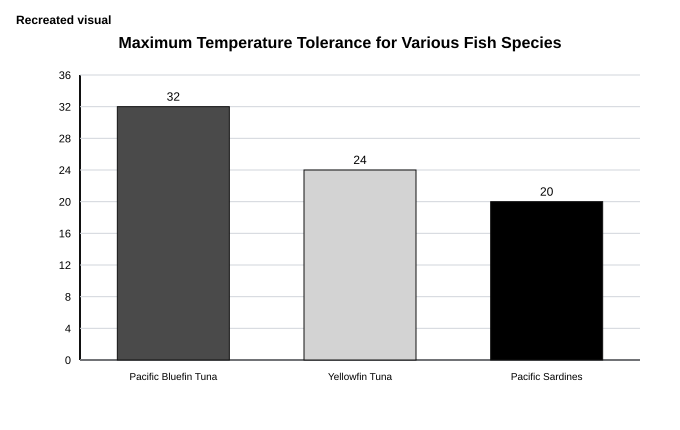

*Recreated visual (graph).*

**Question:**

Which choice most effectively uses data from the graph to complete the text?

**Answer choices:**

A. Pacific sardines should demonstrate the opposite tendency.
B. the minimum temperature tolerance necessary for a fish species to survive warming conditions must be greater than 20°C.
C. Pacific bluefin tuna should also demonstrate this capacity.
D. Pacific bluefin tuna and Pacific sardines, having different maximum tolerances than yellowfin tuna have, should not demonstrate this capacity.

#### Question 12 — Extreme

**Passage / prompt:**

In the American South during the 1930s, blues musicians made livings as itinerant performers, but their original compositions have been a mystery, thought to be improvised or never documented at all. Recently, however, Sofia Lindqvist has argued that an audio archive compiled in the 1930s by Thomas Brennan contains three recordings likely copied from a performance notebook belonging to a blues musician working in the area around Brennan's home. Lindqvist cites features of the recordings characteristic of live performance, such as introducing songs with spoken commentary, extensive use of repetitive verse structures (allowing for improvisation), and references to passing the hat for payment from listeners.

**Question:**

Which statement, if true, would most strongly support Lindqvist's argument?

**Answer choices:**

A. Brennan's archive contains the earliest examples of the three recordings in question, but each of those recordings occurs in other audio collections compiled after Brennan's.
B. Features like repetitive verse structures also occur in other recordings from the period that were widely distributed but are not known to have been performed for live audiences.
C. The three recordings in question contain references that presume that the audience is familiar with Clarksdale and other small Delta towns near where Brennan lived.
D. Itinerant blues musicians are thought to have performed mainly for working-class audiences, and other parts of Brennan's archive reflect his interest in recordings with commercial appeal.

#### Question 13 — Extreme

**Passage / prompt:**

The advent of online video streaming has led many viewers to drift away from ownership of films and television shows (through digital purchases or through physical media such as DVDs and Blu-rays) in favor of the streaming services StreamFlix and WatchNow, among others. Ryan Sullivan studied the effect of the 2013 implementation of a restriction on the free version of the Swedish streaming service Viewly: its unlimited usage was reduced to ten hours a month, while the paid premium version's usage remained unlimited. Ryan Sullivan found that viewers who used the free service visited licensed online video retailers (e.g., the Google Play store) and sites that offer pirated content to download about 3% less after the restriction was implemented, suggesting that ______.

**Question:**

Which choice most logically completes the text?

**Answer choices:**

A. the implementation of the restriction reduced the overall number of users of the streaming service
B. restrictions on the amount of video content that can be streamed may actually suppress viewers' interest in owning films and television shows
C. most users of the free streaming service were probably encouraged by the restriction to move to a paid version of the service with unlimited, ad-free viewing
D. consumers are unlikely to purchase physical copies of video content that is readily available through streaming

#### Question 14 — Extreme

**Passage / prompt:**

Exclusively inhabiting polar regions such as Antarctica, wild emperor penguins lack adaptations to seasonal variations in photoperiod (day length) that occur in temperate zones; since extended darkness enables many vertebrates to regulate melatonin production for circadian rhythms, Jordan Rivera and colleagues studied aquarium penguins in Japan and other temperate countries to see how melatonin levels are affected by the seasonal variations in darkness duration that occur in those locations. They found that penguins' melatonin levels were significantly lower in summer than in winter and appeared unaffected by artificial lighting adjustments implemented by aquarium staff. Rivera and colleagues point out, however, that lighting protocols were rare, highly varied, and poorly tracked, and therefore they caution against concluding that ______

**Question:**

Which choice most logically completes the text?

**Answer choices:**

A. wild emperor penguins in Antarctica would exhibit the same melatonin responses to artificial lighting as aquarium penguins in temperate countries.
B. artificial lighting adjustments are ineffective at influencing melatonin levels in aquarium penguins housed in temperate countries.
C. melatonin levels among aquarium penguins in Japan and other temperate countries show seasonal variation in response to changes in darkness duration.
D. further research on the relationship between artificial lighting and melatonin regulation in captive penguins could yield useful findings.

#### Question 15 — Extreme

**Passage / prompt:**

In an analysis of ancient trade networks in Uruk, Harappa, and other Mesopotamian and Indus Valley city-states, researchers drew on modern network complexity theory, which posits that trade partner diversity in major trading hubs increases as total trade volume grows larger. Hypothesizing that this typical relationship would have differed in ancient city-states because of the constraining influence of centralized palace-temple economic control systems (which are much less pronounced in modern markets) on merchant autonomy and market competition—drivers of trade network expansion—the team created a model that accounted for the presence of redistributive economic institutions. They found that the typically expected diversity-volume relationship held for each of the 89 ancient city-states whose growth they analyzed, suggesting that ______

**Question:**

Which choice most logically completes the text?

**Answer choices:**

A. although there tends to be a positive relationship between trade volume and development of partner diversity for both ancient city-states and modern markets, economic institutions likely limited the rate at which trade partner diversity increased in ancient city-states.
B. despite a change in the role of economic control systems over time, there is likely a notable consistency between ancient city-states and modern markets in underlying elements of the commercial and competitive interactions among traders that shape the development of trade networks.
C. the commercial and competitive dynamics that affect trade network expansion were likely much different in ancient city-states than in modern markets, despite the similarity across time in trade partner diversity patterns.
D. the constraining influence of centralized palace-temple institutions likely had a significant effect on merchants in some trade sectors but little to no effect on merchants in other trade sectors.

#### Question 16 — Hard

**Passage / prompt:**

In protein analysis, determining the size of a molecule requires knowing its molecular weight, a quantification of the mass of all amino acids in the protein chain. The enzymatic ______ has a molecular weight of 14.7 kDa.

**Question:**

Which choice completes the text so that it conforms to the conventions of Standard English?

**Answer choices:**

A. protein, fibrinopeptin (132 amino acids),
B. protein, fibrinopeptin (132 amino acids)
C. protein fibrinopeptin (132 amino acids),
D. protein fibrinopeptin (132 amino acids)

#### Question 17 — Extreme

**Passage / prompt:**

In pre-colonial Northeastern North America, wampum beads were used as a commodity currency. By using specific goods like wampum beads as common units of exchange, commodity currency economies facilitate trade, which is why they often replaced barter economies. Barter economies abandon ______ that requires what economist Adam Smith describes as a "mutual alignment of needs"—in other words, each trading party must possess precisely what the other desires.

**Question:**

Which choice completes the text so that it conforms to the conventions of Standard English?

**Answer choices:**

A. currency in place of a goods-for-goods exchange system
B. currency—in place of a goods-for-goods exchange system
C. currency, in place of a goods-for-goods exchange system
D. currency, in place of a goods-for-goods exchange system,

#### Question 18 — Extreme

**Passage / prompt:**

In cognitive psychology, episodic memories are considered a distinct category because they are truly separable from semantic memories, "truly" being a word that admits a degree of uncertainty. In 2022, researchers L. Bergman, A. Okafor, and K. Lindstrom devised a computational model of distinctness (separability) that would account for such variation. Determining whether memories are "entirely distinct" or "partially overlapping"—whether experiences, facts, or skills— ______ among their primary aims.

**Question:**

Which choice completes the text so that it conforms to the conventions of Standard English?

**Answer choices:**

A. were
B. was
C. having been
D. being

#### Question 19 — Extreme

**Passage / prompt:**

In recent years, the Japanese architect Kenzo Tange (1913–2005), whose buildings were widely influential during his lifetime, has been rediscovered by contemporary scholars—a resurgence of interest that is largely due to architectural historians such as Connor Murphy, whose work ______ the sophistication of Tange's designs and the architect's historical importance to the Metabolist architectural movement encourages a broader rethinking of Japanese Modernism itself.

**Question:**

Which choice completes the text so that it conforms to the conventions of Standard English?

**Answer choices:**

A. illustrates
B. has illustrated
C. illustrating
D. is illustrating

#### Question 20 — Extreme

**Passage / prompt:**

The extraordinary capabilities that quantum computing processors have brought to computational technology belie their extreme cooling requirements, the processors typically ______ at temperatures from negative 273 to negative 270 degrees Celsius.

**Question:**

Which choice completes the text so that it conforms to the conventions of Standard English?

**Answer choices:**

A. operate
B. can operate
C. will operate
D. operating

#### Question 21 — Medium

**Passage / prompt:**

Since 1968, the Harlem Studio Museum in New York, New York, has cultivated a multigenerational community of Caribbean American creatives—from poet Derek Walcott, to musician Harry Belafonte, to visual artists like Romare Bearden and Wifredo Lam, ______ it has garnered a reputation as a hub of Caribbean American art and culture in New York.

**Question:**

Which choice completes the text with the most logical transition?

**Answer choices:**

A. occasionally,
B. in contrast,
C. however,
D. therefore,

#### Question 22 — Medium

**Passage / prompt:**

For several centuries after the establishment of modern biological classification in eighteenth-century Sweden, Latin remained the default language in which most taxonomic names were written. ______ biologists today, such as the taxonomist Dr. Layla Hassan, encounter a wide range of Latin terms—from genus (the general group) to species (the specific type)—when consulting many eighteenth-century taxonomic classifications.

**Question:**

Which choice completes the text with the most logical transition?

**Answer choices:**

A. However,
B. Thus,
C. Lastly,
D. Granted,

#### Question 23 — Extreme

**Passage / prompt:**

At Tallgrass Prairie National Preserve in Kansas, the historic Prairie Crossing Bridge is exposed to wind, moisture, extreme temperatures, and insects. ______ it remains structurally sound due to its material: the bridge is built from pressure-treated timber.

**Question:**

Which choice completes the text with the most logical transition?

**Answer choices:**

A. As a result,
B. In addition,
C. That said,
D. On the contrary,

#### Question 24 — Hard

**Passage / prompt:**

Known as "the empire that spanned the globe," the British Empire once controlled territories across four continents. Its legacy can still be seen, and heard, in the English-speaking nation of India, which gained its independence from Britain in the twentieth century. ______ a former colony's tie to the British Empire is so tenuous that English is rarely used in daily life; an example is Myanmar, which ceased to be part of the empire in 1948.

**Question:**

Which choice completes the text with the most logical transition?

**Answer choices:**

A. As a result,
B. In addition,
C. At the same time,
D. On the other hand,

#### Question 25 — Easy

**Passage / prompt:**

While researching a topic, a student has taken the following notes:
- Stalactites are icicle-shaped mineral formations that hang from cave ceilings.
- Water containing dissolved minerals drips from the ceiling of a cave.
- As water drips, it leaves behind mineral deposits.
- Over time, the repeated dripping and depositing of mineral-rich water forms stalactites.
- Carlsbad Caverns is a famous cave system containing many long stalactites.

**Question:**

The student wants to identify what causes stalactites. Which choice most effectively uses relevant information from the notes to accomplish this goal?

**Answer choices:**

A. Long stalactites are caused by many centuries of mineral deposition from the cave ceiling over time.
B. The dripping and depositing of mineral-rich water from a cave ceiling forms stalactites, or icicle-shaped formations, over time.
C. Over time, many long stalactites have formed in the Carlsbad Caverns, a cave system in the United States.
D. The stalactites in the Carlsbad Caverns will continue to grow longer and thicker over thousands of years.

#### Question 26 — Extreme

**Passage / prompt:**

While researching a topic, a student has taken the following notes:
- The House of the Faun is a large ancient Roman residence in Pompeii, Italy.
- It was inhabited from approximately 180 BCE until the eruption of Mount Vesuvius in 79 CE.
- It was preserved beneath layers of volcanic ash.
- It featured single-story stone and marble construction.
- Its design included interior courtyards called atria surrounded by rectangular, interconnected rooms.

**Question:**

The student wants to provide a detailed overview of the structures at the House of the Faun. Which choice most effectively uses relevant information from the notes to accomplish this goal?

**Answer choices:**

A. Preserved by volcanic ash, the House of the Faun's single-story stone and marble construction featured interior courtyards called atria surrounded by rectangular, interconnected rooms.
B. The House of the Faun, whose structures were built by ancient Romans in Pompeii, was inhabited from approximately 180 BCE until the eruption of Mount Vesuvius in 79 CE.
C. Located in Pompeii, Italy, the House of the Faun was designed with atria, interior courtyards that included central pools and served as spaces for receiving guests and conducting household rituals.
D. Ancient Romans used stone and marble in the construction of the House of the Faun in Pompeii, Italy.

#### Question 27 — Extreme

**Passage / prompt:**

While researching a topic, a student has taken the following notes:
- Acidity is measured using the pH scale.
- Solutions with lower pH values are more acidic than solutions with higher pH values.
- Lemon juice has a pH value of 2.
- Coffee has a pH value of 5.
- Pure water has a neutral pH value of 7.

**Question:**

The student wants to make a generalization about solutions. Which choice most effectively uses relevant information from the notes to accomplish this goal?

**Answer choices:**

A. Based on their pH values, lemon juice (2) is more acidic than coffee (5), and coffee is more acidic than pure water (7).
B. Any solution with a pH of 2, like lemon juice, is more acidic than a solution with a pH of 5, like coffee.
C. Lemon juice has a lower pH than pure water because lemon juice is more acidic than pure water.
D. The pH scale can be used to order lemon juice, coffee, and pure water by acidity.

## Math

### Module 1

#### Question 1 — Extreme

**Question:**

A quadratic function models the height, in meters, of a stream of water above the ground in terms of the time, in seconds, after the water was released. The model estimates that the water was released from an initial height of $0$ meters above the ground and reached a maximum height of $45$ meters above the ground $3$ seconds after it was released. The model also estimates that the water was at a height of $25$ meters above the ground $x$ seconds after it was released. What is a possible value of $x$?

**Response:** Student-produced response

#### Question 2 — Easy

**Question:**

The function $f$ is defined by $f(x) = 6(7x - 8)$. What is the value of $f(12)$?

**Answer choices:**

A. $12$
B. $456$
C. $72$
D. $84$

#### Question 3 — Easy

**Question:**

A concert venue that hosts both seated and standing attendees can accommodate at most $87$ people. Which inequality represents this situation, where $s$ is the number of seated attendees and $t$ is the number of standing attendees?

**Answer choices:**

A. $s - t \leq 87$
B. $s + t \leq 87$
C. $s + t > 87$
D. $s - t \geq 87$

#### Question 4 — Hard

**Question:**

$5x + 23 = 5x + c$. In the given equation, $c$ is a constant. The equation has infinitely many solutions. What is the value of $c$?

**Response:** Student-produced response

#### Question 5 — Easy

**Question:**

The $y$-intercept of the graph of $y=8(2.34)^x$ in the $xy$-plane is $(0,y)$. What is the value of $y$?

**Response:** Student-produced response

#### Question 6 — Easy

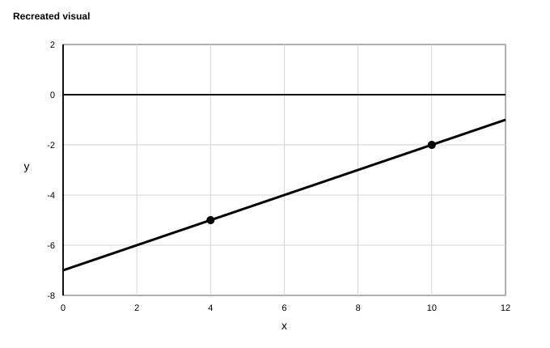

*Recreated visual (graph).*

**Question:**

The graph of the linear function $f$ is shown, where $y=f(x)$. What is the slope of the graph of $f$?

**Answer choices:**

A. $2$
B. $-5$
C. $-\frac{1}{2}$
D. $\frac{1}{2}$

#### Question 7 — Easy

**Question:**

A marathon runner completed a race with an average speed of $9.500$ miles per hour. What was the average speed, in feet per hour, of the runner during the race? ($1$ mile = $5{,}280$ feet)

**Response:** Student-produced response

#### Question 8 — Extreme

**Question:**

Triangle $PQR$ is similar to triangle $XYZ$, where angle $P$ corresponds to angle $X$ and angle $R$ corresponds to angle $Z$. Angles $R$ and $Z$ are right angles. If $\tan P = \frac{15}{8}$, what is the value of $\sin X$?

**Answer choices:**

A. $\frac{15}{17}$
B. $\frac{8}{17}$
C. $\frac{17}{15}$
D. $\frac{17}{8}$

#### Question 9 — Hard

**Question:**

The function $P(w) = 26w$ gives the perimeter of a rectangle, in meters $(\text{m})$, if the width of the rectangle is $w$ m and the length is $12$ times the width. Which of the following is the best interpretation of $P(15) = 390$?

**Answer choices:**

A. If the width of the rectangle is $390$ m, then the length of the rectangle is $15$ m.
B. If the width of the rectangle is $15$ m, then the perimeter of the rectangle is $390$ m.
C. If the width of the rectangle is $15$ m, then the length of the rectangle is $390$ m.
D. If the width of the rectangle is $390$ m, then the perimeter of the rectangle is $15$ m.

#### Question 10 — Easy

**Passage / prompt:**

$-6(x - 8)(x - 4)(x + 5) = 0$

**Question:**

What value of $x$ is a solution to the given equation?

**Answer choices:**

A. $8$
B. $5$
C. $-4$
D. $-6$

#### Question 11 — Medium

**Question:**

Circle $M$ has a radius of $6$ centimeters (cm). Circle $N$ has an area of $100\pi$ $cm^2$. What is the total area, in $cm^2$, of circles $M$ and $N$?

**Answer choices:**

A. $25\pi$
B. $136\pi$
C. $36\pi$
D. $56\pi$

#### Question 12 — Hard

**Question:**

Given $y^2 + 37y + 2 = 0$, what is one of the solutions to the given equation?

**Answer choices:**

A. $\frac{-2 + \sqrt{1361}}{2}$
B. $\frac{-37 + \sqrt{1361}}{74}$
C. $\frac{-37 + \sqrt{1361}}{2}$
D. $\frac{-2 + \sqrt{1361}}{74}$

#### Question 13 — Extreme

**Question:**

A model estimates that the initial number of bacteria in a culture is 1200 when antibiotic treatment begins. The model also estimates that during the treatment, the number of bacteria in the culture decreases by 50% for each 6 hours of treatment. Which equation represents this model, where $N$ is the estimated number of bacteria in the culture at a time $t$ hours after treatment begins?

**Answer choices:**

A. $N = 1200(6)^{\frac{t}{2}}$
B. $N = 1200(0.5)^{t}$
C. $N = 1200(2)^{\frac{t}{6}}$
D. $N = 1200(0.5)^{\frac{t}{6}}$

#### Question 14 — Hard

**Question:**

In the $xy$-plane, line $m$ passes through the points $(4, 0)$ and $(0, 6)$. Which of the following is an equation of line $m$?

**Answer choices:**

A. $2x - 3y = 12$
B. $3x - 2y = 12$
C. $2x + 3y = 12$
D. $3x + 2y = 12$

#### Question 15 — Easy

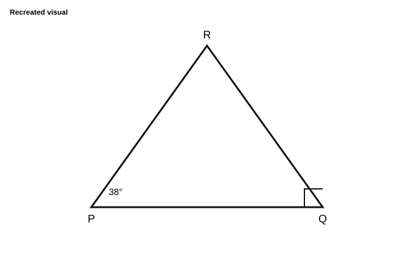

*Recreated visual (graph).*

**Question:**

Note: Figure not drawn to scale. In right triangle $PQR$ shown, what is the measure of $\angle R$?

**Answer choices:**

A. $142^\circ$
B. $128^\circ$
C. $52^\circ$
D. $38^\circ$

#### Question 16 — Extreme

**Question:**

$3x + 2y = 16$

$5x - 3y = 14$

The solution to the given system of equations is $(x, y)$. What is the value of $4x - 7y$?

**Response:** Student-produced response

#### Question 17 — Extreme

**Question:**

A circle in the $xy$-plane has its center at $(3, -2)$ and the point $(6, 2)$ lies on the circle. Which equation represents this circle?

**Answer choices:**

A. $(x-3)^2 + (y+2)^2 = 25$
B. $(x+3)^2 + (y+2)^2 = 5$
C. $(x-3)^2 + (y-2)^2 = 25$
D. $(x-3)^2 + (y+2)^2 = 5$

#### Question 18 — Extreme

**Passage / prompt:**

Note: Figure not drawn to scale.

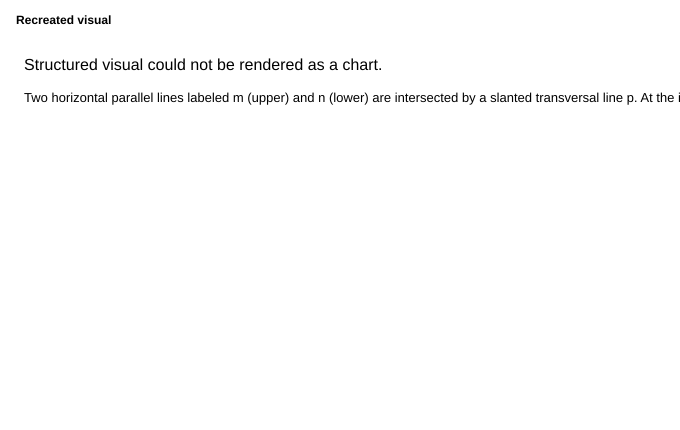

*Recreated visual (graph).*

**Question:**

In the figure, lines $m$ and $n$ are parallel and line $p$ intersects both lines. If $x = 3n + 62$ and $y = \frac{n}{3} + 58$, what is the value of $z$?

**Response:** Student-produced response

#### Question 19 — Hard

**Question:**

$0.3x + 0.8y = 6$

$1.2x + 3.2y = 24$

How many solutions does the given system of equations have?

**Answer choices:**

A. Infinitely many
B. Exactly two
C. Exactly one
D. Zero

#### Question 20 — Extreme

**Question:**

For a study, a research team recorded the test scores of $240$ students from Lincoln High School and $120$ students from Washington High School. The research team determined that the mean score of the $240$ students from Lincoln High School was $76$ points and the mean score of the $120$ students from Washington High School was $82$ points. What was the mean score, in points, of all $360$ students the research team recorded for this study?

**Answer choices:**

A. $80$
B. $77$
C. $79$
D. $78$

#### Question 21 — Extreme

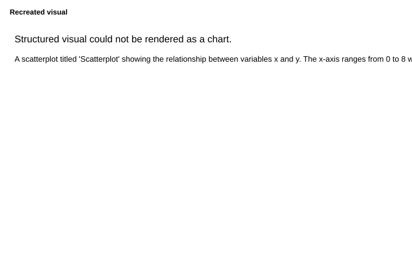

*Recreated visual (graph).*

**Question:**

Which of the following equations is the most appropriate model for the data shown in the scatterplot?

**Answer choices:**

A. $y = 20(1.4)^{x-4}$
B. $y = 20(1.4)^{x-4} + 12$
C. $y = 8(1.4)^{x-4} + 12$
D. $y = (1.4)^{x-4} + 19$

#### Question 22 — Extreme

**Passage / prompt:**

$12abx - 3abm + 15bxm = 0$

**Question:**

In the given equation, $a$, $b$, $m$, and $x$ are positive, and $a$ is greater than $5x$. Which expression is equivalent to $m$?

**Answer choices:**

A. $\frac{-4ax}{a-5x}$
B. $12abx$
C. $\frac{4ax}{a-5x}$
D. $\frac{2ax}{a-5x}$

### Module 2

#### Question 1 — Medium

**Question:**

$y > 2x + 1$

Which graph represents the solutions to the given inequality?

**Answer choices:**

A. 
B. 
C. 
D. 

*Recreated visual (answer choice A).*

*Recreated visual (answer choice B).*

*Recreated visual (answer choice C).*

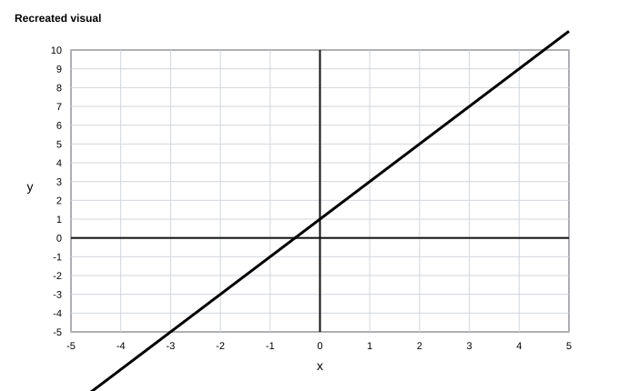

*Recreated visual (answer choice D).*

#### Question 2 — Easy

**Question:**

A baker combines $30$ grams of flour, $40$ grams of sugar, and $x$ grams of butter. The resulting dough has a mass of $125$ grams. What is the value of $x$?

**Answer choices:**

A. $30$
B. $40$
C. $55$
D. $10$

#### Question 3 — Extreme

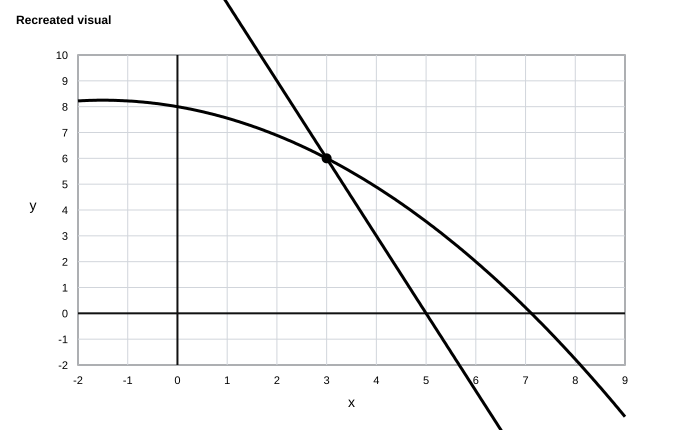

*Recreated visual (graph).*

**Question:**

The graph of a system of a linear equation and a nonlinear equation is shown. Which of the following systems has the same solution as the system shown?

**Answer choices:**

A. $x + y = 9$ and $x - y = 3$
B. $x + y = 9$ and $x - y = -3$
C. $x + y = 6$ and $x - y = 3$
D. $x + y = 6$ and $x - y = -3$

#### Question 4 — Extreme

**Question:**

Marco is saving money to buy a video game console that costs \$$349$. He currently has \$$86$ saved and earns \$$12.50$ per hour at his part-time job. If Marco can work at most 15 hours per week, what is the minimum number of complete weeks Marco must work to have enough money to buy the console?

**Answer choices:**

A. $1$
B. $2$
C. $14$
D. $21$

#### Question 5 — Hard

**Question:**

A shopping mall parking lot has a total of $450$ parking spaces. At 10 AM, $40\%$ of the spaces were occupied. By noon, the number of occupied spaces had increased by $35\%$ from the 10 AM count. How many parking spaces were occupied at noon?

**Answer choices:**

A. $243$
B. $338$
C. $180$
D. $63$

#### Question 6 — Extreme

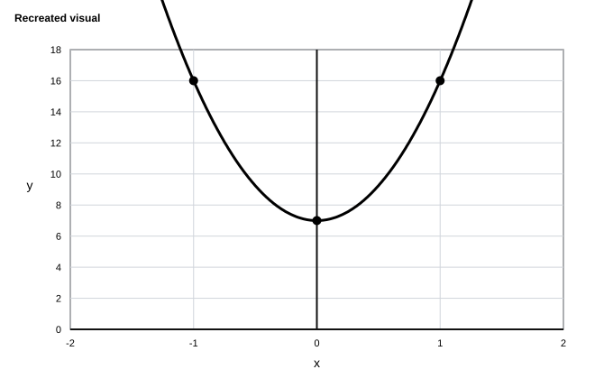

*Recreated visual (graph).*

**Question:**

The graph of the polynomial function $g$, where $y = g(x)$, is shown. The function can be written in the form $g(x) = ax^2 + b$, where $a$ and $b$ are constants. What is the value of $a + b$?

**Response:** Student-produced response

#### Question 7 — Extreme

**Question:**

For what value of $k$ does the equation $5(x + 2) = k(x + 2) - 8$ have no solutions?

**Answer choices:**

A. $5$
B. $-5$
C. $9$
D. $0$

#### Question 8 — Extreme

**Question:**

The value of $y$ is $75\%$ greater than the value of $x$. The value of $z$ is $40\%$ less than the value of $y$. The value of $z$ is what percent greater than the value of $x$?

**Answer choices:**

A. $5$
B. $35$
C. $115$
D. $105$

#### Question 9 — Easy

**Passage / prompt:**

Each of 250 students can be classified by their favorite subject among three options, as shown in the frequency table.

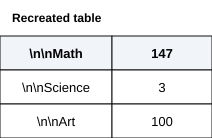

*Recreated visual (table).*

**Question:**

If one of the students is selected at random, what is the probability of selecting a student whose favorite subject is Science?

**Answer choices:**

A. $\frac{100}{250}$
B. $\frac{3}{250}$
C. $\frac{247}{250}$
D. $\frac{147}{250}$

#### Question 10 — Easy

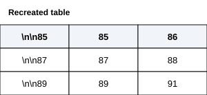

*Recreated visual (table).*

**Question:**

For certain actual temperatures, the table gives heat index values for two different relative humidity levels. According to the table, what is the heat index, in degrees Fahrenheit ($\degree\text{F}$), when the actual temperature is $87\degree\text{F}$ and the relative humidity is $60\%$? (Disregard the degree symbol when entering your answer.)

**Response:** Student-produced response

#### Question 11 — Hard

**Question:**

In triangle $ABC$, angle $A$ measures $50°$ and angle $B$ measures $70°$. Point $D$ lies on side $\overline{BC}$ such that $\overline{AD}$ bisects angle $A$. What is the measure of angle $ADB$, in degrees? (Disregard the degree symbol when entering your answer.)

**Response:** Student-produced response

#### Question 12 — Extreme

**Question:**

One of the factors of $6x^6 + 29x^3 + 9$ is $ax^3 + b$, where $a$ and $b$ are positive integer constants. Which of the following is a possible value of $ab$?

**Answer choices:**

A. $6$
B. $9$
C. $18$
D. $27$

#### Question 13 — Medium

**Question:**

District A has an area of $a$ square kilometers and a housing density of $845$ housing units per square kilometer. District B adjacent to District A has an area of $b$ square kilometers and a housing density of $425$ housing units per square kilometer. The combined number of housing units in District A and District B is $10{,}795$ housing units. Which equation represents this situation?

**Answer choices:**

A. $845a + 425b = 1{,}270$
B. $845a + 425 = 10{,}795b$
C. $845a + 425 = 1{,}270b$
D. $845a + 425b = 10{,}795$

#### Question 14 — Extreme

**Question:**

A triangle has a base length of $(2x + 4)$ centimeters and a height of $(x + 5)$ centimeters. If the area of the triangle is $70$ square centimeters, what is the value of $x$?

**Answer choices:**

A. $7$
B. $6$
C. $5$
D. $4$

#### Question 15 — Hard

**Question:**

The function $g(x) = -25x + 400$ gives the amount of water remaining $g(x)$, in gallons, in a tank that is being drained $x$ minutes after the draining begins. A second tank is modeled by $h(x) = -40x + 520$, where $h(x)$ is the amount of water remaining in gallons after $x$ minutes. After how many minutes will both tanks contain the same amount of water?

**Answer choices:**

A. $6$
B. $8$
C. $10$
D. $12$

#### Question 16 — Extreme

**Question:**

$\displaystyle 4x=\frac{16y^2}{x}-32x$

 The given equation relates the positive variables $x$ and $y$. Which equation correctly expresses $x$ in terms of $y$?

**Answer choices:**

A. $x = \frac{4y}{9}$
B. $x = \frac{2y}{3}$
C. $x = \frac{4y^2}{9}$
D. $x = \frac{2y^2}{3}$

#### Question 17 — Extreme

**Question:**

Maria earns \$$600$ per week from her job. She saves $\frac{2}{5}$ of her earnings and donates $\frac{1}{6}$ of what she saves to charity. After $5$ weeks, Maria decides to invest $\frac{3}{4}$ of her remaining savings into a fund that earns $20\%$ interest. How much money, in dollars, does Maria have in the investment fund after the interest is applied?

**Response:** Student-produced response

#### Question 18 — Hard

**Question:**

The functions $f$ and $g$ are defined by $f(x) = 3x^2 - 2x + 1$ and $g(x) = x^3 - 4$. What is the value of $f(g(2))$?

**Answer choices:**

A. $25$
B. $41$
C. $57$
D. $73$

#### Question 19 — Extreme

**Question:**

$$\frac{4}{x-3} + \frac{2}{x+7} = \frac{px+q}{(x-3)(x+7)}$$

The equation above is true for all $x > 3$, where $p$ and $q$ are positive constants. What is the value of $pq$?

**Answer choices:**

A. $132$
B. $22$
C. $6$
D. $198$

#### Question 20 — Hard

**Question:**

Function $f$ is defined as $f(x) = (3x-4)^2$, and function $g$ is defined as $g(x) = 3(x + 5)$. Which of the following is equivalent to $f(x) + g(x)$?

**Answer choices:**

A. $9x^2 - 21x + 1$
B. $9x^2 - 21x + 31$
C. $9x^2 - 9x + 31$
D. $9x^2 - 27x + 1$

#### Question 21 — Extreme

**Question:**

$$20x^2 - 60x + 45 = m + \frac{23}{5}$$

What is the greatest integer value of $m$ for which the given equation has no real solutions?

**Response:** Student-produced response

#### Question 22 — Extreme

**Question:**

Function $g$ is defined by $g(x) = -a^x + b$, where $a$ and $b$ are constants. In the $xy$-plane, the graph of $y = g(x) - 7$ has a $y$-intercept at $\left(0, -\frac{43}{6}\right)$. The product of $a$ and $b$ is $\frac{20}{3}$. What is the value of $a$?

**Response:** Student-produced response
