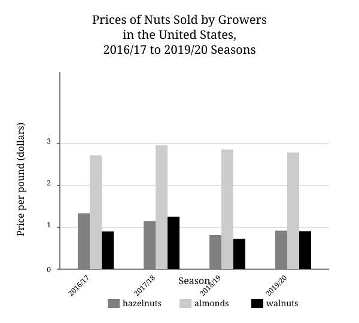
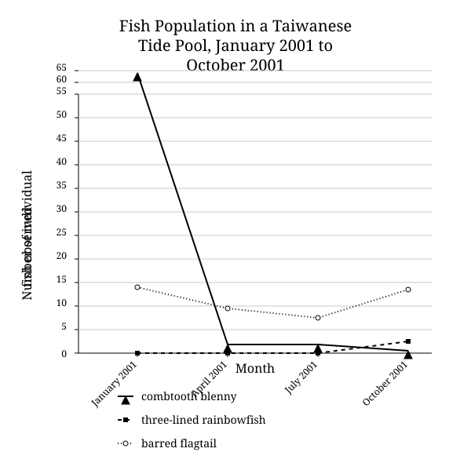

# DSAT English | August 2025 | US | Version 2

Source: https://thetestadvantage.com/passage-page/612 (test id 612)
Sections: 2 modules × 27 questions = 54 questions
Difficulty labels below are the on-screen badges (EASY / INTERMEDIATE / HARD).
Underlined portions are preserved as `<u>...</u>`. Graphics were captured as SVG into `assets/`.

## Module 1

### Question 1
**Difficulty (as shown on site):** EASY
**Skill:** Domain 2 / Domain 2 | Words in Context

**Passage:**

The chili pepper was domesticated in Mexico. It differs physically from the wild plant it is descended from. In terms of physical structure, summer squash also differs from its wild ancestor. Summer squash is known for its soft rind and mild-tasting flesh. Yet its ancestor, the wild Johnny gourd, ______ a hard rind and bitter flesh.

**Question:** Which choice completes the text with the most logical and precise word or phrase?

- A. assists
- B. refuses
- C. requests
- D. possesses

---

### Question 2
**Difficulty (as shown on site):** INTERMEDIATE
**Skill:** Domain 2 / Domain 2 | Words in Context

**Passage:**

The Apollo Moon landings (1969–1972) brought radiation detectors and lunar dust detectors to the Moon and produced large amounts of data, much of which was stored on technologies that are now obsolete. A data-transfer project is working to ______ these data so that the information is available to researcher Philip Metzger, who is investigating the long-term effects of being on the Moon.

**Question:** Which choice completes the text with the most logical and precise word or phrase?

- A. amend
- B. improve
- C. simplify
- D. salvage

---

### Question 3
**Difficulty (as shown on site):** HARD
**Skill:** Domain 2 / Domain 2 | Words in Context

**Passage:**

New and interesting research conducted by Suleiman A. Al-Sweedan and Moath Alhaj is inspired by their observation that though studies of the effect of high altitude on blood chemistry are ______, the effect on blood chemistry of living in locations below sea level, such as the California towns of Niland and Imperial, has received comparatively little notice.

**Question:** Which choice completes the text with the most logical and precise word or phrase?

- A. equivocal
- B. copious
- C. sporadic
- D. preliminary

---

### Question 4
**Difficulty (as shown on site):** EASY
**Skill:** Domain 2 / Domain 2 | Words in Context

**Passage:**

In the architectural process called modular construction, a building is manufactured in modules under controlled conditions and then assembled at its intended location. ______ of this approach cite fewer weather delays and a greater potential for reuse and recycling.

**Question:** Which choice completes the text with the most logical and precise word or phrase?

- A. Proponents
- B. Components
- C. Epitomes
- D. Safeguards

---

### Question 5
**Difficulty (as shown on site):** INTERMEDIATE
**Skill:** Domain 2 / Domain 2 | Structure

**Passage:**

Land art, or earth art, is characterized by its large scale and the fact that it’s often placed in remote or surprising locations. Land art is also notable for the wildly diverse ways in which it is created: Robert Smithson’s Spiral Jetty, for instance, was created by arranging rocks in a large spiral in Utah’s Great Salt Lake, whereas for Circular Surface Planar Displacement Drawing, Michael Heizer made lines in a desert lake bed by driving a motorcycle in certain patterns.

**Question:** Which choice best describes the overall structure of the text?

- A. The text outlines a common misconception about a kind of art, then offers an explanation for why that misconception persists.
- B. The text compares two works of art, then provides details about the lives of the artists who created them.
- C. The text conveys a definition of a kind of art, then addresses a well-established criticism of the art.
- D. The text describes a particular genre of art, then cites examples illustrating an important characteristic of that genre.

---

### Question 6
**Difficulty (as shown on site):** HARD
**Skill:** Domain 2 / Domain 2 | Function of Underlined Portion

**Passage:**

Fossil evidence indicates that the End-Triassic mass extinction—the relatively sudden die-off of about 80 percent of species (including many species of dinosaurs)—occurred approximately 201 million years ago. Researchers have identified the effects of volcanic activity as a possible initial cause of this mass extinction. But mass extinctions, <u>while abrupt in geological terms,</u> unfold over thousands or millions of years: it’s likely that multiple factors drove extensive species loss.

**Question:** Which choice best states the function of the underlined portion in the text as a whole?

- A. It expands on the uncertainty mentioned earlier regarding the pace of extinction of species of dinosaurs relative to that of other species.
- B. It offers support for an earlier claim about the primary cause of a mass extinction that is then qualified by the information that follows.
- C. It emphasizes that a question about the beginning of a mass extinction raised by the researchers mentioned earlier is still unresolved.
- D. It concedes that the pace of mass extinctions as described in the information that follows is perceived differently when considered from another point of view.

---

### Question 7
**Difficulty (as shown on site):** INTERMEDIATE
**Skill:** Domain 2 / Domain 2 | Purpose

**Passage:**

Dust aboard the International Space Station (ISS) contains many microbes common in dust on Earth, and scientists found that the levels of Aspergillus sydowii fungal spores and Lactobacillus helveticus bacteria in ISS dust were not concerning when relative humidity (RH) was kept within the ISS’s standard range (25%–75%). When exposed to constant RH of 85% and above (which can happen where handwashing occurs), however, these microbial populations expanded rapidly.

**Question:** Which choice best states the main purpose of the text?

- A. To describe an effect of RH on the growth of one fungal species and one bacterial species in ISS dust
- B. To explain why RH on the ISS can reach levels high enough to promote bacterial and fungal growth
- C. To outline the methods the ISS crew uses to monitor RH levels and microbial growth aboard the ISS
- D. To demonstrate that A. sydowii and L. helveticus respond differently to elevated RH conditions aboard the ISS than they do on Earth

---

### Question 8
**Difficulty (as shown on site):** INTERMEDIATE
**Skill:** Domain 1 / Domain 1 | Main Idea

**Passage:**

The following text is from Yung Wing’s 1909 memoir My Life in China and America.

We landed in New York on the 12th of April, 1847, after a passage of ninety-eight days of unprecedented fair weather. The New York of 1847 was altogether a different city from the New York of 1909. It was a city of only 250,000 or 300,000 inhabitants; now it is a metropolis rivaling London in population, wealth and commerce. The whole of Manhattan Island is turned into a city of skyscrapers, churches and palatial residences.

**Question:** Which choice best states the main idea of the text?

- A. The journey to New York City was extremely demanding for Yung.
- B. New York City has become more developed and populated since Yung’s arrival in 1847.
- C. The architecture in New York City is more beautiful than that in London.
- D. Yung has experienced significant personal growth in the time since his arrival to New York City in 1847.

---

### Question 9
**Difficulty (as shown on site):** HARD
**Skill:** Domain 1 / Domain 1 | Inference

**Passage:**

Pollination syndromes are suites of floral traits that have independently evolved as a result of selection pressure exerted by pollinators; psychophilous (butterfly-pollinated) flowers, for example, frequently exhibit a narrow, tubular shape. In a review of previous studies covering 417 plant species, Victor Rosas-Guerrero et al. concluded that the syndromes reliably predict angiosperms’ most effective pollinators. However, in a response paper, Jeff Ollerton et al. note that RosasGuerrero et al. may have inadvertently excluded studies published before the term “pollinator effectiveness” came into common use.

**Question:** What does the text most strongly suggest about the study conducted by Rosas-Guerrero et al.?

- A. Because the study contained data on a limited number of plant species, its conclusion is accurate for those species but cannot be applied to species not in the study.
- B. A limitation in the methodology used by the researchers may entail that the study’s conclusion is not well supported.
- C. Due to the difficulty of gathering representative research on angiosperms, the study may have included previous research with a focus too heterogeneous to be comparable.
- D. The approach selected by the researchers enabled them to sort through and remove obviously incomplete or inconsistent data before conducting their analysis.

---

### Question 10
**Difficulty (as shown on site):** EASY
**Skill:** Domain 1 / Domain 1 | Data Completes a Statement

**Passage:**

The US Department of Agriculture’s Fruit and Tree Nuts Outlook is a document that covers a variety of subjects, from the influence of changing climate on agricultural production to the effect of stinkbug damage on pear crops. A student studying agricultural economics is consulting a graph in the document that shows the prices for which several types of nuts have been sold by growers in the United States over four growing seasons from 2016 to 2020. The student wishes to determine in which season walnuts reached their lowest price. Consulting the graph, the student finds that this season was the ______

**Question:** Which choice most effectively uses data from the graph to complete the statement?

- A. 2016/17 season.
- B. 2017/18 season.
- C. 2019/20 season.
- D. 2018/19 season.

---

### Question 11
**Difficulty (as shown on site):** INTERMEDIATE
**Skill:** Domain 1 / Domain 1 | Illustrate the Claim

**Passage:**

Peter Pan is a 1911 novel by J.M. Barrie. In the fantasy novel, a dog named Nana is a nurse (nanny) for the children in the Darling family— Wendy, John, and Michael. The narrator describes Nana as planning for events like a human would: ______

**Question:** Which quotation from Peter Pan best illustrates the claim?

- A. “The Darlings had become acquainted with [Nana] in Kensington Gardens.”
- B. “On John’s [soccer] days [Nana] never once forgot his sweater, and she usually carried an umbrella in her mouth in case of rain.”
- C. “Mrs. Darling loved to have everything just so, and Mr. Darling had a passion for being exactly like his neighbours.”
- D. “While [Mrs. Darling] slept she had a dream.”

---

### Question 12
**Difficulty (as shown on site):** EASY
**Skill:** Domain 1 / Domain 1 | Data Completes a Statement

**Passage:**

Lin-Tai Ho and colleagues counted fish in a tide pool in Taiwan at several times during the year and found that some species had a significantly higher maximum population count than others. For example, the highest count for the combtooth blenny was 62 individuals in January of 2001, whereas the highest count for the three-lined rainbowfish was ______

**Question:** Which choice most effectively uses data from the graph to complete the example?

- A. 16 individuals in October of 2001.
- B. 3 individuals in October of 2001.
- C. 72 individuals in January of 2001.
- D. 13 individuals in October of 2001.

---

### Question 13
**Difficulty (as shown on site):** HARD
**Skill:** Domain 1 / Domain 1 | Support

**Passage:**

Twinflower (Linnaea borealis) plants are native to Alaska, where harsh conditions have historically impeded potential invasive species. As the boreal climate has warmed in recent decades, however, narrowleaf hawksbeard (Crepis tectorum) plants have established themselves in Alaska. It has been suggested that warming-induced delays in the onset of subfreezing temperatures in autumn can benefit invasives more than native species; to evaluate this possibility, biologists Christa Mulder and Katie Spellman tracked L. borealis and C. tectorum, along with other native and invasive species, over several years, concluding that invasives are advantaged by delays in subfreezing temperature onset in Alaska.

**Question:** Which finding, if true, would most directly support Mulder and Spellman’s conclusion?

- A. Although L. borealis and C. tectorum both tended to produce more leaves overall in years with late subfreezing temperature onset than they did in years with historically typical temperature patterns, the years with late subfreezing temperature onset also had early growing season onset in spring.
- B. Although significant interannual variations in subfreezing temperature onset were observed during the study, neither C. tectorum nor L. borealis showed any significant interannual variation in the cessation of leaf production.
- C. Although L. borealis and C. tectorum tended to stop producing leaves at about the same time in years with historically typical temperature patterns, C. tectorum stopped producing leaves sooner than L. borealis did in years with late subfreezing temperature onset.
- D. Although L. borealis and C. tectorum both tended to produce leaves later into autumn in years with late subfreezing temperature onset, the extension was much greater for C. tectorum than for L. borealis.

---

### Question 14
**Difficulty (as shown on site):** INTERMEDIATE
**Skill:** Domain 1 / Domain 1 | Logical Conclusion

**Passage:**

India has classified the spiraling whitefly as an invasive species that could harm some of the country’s native species. But researchers Alejandro Camacho and Jason McLachlan have pointed out that “invasive” and “native” are labels that describe temporary circumstances. Changes in Earth’s climate may force animals from their current ranges. Climate changes may also create good habitats in areas where a species couldn’t live previously. These observations suggest that ______

**Question:** Which choice most logically completes the text?

- A. changes in Earth’s climate are likely to result in the spiraling whitefly establishing itself as a native species in locations other than India.
- B. India was previously home to some spiraling whiteflies but they were outcompeted by invading species.
- C. it’s appropriate for India to designate certain species as invasive but the country should designate the spiraling whitefly as native.
- D. India may eventually need to reexamine its designation of the spiraling whitefly as invasive.

---

### Question 15
**Difficulty (as shown on site):** EASY
**Skill:** Domain 4 / Domain 4 | Verbs / Domain 4 | Verbs | Subject-Verb Agreement

**Passage:**

Many ranching terms come from Spanish. For example, the word “hackamore” (a halter) ______ from the Spanish word jáquima, and “rodeo” (a roundup) derives from rodear. This is because the first Anglo, African, and Native American cattle ranchers in the southwestern US learned the trade from Spanish-speaking Mexican vaqueros, or cowboys.

**Question:** Which choice completes the text so that it conforms to the conventions of Standard English?

- A. were deriving
- B. derives
- C. derive
- D. have derived

---

### Question 16
**Difficulty (as shown on site):** INTERMEDIATE
**Skill:** Domain 4 / Domain 4 | Verbs / Domain 4 | Verbs | Verb Forms

**Passage:**

A preserved specimen of the marine protist G. ungulata collected from the Caribbean has been identified as the species holotype, a term ______ that this specimen serves as the basis for all formal scientific descriptions of the species.

**Question:** Which choice completes the text so that it conforms to the conventions of Standard English?

- A. indicated
- B. has indicated
- C. indicating
- D. is indicating

---

### Question 17
**Difficulty (as shown on site):** EASY
**Skill:** Domain 4 / Domain 4 | Apostrophe / Domain 4 | Possessives | Plural vs Possessive

**Passage:**

Debuting in 1982, Children’s Art: Traveling Through the Imagination is just one of the ______ that have been curated by the staff of the San Francisco International Airport.

**Question:** Which choice completes the text so that it conforms to the conventions of Standard English?

- A. hundred’s of exhibits
- B. hundreds of exhibits
- C. hundreds of exhibit’s
- D. hundreds of exhibits’

---

### Question 18
**Difficulty (as shown on site):** EASY
**Skill:** Domain 4 / Domain 4 | Apostrophe / Domain 4 | Possessives | Plural vs Possessive

**Passage:**

After touching down on Mars on September 3, 1976, the Viking 2 lander spent almost four years exploring the geology of the red planet, including its many ______ To aid in communication, scientists gave informal names like Doc and Plymouth to some of the smaller yet notable rocks discovered.

**Question:** Which choice completes the text so that it conforms to the conventions of Standard English?

- A. craters and rock’s.
- B. crater’s and rocks.
- C. crater’s and rock’s.
- D. craters and rocks.

---

### Question 19
**Difficulty (as shown on site):** INTERMEDIATE
**Skill:** Domain 4 / Domain 4 | Double Comma / Domain 4 | Supplementary Elements | Paired Commas

**Passage:**

Leptoptilos dubius, also known as the greater ______ can be found in places like the Inner Gulf of Thailand and Stung Kampong Smach in Cambodia, but more than 80 percent of this endangered stork species is found in Assam, India. There, wildlife biologist Dr. Purnima Devi Barman is on the front lines of a conservation effort that aims to bring adjutants back from near extinction.

**Question:** Which choice completes the text so that it conforms to the conventions of Standard English?

- A. adjutant,
- B. adjutant;
- C. adjutant
- D. adjutant—

---

### Question 20
**Difficulty (as shown on site):** INTERMEDIATE
**Skill:** Domain 4 / Domain 4 | Dependent + Independent Clause

**Passage:**

In July 2021, consumer goods cost less in Latvia than in ______ to data from the Organisation for Economic Co-operation and Development. A set of consumer goods priced at 100 US dollars (USD) in the United States would cost 66 USD in Latvia but 112 USD in Ireland.

**Question:** Which choice completes the text so that it conforms to the conventions of Standard English?

- A. Ireland, and according
- B. Ireland, according
- C. Ireland. According
- D. Ireland; according

---

### Question 21
**Difficulty (as shown on site):** INTERMEDIATE
**Skill:** Domain 3 / Domain 3 | Transitions / Domain 3 | Transitions | Example or Illustration

**Passage:**

Broadcasting from the Yakama Nation’s lands in central Washington, the Native-run radio station KYNR 1490 AM does much to serve the local Sahaptin-speaking community. ______ it broadcasts local news and music as well as programming in the Sahaptin language.

**Question:** Which choice completes the text with the most logical transition?

- A. Nevertheless,
- B. As a result,
- C. Instead,
- D. Specifically,

---

### Question 22
**Difficulty (as shown on site):** INTERMEDIATE
**Skill:** Domain 3 / Domain 3 | Transitions / Domain 3 | Transitions | Cause and Effect

**Passage:**

From mountains to monuments, deserts to rainforests, and isolated islands to teeming cities, the sites on UNESCO’s World Heritage List are chosen because they hold cultural or natural value that the organization wishes to preserve for future generations. ______ in 2010, UNESCO recognized the importance of Kiribati’s Phoenix Islands Protected Area, home to one of the world’s largest oceanic coral ecosystems, by adding it to the list as a natural heritage site.

**Question:** Which choice completes the text with the most logical transition?

- A. Accordingly,
- B. In other words,
- C. Next,
- D. By contrast,

---

### Question 23
**Difficulty (as shown on site):** EASY
**Skill:** Domain 3 / Domain 3 | Transitions / Domain 3 | Transitions | Contrast

**Passage:**

Some bands choose a name that’s as unique as possible to distinguish themselves from other bands. The punkabilly band the Living End, ______ took a different approach. They chose to name themselves after a song by a well-known band, the Stray Cats.

**Question:** Which choice completes the text with the most logical transition?

- A. by contrast,
- B. secondly,
- C. for example,
- D. therefore,

---

### Question 24
**Difficulty (as shown on site):** HARD
**Skill:** Domain 3 / Domain 3 | Transitions / Domain 3 | Transitions | Concession

**Passage:**

The Brahin meteorite, discovered in Belarus in 1810, weighs approximately 1,814 pounds and is the seventh-largest stony-iron meteorite ever discovered on Earth. The Morito meteorite, discovered in Mexico in 1600, is much larger at 22,300 pounds. ______ the latter is an iron meteorite, and a size difference between meteorites of different compositions isn’t unexpected.

**Question:** Which choice completes the text with the most logical transition?

- A. Admittedly,
- B. As a result,
- C. In conclusion,
- D. In other words,

---

### Question 25
**Difficulty (as shown on site):** INTERMEDIATE
**Skill:** Domain 3 / Domain 3 | Notes / Domain 3 | Notes | Differences/ Similarities

**Passage:**

While researching a topic, a student has taken the following notes:

- People in Central America first began domesticating turkeys around 1,800 years ago.
- They raised turkeys for their eggs and as guards.
- People in eastern Europe first began domesticating horses around 6,000 years ago.
- They raised horses for transportation and for plowing fields.

**Question:** The student wants to emphasize a difference between the domestication of turkeys and that of horses. Which choice most effectively uses relevant information from the notes to accomplish this goal?

- A. Though turkeys were domesticated longer ago than horses, both were raised for the same purposes.
- B. People in Central America and eastern Europe first began domesticating turkeys and horses around 1,800 years ago.
- C. While horses were first domesticated 6,000 years ago, turkeys were domesticated more recently, around 1,800 years ago.
- D. Turkeys were first domesticated in eastern Europe, whereas the domestication of horses first occurred in Central America.

---

### Question 26
**Difficulty (as shown on site):** INTERMEDIATE
**Skill:** Domain 3 / Domain 3 | Notes / Domain 3 | Notes | Sequence/ Specifity

**Passage:**

While researching a topic, a student has taken the following notes:

- An isthmus is a strip of land that connects two larger pieces of land across an expanse of water.
- It is also known as a land bridge.
- The Isthmus of Avalon is located in Canada.
- It connects the Avalon Peninsula to Newfoundland.

**Question:** The student wants to provide a specific example of an isthmus. Which choice most effectively uses relevant information from the notes to accomplish this goal?

- A. In Canada, the Avalon Peninsula is connected to Newfoundland.
- B. There is a land bridge in Canada.
- C. An isthmus, also known as a land bridge, is a strip of land that connects two larger pieces of land across an expanse of water.
- D. One example of an isthmus is the Isthmus of Avalon in Canada.

---

### Question 27
**Difficulty (as shown on site):** INTERMEDIATE
**Skill:** Domain 3 / Domain 3 | Notes / Domain 3 | Notes | Sequence/ Specifity

**Passage:**

- India Arie is an African American singer and songwriter.
- The media outlet All Music has described her music as having “glistening acoustic guitar, churchy organ, and smooth, supple beats.”
- Her first studio album, Acoustic Soul, was released in 2001.
- It features the song “Strength, Courage & Wisdom.”
- Judeth Insel played viola on the album.

**Question:** Which choice most effectively uses information from the given sentences to specify Judeth Insel’s contribution to India Arie’s music?

- A. India Arie is an African American singer and songwriter whose music has been described as having “glistening acoustic guitar, churchy organ, and smooth, supple beats.”
- B. Featuring the song “Strength, Courage & Wisdom,” Acoustic Soul is India Arie’s first studio album.
- C. Acoustic Soul, India Arie’s first studio album, features Judeth Insel.
- D. Judeth Insel played viola on India Arie’s 2001 album Acoustic Soul.

---

## Module 2

### Question 28
**Difficulty (as shown on site):** INTERMEDIATE
**Skill:** Domain 2 / Domain 2 | Words in Context

**Passage:**

A rising illustrator of children’s books spoke at a recent publishing conference about what motivated her to pursue a career in children’s literature. The presenter credited much of her inspiration to ______ Kathleen Atkins Wilson’s work in The Origin of Life on Earth: An African Creation Myth, which was among the presenter’s favorite books as a child.

**Question:** Which choice completes the text with the most logical and precise word or phrase?

- A. a complacency about
- B. an ambivalence toward
- C. an affinity for
- D. a stipulation about

---

### Question 29
**Difficulty (as shown on site):** EASY
**Skill:** Domain 2 / Domain 2 | Words in Context

**Passage:**

The Art Institute of Chicago houses nearly 300,000 works from around the world. Museum visitors looking to ______ their art-viewing experience should turn to Chicago’s streets, where they can find works ranging from Marc Chagall’s mosaic Four Seasons at Chase Tower to Joseph “Sentrock” Perez’s mural Fly Higher on South Wood Street.

**Question:** Which choice completes the text with the most logical and precise word or phrase?

- A. supplement
- B. mitigate
- C. provoke
- D. satisfy

---

### Question 30
**Difficulty (as shown on site):** HARD
**Skill:** Domain 2 / Domain 2 | Words in Context

**Passage:**

The people inhabiting the Ice Age sites now known as Shizitan and Kurtak-4 likely began wearing clothing as a defense against the cold, but Ian Gilligan et al. argue that as clothing became ______, its purpose shifted from the purely practical. Once wearing clothing turned into a widespread, familiar practice, differences in clothes could take on social and cultural significance.

**Question:** Which choice completes the text with the most logical and precise word or phrase?

- A. ubiquitous
- B. divisive
- C. provisional
- D. feasible

---

### Question 31
**Difficulty (as shown on site):** HARD
**Skill:** Domain 2 / Domain 2 | Structure

**Passage:**

Some researchers posit that the species inhabiting the South Pacific island of Grande Terre belong to clades that predate the island’s split from remnants of the former supercontinent Gondwana around 80 million years ago. A study conducted by Andrea Lucky and Eli M. Sarnat found, however, that the crown age (the age of the most recent common ancestor of all living and extinct species in the clade) of the clade of ants on Grande Terre is 9.0 million years; Lucky and Sarnat further found that the crown age of the clade of ants in the South Pacific generally is also approximately 9.0 million years.

**Question:** Which choice best describes the overall structure of the text?

- A. It explains a view some researchers have advanced, then discusses study results that led them to reconsider that view.
- B. It identifies a discrepancy between a hypothesis some researchers have proposed and related research findings, then explains that discrepancy.
- C. It presents a possibility that some researchers have raised, then describes a study that clarifies their reasons for doing so.
- D. It describes an idea that some researchers have put forward, then presents study results that are incompatible with that idea.

---

### Question 32
**Difficulty (as shown on site):** HARD
**Skill:** Domain 2 / Domain 2 | Function of Underlined Portion

**Passage:**

The following text is from Anne Spencer’s 1922 poem “Translation.”

We trekked into a far country,

My friend and I.

Our deeper content was never spoken,

But each knew all the other said.

He told me how calm his soul was laid

By the lack of <u>anvil and strife.</u>

“The wooing kestrel,” I said, “mutes his mating-note

To please the harmony of this sweet silence.”

**Question:** Which choice best describes the function of the reference to “anvil and strife” in the text as a whole?

- A. It illustrates how the speaker and her friend understand each other well even without being explicit about their feelings.
- B. It symbolizes the speaker’s friend’s view that meaningful work and social engagement are core components of a fulfilling life.
- C. It represents a strong contrast to the speaker’s friend’s current experience of tranquility.
- D. It emphasizes how the speaker and her friend perceive their friendship as being different than anything they see in nature.

---

### Question 33
**Difficulty (as shown on site):** HARD
**Skill:** Domain 2 / Domain 2 | Function of Underlined Portion

**Passage:**

The scenario of a lone Norway lemming engaging in conflict with another Norway lemming over limited resources illustrates a major dimension of social life across animal species, from the solitary to those with complex sociality: <u>intraspecific contact with perceived outsiders.</u> Though one prominent hypothesis posits that sophisticated cognitive adaptations are primarily driven by the demands of various behaviors within established social groups (e.g., cooperative response to predation), interactions with same-species outsiders arguably contribute comparably by favoring nuanced analysis (e.g., evaluation of relative physical status).

**Question:** Which choice best describes the function of the underlined portion in the text as a whole?

- A. It defines a scientific term central to the text’s discussion of the role of complex sociality in driving cognitive adaptations in animals.
- B. It establishes that perceiving an individual of the same species as an outsider exemplifies the kind of analysis mentioned later in the text.
- C. It identifies a particular type of social interaction whose relevance to higher cognition in animals is the overall focus of the text.
- D. It narrows the text’s focus from the full complement of social life dimensions across species to one applicable to only a subset of species.

---

### Question 34
**Difficulty (as shown on site):** HARD
**Skill:** Domain 2 / Domain 2 | Author Response

**Passage:**

Text 1

For decades, ornithologists assumed that if they saw a singing purple finch—a bird species found in temperate North America—they must be observing a male. That’s because birdsong has long been considered a male trait; researchers have argued that singing enables males to attract mates and claim territory.

Text 2

Recent evidence shows that a female purple finch is as capable of song as a male is. In fact, Karan J. Odom and colleagues found evidence of female song in 71% of the 323 species they examined. They claim that the historical mischaracterization of birdsong as a male trait is largely the result of bias: much of the research ornithologists have carried out has been near universities in the temperate northern hemisphere, where female birdsong is less common than it is in the tropics.

**Question:** Based on the texts, how would Odom and colleagues (Text 2) most likely respond to the view of birdsong presented in Text 1?

- A. They would underscore that male songbirds in temperate zones are likely using their songs for different purposes than are male songbirds in the tropics.
- B. They would argue that it was influenced by the kinds of study sites researchers tended to select.
- C. They would claim that other factors than mate attraction and territorial defense have driven the evolution of singing in male birds.
- D. They would suggest that it reflects a tendency to study male birds rather than female birds.

---

### Question 35
**Difficulty (as shown on site):** INTERMEDIATE
**Skill:** Domain 1 / Domain 1 | Main Idea

**Passage:**

Although notorious for its strict formal requirements, the sonnet is nevertheless represented by such wide-ranging examples as Claude McKay’s “America” and Natalie Diaz’s “My American Crown”—poems that differ remarkably in subject, rhythm, and structure. It may seem counterintuitive that the sonnet—ostensibly rigid and timeworn—could accommodate such variety, but poet Carl Phillips contends that the form invites experimentation: when a genre’s conventions are as recognizable as those of the sonnet, the opportunity to subvert them is especially irresistible.

**Question:** Which choice best states the main idea of the text?

- A. As a form, the sonnet encourages a surprising amount of variety, even though certain characteristics associated with it suggest this would be unlikely.
- B. That the sonnet remains as popular as it is today is unexpected, given that many of the features associated with the form have long since seemed antiquated to readers.
- C. Although McKay’s and Diaz’s sonnets are both widely celebrated for their striking originality, most modern examples of the form are generally regarded as conventional.
- D. Although the sonnet is now recognized for the way it facilitates experimentation, there was a long period in its history in which very little innovation occurred.

---

### Question 36
**Difficulty (as shown on site):** INTERMEDIATE
**Skill:** Domain 1 / Domain 1 | Inference

**Passage:**

Economist Gabriel Zucman finds that 8% of worldwide household wealth is held in tax havens (territories such as Hong Kong with low tax rates for investors who reside outside those territories). Zucman also finds that use of tax havens differs between countries—they are rarely used by investors living in South Korea, while many investors who utilize tax havens reside in Saudi Arabia or Venezuela. Philosopher Ingrid Robeyns disapproves of the use of tax havens as a method of tax avoidance that, though legally permissible, nonetheless helps investors to sidestep payment toward government upkeep.

**Question:** Based on the text, what does Zucman’s research suggest about investors residing in South Korea?

- A. They are more likely than residents of Hong Kong to utilize investment strategies that might yield greater returns but that might also result in greater losses.
- B. They are more likely than residents of Venezuela to engage in tax avoidance.
- C. They are engaging in investment practices that Robeyns would acknowledge as beneficial because they are legally permissible.
- D. They are less likely than investors residing in Saudi Arabia to store wealth in Hong Kong.

---

### Question 37
**Difficulty (as shown on site):** HARD
**Skill:** Domain 1 / Domain 1 | Graph

**Passage:**

Terrestrial plants typically carry a negative electrical charge, while hummingbirds and other pollinators tend to accumulate a positive charge. A team of researchers therefore hypothesized that electrostatic attraction (mutual attraction between objects with opposite charges) might enhance pollen transmission between plants and their pollinator species. The team’s experiments showed that the maximum positive charge of European peacock butterflies is sufficiently high to facilitate electrostatic pollen transfer, a finding that suggests that ______

**Question:** Which choice most effectively uses data from the graph to complete the text?

- A. Anna’s hummingbirds and houseflies, having greater maximum charges than European peacock butterflies have, should not demonstrate this capacity.
- B. houseflies should demonstrate the opposite tendency.
- C. the minimum positive charge necessary for a pollinator to induce electrostatic attraction must be greater than 200 pC.
- D. Anna’s hummingbirds should also demonstrate this capacity.

---

### Question 38
**Difficulty (as shown on site):** HARD
**Skill:** Domain 1 / Domain 1 | Support

**Passage:**

In medieval England, harpers and minstrels made livings as traveling performers, but the pieces they performed have been a mystery, thought to be lost or never committed to paper at all. Recently, however, James Wade has argued that a manuscript collection compiled in the fifteenth century by Richard Heege contains three pieces likely copied from a repertoire book belonging to a minstrel working in the area around Heege’s home. Wade cites features of the texts indicative of live performance, such as directly appealing to the audience, extensive use of repetition (allowing for easy memorization), and requests for tips (payment) from listeners.

**Question:** Which statement, if true, would most strongly support Wade’s argument?

- A. Traveling minstrels are thought to have performed mainly for elite audiences, and other parts of Heege’s collection reflect his interest in works with popular appeal.
- B. Features like repetition also occur in other texts from the period that were widely read but are not known to have been performed for live audiences.
- C. Heege’s collection contains the earliest examples of the three pieces in question, but each of those pieces occurs in other manuscript collections compiled after Heege’s.
- D. The three pieces in question contain references that presume that the audience is familiar with Holbrooke and other small villages near where Heege lived.

---

### Question 39
**Difficulty (as shown on site):** INTERMEDIATE
**Skill:** Domain 1 / Domain 1 | Logical Conclusion

**Passage:**

The advent of online streaming has led many music listeners to drift away from ownership of music (through downloads or through physical media such as compact discs) in favor of the streaming services Apple Music and AccuRadio, among others. Luis Aguiar studied the effect of the 2011 implementation of a restriction on the free version of the French streaming service Deezer: its unlimited usage was reduced to five hours a month, while the paid premium version’s usage remained unlimited. Aguiar found that listeners who used the free service visited licensed online music sellers (e.g., the iTunes store) and sites that make unlicensed music available to download about 2% less after the restriction was implemented, suggesting that ______

**Question:** Which choice most logically completes the text?

- A. consumers are unlikely to purchase physical copies of music that is readily available through streaming.
- B. restrictions on the amount of music that can be streamed may actually suppress users’ interest in owning music.
- C. most users of the free streaming service were probably encouraged by the restriction to move to a paid version of the service with unlimited, ad-free listening.
- D. the implementation of the restriction reduced the overall number of users of the streaming service.

---

### Question 40
**Difficulty (as shown on site):** HARD
**Skill:** Domain 1 / Domain 1 | Logical Conclusion

**Passage:**

Exclusively inhabiting tropical countries such as Burundi, wild chimpanzees lack adaptations to seasonal variations in ultraviolet B (UVB) irradiance from sunlight; since UVB exposure enables vertebrates to synthesize vitamin D, Sophie Moittié and colleagues studied zoo chimpanzees in Ireland and other mid-latitude countries to see how vitamin D levels are affected by the seasonal variations in UVB irradiance that occur in those locations. They found that chimpanzees’ vitamin D levels were significantly lower in winter than in summer and appeared unaffected by oral supplementation of vitamin D administered by zookeepers. Moittié and colleagues point out, however, that supplementation was rare, highly varied, and poorly tracked, and therefore they caution against concluding that ______

**Question:** Which choice most logically completes the text?

- A. winter reductions in UVB irradiance in Ireland and other midlatitude countries can contribute to variations in zoo chimpanzees’ vitamin D levels.
- B. the lack of an observed effect of supplemental vitamin D on zoo chimpanzees in Ireland and other mid-latitude countries may reflect shortcomings in the data rather than actual ineffectiveness.
- C. providing zoo chimpanzees in Ireland and other mid-latitude countries with supplemental vitamin D has no promise as a strategy for offsetting winter reductions in their vitamin D levels.
- D. vitamin D levels among zoo chimpanzees in Ireland and other mid-latitude countries likely show different seasonal patterns than do vitamin D levels among wild chimpanzees in Burundi and other tropical countries.

---

### Question 41
**Difficulty (as shown on site):** HARD
**Skill:** Domain 1 / Domain 1 | Logical Conclusion

**Passage:**

In an analysis of medieval urbanization in Coventry, Macon, and other European settlements, researchers drew on modern urban scaling theory, which posits that population density in core urban areas increases as a city grows larger. Hypothesizing that this typical relationship would have differed in medieval settlements because of the constraining influence of strong hierarchical social structures (which are much less pronounced in modern cities) on social networking and economic integration—drivers of urban agglomeration—the team created a model that accounted for the presence of restrictive institutions. They found that the typically expected density-size relationship held for each of the 173 medieval settlements whose growth they analyzed, suggesting that ______

**Question:** Which choice most logically completes the text?

- A. despite a change in the role of social structures over time, there is likely a notable consistency between medieval settlements and modern cities in underlying elements of the social and economic interactions among individuals that shape the development of core urban areas.
- B. the constraining influence of hierarchical medieval institutions likely had a significant effect on individuals in some social groupings but little to no effect on members of other social groupings.
- C. although there tends to be a positive relationship between population size and development of core urban areas for both medieval settlements and modern cities, social institutions likely limited the rate at which population density increased in medieval settlements.
- D. the social and economic dynamics that affect urban agglomeration were likely much different in medieval settlements than in modern cities, despite the similarity across time in population density patterns.

---

### Question 42
**Difficulty (as shown on site):** INTERMEDIATE
**Skill:** Domain 4 / Domain 4 | Double Comma / Domain 4 | Restrictive vs Nonrestrictive

**Passage:**

In a chemical equation, converting between the mass of the reactants and the mass of the product requires knowing each component’s molar mass, a quantification of the average mass of the atoms in a compound. The liquid ______ has a molar mass of 32.04 g/mol.

**Question:** Which choice completes the text so that it conforms to the conventions of Standard English?

- A. compound methanol (CH3OH),
- B. compound methanol (CH3OH)
- C. compound, methanol (CH3OH)
- D. compound, methanol (CH3OH),

---

### Question 43
**Difficulty (as shown on site):** HARD
**Skill:** Domain 4 / Domain 4 | No Punctuation Needed

**Passage:**

In ancient China, silk was used as a commodity currency. By using specific goods like silk as common units of exchange, commodity currency economies streamline trade, which is why they often replaced barter economies. Barter economies eschew ______ that requires what economist W.S. Jevons deems a “double coincidence of wants”—in other words, each trading party must want precisely what the other has.

**Question:** Which choice completes the text so that it conforms to the conventions of Standard English?

- A. currency, in favor of a direct trade system
- B. currency, in favor of a direct trade system,
- C. currency in favor of a direct trade system
- D. currency—in favor of a direct trade system

---

### Question 44
**Difficulty (as shown on site):** HARD
**Skill:** Domain 4 / Domain 4 | Verbs / Domain 4 | Verbs | Subject-Verb Agreement

**Passage:**

In economics, potatoes are considered a commodity because they are essentially interchangeable, “essentially” being a word that admits a degree of latitude. In 2021, researchers J. Shorish, M. Stephenson, and M. Zargham devised a mathematical model of fungibility (interchangeability) that would account for such variation. Distinguishing “exactly the same” and “nearly the same” commodities—whether crops, fuel, or precious metals—______ among their primary aims.

**Question:** Which choice completes the text so that it conforms to the conventions of Standard English?

- A. having been
- B. was
- C. being
- D. were

---

### Question 45
**Difficulty (as shown on site):** HARD
**Skill:** Domain 4 / Domain 4 | Verbs / Domain 4 | Verbs | Verb Forms

**Passage:**

In recent years, the English writer Helen Maria Williams (1759–1827), whose poetry was widely read during her lifetime, has been rediscovered by contemporary audiences—a resurgence of interest that is largely due to literary scholars such as Lia Guerra, whose work ______ the richness of Williams’s poems and the poet’s historical importance to the Romantic literary movement encourages a broader rethinking of British Romanticism itself.

**Question:** Which choice completes the text so that it conforms to the conventions of Standard English?

- A. is highlighting
- B. has highlighted
- C. highlighting
- D. highlights

---

### Question 46
**Difficulty (as shown on site):** HARD
**Skill:** Domain 4 / Domain 4 | Verbs / Domain 4 | Verbs | Verb Forms

**Passage:**

The extensive impact that cadmium sulfide nanoparticles (CdSNPs) have had on pigment technology belies their minuscule size, the nanoparticles typically ______ from only 1 to 100 billionths of a meter.

**Question:** Which choice completes the text so that it conforms to the conventions of Standard English?

- A. ranging
- B. can range
- C. range
- D. will range

---

### Question 47
**Difficulty (as shown on site):** HARD
**Skill:** Domain 4 / Domain 4 | Two Independent Clauses / Domain 4 | Two Independent Clauses | Period or Semicolon

**Passage:**

By occupying the Earth-Moon L2 Lagrange point, where the gravitational forces from Earth and the Moon are in equilibrium, the THEMIS satellite—which studies Earth’s magnetosphere—maintains a constant orbital position relative to the Moon. The orbital stability of objects positioned at a Lagrange point is not ______ spacecraft occupying the Earth-Moon L2 Lagrange point still need to make occasional adjustments, using small amounts of fuel to fine-tune their positions.

**Question:** Which choice completes the text so that it conforms to the conventions of Standard English?

- A. perfect, though,
- B. perfect, though
- C. perfect, though;
- D. perfect; though

---

### Question 48
**Difficulty (as shown on site):** INTERMEDIATE
**Skill:** Domain 3 / Domain 3 | Transitions / Domain 3 | Transitions | Cause and Effect

**Passage:**

Since 1941, the South Side Community Art Center in Chicago, Illinois, has cultivated a multigenerational community of Black creatives—from writer Gwendolyn Brooks, to musician Nat King Cole, to visual artists like Allen Stringfellow and Frank Hayden. ______ it has garnered a reputation as a hub of Black art and culture in Chicago.

**Question:** Which choice completes the text with the most logical transition?

- A. Accordingly,
- B. Periodically,
- C. Nevertheless,
- D. On the other hand,

---

### Question 49
**Difficulty (as shown on site):** INTERMEDIATE
**Skill:** Domain 3 / Domain 3 | Transitions / Domain 3 | Transitions | Cause and Effect

**Passage:**

For several centuries after the birth of opera in sixteenth-century Florence, Italian remained the default language in which most opera scores were written. ______ opera singers today, such as the soprano Verónica Villarroel, encounter a wide range of Italian terms— from con fuoco (with fire) to lentando (at a decelerating tempo)—when following many eighteenth-century opera scores.

**Question:** Which choice completes the text with the most logical transition?

- A. Thus,
- B. However,
- C. Lastly,
- D. Granted,

---

### Question 50
**Difficulty (as shown on site):** HARD
**Skill:** Domain 3 / Domain 3 | Transitions / Domain 3 | Transitions | Contrast

**Passage:**

At Storm King Art Center, an outdoor sculpture park in New York, Mark di Suvero’s Mahatma is exposed to rain, snow, heat, and humidity. ______ it remains in good condition due to its material: di Suvero’s sculpture is made of corrosion-resistant steel.

**Question:** Which choice completes the text with the most logical transition?

- A. On the contrary,
- B. In addition,
- C. As a result,
- D. That said,

---

### Question 51
**Difficulty (as shown on site):** INTERMEDIATE
**Skill:** Domain 3 / Domain 3 | Transitions / Domain 3 | Transitions | Continuous

**Passage:**

When constructing grain storage silos with reinforced concrete, engineers anticipate that the material will develop cracks under heavy loads; the reinforcing lattice of steel bars embedded within the concrete is meant to accommodate this inevitability rather than thwart it entirely. ______ it is only upon cracking that reinforced concrete can actuate the full support of the steel. Until then, the steel’s role is largely passive, and the concrete behaves more or less like unreinforced concrete.

**Question:** Which choice completes the text with the most logical transition?

- A. Indeed,
- B. Nevertheless,
- C. However,
- D. Thus,

---

### Question 52
**Difficulty (as shown on site):** HARD
**Skill:** Domain 3 / Domain 3 | Transitions / Domain 3 | Transitions | Contrast

**Passage:**

Known as an “empire on which the sun never sets,” the Spanish Empire once controlled portions of five continents. Its legacy can still be seen, and heard, in the Spanish-speaking nation of Argentina, which gained its independence from Spain in the nineteenth century. ______ a former colony’s tie to the Spanish Empire is so tenuous that Spanish is seldom spoken there; an example is the Netherlands, which ceased to be part of the empire in 1648.

**Question:** Which choice completes the text with the most logical transition?

- A. Sometimes,
- B. At the same time,
- C. In addition,
- D. On the other hand,

---

### Question 53
**Difficulty (as shown on site):** INTERMEDIATE
**Skill:** Domain 3 / Domain 3 | Notes / Domain 3 | Notes | Generalization/ Effect/ Context

**Passage:**

While researching a topic, a student has taken the following notes:

- A U-shaped curve in a river channel is called a meander.
- A meander forms when water erodes sediment from one side of the riverbank and redeposits that sediment on the opposite side.
- Meanders will gradually change shape and migrate downstream over time.
- A river with high sinuosity has many meanders, and a river with low sinuosity has few.
- The Congaree River in the United States has high sinuosity.

**Question:** The student wants to identify what causes meanders. Which choice most effectively uses relevant information from the notes to accomplish this goal?

- A. Over time, many meanders have formed in the Congaree River, a river in the United States with high sinuosity.
- B. High sinuosity is caused by the formation of many meanders, or curves, in a riverbank over time.
- C. The erosion and redepositing of sediment from one side of a riverbank to the other forms meanders, or curves, over time.
- D. The meanders in the Congaree River will change shape and shift downstream over time.

---

### Question 54
**Difficulty (as shown on site):** HARD
**Skill:** Domain 3 / Domain 3 | Notes / Domain 3 | Notes | Sequence/ Specifity

**Passage:**

While researching a topic, a student has taken the following notes:

- Modern Pueblo tribal nations were preceded by the Ancestral Puebloan civilization, which occupied parts of the southwestern US until approximately 1600 CE.
- Long House in southwestern Colorado is a former Ancestral Puebloan settlement inhabited from approximately 1200–1280 CE.
- It was constructed in a natural cliff alcove and had multistory adobe and stone buildings.
- These buildings had cube-shaped, contiguous rooms that surrounded kivas.
- Kivas are round rooms typically used for ceremonial purposes and as gathering spaces.

**Question:** The student wants to provide a detailed overview of the structures at Long House. Which choice most effectively uses relevant information from the notes to accomplish this goal?

- A. Constructed in a natural cliff alcove, Long House’s multistory adobe and stone buildings featured round rooms called kivas surrounded by cube-shaped, contiguous rooms.
- B. Long House, whose structures were built by Ancestral Puebloans in southwestern Colorado, was inhabited from approximately 1200–1280 CE.
- C. Located in southwestern Colorado, Long House was designed with kivas, round rooms that were typically used for ceremonial purposes and as gathering spaces.
- D. The Ancestral Puebloans used adobe and stone in the construction of Long House in southwestern Colorado.

---
