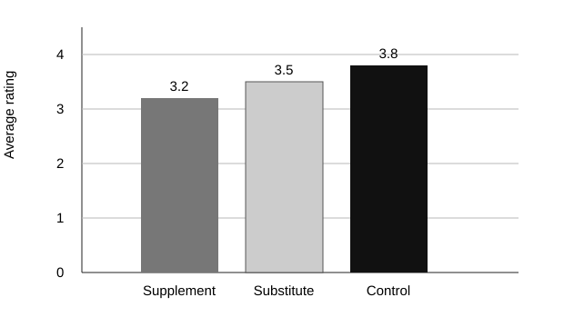
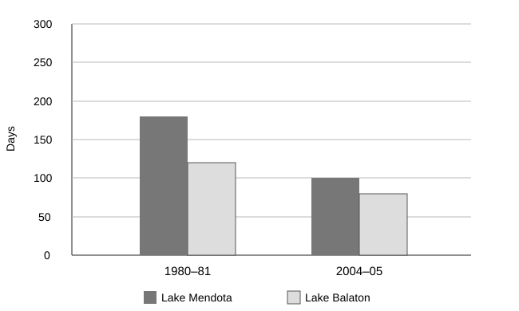
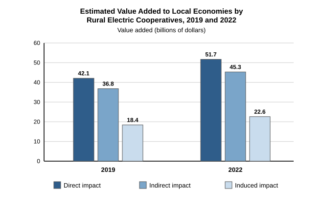

# DSAT English | June 2026 | Int and US | Question Bank ALL

**Source:** https://thetestadvantage.com/public/passage-page/717 (test id 717)  
**Slug:** `dsat-english-june-2026-int-and-us-question-bank-all-june-2026`  
**Captured:** 2026-08-10  
**Questions:** 230 (site navigator reads "Q _n_ of 230")  
**Sections:** Vocabulary · Domain 2 Craft and Structure · Domain 1 Reading · Domain 1 Variations · Domain 4 Grammar and Punctuation · Domain 3 Transitions · Domain 3 Notes

## How to read this file

- **Difficulty** is the badge the site shows on the question screen (EASY / INTERMEDIATE / HARD), recorded verbatim.
- **Underlined portions** of a passage are preserved as `<u>...</u>`, exactly as the site marks them.
- **Bulleted note sets** (the "student has taken the following notes" questions) keep their bullet structure as a Markdown list; the site renders them as `•` lines.
- *Italics* correspond to `<em>` on the site (work titles, species names); **bold** to `<strong>`.
- **Tables** are transcribed to Markdown from the site's HTML tables — no data is re-typed by hand.
- **Charts** are saved under `assets/`. Captured graphics are the site's own vector SVG. One chart is drawn with CSS `
` bars instead of an image; it is redrawn and explicitly labelled **RECREATED GRAPHIC**.
- **Appeared in** lists other administrations where the site says the same item was used.
- **Answer keys are not included:** the site validates answers server-side and never sends the correct choice to the page, so there is nothing to capture.

---

## Vocabulary

### Question 1

**Difficulty (as shown on site):** EASY  
**Skill:** Domain 2 / Domain 2 | Logical Completion  
**Site reference:** Passage 1: Vocabulary (passage id 28553, question id 211341)

**Passage:**

In skilled trades like electrical work, experienced professionals generally instruct newcomers to the field, not just showing them how to complete tasks but also explaining the reasoning behind standard practices. ______ such as this ensures that valuable knowledge continues to be passed down.

**Question:** Which choice completes the text with the most logical and precise word or phrase?

- A. Mentorship
- B. Innovation
- C. Craftsmanship
- D. Certification

### Question 2

**Difficulty (as shown on site):** EASY  
**Skill:** Domain 2 / Domain 2 | Logical Completion  
**Site reference:** Passage 2: Vocabulary (passage id 28554, question id 211346)

**Passage:**

In the 1970s, British consumers initially ______ major fast-food chains from the United States. However, promotional tactics like free milkshakes and low prices gradually attracted patrons seeking quick meals. By the late 1980s, public sentiment had shifted as fast food transformed from a controversial novelty into a fixture of Great Britain’s dining landscape.

**Question:** Which choice completes the text with the most logical and precise word or phrase?

- A. reflected
- B. prepared
- C. discovered
- D. rejected

### Question 3

**Difficulty (as shown on site):** INTERMEDIATE  
**Skill:** Domain 2 / Domain 2 | Words in Context  
**Site reference:** Passage 3: Vocabulary (passage id 28555, question id 211351)

**Passage:**

Despite the appearance of many more sophisticated tools in recent years, the ordinary pipe wrench remains ______ plumbers. Its combination of simplicity, durability, and easy adjustability has been impossible for toolmakers to match.

**Question:** Which choice completes the text with the most logical and precise word or phrase?

- A. excessive for
- B. indispensable to
- C. dependent on
- D. controversial among

### Question 4

**Difficulty (as shown on site):** EASY  
**Skill:** Domain 2 / Domain 2 | Logical Completion  
**Site reference:** Passage 4: Vocabulary (passage id 28556, question id 211356)

**Passage:**

In commercial kitchen ventilation design and construction, engineers carefully calibrate incoming and outgoing airstreams to ______ negative pressure conditions. If the air pressure is lower in the kitchen than in surrounding areas (i.e., there is negative pressure), fresh air will move from those areas into the kitchen, thereby keeping cooking odors contained and keeping kitchen staff comfortable.

**Question:** Which choice completes the text with the most logical and precise word or phrase?

- A. estimate
- B. maintain
- C. prevent
- D. ignore

### Question 5

**Difficulty (as shown on site):** HARD  
**Skill:** Domain 2 / Domain 2 | Words in Context  
**Site reference:** Passage 5: Vocabulary (passage id 28557, question id 211361)

**Passage:**

Both overwatering and underwatering can significantly reduce agricultural yields and waste valuable resources. To avoid these problems, farmers’ management of agricultural irrigation systems must be ______. Following the careful consideration of crop requirements, soil conditions, and weather patterns, farmers need to make precise, minute adjustments to water allocations to ensure the best outcomes.

**Question:** Which choice completes the text with the most logical and precise word or phrase?

- A. perfunctory
- B. serendipitous
- C. resolute
- D. exacting

### Question 6

**Difficulty (as shown on site):** INTERMEDIATE  
**Skill:** Domain 2 / Domain 2 | Words in Context  
**Site reference:** Passage 6: Vocabulary (passage id 28558, question id 211366)

**Passage:**

Astronomers analyzing the Sun have discovered an important ______ between magnetically active and quiet regions. In active regions, bursts of ultraviolet light typically precede significant decreases in magnetic energy, whereas in quiet regions, there is a continuous correlation between ultraviolet light intensity and magnetic energy without significant energy drops.

**Question:** Which choice completes the text with the most logical and precise word or phrase?

- A. analogy
- B. trade-off
- C. interaction
- D. disparity

### Question 7

**Difficulty (as shown on site):** HARD  
**Skill:** Domain 2 / Domain 2 | Words in Context  
**Site reference:** Passage 7: Vocabulary (passage id 28559, question id 211371)

**Passage:**

Microhistories tackle “big questions” about broad phenomena via narrow subjects. The questions they ask are often ______. Distinct strains of microhistory emerged at different times in France, Iceland, and elsewhere, for example, and while microhistories of the 1980s reflected the era’s interest in popular culture, the “material turn” in recent historiography sparked a wave of object-centered microhistories.

**Question:** Which choice completes the text with the most logical and precise word or phrase?

- A. indicative of the practitioner’s ingenuity
- B. peripheral to the practitioner’s discipline
- C. controversial within the practitioner’s specialty
- D. contingent on the practitioner’s milieu

### Question 8

**Difficulty (as shown on site):** INTERMEDIATE  
**Skill:** Domain 2 / Domain 2 | Words in Context  
**Site reference:** Passage 8: Vocabulary (passage id 28560, question id 211376)

**Passage:**

Zoochorous trees—those whose seeds are dispersed mainly by animals—are much more prevalent in the Mo Singto plot than in the Tyson Research Center, making species distribution in Mo Singto considerably more ______. Animal dispersers may congregate at varying distances from parent trees, may carry seeds for varying lengths of time, and may have idiosyncratic spatial trajectories.

**Question:** Which choice completes the text with the most logical and precise word or phrase?

- A. symmetrical
- B. iterative
- C. anachronistic
- D. unpredictable

### Question 9

**Difficulty (as shown on site):** INTERMEDIATE  
**Skill:** Domain 2 / Domain 2 | Words in Context  
**Site reference:** Passage 9: Vocabulary (passage id 28561, question id 211381)

**Passage:**

Lauren Hoult, Trudi Edginton, and colleagues reviewed 51 studies about positive expressive writing (writing about positive experiences and emotions like cheerfulness) in an attempt to determine what therapeutic outcomes this kind of writing most reliably achieves. However, large ______ across the studies in the methodologies used and health effects assessed prevented a definitive universal conclusion.

**Question:** Which choice completes the text with the most logical and precise word or phrase?

- A. discrepancies
- B. vulnerabilities
- C. compensations
- D. endorsements

### Question 10

**Difficulty (as shown on site):** INTERMEDIATE  
**Skill:** Domain 2 / Domain 2 | Words in Context  
**Site reference:** Passage 10: Vocabulary (passage id 28562, question id 211386)

**Passage:**

Zoochorous trees—those whose seeds are dispersed mainly by animals—are much more prevalent in the Barro Colorado Island plot than in the Fenglin Nature Reserve, making species distribution in Barro Colorado considerably more ______. Animal dispersers may congregate at varying distances from parent trees, may carry seeds for varying lengths of time, and may have idiosyncratic spatial trajectories.

**Question:** Which choice completes the text with the most logical and precise word or phrase?

- A. anachronistic
- B. symmetrical
- C. iterative
- D. haphazard

### Question 11

**Difficulty (as shown on site):** HARD  
**Skill:** Domain 2 / Domain 2 | Words in Context  
**Site reference:** Passage 11: Vocabulary (passage id 28563, question id 211391)

**Appeared in 2 other administrations:**
- DSAT English | December 2024 | Asia Version 1
- DSAT English | June 2025 |  INT | Version A

**Passage:**

Some social scientists argue that while a belief in the importance of reason and progress is key to democracy, the public’s understanding of history is also central to its subsequent comprehension of a state’s politics, and if an electorate is to function, historical issues cannot remain the dominion only of academics. History is too ______ to leave to historians alone.

**Question:** Which choice completes the text with the most logical and precise word or phrase?

- A. accessible
- B. complex
- C. respectable
- D. consequential

### Question 12

**Difficulty (as shown on site):** INTERMEDIATE  
**Skill:** Domain 2 / Domain 2 | Words in Context  
**Site reference:** Passage 12: Vocabulary (passage id 28564, question id 211396)

**Passage:**

While modern composers may often get inspiration from past greats like Ludwig van Beethoven, the extent of their influences is broad. The music of Sérgio Assad, for example, can be said to ______ elements of both the classical European tradition and the social, political, and cultural landscape of his native Brazil.

**Question:** Which choice completes the text with the most logical and precise word or phrase?

- A. defy
- B. neglect
- C. foretell
- D. synthesize

### Question 13

**Difficulty (as shown on site):** HARD  
**Skill:** Domain 2 / Domain 2 | Words in Context  
**Site reference:** Passage 13: Vocabulary (passage id 28565, question id 211401)

**Passage:**

A unique habitat at the interface of surface water and groundwater within river corridors, a river’s hyporheic zone (HZ) extends beyond its embankments: for a great river like the Orinoco, the HZ might reach up to 450 meters from the channel. Because of its inaccessibility, scientists use ______ to measure the HZ—for example, by mapping aquatic organisms found in soil and a waterway’s banks.

**Question:** Which choice completes the text with the most logical and precise word or phrase?

- A. auxiliaries
- B. simulations
- C. parameters
- D. proxies

### Question 14

**Difficulty (as shown on site):** EASY  
**Skill:** Domain 2 / Domain 2 | Logical Completion  
**Site reference:** Passage 14: Vocabulary (passage id 28566, question id 211406)

**Passage:**

In passenger vehicle maintenance guides, brake pad replacement appears to be ______ but as professional technicians will attest, apparent simplicity can mask considerable complexity. Properly done, the procedure requires a detailed inspection of rotors, calipers, and brake lines, as well as detailed checks for fluid leaks and full mechanical operation.

**Question:** Which choice completes the text with the most logical and precise word or phrase?

- A. hazardous
- B. infrequent
- C. straightforward
- D. complimentary

### Question 15

**Difficulty (as shown on site):** INTERMEDIATE  
**Skill:** Domain 2 / Domain 2 | Logical Completion  
**Site reference:** Passage 15: Vocabulary (passage id 28567, question id 211411)

**Passage:**

When investigating why a house’s circuit breaker has tripped, an electrician typically asks residents to ______ the appliances that were running when the power went out. This information is needed so that the electrician can begin to investigate whether the ongoing outage stems from a faulty device or simply too many devices operating simultaneously.

**Question:** Which choice completes the text with the most logical and precise word or phrase?

- A. refurbish
- B. exchange
- C. activate
- D. specify

### Question 16

**Difficulty (as shown on site):** INTERMEDIATE  
**Skill:** Domain 2 / Domain 2 | Words in Context  
**Site reference:** Passage 16: Vocabulary (passage id 28568, question id 211416)

**Passage:**

The Mexican Revolution (1910-1920) was followed by a period of flourishing literary production, with writers such as Carlos Fuentes contributing to the ______ of poetry, fiction, essays, and more. Unfortunately, this flood of interesting writing has diverted scholarly attention from the equally fascinating work of nineteenth-century figures like Guillermo Prieto.

**Question:** Which choice completes the text with the most logical and precise word or phrase?

- A. overturning
- B. underappreciation
- C. erasure
- D. proliferation

### Question 17

**Difficulty (as shown on site):** EASY  
**Skill:** Domain 2 / Domain 2 | Logical Completion  
**Site reference:** Passage 17: Vocabulary (passage id 28569, question id 211421)

**Appeared in 1 other administration:**
- DSAT English | August  2024 | Asia version 2

**Passage:**

Whatever the general attitude toward Spike Lee’s 1992 film *Malcolm X* and Carl Franklin’s 1995 film *Devil in a Blue Dress* when they were initially released, both films now tend to be regarded quite ______. In 2018, for example, critics for the *New York Times* praised the former as “electrifying” and the latter as “picture-perfect.”

**Question:** Which choice completes the text with the most logical and precise word or phrase?

- A. favorably
- B. neutrally
- C. skeptically
- D. strangely

### Question 18

**Difficulty (as shown on site):** INTERMEDIATE  
**Skill:** Domain 2 / Domain 2 | Words in Context  
**Site reference:** Passage 18: Vocabulary (passage id 28570, question id 211426)

**Appeared in 1 other administration:**
- DSAT English | October  2024 | Asia version 3

**Passage:**

Any effort to raise the toll that drivers must pay to use the Lewis and Clark Bridge, which spans the Ohio River to connect Indiana and Kentucky, should explain why a higher toll is necessary; no amount of justification, however, is likely to persuade some drivers who believe the current toll is ______.

**Question:** Which choice completes the text with the most logical and precise word or phrase?

- A. equivocal
- B. contentious
- C. warranted
- D. excessive

### Question 19

**Difficulty (as shown on site):** INTERMEDIATE  
**Skill:** Domain 2 / Domain 2 | Words in Context  
**Site reference:** Passage 19: Vocabulary (passage id 28571, question id 211431)

**Passage:**

Cybersecurity experts warn that organizations often focus solely on detecting and preventing breaches or other attacks and neglect to develop ______ capabilities. This neglect can lead to potentially catastrophic consequences, since how quickly an intrusion is contained often determines the ultimate severity of a security incident.

**Question:** Which choice completes the text with the most logical and precise word or phrase?

- A. deterrence
- B. surveillance
- C. encryption
- D. mitigation

---

## Domain 2 Craft and Structure

### Question 20

**Difficulty (as shown on site):** EASY  
**Skill:** Domain 2 / Domain 2 | Structure  
**Site reference:** Passage 20: Text Structure and Purpose (passage id 28573, question id 211441)

**Passage:**

From Earth, some stars in the night sky appear to form shapes with other stars. These shapes are called constellations. They are often named after the shapes people think the stars form. Some people have thought that one set of stars looks like a hunter. This constellation is named Orion, after a mythical Greek hunter. People have thought that another set of stars looks like a bear. This constellation is named *Ursa Major*, which means “larger bear” in Latin.

**Question:** Which choice best describes the overall structure of the text?

- A. It identifies some scientific instruments and then explains how they are used.
- B. It lists the names of some stars and then states how far away they are from Earth.
- C. It explains what constellations are and then gives examples of how some were named.
- D. It describes how stars are born and then explains how they eventually die.

### Question 21

**Difficulty (as shown on site):** INTERMEDIATE  
**Skill:** Domain 2 / Domain 2 | Function of Underlined Portion  
**Site reference:** Passage 21: Text Structure and Purpose (passage id 28574, question id 211446)

**Passage:**

Marketers and retailers typically employ nine-ending prices (e.g., 4.99 dollars) to suggest value. In general, shoppers appear to interpret these prices as intended, perceiving products with nine-ending prices as being offered at a discount or special deal. <u>However, research has uncovered that some consumers associate these prices with lower product quality and even as a sign that merchants are being misleading—by trying to trick consumers into thinking a 4.99 dollars product costs 4 dollars rather than 5 dollars, which is closer to the truth.</u>

**Question:** Which choice best describes the function of the underlined sentence in the text as a whole?

- A. It accounts for a contrast between how retailers intend nine-ending prices to be interpreted and how consumers typically interpret them.
- B. It explains negative responses to nine-ending prices that have led some retailers and marketers to shift their pricing strategies.
- C. It highlights unintended interpretations of nine-ending prices that suggest that using such prices may not be uniformly effective.
- D. It identifies how consumers tend to respond to nine-ending prices and acknowledges exceptions to that tendency.

### Question 22

**Difficulty (as shown on site):** INTERMEDIATE  
**Skill:** Domain 2 / Domain 2 | Structure  
**Site reference:** Passage 22: Text Structure and Purpose (passage id 28575, question id 211451)

**Passage:**

Many models predict that as climates warm, North American tree populations will expand northward into newly suitable habitats. However, forest surveys show that many species, such as the chestnut oak (*Quercus montana*) and the Engelmann spruce (*Picea engelmannii*), are exhibiting migration lag—that is, they are failing to establish northern populations as predicted. Research suggests that this lag is linked to reduced diversity of essential fungal partners at the northern edges of the trees’ habitats, making it difficult for these trees to successfully expand northward.

**Question:** Which choice best describes the overall structure of the text?

- A. It presents a scientific prediction, describes evidence that contradicts that prediction, and then offers an explanation for the contradiction.
- B. It introduces a scientific model, presents several predictions made using data generated by the model, and then provides further support for one prediction over the others.
- C. It summarizes recent research findings, identifies a gap in current understanding, and then suggests future research to address that gap.
- D. It describes an environmental problem, discusses several attempted solutions, and then proposes a new solution.

### Question 23

**Difficulty (as shown on site):** HARD  
**Skill:** Domain 2 / Domain 2 | Function of Underlined Portion  
**Site reference:** Passage 23: Text Structure and Purpose (passage id 28576, question id 211456)

**Passage:**

Dziga Vertov’s *Man with a Movie Camera* (1929) not only exhibits striking visual effects like multiple exposure, but it also has as a central idea that <u>the camera itself is a character in the film</u>. The camera’s presence is continually accentuated by showing the operator position it, for example, placing it on the outside of a train, where he then adjusts the camera to capture a view of train tracks as seen from the front of a locomotive, to which the film cuts immediately after.

**Question:** Which choice best describes the function of the underlined portion in the text as a whole?

- A. It introduces a conceit of the film that helps explain Vertov’s choices as described later in the text.
- B. It introduces a concept attributed to Vertov, which the remainder of the text affirms is rightly attributed.
- C. It presents a metaphor that the text indicates inspired Vertov to structure the film as he did.
- D. It presents Vertov’s intended message for the film, which the remainder of the text uses as a basis to evaluate how successful the film was at conveying it.

### Question 24

**Difficulty (as shown on site):** INTERMEDIATE  
**Skill:** Domain 2 / Domain 2 | Author Response  
**Site reference:** Passage 24: Cross-Text Connections (passage id 28577, question id 211461)

**Appeared in 2 other administrations:**
- DSAT English | Test 2 RW | Mod 1 and 2*
- DSAT English | MAY 2024 | Version 2

**Passage:**

**Text 1**
Attempts to automate classification of music into genres have not been very successful. It is also unclear whether categorizing music by genre is useful, since genre categories are ambiguous, subjective, and reductive. As Jin Ha Lee and Anh Thu Nguyen argue in their study of the South Korean band BTS, relationships between pieces of music may be best understood with concepts other than genre.

**Text 2**
Merengue is a genre of music originally from the Dominican Republic that shares some harmonic and rhythmic similarities with the axé genre. Automated genre classification systems typically struggle to draw distinctions in situations like this, but Yandre Costa and colleagues solved that problem by converting sound to images and having computers compare features of those images. Their approach could improve genre classification, which could have many benefits for users.

**Question:** Based on the texts, how would the author of Text 1 most likely respond to the claim about the potential benefits of Costa and colleagues’ research in Text 2?

- A. Some genres are more easily recognized by classification systems than others.
- B. People do not necessarily enjoy every recording in a genre they claim to prefer.
- C. Future research may provide substantial advancements in the field of automated genre classification.
- D. Users may not actually find genre classifications particularly helpful.

### Question 25

**Difficulty (as shown on site):** INTERMEDIATE  
**Skill:** Domain 2 / Domain 2 | Cross Text Connections  
**Site reference:** Passage 25: Cross-Text Connections (passage id 28578, question id 211466)

**Appeared in 3 other administrations:**
- DSAT English | November 2024 | Asia version 1
- DSAT English | November 2024 | Asia version 4
- DSAT English | May | 2026 | Int | Question Bank ALL

**Passage:**

**Text 1**
For thousands of years, O’odham farmers in the Sonoran desert of the southwestern US and northern Mexico have cultivated mesquite seeds and agave sap, sometimes planting these species together so that the mesquite trees provide shade for agaves. Doing so helps protect agaves from the harshest heat and light and thereby helps prevent soil moisture from evaporating.

**Text 2**
Agaves are well adapted to growing in the desert but grow best when shaded. Inspired by O’odham farmers, who often strategically plant agaves in the shade of sun-hardy species like mesquite trees for protection from the sun and heat, Gary Nabhan and colleagues planted agaves in the shade of solar panels in the Sonoran desert and found that the plants grew well, suggesting to Nabhan and colleagues that the panels provide a benefit similar to that provided by mesquite trees.

**Question:** Based on the texts, the author of Text 1 and the author of Text 2 would most likely agree on which point?

- A. Compared with Nabhan’s approach, the O’odham approach has the advantage of producing agave sap.
- B. Mesquite trees grow best when planted in shaded areas, while agaves do not require shade to thrive.
- C. Mesquite trees can provide shade that protects agaves from high-intensity heat and light.
- D. Nabhan’s team’s method could be refined to more actively prevent soil moisture from evaporating.

### Question 26

**Difficulty (as shown on site):** HARD  
**Skill:** Domain 2 / Domain 2 | Function of Underlined Portion  
**Site reference:** Passage 26: Text Structure and Purpose (passage id 28579, question id 211471)

**Passage:**

The following text is from Richard B. Sheridan’s 1777 satirical play *The School for Scandal*. Maria, Lady Sneerwell, and Joseph Surface are discussing their mutual acquaintance Sir Benjamin Backbite.

MARIA: [Sir Benjamin] has done nothing—but his conversation is a perpetual libel on all his acquaintance.
SURFACE: Aye and the worst of it is there is no advantage in not knowing him, for he’ll abuse a stranger just as soon as his best friend—and [his uncle] is as bad.
SNEERWELL: Nay but we should make allowance. Sir Benjamin is a wit and a poet.
MARIA: <u>For my part—I own madam—wit loses its respect with me, when I see it in company with malice.</u> What do you think, Mr. Surface?
SURFACE: Certainly, madam, to smile at the jest which plants a thorn on another’s breast is to become a principal in the mischief.

**Question:** Which choice best describes the function of the underlined sentence in the text as a whole?

- A. It illustrates and expands on one character’s definition of a term that was discussed earlier in the text.
- B. It contrasts the point of view of one character with that of another through the use of figurative language.
- C. It presents a position that seems to support the stance of one character and undermine that of another.
- D. It appears to offer an explanation for the behavior of the character who is the topic of conversation in the text.

### Question 27

**Difficulty (as shown on site):** HARD  
**Skill:** Domain 2 / Domain 2 | Function of Underlined Portion  
**Site reference:** Passage 27: Text Structure and Purpose (passage id 28580, question id 211476)

**Passage:**

The following text is adapted from George Eliot’s 1860 novel *The Mill on the Floss*. After quarrelling with Tom Tulliver, Bob Jakin has just thrown his much cherished pocketknife, a gift from Tom, onto the ground in an attempt to spite Tom.

[Bob’s] very fingers sent entreating thrills that he would go and clutch that familiar rough buck’s-horn handle, which they had so often grasped for mere affection, as it lay idle in his pocket. And there were two blades, and they had just been sharpened! What is life without a pocket-knife to him who has once tasted a higher existence? No; to throw the handle after the hatchet is a comprehensible act of desperation, but to throw one’s pocket-knife after an implacable friend is <u>clearly in every sense a hyperbole, or throwing beyond the mark.</u>

**Question:** Which choice best describes the function of the underlined phrase in the text as a whole?

- A. It suggests Bob’s dawning realization that the importance he attaches to the pocketknife is excessive and absurd.
- B. It alludes to Bob’s unbridled propensity to invent wildly embellished tales of his own exploits.
- C. It illustrates Bob’s deliberate intention of using sophisticated vocabulary to intimidate Tom.
- D. It conveys Bob’s distinct awareness that spurning Tom’s gift is an overly dramatic gesture.

### Question 28

**Difficulty (as shown on site):** EASY  
**Skill:** Domain 2 / Domain 2 | Purpose  
**Site reference:** Passage 28: Text Structure and Purpose (passage id 28581, question id 211481)

**Passage:**

The moon jar first gained prominence in Korea in the late seventeenth century. Its shape is distinctive: it is a simple orb created by joining two wheel-spun bowl shapes together. Irregularity is an important feature of a moon jar, so it is traditionally finished with a smooth, milky white glaze that may include bits of debris or dashes of color. Modern ceramists continue to create their own versions of these iconic pieces. Los Angeles artist Raina Lee, for example, uses custom glazes to create thick, cratered surfaces on her moon jars.

**Question:** Which choice best states the main purpose of the text?

- A. To provide an overview of a type of traditional pottery
- B. To present a history of Korean pottery since the seventeenth century
- C. To discuss a collection of works by a contemporary artist
- D. To explain the philosophy that inspired an ancient artistic practice

### Question 29

**Difficulty (as shown on site):** INTERMEDIATE  
**Skill:** Domain 2 / Domain 2 | Function of Underlined Portion  
**Site reference:** Passage 29: Text Structure and Purpose (passage id 28582, question id 211486)

**Passage:**

Early television analysis in the 1970s and 1980s was shaped by film studies, though <u>media scholar Horace Newcomb notes that tools borrowed from that field often proved inadequate when applied to TV’s distinct characteristics.</u> A recognition of the limitations led researchers to approaches that accounted for a domestic viewing context, embedded advertisements, and serialized narratives, and to a shift in audience research toward ethnographic methods that emphasized viewer engagement. By the 1990s, television studies had emerged as a widely recognized academic field, with scholars founding dedicated journals.

**Question:** Which choice best states the function of the underlined portion in the text as a whole?

- A. It implies that the development of television studies as a discipline was slowed by scholars’ early reluctance to accept that television and film have different characteristics.
- B. It suggests that Newcomb’s observations were the primary catalyst for the emergence of television studies as a formal academic field.
- C. It introduces an expert opinion that establishes the impetus for a change in scholarly methods of studying television.
- D. It questions the extent to which the methodologies of film studies informed methodologies in the emerging field of television studies.

### Question 30

**Difficulty (as shown on site):** HARD  
**Skill:** Domain 2 / Domain 2 | Author Response  
**Site reference:** Passage 30: Cross-Text Connections (passage id 28583, question id 211491)

**Passage:**

**Text 1**
Studies contributing to the body of evidence that people generally enjoy socializing have routinely focused on interactions in ongoing relationships (from close confidants to neighbors), but psychologist Selin Salman-Engin and colleagues have demonstrated the benefit of making connections with strangers. Greater positive affect was reported by participants in their study who warmly thanked a shuttle driver than by those who didn’t speak to the driver.

**Text 2**
Social relations research commonly draws on a model that centers an individual within three concentric circles. The innermost circle holds one’s strongest ties (e.g., a treasured friend), the next holds close but less important ties (e.g., a teammate), and the outermost holds weak ties (those more distant but important enough to be counted as part of one’s social network).

**Question:** Based on the texts, what would Salman-Engin and colleagues (Text 1) most likely say about the discussion of the model in Text 2?

- A. It emphasizes distinctions among types of close connections that aren’t adequately represented in social relations research, since most studies categorize relationships as either close or casual.
- B. It reflects an overemphasis on relationship longevity in researchers’ evaluations of the relative importance of various connections in an individual’s social network.
- C. It underscores that most research on social interactions fails to capture a category of connection that has the capacity to contribute positively to individuals’ sense of well-being.
- D. It explains researchers’ observations that individuals typically expect interactions with familiar people to be more positive than their interactions with unfamiliar people would be.

### Question 31

**Difficulty (as shown on site):** HARD  
**Skill:** Domain 2 / Domain 2 | Author Response  
**Site reference:** Passage 31: Cross-Text Connections (passage id 28584, question id 211496)

**Passage:**

**Text 1**
Studies contributing to the body of evidence that people generally enjoy socializing have routinely focused on interactions in ongoing relationships (from close friends to classmates), but psychologist Gillian Sandstrom and a colleague have demonstrated the benefit of making connections with strangers. Greater positive affect was reported by participants in their study who smiled at and chatted with a cashier while ordering coffee than by those who were as efficient as possible.

**Text 2**
Social relations research commonly draws on a model that centers an individual within three concentric circles. The innermost circle holds one’s strongest ties (e.g., a treasured friend), the next holds close but less important ties (e.g., a teammate), and the outermost holds weak ties (those more distant but important enough to be counted as part of one’s social network).

**Question:** Based on the texts, what would Sandstrom and colleague (Text 1) most likely say about the discussion of the model in Text 2?

- A. It underscores that most research on social interactions fails to capture a category of connection that has the capacity to contribute positively to individuals’ sense of well-being.
- B. It explains researchers’ observations that individuals typically expect interactions with familiar people to be more positive than their interactions with unfamiliar people would be.
- C. It reflects an overemphasis on relationship longevity in researchers’ evaluations of the relative importance of various connections in an individual’s social network.
- D. It emphasizes distinctions among types of close connections that aren’t adequately represented in social relations research, since most studies categorize relationships as either close or casual.

### Question 32

**Difficulty (as shown on site):** INTERMEDIATE  
**Skill:** Domain 2 / Domain 2 | Structure  
**Site reference:** Passage 32: Text Structure and Purpose (passage id 28585, question id 211501)

**Passage:**

Many models predict that as climates warm, North American tree populations will expand northward into newly suitable habitats. However, forest surveys show that many species, such as the sand post oak (*Quercus margaretta*) and the slash pine (*Pinus elliottii*), are exhibiting migration lag—that is, they are failing to establish northern populations as predicted. Research suggests that this lag is linked to reduced diversity of essential fungal partners at the northern edges of the trees’ habitats, making it difficult for these trees to successfully expand northward.

**Question:** Which choice best describes the overall structure of the text?

- A. It presents a scientific prediction, describes evidence that contradicts that prediction, and then offers an explanation for the contradiction.
- B. It describes an environmental problem, discusses several attempted solutions, and then proposes a new solution.
- C. It summarizes recent research findings, identifies a gap in current understanding, and then suggests future research to address that gap.
- D. It introduces a scientific model, presents several predictions made using data generated by the model, and then provides further support for one prediction over the others.

### Question 33

**Difficulty (as shown on site):** INTERMEDIATE  
**Skill:** Domain 2 / Domain 2 | Function of Underlined Portion  
**Site reference:** Passage 33: Text Structure and Purpose (passage id 28586, question id 211506)

**Appeared in 8 other administrations:**
- DSAT English | October  2024 | Asia version 1
- DSAT English | August 2025 | INT | Version A
- DSAT English | August 2025 | US | Version A
- DSAT English | August 2025 |  Version 3
- DSAT English | November 2025 | US | Version 3
- DSAT English | November 2025 | US | Version 5
- DSAT English | December 2025 | Version 4(Easy)
- DSAT English | December 2025 | Version 4 (Hard)

**Passage:**

Vertical gene transfer involves the transmission of genetic material from a parent to offspring; horizontal gene transfer, on the other hand, involves the exchange of genetic material between organisms not in a parent-offspring relationship. <u>While horizontal gene transfer is common among prokaryotes—single-celled organisms, such as the bacteria *Brevibacillus borstelensis* and *Lactococcus lactis*—it has rarely been observed among eukaryotes (multicellular organisms).</u> However, new studies suggest that horizontal gene transfer is more common in eukaryotes than originally thought.

**Question:** Which choice best states the function of the underlined sentence in the text as a whole?

- A. It argues that two biological phenomena are more similar than they may initially appear to be.
- B. It contrasts the frequency with which a biological phenomenon has been detected in two categories of organisms.
- C. It explains why a common perception of a biological process is flawed.
- D. It indicates a distinction between the mechanics of two kinds of biological processes.

### Question 34

**Difficulty (as shown on site):** HARD  
**Skill:** Domain 2 / Domain 2 | Purpose  
**Site reference:** Passage 34: Text Structure and Purpose (passage id 28587, question id 211511)

**Passage:**

In vascular plants, leaf veins are crucial for such functions as hydraulic conductance and structural reinforcement. Emerging approximately 340 million years ago (MYA) during the Carboniferous Period, the first vascular plants had relatively simple branched vein structures, but beginning around 320 MYA, reticulate (netlike) venation evolved multiple times in different lineages despite greater associated energy costs. Since reticulation is linked to increased robustness against ecological stressors, one hypothesis posits that the relatively dry interglacial climate of the Carboniferous may explain this trait’s evolution.

**Question:** Which choice best states the main purpose of the text?

- A. To outline a scientific debate about the timing of various adaptations found in vascular-plant lineages and evaluate the merits of these competing interpretations.
- B. To compare the different functions served by two types of venation patterns found in Carboniferous vascular plants and explain why vascular plants are now more common than nonvascular plants are.
- C. To provide an overview of the evolutionary history of a particular adaptation found in some leaf venation structures and identify a potential driver of this adaptation.
- D. To introduce a hypothesis about the emergence of leaf vasculature in Carboniferous plants and summarize experimental evidence that substantiates the hypothesis.

### Question 35

**Difficulty (as shown on site):** EASY  
**Skill:** Domain 2 / Domain 2 | Function of Underlined Portion  
**Site reference:** Passage 35: Text Structure and Purpose (passage id 28588, question id 211516)

**Passage:**

In 1881, Isaac B. Goude invented a bed that folds into a cabinet, which helped people save space in small homes and inspired the creation of other space-saving furniture. In 1881, Harriet Russell invented a way to store water for farms, which helped people grow crops in dry places. <u>Although created to address different needs, both inventions have had lasting impacts. Likewise, both inventors exemplified important traits that continue to drive innovation: creative thinking, strong problem-solving skills, and persistence.</u>

**Question:** Which choice best describes the function of the underlined portion in the text as a whole?

- A. It is a transition that the text uses as it frequently mentions two modern inventors.
- B. It highlights that Goude and Russell shared traits that many successful inventors embody.
- C. It lists some specific impacts that two older inventions have had on modern life.
- D. It hints at the features of Goude's and Russell's inventions that contributed most to their usefulness.

### Question 36

**Difficulty (as shown on site):** INTERMEDIATE  
**Skill:** Domain 2 / Domain 2 | Function of Underlined Portion  
**Site reference:** Passage 36: Text Structure and Purpose (passage id 28589, question id 211521)

**Appeared in 3 other administrations:**
- DSAT English | June 2025 |  INT | Version B
- DSAT English | December 2025 | Version 2 (Hard)
- DSAT English | December 2025 | Version 3 (Easy)

**Passage:**

The following text is from Yung Wing’s 1909 memoir *My Life in China and America*. Yung Wing was the first person from China to graduate from a US university.

<u>Little did I realize when in 1845 I wrote, while in the Morrison School, a composition on “An Imaginary Voyage to New York and up the Hudson,” that I was to see New York in reality.</u> This incident leads me to the reflection that sometimes our imagination foreshadows what lies uppermost in our minds and brings possibilities within the sphere of realities.

**Question:** Which choice best describes the function of the underlined sentence in the text as a whole?

- A. It illustrates the role that education played in Yung's childhood.
- B. It foreshadows Yung's future difficulties in publishing his writings.
- C. It indicates Yung's unwillingness to distinguish between reality and fantasy as a child.
- D. It describes an event in Yung's life that exemplifies a phenomenon.

---

## Domain 1 Reading

### Question 37

**Difficulty (as shown on site):** INTERMEDIATE  
**Skill:** Domain 1 / Domain 1 | Inference  
**Site reference:** Passage 37: Inferences (passage id 28591, question id 211531)

**Appeared in 7 other administrations:**
- DSAT English | August  2024 | Asia version 2
- DSAT English | August  2024 | US version 3
- DSAT English | November 2024 | Asia version 4
- DSAT English | December 2024 | Asia Version 1
- DSAT English | June 2025 |  INT | Version B
- DSAT English | June 2025 |  INT | Version A
- DSAT English | March 2026 | International Question Bank (ALL)

**Passage:**

The following text is from Jerome K. Jerome’s 1889 novel *Three Men in a Boat (To Say Nothing of the Dog)*. The narrator and two friends are taking a boat down the River Thames in England.

In a boat, I have always noticed that it is the fixed idea of each member of the crew that he is doing everything. Harris’s notion was, that it was he alone who had been working, and that both George and I had been imposing upon him. George, on the other hand, ridiculed the idea of Harris’s having done anything more than eat and sleep, and had a cast-iron opinion that it was he—George himself—who had done all the labour worth speaking of.

**Question:** Based on the text, how would the narrator most likely describe Harris’s and George's attitudes?

- A. As understandable, because there’s usually more work to be done on a boat than the crew can easily handle
- B. As typical, because people working on boats usually believe that the other crew members aren’t contributing
- C. As perplexing, because the narrator is much more eager than either Harris or George to complete his own tasks
- D. As frustrating, because Harris and George frequently tease each other

### Question 38

**Difficulty (as shown on site):** INTERMEDIATE  
**Skill:** Domain 1 / Domain 1 | Main Idea  
**Site reference:** Passage 38: Central Ideas and Details (passage id 28592, question id 211536)

**Passage:**

Plants that are pollinated by butterflies commonly develop flowers with deeply hidden nectar that can easily be accessed by these insects’ long, tubelike mouthparts, increasing the likelihood of successful pollination. Hammer orchids, however, use a different strategy. These orchids facilitate pollination by deceiving their sole pollinator: thynnid wasps. The flower’s structure mimics the appearance of thynnid wasps. When a wasp attempts to interact with what appears to be another wasp, it triggers a hinged part of the flower that flips the insect upside down, positioning it for optimal pollen transfer.

**Question:** Which choice best states the main idea of the text?

- A. Hammer orchids have developed the ability to mimic the characteristics of thynnid wasps.
- B. Unlike species pollinated by butterflies, hammer orchids use deception to improve their chances of being pollinated.
- C. Hammer orchids have developed a much better strategy for attracting pollinators than have other flowering plants.
- D. Attracting pollinators through deception is an effective strategy used by many types of flowering plants.

### Question 39

**Difficulty (as shown on site):** EASY  
**Skill:** Domain 1 / Domain 1 | Main Idea  
**Site reference:** Passage 39: Central Ideas and Details (passage id 28593, question id 211541)

**Passage:**

The following text is adapted from Kenneth Grahame’s 1908 novel *The Wind in the Willows*. The Mole has been found by a friend after getting lost in the woods. It is beginning to snow.

The Mole saw the wood that had been dreadful to him in quite a changed aspect. Holes, hollows, pools, pitfalls, and other menaces to the wayfarer were vanishing fast, and a gleaming carpet was springing up everywhere, that looked too delicate to be trodden upon by rough feet.

**Question:** Which choice best states the main idea of the text?

- A. The Mole feels sad that his adventure in the woods is over.
- B. As the landscape gets covered in snow, it no longer seems threatening to the Mole.
- C. After being found by his friend, the Mole is ashamed about getting lost.
- D. The Mole prefers warm and dry weather to cold and snowy weather.

### Question 40

**Difficulty (as shown on site):** INTERMEDIATE  
**Skill:** Domain 1 / Domain 1 | Illustrate the Claim  
**Site reference:** Passage 40: Command of Evidence: Textual (passage id 28594, question id 211546)

**Appeared in 2 other administrations:**
- DSAT English | March 2026 | International Question Bank (ALL)
- DSAT English | May | 2026 | Int | Question Bank ALL

**Passage:**

*Life Among the Piutes* is an 1882 autobiographical narrative by Sarah Winnemucca Hopkins, a Northern Paiute author, educator, and activist. In the work, Winnemucca directly addresses the reader to explain certain customs, writing ______

**Question:** Which quotation from *Life Among the Piutes* most effectively illustrates the claim?

- A. “Nothing happened during the day, and after awhile mother told us not to say a word about why we left, for grandpa might get mad with us.”
- B. “We would all go in company to see if the flowers we were named for were yet in bloom, for almost all the girls are named for flowers.”
- C. “Now, my dear reader, there is no word so endearing as the word father, and that is why [my people] call all good people father or mother.”
- D. “But how can I describe the scene that followed? Some of you, dear readers, can imagine.”

### Question 41

**Difficulty (as shown on site):** HARD  
**Skill:** Domain 1 / Domain 1 | Illustrate the Claim  
**Site reference:** Passage 41: Command of Evidence: Textual (passage id 28595, question id 211551)

**Passage:**

*The Age of Innocence* is a 1920 novel by Edith Wharton set in New York City in the 1870s. In the novel, Newland Archer attends an opera. The narrator describes the New York society to which Archer belongs as preferring familiarity over novelty: ______

**Question:** Which quotation from *The Age of Innocence* best illustrates the claim?

- A. “Though there was already talk...of a new Opera House which should compete in costliness and splendour with those of the great European capitals, the world of fashion was still content to reassemble every winter in the shabby red and gold boxes of the sociable old Academy [of Music in New York].”
- B. “But, in the first place, New York was a metropolis, and perfectly aware that in metropolises it was ‘not the thing’ to arrive early at the opera.”
- C. “To come to the Opera in a [carriage for hire] was almost as honourable a way of arriving in one’s own carriage.”
- D. “M’ama...non m’ama... the prima donna sang, and ‘M’ama?’, with a final burst of love triumphant, as she pressed the dishevelled daisy to her lips.”

### Question 42

**Difficulty (as shown on site):** HARD  
**Skill:** Domain 1 / Domain 1 | Support  
**Site reference:** Passage 42: Command of Evidence: Textual (passage id 28596, question id 211556)

**Passage:**

The Exeter Book (ca. 960-990 CE) is the sole manuscript source for the entire corpus of Old English riddles. The precise number of riddles is a matter of debate. Identification of consecutive riddles’ boundaries based on content is difficult, given their purposely enigmatic nature, the challenges modern readers face in interpreting the archaic language of Old English, and damage to the manuscript. Moreover, the manuscript lacks any paratextual apparatus—titles, commentary, lists of solutions—to delimit riddles, and the appearance of a distinctive mark to signal the ends of some riddles may be an unreliable clue. For instance, some scholars claim that the use of this mark at the end of the single manuscript line containing the text conventionally known as Riddle 68 may be a scribal error.

**Question:** Given that the texts conventionally known as Riddle 68 and Riddle 69 appear consecutively in the manuscript, which evidence, if true, would most directly support the claim about Riddle 68 presented in the text?

- A. Circumstantial evidence, including the fact that most of Riddles 63-72, which appear consecutively in the manuscript, repeat solutions from riddles scattered throughout earlier pages of the manuscript, suggests that Riddles 68 and 69 may have originated from a single source whose author was influenced by those earlier riddles.
- B. Although Riddle 68 opens with a phrase in Old English meaning “I saw” that likewise appears at the beginning of a large number of the Exeter Book riddles, neither it nor Riddle 69 concludes with any phrases that directly invite the audience to solve the riddle, which nearly half of the Exeter Book riddles do.
- C. Although Riddle 69 appears to be solvable when read on its own or in conjunction with Riddle 68, with “iceberg” or “icicle” having been presented as likely solutions, Riddle 68, whose imagery and sonic patterns are consistent with those of Riddle 69, has been deemed unsolvable given its overly generic clues, unless read in conjunction with Riddle 69.
- D. Many of the Exeter Book riddles employ the rhetorical device of prosopopoeia, a form of personification in which a nonhuman entity, usually the solution to a riddle, is represented as speaking, but neither Riddle 68 nor Riddle 69 uses this device.

### Question 43

**Difficulty (as shown on site):** INTERMEDIATE  
**Skill:** Domain 1 / Domain 1 | Logical Conclusion  
**Site reference:** Passage 43: Inferences (passage id 28597, question id 211561)

**Passage:**

Shallow cumulus clouds are too small to be represented accurately in the standard global weather and climate models that weather forecasters use to make predictions. This affects the accuracy of weather forecasts. In 2023, scientists developed a model that predicts how clouds of different sizes interact as they form and change throughout the day. The scientists tested their model using data from a single day in the state of Oklahoma, and it successfully predicted how clouds merged together or split apart over time. Although the results were promising, they are limited in what they can tell us, since ______

**Question:** Which choice most logically completes the text?

- A. predicting cloud mergers is more important than predicting cloud splits.
- B. a single day's worth of data from one location may not be representative.
- C. small clouds tend to have little effect on the accuracy of weather forecasts.
- D. existing forecasting systems already account for shallow cumulus clouds.

### Question 44

**Difficulty (as shown on site):** HARD  
**Skill:** Domain 1 / Domain 1 | Logical Conclusion  
**Site reference:** Passage 44: Inferences (passage id 28598, question id 211566)

**Appeared in 1 other administration:**
- DSAT English | March 2026 | International Question Bank (ALL)

**Passage:**

Louis-Ferdinand Céline’s 1932 novel *Journey to the End of the Night* is regularly described as autobiographical. This description has some merit—there are many parallels between the experiences of the novel's protagonist, Ferdinand Bardamu, and those of Céline—but it can also be misleading in its implication that Céline is concerned with fidelity to the truth. *Journey to the End of the Night* is a complex interweaving of interpretations, deliberate alterations, and pure invention; readers should therefore be wary of concluding that ______

**Question:** Which choice most logically completes the text?

- A. Céline was conscious of drawing on any of his actual experiences when writing *Journey to the End of the Night*.
- B. all events and characters depicted in *Journey to the End of the Night* have real-world analogues.
- C. *Journey to the End of the Night* contains any material that could illuminate aspects of Céline’s life or perspective.
- D. Céline intended *Journey to the End of the Night* to be understood as fiction.

### Question 45

**Difficulty (as shown on site):** HARD  
**Skill:** Domain 1 / Domain 1 | Inference  
**Site reference:** Passage 45: Inferences (passage id 28599, question id 211571)

**Passage:**

Having demonstrated that the power conversion efficiency of new perovskite photovoltaic cells is nearly indistinguishable from that of cells recycled multiple times, Xun Xiao and colleagues evaluated the levelized cost of electricity (LCOE)—a measure of cost per produced electricity unit that incorporates materials acquisition costs as well as operating costs—for power plants utilizing each type of cell.<u> With a modeled 15-year cell lifetime, the LCOE of plants using new cells was 4.99 cents per kilowatt hour, whereas that of plants using recycled cells three times was 4.05 cents per kilowatt hour. Moreover, the LCOE differential grew from 18.8% to 31.3% when the modeled cell lifetime was reduced by two-thirds.</u>

**Question:** Based on the text, which choice, if true, best accounts for the observation presented in the underlined sentence?

- A. Although less expensive than producing new cells, recycling cells does incur costs, and thus reducing cell lifetimes entails greater cumulative costs.
- B. As the modeled cell lifetime decreases, plant operating costs increase, and thus the LCOE for plants using new cells diverges from that of plants using recycled cells.
- C. Securing new cell materials is more expensive than recycling cell materials, and thus more frequent cell replacement entails greater disparity in cumulative costs.
- D. Cells can be recycled multiple times without a significant decrease in power conversion efficiency, and thus recycling cells more frequently does not change the LCOE for plants using recycled cells.

### Question 46

**Difficulty (as shown on site):** HARD  
**Skill:** Domain 1 / Domain 1 | Illustrate the Claim  
**Site reference:** Passage 46: Command of Evidence: Textual (passage id 28600, question id 211576)

**Passage:**

If Spider-Man’s mother figure, Aunt May, was often cast as the damsel in distress, she was ultimately an ordinary woman and thus could hardly be expected to vie with superheroes. The 1960s saw superpowered female characters emerge, yet scholars have observed that the portrayal of female superheroes in the 1960s remained constrained by the era’s narrow expectations about femininity, including an emphasis on nurturing or romantic qualities and ineptitude in battle, with exceptions to such portrayals typically framed as aberrant and originating outside the characters’ autonomy. Even characters such as the Invisible Girl and the Wasp—powerful founding members of the *Fantastic Four* and the *Avengers*, respectively—followed this tendency.

**Question:** Which scenario, if included in a comic book, would best illustrate the scholars’ observation about the portrayal of female superheroes in the 1960s?

- A. Frustrated by her male teammates’ expectations that she handle domestic duties, the Wasp demands that the entire team distributes the work of maintaining the Avengers’ living quarters more equitably.
- B. The Invisible Girl temporarily becomes a much more formidable combatant than any of her male teammates as a result of a mysterious influence that wholly alters her personality.
- C. After the Wasp masters her power to shrink and fly, she acquires a new ability to fire bioelectric blasts, dubbed her “wasp’s sting,” which greatly enhances her offensive potential.
- D. When a supervillain briefly steals the Invisible Girl’s powers, her male teammates work to defeat the supervillain and restore her powers while she remains at the team’s headquarters.

### Question 47

**Difficulty (as shown on site):** INTERMEDIATE  
**Skill:** Domain 1 / Domain 1 | Logical Conclusion  
**Site reference:** Passage 47: Inferences (passage id 28601, question id 211581)

**Passage:**

From swallows to storks, many birds fly in flocks. But starlings uniquely form murmurations, large flocks that swirl in changing shapes before the birds roost together overnight. The two leading explanations for this behavior are the “warmer together” hypothesis, which holds that the goal is to attract more starlings to increase body heat in cold roosts, and the “safer together” hypothesis, which centers on defenses like crowding to make it hard for hen harriers and other predators to target a single bird. A study of over 3,000 murmurations across a range of climates found that local temperature was not associated with size, but the presence of a predator correlated with increases in both size and duration. Thus, researchers suggest that ______

**Question:** Which choice most logically completes the text?

- A. starlings differ from both smaller birds like swallows and larger birds like storks in that starlings engage in flocking behaviors primarily when predators are present.
- B. starlings are unlikely to form murmurations in climates where overnight temperatures tend to be warm, regardless of the prevalence of local predators.
- C. starlings’ movements are likely less predictable when a hen harrier poses an imminent threat to the flock than when other types of avian predators do.
- D. starlings’ flocking behavior likely evolved as a response to predation from birds such as hen harriers rather than as a response to cold overnight temperatures.

### Question 48

**Difficulty (as shown on site):** HARD  
**Skill:** Domain 1 / Domain 1 | Graph  
**Site reference:** Passage 48: Command of Evidence: Quantitative (passage id 28602, question id 211586)

**Passage:**

**Table — Average Ancestry Proportions in Regions of Southern Britain during the Pre-Roman Iron Age**

| Region | WHG (percent) | EEF (percent) | Yamnaya (percent) |
| --- | --- | --- | --- |
| Midlands | 12.6 | 36.0 | 51.4 |
| South Wales | 14.2 | 38.6 | 47.2 |
| Southeast England | 13.9 | 38.3 | 47.8 |

Research has shown that in 3000 BCE, people in what is now Great Britain derived an average of 80 percent of their genetic ancestry from early European farmers (EEF) and the remaining 20 percent from western European hunter-gatherers (WHG). When the genetic influence of another group, the Yamnaya, rose substantially in Britain around 2450 BCE, the average proportion of EEF ancestry in southern Britain (present-day England and Wales) decreased, dropping to only 31 percent by 2100 BCE. Studying genetic data from the pre-Roman Iron Age (750-43 BCE) across regions of Britain, a researcher claims that a wave of people with relatively high proportions of EEF ancestry likely migrated into southern Britain between 2100 BCE and the start of the pre-Roman Iron Age.

**Question:** Which choice best describes data from the table that support the researcher's conclusion?

- A. The average proportion of WHG ancestry in the given regions remained below 15 percent throughout the pre-Roman Iron Age.
- B. There was relatively little variation in the average proportions of Yamnaya ancestry across the given regions during the pre-Roman Iron Age.
- C. During the pre-Roman Iron Age, people in the given regions typically had a lower average proportion of ancestry from EEF than from the Yamnaya.
- D. The lowest average proportion of EEF ancestry during the pre-Roman Iron Age for the given regions was 36.0.

### Question 49

**Difficulty (as shown on site):** INTERMEDIATE  
**Skill:** Domain 1 / Domain 1 | Graph  
**Site reference:** Passage 49: Command of Evidence: Quantitative (passage id 28603, question id 211591)

**Passage:**

**Table — Number of Days to Construct Modular Retail Facilities**

| Retail facilities | Construction company | Days to complete construction | Location |
| --- | --- | --- | --- |
| Constitutional Hill Coffee Shop | Modular Site Solutions | 23 | Johannesburg, South Africa |
| Sundance Ridge Sales Center | WillScot | 136 | Kansas, USA |
| Fresh Produce Distribution Center | ZGROUP | 198 | Lima, Peru |
| The Pitch | Falcon Structures | 380 | Texas, USA |

The rapid completion of the Parramatta Eels Head Office, a modular structure (a structure built in pieces elsewhere and assembled on site) located in Australia, led an employee at another company to collect data on other facilities built using modular construction methods. The employee concluded that modular construction is more efficient than other construction methods.

**Question:** Based on the text and the table, is the employee's conclusion supported?

- A. Yes, because even the project with the longest construction time shown in the table was completed more quickly than it would have been if a different method had been used
- B. Yes, because the Constitutional Hill Coffee Shop was completed in only 23 days
- C. No, because not enough information has been provided to allow a comparison of different construction methods' efficiency
- D. No, because the data in the table show that modular construction projects vary considerably in their number of construction days

### Question 50

**Difficulty (as shown on site):** INTERMEDIATE  
**Skill:** Domain 1 / Domain 1 | Data Completes a Statement  
**Site reference:** Passage 50: Command of Evidence: Quantitative (passage id 28604, question id 211596)

**Passage:**

**Table — Estimated Electricity Requirements for Green Hydrogen Production in 2020 and 2050**

| Country | Estimated electricity for green hydrogen production (kilowatts per capita), 2020 | Percentage of direct-use electricity capacity, 2020 | Estimated electricity for green hydrogen production (kilowatts per capita), 2050 | Percentage of direct-use electricity capacity, 2050 |
| --- | --- | --- | --- | --- |
| Argentina | 0.1 | 22 | 0.3 | 45 |
| Indonesia | 0.1 | 51 | 0.1 | 63 |
| Japan | 0.1 | 7 | 0.4 | 25 |
| Netherlands | 0.6 | 79 | 0.8 | 79 |

In 2020, most hydrogen was produced through steam methane reforming, which emits carbon gases. Using electricity from renewable sources to produce green hydrogen sourced from water would enable countries to reduce industrial carbon emissions, but doing so depends on countries’ capacity for direct-use electricity (electricity produced and used at the same facility). Researchers estimated the amount of electricity needed in 2020 if green hydrogen had been adopted and the amount needed to meet projected green hydrogen demand in 2050. Comparison between these estimates and estimates of capacity suggests that in most countries, projected green hydrogen production would require a larger share of electricity produced on-site. One exception is ______

**Question:** Which choice most effectively uses data from the table to complete the statement?

- A. Indonesia, since the estimated electricity needed for green hydrogen production in 2050 is expected to be the same as it was in 2020.
- B. Argentina, since the estimated electricity needed for green hydrogen production in 2050 is expected to be lower there than in any other country listed.
- C. Japan, since the percentage of direct-use electricity needed to produce green hydrogen there in 2050 is the lowest of the countries listed.
- D. the Netherlands, since the percentage of direct-use electricity needed to produce green hydrogen in 2050 is expected to be the same as it was in 2020.

### Question 51

**Difficulty (as shown on site):** EASY  
**Skill:** Domain 1 / Domain 1 | Data Completes a Statement  
**Site reference:** Passage 51: Command of Evidence: Quantitative (passage id 28605, question id 211601)

**Passage:**

**Table — Home Video Game Systems of the 1970s and 1980s**

| System | Manufacturer | System type | Approximate number of units sold worldwide |
| --- | --- | --- | --- |
| ColecoVision | Coleco | console | 2,000,000 |
| Intellivision | Mattel | console | 3,000,000 |
| MSX | ASCII Corp. | computer | 4,000,000 |
| Game & Watch | Nintendo | handheld | 18,600,000 |

A student is writing a research paper on the global rise of the home video game industry during the 1970s and 1980s. The student is surprised by differences in the number of units sold by some systems compared to those sold by others. Most remarkably, the ______

**Question:** Which choice most effectively uses data from the table to complete the statement?

- A. *Game & Watch* sold approximately 18,600,000 units, whereas the *ColecoVision* sold only approximately 2,000,000 units.
- B. *Game & Watch* sold approximately 4,000,000 units, whereas the *ColecoVision* sold only approximately 3,000,000 units.
- C. *MSX* sold approximately 4,000,000 units, whereas the *Intellivision* sold only approximately 3,000,000 units.
- D. *Game & Watch* sold approximately 18,600,000 units, whereas the *Intellivision* sold only approximately 2,000,000 units.

### Question 52

**Difficulty (as shown on site):** HARD  
**Skill:** Domain 1 / Domain 1 | Logical Conclusion  
**Site reference:** Passage 52: Inferences (passage id 28606, question id 211606)

**Passage:**

Animal fossils from the Arabian Peninsula come primarily from two time periods and locations: a late Miocene (7.0-7.7 million years ago) site in the Baynunah Formation and a Pleistocene (12,000-500,000 years ago) site in the Nefud Desert. The 6.5-million-year gap between these fossil assemblages occurs in the context of considerable evidence of concurrent African-Eurasian faunal exchange. While limited exchange may have occurred via island hopping across the 5.3-million-year-old Mediterranean Sea, many of the species that moved between the continents were adapted to grasslands that could not have existed in sufficient size on Mediterranean islands, leaving only the peninsula as a viable exchange route, a fact suggesting that ______

**Question:** Which choice most logically completes the text?

- A. conditions in the Arabian Peninsula were likely more conducive to fossilization before 7.7 million years ago and after 500,000 years ago than they were in the intervening period.
- B. even though grasslands likely flourished on the Arabian Peninsula between 7.0 million years ago and 500,000 years ago, the peninsula was not the only route by which grassland-adapted animals traveled between Africa and Eurasia.
- C. the absence of any evidence for African-Eurasian faunal exchange between 7.7 million years ago and 500,000 years ago should not be taken as evidence that the Arabian Peninsula formed a barrier to such exchange.
- D. the gap in the fossil record between 7.0 million years ago and 500,000 years ago could be reflective of poor preservation conditions in the Arabian Peninsula at that time, inadequate fossil recovery efforts, or both.

### Question 53

**Difficulty (as shown on site):** INTERMEDIATE  
**Skill:** Domain 3 / Domain 3 | Notes / Domain 3 | Notes | Generalization/ Effect/ Context  
**Site reference:** Passage 53: Command of Evidence: Quantitative (passage id 28607, question id 211611)

**Passage:**

While researching a topic, a student has taken the following notes:
- Canteen Co-op is a democratically run convenience store based in Hong Kong.
- 1914: Webb and Webb’s degeneration thesis argued that democratic workplaces will either fail or be forced to adopt hierarchical governance to remain profitable.
- 2012: Diamantopoulos’s regeneration thesis argued that workplaces could regenerate (recover from degeneration by reintroducing democratic practices).
- 2022: Unterrainer et al. analyzed data from 73 democratic workplaces to track structural changes over time.
- Canteen Co-op was among the 52.7% of the studied workplaces that resisted degeneration.
- 10.8% of the workplaces had regenerated, 27.0% showed partial signs of degeneration, and 9.5% had fully degenerated and never recovered.

**Question:** The student wants to use data to support Diamantopoulos’s thesis. Which choice most effectively uses relevant information from the notes to accomplish this goal?

- A. Signs of degeneration were seen in 27.0% of democratic workplaces studied, supporting Diamantopoulos's assertion that degeneration could be reversed.
- B. An impressive 52.7% of democratic workplaces studied—including Canteen Co-op—resisted degeneration, lending credence to Diamantopoulos's regeneration thesis.
- C. Though Webb and Webb's degeneration thesis insisted on the inevitability of such an outcome, only 9.5% of democratic workplaces studied had fully degenerated and never recovered.
- D. Around 10.8% of democratic workplaces in the study successfully used democratic practices to recover from degeneration.

### Question 54

**Difficulty (as shown on site):** EASY  
**Skill:** Domain 1 / Domain 1 | Major Detail  
**Site reference:** Passage 54: Central Ideas and Details (passage id 28608, question id 211616)

**Passage:**

How bright is the night sky above your home compared to truly dark wilderness areas? This is the question investigated by citizen scientists participating in the Globe at Night project. Rather than seeing simply "darkness," trained observers recognize that night skies exist on a spectrum of brightness. By counting visible stars within specific constellations or measuring sky glow with specialized meters, participants quantify what was once just a subjective experience. These data help researchers track light pollution trends and their effects on wildlife and human health.

**Question:** According to the text, what is one effect of the Globe at Night project for participants?

- A. It enables them to quantify what was previously a subjective experience.
- B. It reveals to them that light pollution isn't limited to major metropolitan areas.
- C. It allows them to prove that artificial light has no significant effect on wildlife behavior.
- D. It helps them to acquire a greater appreciation of the beauty of night skies.

### Question 55

**Difficulty (as shown on site):** INTERMEDIATE  
**Skill:** Domain 1 / Domain 1 | Illustrate the Claim  
**Site reference:** Passage 55: Command of Evidence: Textual (passage id 28609, question id 211621)

**Appeared in 5 other administrations:**
- DSAT English | November 2024 | Asia version 1
- DSAT English | December 2025 | Version 2 (Hard)
- DSAT English | December 2025 | Version 4(Easy)
- DSAT English | December 2025 | Version 4 (Hard)
- DSAT English | May | 2026 | Int | Question Bank ALL

**Passage:**

*Cane* is a 1923 novel by Jean Toomer. In the novel, Toomer mentions a road in rural Georgia called Dixie Pike and describes it as having a deep connection to a faraway place, writing, ______

**Question:** Which quotation from *Cane* most effectively illustrates the claim?

- A. “The Dixie Pike has grown from a goat path in Africa.”
- B. “One evening I walked up the [Dixie] Pike on purpose, and stopped to say hello [to Fern].”
- C. “From down the railroad track, the chug-chug of a gas engine announces that the repair gang is coming home.”
- D. “and when the wind is from the South, soil of my homeland falls like a fertile shower upon the lean streets of [Washington, DC].”

### Question 56

**Difficulty (as shown on site):** INTERMEDIATE  
**Skill:** Domain 1 / Domain 1 | Illustrate the Claim  
**Site reference:** Passage 56: Command of Evidence: Textual (passage id 28610, question id 211626)

**Appeared in 1 other administration:**
- DSAT English | December 2025 | US | Full Question Bank

**Passage:**

*Poems of Experience* is a 1910 collection of poetry by Ella Wheeler Wilcox. In one of her poems, the speaker encourages readers to persevere through difficulty, saying, ______

**Question:** Which quotation from *Poems of Experience* most effectively illustrates the claim?

- A. “It is up to you, to be, and do, / What you look for in others. See?” (from “See?”)
- B. “Is the heart heavy with hope long deferred, / And with prayers that seem vain?” (from “Keep Going”)
- C. “Over and over the task was set, / Over and over I slighted the work.” (from “The Purpose”)
- D. “Then gird up your courage, and say ‘I am strong,’ / And keep going.” (from “Keep Going”)

### Question 57

**Difficulty (as shown on site):** INTERMEDIATE  
**Skill:** Domain 1 / Domain 1 | Logical Conclusion  
**Site reference:** Passage 57: Inferences (passage id 28611, question id 211631)

**Appeared in 4 other administrations:**
- DSAT English | MAY 2024 | Version 2
- DSAT English | August 2025 |  Version 4
- DSAT English | November 2025 | US | Version 4
- DSAT English | December 2025 | US | Full Question Bank

**Passage:**

The small white heron and the small dark heron are long-legged birds that live in wetlands, like the Everglades in Florida. Laura D’Acunto and colleagues wanted to know how these birds choose an area in which to live. They looked at features of the birds’ habitats, such as the geographic location of the area and how deep the water is during breeding season. They found that although only small white herons prefer areas with deep water during breeding season, both small white herons and small dark herons prefer areas that have standing water for more than 60 days per year. The researchers therefore concluded that neither species is very drawn to areas where ______

**Question:** Which choice most logically completes the text?

- A. there are any features that attract the other species.
- B. there is relatively deep water during the breeding season.
- C. there is standing water for fewer than 60 days per year.
- D. species with breeding seasons longer than 60 days are likely to be present.

### Question 58

**Difficulty (as shown on site):** EASY  
**Skill:** Domain 1 / Domain 1 | Main Idea  
**Site reference:** Passage 58: Central Ideas and Details (passage id 28612, question id 211636)

**Passage:**

Division of labor is a system of dividing the work of making a product among different people who specialize in specific tasks. Instead of each person making an entire product, workers focus on one step in the process. In a pencil factory, for instance, some workers might cut the wood, others insert the graphite, and still others attach the erasers. Workers become skilled at their specific tasks and save time because they’re not switching between different activities. This system has been important for increasing the amount of goods that can be produced in modern economies.

**Question:** What is the main topic of the text?

- A. How division of labor increases efficiency
- B. How factories train new workers for their jobs
- C. The future of the pencil industry
- D. The invention of the pencil eraser

### Question 59

**Difficulty (as shown on site):** HARD  
**Skill:** Domain 1 / Domain 1 | Graph  
**Site reference:** Passage 59: Command of Evidence: Quantitative (passage id 28613, question id 211641)

**Passage:**

**Table — Average DOC and TDN Concentrations in Rainwater Samples**

| Precipitation event | Rainwater type | Average DOC concentration (mg/L) | Average TDN concentration (mg/L) |
| --- | --- | --- | --- |
| 7 | throughfall | 7.19 | 0.55 |
| 8 | stemflow | 98.70 | 3.22 |
| 15 | stemflow | 23.03 | 1.32 |
| 21 | throughfall | 3.82 | 0.3 |

To investigate how the chemical composition of rainwater is affected by trees, a student consulted data collected during different precipitation events at sites in a deciduous forest in the northeastern United States. The student considered three types of rainwater samples: regular (falling directly into a container), throughfall (passing through the tree canopy), and stemflow (flowing down tree branches and trunks). Noting that regular samples had average concentrations of 0.90 mg/L of dissolved organic carbon (DOC) and 0.19 mg/L of total dissolved nitrogen (TDN) across events, the student concluded that contact with trees alters the chemical composition of rainwater before it reaches the forest floor.

**Question:** Which choice best describes the extent to which the student's conclusion is supported by data from the table?

- A. The average concentrations of DOC are higher in the stemflow samples and throughfall samples than those reported for the regular samples, while the average concentrations of TDN are slightly lower than those reported for the regular samples, which weakly supports the conclusion.
- B. The average concentrations of DOC and TDN in the stemflow samples are higher than those in the throughfall samples, which supports the conclusion for only one type of contact with trees.
- C. The average concentrations of DOC and TDN are higher in the stemflow samples and throughfall samples than those reported for regular samples, which strongly supports the conclusion.
- D. The degree of difference between the average concentrations of DOC and TDN in the stemflow samples and throughfall samples and those reported for regular samples varies widely across precipitation events, which challenges the conclusion.

### Question 60

**Difficulty (as shown on site):** INTERMEDIATE  
**Skill:** Domain 1 / Domain 1 | Main Idea  
**Site reference:** Passage 60: Central Ideas and Details (passage id 28614, question id 211646)

**Passage:**

Utilizing multiscale optical coherence tomography and other advanced imaging techniques, in 2018 a group of scholars conducted an in-depth analysis of Dutch painter Johannes Vermeer’s iconic work *Girl with a Pearl Earring* (ca. 1665). The investigation yielded fresh insights into the painting’s current condition and the techniques Vermeer employed in its creation, which were subsequently published in a series of articles. In one such article, John K. Delaney et al. expounded the way in which the group’s methodologies facilitated identification of the pigments Vermeer used in various sections of the painting.

**Question:** Which choice best states the main idea of the text?

- A. Scholars have gleaned novel information about the creation and preservation state of the renowned Vermeer painting *Girl with a Pearl Earring* through analysis with sophisticated technology.
- B. Scholars determined in 2018 that advances in imaging technology afforded an unprecedented opportunity to resolve intricate questions about Vermeer’s *Girl with a Pearl Earring*.
- C. An investigation that uncovered previously undisclosed particulars about Vermeer’s masterpiece *Girl with a Pearl Earring* has demonstrated the superiority of multiscale optical coherence tomography to other advanced imaging techniques.
- D. An analysis that was made possible by recent technological advancements prompted the publication of a series of articles with contrasting interpretations of the analysis’s revelations about Vermeer’s *Girl with a Pearl Earring*.

### Question 61

**Difficulty (as shown on site):** INTERMEDIATE  
**Skill:** Domain 1 / Domain 1 | Logical Conclusion  
**Site reference:** Passage 61: Inferences (passage id 28615, question id 211651)

**Passage:**

In a study of the effects of music tempo (as measured in beats per minute, or bpm) during exercise, participants jogged outdoors for 30 minutes while listening to Vanessa Williams’s “Colors of the Wind” (83 bpm) continuously. Researchers anticipated that when participants performed the same activity the following day while listening to Jimi Hendrix’s “Fire” (172 bpm), they would jog more quickly. Participants’ performance on the second day, however, may have been negatively affected by tiredness from the first day. Thus, ______

**Question:** Which choice most logically completes the text?

- A. the results from the second day may lead to an underestimation of the effect of the faster tempo.
- B. the researchers were unable to accurately measure how quickly participants jogged on the second day.
- C. participants demonstrated a preference for one song over the other.
- D. participants’ prior familiarity with the songs may have contributed to differences in performance over the two days.

### Question 62

**Difficulty (as shown on site):** INTERMEDIATE  
**Skill:** Domain 1 / Domain 1 | Main Idea  
**Site reference:** Passage 62: Central Ideas and Details (passage id 28616, question id 211656)

**Appeared in 3 other administrations:**
- DSAT English | August  2024 | US version 3
- DSAT English | March 2026 | International Question Bank (ALL)
- DSAT English | November 2025 | US |  Version 1

**Passage:**

The following text is from Ralph Waldo Emerson’s 1841 essay “*The Method of Nature*.”

The scholars are the priests of that thought which establishes the foundations of the earth. No matter what is their special work or profession, they stand for the spiritual interest of the world, and it is a common calamity if they neglect their post in a country where the material interest is so predominant as it is in America.

**Question:** Which choice best states the main idea of the text?

- A. In a country whose citizens are largely preoccupied with tangible gains, it is crucial that some people work to foster and preserve ideas.
- B. Many descriptions of the role of scholars in society unfairly diminish their importance.
- C. It is unfortunate that so many intellectuals are concerned with material things rather than ideas.
- D. Military experience encourages Americans to contemplate aspects of human life that they would not choose to otherwise.

### Question 63

**Difficulty (as shown on site):** HARD  
**Skill:** Domain 1 / Domain 1 | Logical Conclusion  
**Site reference:** Passage 63: Inferences (passage id 28617, question id 211661)

**Passage:**

Antonia Olivia Dolan and colleagues conducted a study of the differences between musicians and nonmusicians in their preferred volume, in decibels (dB), for listening to various audio recordings including acoustic folk music, pop music, and nature sounds. The musicians, who reported much greater lifetime noise exposure than the nonmusicians did, tended to listen to the recordings at higher volumes than the nonmusicians did. The musicians and the nonmusicians had clinically comparable hearing, however, suggesting that while a musician’s preferred volume for playing a favorite recording might be 84.2 dB and a nonmusician’s might be 71.5 dB, this difference ______

**Question:** Which choice most logically completes the text?

- A. indicates that the musician is unlikely to listen to a nonfavorite recording at a higher volume than the nonmusician would.
- B. shows that both the musician and the nonmusician have lower hearing ability than would be expected of clinically typical individuals with typical levels of lifetime noise exposure.
- C. cannot be explained as resulting from the musician’s relatively greater musical expertise.
- D. does not arise from the musician having a clinically significant reduction in hearing ability as a result of lifetime noise exposure.

### Question 64

**Difficulty (as shown on site):** INTERMEDIATE  
**Skill:** Domain 1 / Domain 1 | Illustrate the Claim  
**Site reference:** Passage 64: Command of Evidence: Textual (passage id 28618, question id 211666)

**Appeared in 3 other administrations:**
- DSAT English | June 2025 |  INT | Version A
- DSAT English | November 2025 | US | Version 3
- DSAT English | March 2026 | US Question Bank (Complete)

**Passage:**

*The Clouds* is a 423 BCE play by Aristophanes, originally written in ancient Greek. At the time, professional intellectuals called sophists taught paying customers a variety of subjects and implemented designs in what would now be described as research. Aristophanes satirizes sophists’ practices and views as foolish, as seen when the character ______

**Question:** Which choice best describes a quotation from a translation of *The Clouds* to illustrate the claim?

- A. Socrates, a sophist, explains why he studies astronomy while sitting in a basket hanging a few feet off the ground, saying, “I should not have rightly discovered things celestial if I had not suspended the intellect, and mixed the thought in a subtle form with its kindred air.”
- B. Strepsiades encourages his son to learn to be a sophist, saying, “Go, I entreat you, dearest of men, go and be taught.”
- C. Socrates, a sophist, says to a customer, “You straightaway forget whatever you learn. For what now was the first thing you were taught? Tell me.”
- D. Strepsiades, after taking lessons from a sophist, says to his son, “Approach, that you may know more; and I will tell you a thing, by learning which you will be a man. But see that you do not teach this to any one.”

### Question 65

**Difficulty (as shown on site):** HARD  
**Skill:** Domain 1 / Domain 1 | Graph  
**Site reference:** Passage 65: Command of Evidence: Quantitative (passage id 28619, question id 211671)

**Passage:**

**Table — Fungal Concentrations in One Dust Sample, by Experimental Treatment**

| Treatment | Sample ID | Fungal concentration (spores/mg dust) |
| --- | --- | --- |
| Control | 6 | 493,000 |
| 85% RH | 6 | 5,610,000 |
| 100% RH | 6 | 485,000,000 |

The International Space Station (ISS) is meant to maintain 25%–75% relative humidity (RH) on board. However, routine crew activities such as handwashing can create localized areas of elevated RH. These increases create conditions under which microbial growth can be a concern. Researchers collected dust samples from four ISS vacuum bags, creating three samples from each bag for twelve samples in total. Observed fungal concentrations (spore count per mg of dust) at each sample’s original condition—presumed to reflect the desired RH range—were used as controls for comparison with counts after exposure to 85% and 100% RH.

**Question:** Which statement about microbes aboard the ISS is best supported by the information in the text and the table?

- A. The fungal spore count of the control treatment of sample 6 likely reflects an RH of under 25%.
- B. In areas of the ISS where crew activities like handwashing frequently occur, fungal spore counts in dust could substantially exceed 493,000/mg.
- C. Fungal spore counts above 493,000/mg of dust aboard the ISS create problems for crew members.
- D. In areas of the ISS where crew activities like handwashing frequently occur, fungal spore counts in dust as high as 485,000,000/mg have been observed.

### Question 66

**Difficulty (as shown on site):** HARD  
**Skill:** Domain 1 / Domain 1 | Graph  
**Site reference:** Passage 66: Command of Evidence: Quantitative (passage id 28620, question id 211676)

**Passage:**

**Table — Projected Annual Costs and Profits of Biofuel Profit Models (in dollars)**

| Method | LCFS revenue | Total revenue | Total cost | Total profit |
| --- | --- | --- | --- | --- |
| Heuristic | 6,837,474 | 37,957,674 | 30,528,134 | 7,429,540 |
| Lexicographic | 9,878,474 | 40,998,474 | 30,528,134 | 10,470,340 |
| Proposed | 11,157,472 | 42,277,472 | 30,933,469 | 11,344,003 |

Biofuels typically emit less carbon than do fossil fuels. In California, biofuel manufacturers have two revenue sources: biofuel sales and LCFS (low carbon fuel standard) credits purchased from them by companies producing fuel that falls short of California’s emission standards. Given the interplay between these revenue streams, Meltem Denizel et al. examined three models for how a biofuel firm might maximize profit: the industry-standard heuristic model, a lexicographic model, and a model proposed by the researchers. They concluded that although their model maximized profit, it might not be ideal for firms that need to minimize cash outflows.

**Question:** Which choice best describes data from the table that support the researchers’ conclusion?

- A. The proposed model shows the highest total revenue, LCFS revenue, and total cost of all three models.
- B. While the total profit and the LCFS revenue are nearly the same for the proposed model, the total profit is significantly greater than the LCFS revenue for the lexicographic model.
- C. Both the total revenue and total profit for the lexicographic model are higher than those for the heuristic model but lower than those for the proposed model.
- D. While the proposed model projects the highest total profit, it also projects a higher total cost than the lexicographic model, which projects the same total cost as the heuristic model but a higher total profit.

### Question 67

**Difficulty (as shown on site):** INTERMEDIATE  
**Skill:** Domain 1 / Domain 1 | Data Completes a Statement  
**Site reference:** Passage 67: Command of Evidence: Quantitative (passage id 28621, question id 211681)

**Appeared in 1 other administration:**
- DSAT English | December 2024 | Asia Version 2

**Passage:**

**Table — Highest Major Summits in India**

| Summit | Elevation (meters) | Mountain range | Prominence (meters) |
| --- | --- | --- | --- |
| Saser Kangri I / K22 | 7,672 | Saser Karakoram | 2,304 |
| Padmanabh | 7,030 | Rimo Karakoram | 870 |
| Ghent Kangri | 7,401 | Saltoro Karakoram | 1,493 |
| Satopanth | 7,075 | Garhwal Himalaya | 1,250 |
| Kanchenjunga | 8,586 | Himalayas | 3,922 |

Mountain summits are often described in terms of their elevation, or height above sea level. But a summit’s elevation may not be as good an indication of how high the mountain appears to observers as is the summit’s prominence, or its height above its surroundings, and these values can differ significantly. For example, the Indian mountain of ______

**Question:** Which choice most effectively uses data from the table to complete the example?

- A. Saser Kangri I / K22 has an elevation of 7,672 meters and is considered the highest mountain from the Saser Karakoram range.
- B. Kanchenjunga has a high prominence but is from a different mountain range than Satopanth, which has a lower prominence.
- C. Kanchenjunga has an elevation of 8,586 meters but a considerably lower prominence of 3,922 meters.
- D. Kanchenjunga has a much higher prominence than does Padmanabh.

### Question 68

**Difficulty (as shown on site):** INTERMEDIATE  
**Skill:** Domain 1 / Domain 1 | Weaken  
**Site reference:** Passage 68: Command of Evidence: Textual (passage id 28622, question id 211686)

**Passage:**

The Inuit dog, an arctic breed said to predate the European colonization of the Americas, descends from a precolonial dog population. The Inuit dog carries a haplotype (a group of genetic variants inherited together from one parent) absent in European dogs but present in East Asian dogs, supporting the idea that precolonial breeds in the Americas descend from dogs that accompanied human migration from Asia in the last ice age. <u>The Carolina dog, a yellow-coated breed native to the rural Southeastern US, offers further support: present-day individuals carry haplotype A184, part of a haplotype group unique to East Asian dogs.</u> Many other precolonial breeds, such as the Hare dog of Canada, vanished through interbreeding with dogs brought from Europe.

**Question:** Which finding, if true, would most directly undermine the underlined claim?

- A. Haplotype A184 is present in precolonial remains recovered from Arctic North America, where the Inuit dog originated, as well as in remains from other regions outside the Southeastern US.
- B. Several modern East Asian breeds were imported to the Southeastern US in the 1900s, and the Carolina dog’s recent ancestry may include individuals from these breeds.
- C. The Carolina dog carries some genes that are also common in the remains of European dogs from before the European colonization of the Americas.
- D. Haplotype A184 is present in dog remains recovered in East Asia and dating to before the emergence of the Carolina dog.

### Question 69

**Difficulty (as shown on site):** HARD  
**Skill:** Domain 1 / Domain 1 | Support  
**Site reference:** Passage 69: Command of Evidence: Textual (passage id 28623, question id 211691)

**Passage:**

*Colpophyllia natans*, a Caribbean coral with a domed shape, and *Acropora hyacinthus*, a Pacific coral with table-like plates, are both stony corals—the type that builds reefs. Boosting stony coral colonies globally is a key objective for ecologists, as land-based runoff and other pressures increasingly harm reefs. In the wild, crustose coralline algae (CCA) encourage growth of the healthy reefs they inhabit by emitting lipids and other metabolites—chemical cues that induce coral larvae settlement. Biotechnology researcher Zahra Karimi and team have created a tool to reinstate those cues in damaged reefs: a gel coating embedded with metabolites derived from Pacific CCA. In tests with *Montipora capitata*, a Pacific stony coral, settlement rates increased substantially.

**Question:** Which finding, if true, would best support a claim that the new tool already has the capacity to support the scope of the ecologists’ objective?

- A. In Pacific reefs, higher concentrations of lipids and other metabolites emitted by local CCA are associated with larger colonies of *Acropora hyacinthus* and greater overall diversity of coral species.
- B. Exposure to lipids and other metabolites emitted by CCA from Pacific reefs improves settlement rates for larvae of *Colpophyllia natans* and a range of other coral species in regions other than the Pacific.
- C. The lipids and other metabolites derived from Pacific CCA appear to remain stable for long periods across a range of water temperatures and environmental conditions.
- D. When CCA are present and emitting lipids and other metabolites, larvae settlement rates improve almost as much in damaged reefs with *Montipora capitata* as they do in healthy reefs with that coral.

### Question 70

**Difficulty (as shown on site):** INTERMEDIATE  
**Skill:** Domain 1 / Domain 1 | Support  
**Site reference:** Passage 70: Command of Evidence: Textual (passage id 28624, question id 211696)

**Appeared in 1 other administration:**
- DSAT English | August  2024 | Asia version 2

**Passage:**

A film studies student is researching early 20th-century film serials, which consisted of individual episodes of a single long story that were shown weekly in theaters. *The Mystery Squadron* is a 1933 serial that, over its 12 episodes, kept its audience interested with the suspense and drama that are typical of the aviation genre. <u>The student, however, claims that ultimately audiences of the time preferred resolution and closure over ongoing tension.</u>

**Question:** Which finding, if true, would most directly support the student's claim?

- A. The 12th episode of *The Mystery Squadron* was the most expensive episode of the series to produce.
- B. Audiences of the time considered *The Mystery Squadron* to belong to a genre other than the aviation genre.
- C. The 12th episode of *The Mystery Squadron* was viewed by more people than was any previous episode in the series.
- D. Modern critics generally regard the first episode as the best installment of *The Mystery Squadron*.

### Question 71

**Difficulty (as shown on site):** INTERMEDIATE  
**Skill:** Domain 1 / Domain 1 | Main Idea  
**Site reference:** Passage 71: Central Ideas and Details (passage id 28625, question id 211701)

**Appeared in 1 other administration:**
- DSAT English | December 2025 | US | Full Question Bank

**Passage:**

The following text is adapted from Daniel Defoe’s 1704 nonfiction book *The Storm*.

If I judge right, ’tis the duty of an historian to set everything in its own light, and to convey matter of fact upon its legitimate authority, and no other: I mean thus, (for I would be as explicit as I can) that where a story is vouched to him with sufficient authority, he ought to give the world the special testimonial of its proper voucher, or else he is not just to the story: and where it comes without such sufficient authority, he ought to say so; otherwise he is not just to himself.

**Question:** Which choice best states the main idea of the text?

- A. Because no memories can be trusted, all historians are forced to admit that some records of events may be, in part, false.
- B. The only figures that a historian should quote are those who are widely viewed as credible.
- C. Historians should clearly indicate the extent to which each of their sources is trustworthy.
- D. It is difficult for historians to be completely accurate, and eventually they will feel remorse for some of their work.

### Question 72

**Difficulty (as shown on site):** INTERMEDIATE  
**Skill:** Domain 1 / Domain 1 | Logical Conclusion  
**Site reference:** Passage 72: Inferences (passage id 28626, question id 211706)

**Appeared in 1 other administration:**
- DSAT English | Test 3 RW  | Mod 1 and 2*

**Passage:**

Over 600 languages are spoken in New York City in addition to English—one can find Aromanian spoken in the neighborhood of Ridgewood, or Irish in Red Hook. Most speakers of Chinese languages reside in the neighborhood of Flushing (part of New York City’s borough of Queens), where the dominant Chinese language is Mandarin, and in Chinatown, in the borough of Manhattan, where the dominant Chinese languages are Cantonese and Fuzhounese. Mandarin is widely spoken in north China, while Cantonese and Fuzhounese are widely spoken in south China. It can therefore be inferred that ______

**Question:** Which choice most logically completes the text?

- A. Chinese immigrants regularly change their residences between Queens and Manhattan after they emigrate, rather than staying in one borough.
- B. people who emigrate from north China tend to settle in Flushing, while people who emigrate from south China tend to settle in Chinatown.
- C. Chinese immigrants who emigrated to New York City many years ago are more likely to speak several Chinese languages than are more recent Chinese immigrants.
- D. taken together, there are more Cantonese and Fuzhounese speakers among Chinese immigrants in New York than there are Mandarin speakers.

### Question 73

**Difficulty (as shown on site):** INTERMEDIATE  
**Skill:** Domain 1 / Domain 1 | Graph  
**Site reference:** Passage 73: Command of Evidence: Quantitative (passage id 28627, question id 211711)

**Passage:**

**Figure — Participants’ Openness to Marketing Message Content**

> Graphic captured verbatim from the site (vector SVG, not a screenshot).

Having found that emoji images of objects generally have a negative effect when used in social media marketing, Lura Forcum and team studied reactions to three versions of a café’s message about coffee: one with a coffee cup emoji after the text (supplement), one with the emoji standing in for the word “coffee” (substitute), and one with no emoji (control). Participants rated their openness to the content of the version of the message they saw, on a scale from 1 (not at all open) to 7 (very open). The team hypothesized that the general negative effect they’d previously observed would be reduced when an emoji replaces the word it represents.

**Question:** Which choice best describes data from the graph that support the team’s hypothesis?

- A. The average rating for the control condition was higher than the average rating for the supplement condition.
- B. The substitute condition and the control condition both received an average rating of about 4.
- C. The highest average rating for any of the three conditions was well below the maximum rating of 7.
- D. The average rating for the substitute condition was higher than the average rating for the supplement condition.

### Question 74

**Difficulty (as shown on site):** HARD  
**Skill:** Domain 1 / Domain 1 | Logical Conclusion  
**Site reference:** Passage 74: Inferences (passage id 28628, question id 211716)

**Passage:**

For brands of cereal bars sold in the United Kingdom, the mean line length—the number of products sharing a brand name—is 9.7, while for brands of soft drinks, the mean line length is 15.3. Koushyar Rajavi and colleagues examined 203 months of economic data to investigate whether line length mediates the effects of economic expansions and contractions on brand equity (the value, manifesting as a price premium, that a brand has in consumers’ minds due to its perceived quality and other associations). They noted that it becomes more difficult for consumers to evaluate brand quality as line length increases and that consumers show high risk aversion during economic downturns. Rajavi and colleagues would thus expect that ______

**Question:** Which choice most logically completes the text?

- A. brand-related price premiums for cereal bars will likely show less variation across economic contractions and expansions than such premiums for soft drinks will.
- B. brand-related price premiums for cereal bars are more likely to be maintained during economic contractions than those for brands of soft drinks are.
- C. brands of cereal bars are more likely to increase their line lengths during economic contractions than brands of soft drinks are.
- D. brands of cereal bars will likely have higher brand equity than brands of soft drinks will during economic contractions but not during economic expansions.

### Question 75

**Difficulty (as shown on site):** HARD  
**Skill:** Domain 1 / Domain 1 | Logical Conclusion  
**Site reference:** Passage 75: Inferences (passage id 28629, question id 211721)

**Passage:**

“The Golden Side” by Mary Ann Kidder, published in *The Western Democrat* in 1868, exemplifies the phenomenon of “fugitive verse,” poems reprinted in newspapers and other nineteenth-century periodicals without authorial oversight or even, in many cases, knowledge. Though poems that became fugitive verse were typical of newspaper poetry of their era in their reliance on such elements as moral themes and everyday settings, the phenomenon of fugitive verse represents a significant departure from the dominant model of literary authorship in which a work is controlled by a single and publicly identified author. This practice, however, was accepted as routine, even by the poets affected; that it has come to seem anomalous is indicative of the fact that ______

**Question:** Which choice most logically completes the text?

- A. the literary characteristics of works disseminated through commercial venues are influenced by the circumstances of publication as well as by authorial choices.
- B. the notion that authors should have control over the reprinting of their works was a contested issue in nineteenth-century literary culture.
- C. the concept of authorship and the privileges associated with the author’s role are mediated by the contexts within which works are written and published.
- D. the authors of nineteenth-century newspaper poetry placed less value on artistic control than did their contemporaries who wrote other types of literature.

### Question 76

**Difficulty (as shown on site):** EASY  
**Skill:** Domain 1 / Domain 1 | Major Detail  
**Site reference:** Passage 76: Central Ideas and Details (passage id 28630, question id 211726)

**Passage:**

When used to examine paintings, nonvisible light, such as ultraviolet, can penetrate the painting’s visible surface and give art historians important insights into an artist’s process. For example, imaging the underlayers of Claude Monet's *Wisteria* (1917-20) revealed that Monet had initially included water lilies but ultimately painted over them. Imaging can also provide insights into a painter’s choice of materials, showing, for example, whether a painter used Prussian blue pigment in a given work.

**Question:** According to the text, why are the images beneath the surface of a painting valuable to art historians?

- A. They can reveal aspects of an artist's decision making.
- B. They can show how long a painting took to complete.
- C. They can indicate whether a painting is damaged.
- D. They can be used to prove which artist painted a given work.

### Question 77

**Difficulty (as shown on site):** INTERMEDIATE  
**Skill:** Domain 1 / Domain 1 | Logical Conclusion  
**Site reference:** Passage 77: Inferences (passage id 28631, question id 211731)

**Appeared in 2 other administrations:**
- DSAT English | December 2025 | Version 2 (Hard)
- DSAT English | December 2025 | Version 3 (Easy)

**Passage:**

Studying animals in a laboratory allows variables to be systematically controlled, but removing animals from their wild habitats can affect their behavior and biology in unforeseen ways. Given this, biologists Rebecca M. Calisi-Rodriguez and George E. Bentley examined research on brown-throated three-toed sloths and white-throated sparrows to see whether results from studies in the wild were consistent with the results of studies in the laboratory. Therefore, data showing that brown-throated three-toed sloths tend to sleep fewer than 10 hours per day in the wild would be irrelevant to Calisi-Rodriguez and Bentley's investigation if ______

**Question:** Which choice most logically completes the text?

- A. this behavior pattern has not been studied in the lab.
- B. such data have been collected for white-throated sparrows in laboratory settings but not in the wild.
- C. white-throated sparrows have low levels of corticosterone hormones outside of the breeding season in the wild.
- D. sloths in the wild tend to exhibit greater variance in their sleeping patterns than do sparrows.

### Question 78

**Difficulty (as shown on site):** INTERMEDIATE  
**Skill:** Domain 1 / Domain 1 | Support  
**Site reference:** Passage 78: Command of Evidence: Textual (passage id 28632, question id 211736)

**Appeared in 3 other administrations:**
- DSAT English | June 2025 |  INT | Version B
- DSAT English | December 2025 | Version 3 (Easy)
- DSAT English | March 2026 | US Question Bank (Complete)

**Passage:**

Rafael Núñez and colleagues studied how members of the Yupno, an indigenous group in Papua New Guinea, conceptualize time in both spoken language and gestures. The researchers recorded Yupno speakers explaining certain temporal words and phrases, such as *jare*, a past-oriented expression that translates to “day before yesterday,” and coded each speaker’s manual gestures. Previous research has found a tendency in many cultures to make temporal distinctions along imagined linear axes: for instance, Hebrew speakers often refer to the right/left axis to describe events in time. Some researchers believe this tendency is universal, but <u>Núñez and colleagues claim this is not the case.</u>

**Question:** Which finding, if true, would most directly support Núñez and colleagues’ claim?

- A. Some Yupno grammatical structures used when talking about time are also used in Hebrew.
- B. Yupno speakers were observed making temporal gestures both indoors and outdoors, though with greater frequency when indoors.
- C. Future-oriented gestures used by Yupno speakers do not, on average, point in the opposite linear direction of past-oriented gestures.
- D. Yupno speakers typically use their left hand to make temporal gestures regardless of whether the gestures are past oriented or future oriented.

### Question 79

**Difficulty (as shown on site):** INTERMEDIATE  
**Skill:** Domain 1 / Domain 1 | Data Completes a Statement  
**Site reference:** Passage 79: Command of Evidence: Quantitative (passage id 28633, question id 211741)

**Passage:**

**Figure — Days per Year That Lakes Have Surface Ice**

> Graphic captured verbatim from the site (vector SVG, not a screenshot).

It is common for lakes such as Lake Mendota and Lake Balaton to have surface ice in winter. A comparison of the winters of 1980–81 and 2004–05 found that both lakes retained surface ice for substantial periods even in the later winter. For example, ______

**Question:** Which choice most effectively uses data from the graph to complete the example?

- A. both Lake Mendota and Lake Balaton, which had more days of ice in the winter of 2004-05 than they did in the winter of 1980-81.
- B. Lake Balaton, which had more days of ice in the winter of 2004-05 than it did in the winter of 1980-81.
- C. both Lake Balaton and Lake Mendota, which had more than 40 days of ice in the winter of 2004-05.
- D. both Lake Balaton and Lake Mendota, which had fewer than 40 days of ice in the winter of 2004-05.

---

## Domain 1 Variations

### Question 80

**Difficulty (as shown on site):** INTERMEDIATE  
**Skill:** Domain 1 / Domain 1 | Main Idea  
**Site reference:** Passage 80: Central Ideas and Details (passage id 28635, question id 211751)

**Passage:**

Plants that are pollinated by bees commonly develop aromatic flowers that release sweet fragrances to attract these scent-sensitive insects, increasing the likelihood of successful pollination. Hammer orchids, however, use a different strategy. These orchids facilitate pollination by deceiving their sole pollinator: thynnid wasps. The flower’s structure mimics the appearance of thynnid wasps. When a wasp attempts to interact with what appears to be another wasp, it triggers a hinged part of the flower that flips the insect upside down, positioning it for optimal pollen transfer.

**Question:** Which choice best states the main idea of the text?

- A. Unlike species pollinated by bees, hammer orchids use deception to improve their chances of being pollinated.
- B. Hammer orchids have developed the ability to mimic the characteristics of thynnid wasps.
- C. Hammer orchids have developed a much better strategy for attracting pollinators than have other flowering plants.
- D. Attracting pollinators through deception is an effective strategy used by many types of flowering plants.

### Question 81

**Difficulty (as shown on site):** INTERMEDIATE  
**Skill:** Domain 1 / Domain 1 | Main Idea  
**Site reference:** Passage 81: Central Ideas and Details (passage id 28636, question id 211756)

**Passage:**

Plants that are pollinated by hummingbirds commonly develop long, tubular flowers that match the shape of these birds’ specialized beaks, increasing the likelihood of successful pollination. Hammer orchids, however, use a different strategy. These orchids facilitate pollination by deceiving their sole pollinator: thynnid wasps. The flower’s structure mimics the appearance of thynnid wasps. When a wasp attempts to interact with what appears to be another wasp, it triggers a hinged part of the flower that flips the insect upside down, positioning it for optimal pollen transfer.

**Question:** Which choice best states the main idea of the text?

- A. Hammer orchids have developed a much better strategy for attracting pollinators than have other flowering plants.
- B. Attracting pollinators through deception is an effective strategy used by many types of flowering plants.
- C. Unlike species pollinated by hummingbirds, hammer orchids use deception to improve their chances of being pollinated.
- D. Hammer orchids have developed the ability to mimic the characteristics of thynnid wasps.

### Question 82

**Difficulty (as shown on site):** INTERMEDIATE  
**Skill:** Domain 1 / Domain 1 | Main Idea  
**Site reference:** Passage 82: Central Ideas and Details (passage id 28637, question id 211761)

**Passage:**

Plants that are pollinated by birds commonly develop perchlike flowers that serve as landing areas for these larger pollinators, increasing the likelihood of successful pollination. Hammer orchids, however, use a different strategy. These orchids facilitate pollination by deceiving their sole pollinator, thynnid wasps. The flower's structure mimics the appearance of thynnid wasps. When a wasp attempts to interact with what appears to be another wasp, it triggers a hinged part of the flower that flips the insect upside down, positioning it for optimal pollen transfer.

**Question:** Which choice best states the main idea of the text?

- A. Hammer orchids have developed a much better strategy for attracting pollinators than have other flowering plants.
- B. Unlike species pollinated by birds, hammer orchids use deception to improve their chances of being pollinated.
- C. Hammer orchids have developed the ability to mimic the characteristics of thynnid wasps.
- D. Attracting pollinators through deception is an effective strategy used by many types of flowering plants.

### Question 83

**Difficulty (as shown on site):** INTERMEDIATE  
**Skill:** Domain 1 / Domain 1 | Main Idea  
**Site reference:** Passage 83: Central Ideas and Details (passage id 28638, question id 211766)

**Passage:**

Plants that are pollinated by moths commonly develop broad, flat flowers that serve as landing areas for these insects, increasing the likelihood of successful pollination. Hammer orchids, however, use a different strategy. These orchids facilitate pollination by deceiving their sole pollinator, thynnid wasps. The flower's structure mimics the appearance of thynnid wasps. When a wasp attempts to interact with what appears to be another wasp, it triggers a hinged part of the flower that flips the insect upside down, positioning it for optimal pollen transfer.

**Question:** Which choice best states the main idea of the text?

- A. Hammer orchids have developed a much better strategy for attracting pollinators than have other flowering plants.
- B. Attracting pollinators through deception is an effective strategy used by many types of flowering plants.
- C. Hammer orchids have developed the ability to mimic the characteristics of thynnid wasps.
- D. Unlike species pollinated by moths, hammer orchids use deception to improve their chances of being pollinated.

### Question 84

**Difficulty (as shown on site):** HARD  
**Skill:** Domain 1 / Domain 1 | Graph  
**Site reference:** Passage 84: Command of Evidence: Quantitative (passage id 28639, question id 211771)

**Passage:**

**Table — Number of Days to Construct Modular Retail Facilities**

| Retail facility | Construction company | Days to complete construction | Location |
| --- | --- | --- | --- |
| Constitutional Hill Coffee Shop | Modular Site Solutions | 23 | Johannesburg, South Africa |
| Harrison Street Oasis | UrbanBloc | 106 | California, USA |
| GE Aviation | Pac-Van | 112 | Ohio, USA |
| InfoBox | iQ Module | 575 | Pomorskie, Poland |

The rapid completion of the Holcomb Family YMCA, a modular structure (a structure built in pieces elsewhere and assembled on site) located in the United States, led an employee at another company to collect data on other facilities built using modular construction methods. The employee concluded that modular construction is more efficient than other construction methods.

**Question:** Based on the text and the table, is the employee's conclusion supported?

- A. No, because the data in the table show that modular construction projects vary considerably in their number of construction days
- B. No, because not enough information has been provided to allow a comparison of different construction methods' efficiency
- C. Yes, because even the project with the longest construction time shown in the table was completed more quickly than it would have been if a different method had been used
- D. Yes, because the Constitutional Hill Coffee Shop was completed in only 23 days

### Question 85

**Difficulty (as shown on site):** HARD  
**Skill:** Domain 1 / Domain 1 | Graph  
**Site reference:** Passage 85: Command of Evidence: Quantitative (passage id 28640, question id 211776)

**Passage:**

**Table — Number of Days to Construct Modular Retail Facilities**

| Retail facility | Construction company | Days to complete construction | Location |
| --- | --- | --- | --- |
| Constitutional Hill Coffee Shop | Modular Site Solutions | 23 | Johannesburg, South Africa |
| Harrison Street Oasis | UrbanBloc | 106 | California, USA |
| GE Aviation | Pac-Van | 112 | Ohio, USA |
| InfoBox | iQ Module | 575 | Pomorskie, Poland |

The rapid completion of the Nagle Paving Dispatcher Office, a modular structure (a structure built in pieces elsewhere and assembled on site) located in the United States, led an employee at another company to collect data on other facilities built using modular construction methods. The employee concluded that modular construction is more efficient than other construction methods.

**Question:** Based on the text and the table, is the employee’s conclusion supported?

- A. No, because not enough information has been provided to allow a comparison of different construction methods’ efficiency
- B. Yes, because even the project with the longest construction time shown in the table was completed more quickly than it would have been if a different method had been used
- C. Yes, because the Constitutional Hill Coffee Shop was completed in only 23 days
- D. No, because the data in the table show that modular construction projects vary considerably in their number of construction days

### Question 86

**Difficulty (as shown on site):** HARD  
**Skill:** Domain 1 / Domain 1 | Graph  
**Site reference:** Passage 86: Command of Evidence: Quantitative (passage id 28641, question id 211781)

**Passage:**

**Table — Number of Days to Construct Modular Retail Facilities**

| Retail facility | Construction company | Days to complete construction | Location |
| --- | --- | --- | --- |
| Constitutional Hill Coffee Shop | Modular Site Solutions | 23 | Johannesburg, South Africa |
| Harrison Street Oasis | UrbanBloc | 106 | California, USA |
| GE Aviation | Pac-Van | 112 | Ohio, USA |
| InfoBox | iQ Module | 575 | Pomorskie, Poland |

The rapid completion of the Hermeus Office and Engine Testing Center, a modular structure (a structure built in pieces elsewhere and assembled on site) located in the United States, led an employee at another company to collect data on other facilities built using modular construction methods. The employee concluded that modular construction is more efficient than other construction methods.

**Question:** Based on the text and the table, is the employee’s conclusion supported?

- A. No, because the data in the table show that modular construction projects vary considerably in their number of construction days
- B. No, because not enough information has been provided to allow a comparison of different construction methods’ efficiency
- C. Yes, because the Constitutional Hill Coffee Shop was completed in only 23 days
- D. Yes, because even the project with the longest construction time shown in the table was completed more quickly than it would have been if a different method had been used

### Question 87

**Difficulty (as shown on site):** HARD  
**Skill:** Domain 1 / Domain 1 | Graph  
**Site reference:** Passage 87: Command of Evidence: Quantitative (passage id 28642, question id 211786)

**Passage:**

**Table — Number of Days to Construct Modular Retail Facilities**

| Retail facility | Construction company | Days to complete construction | Location |
| --- | --- | --- | --- |
| Constitutional Hill Coffee Shop | Modular Site Solutions | 23 | Johannesburg, South Africa |
| Harrison Street Oasis | UrbanBloc | 106 | California, USA |
| GE Aviation | Pac-Van | 112 | Ohio, USA |
| InfoBox | iQ Module | 575 | Pomorskie, Poland |

The rapid completion of the Specialty Granules Field Office, a modular structure (a structure built in pieces elsewhere and assembled on site) located in the United States, led an employee at another company to collect data on other facilities built using modular construction methods. The employee concluded that modular construction is more efficient than other construction methods.

**Question:** Based on the text and the table, is the employee’s conclusion supported?

- A. No, because the data in the table show that modular construction projects vary considerably in their number of construction days
- B. Yes, because the Constitutional Hill Coffee Shop was completed in only 23 days
- C. Yes, because even the project with the longest construction time shown in the table was completed more quickly than it would have been if a different method had been used
- D. No, because not enough information has been provided to allow a comparison of different construction methods’ efficiency

### Question 88

**Difficulty (as shown on site):** HARD  
**Skill:** Domain 1 / Domain 1 | Data Completes a Statement  
**Site reference:** Passage 88: Command of Evidence: Quantitative (passage id 28643, question id 211791)

**Passage:**

**Table — Estimated Electricity Requirements for Green Hydrogen Production, 2020 and 2050**

| Country | Electricity needed for green hydrogen production, 2020 (TWh) | As percentage of direct-use electricity, 2020 | Electricity needed for green hydrogen production, 2050 (TWh) | As percentage of direct-use electricity, 2050 |
| --- | --- | --- | --- | --- |
| Indonesia | 18 | 22% | 41 | 47% |
| Malaysia | 12 | 19% | 27 | 38% |
| Taiwan | 15 | 24% | 34 | 44% |
| Turkey | 21 | 31% | 45 | 31% |

In 2020, most hydrogen was produced through steam methane reforming, which emits carbon gases. Using electricity from renewable sources to produce green hydrogen sourced from water would enable countries to reduce industrial carbon emissions, but doing so depends on countries’ capacity for direct-use electricity (electricity produced and used at the same facility). Researchers estimated the amount of electricity needed in 2020 if green hydrogen had been adopted and the amount needed to meet projected green hydrogen demand in 2050. Comparison between these estimates and estimates of capacity suggests that in most countries, projected green hydrogen production would require a larger share of electricity produced on-site. One exception is ______

**Question:** Which choice most effectively uses data from the table to complete the statement?

- A. Malaysia, since the estimated electricity needed for green hydrogen production in 2050 is expected to be lower than it was in 2020.
- B. Turkey, since the percentage of direct-use electricity needed to produce green hydrogen in 2050 is expected to be the same as it was in 2020.
- C. Indonesia, since the estimated electricity needed for green hydrogen production in 2050 is expected to be the same as it was in 2020.
- D. Taiwan, since the percentage of direct-use electricity needed to produce green hydrogen there in 2050 is the lowest of the countries listed.

### Question 89

**Difficulty (as shown on site):** HARD  
**Skill:** Domain 1 / Domain 1 | Data Completes a Statement  
**Site reference:** Passage 89: Command of Evidence: Quantitative (passage id 28644, question id 211796)

**Passage:**

**Table — Estimated Electricity Requirements for Green Hydrogen Production, 2020 and 2050**

| Country | Electricity needed for green hydrogen production, 2020 (TWh) | As percentage of direct-use electricity, 2020 | Electricity needed for green hydrogen production, 2050 (TWh) | As percentage of direct-use electricity, 2050 |
| --- | --- | --- | --- | --- |
| Algeria | 9 | 20% | 33 | 44% |
| Indonesia | 18 | 22% | 41 | 47% |
| Japan | 26 | 29% | 58 | 52% |
| Malaysia | 14 | 33% | 30 | 25% |

In 2020, most hydrogen was produced through steam methane reforming, which emits carbon gases. Using electricity from renewable sources to produce green hydrogen sourced from water would enable countries to reduce industrial carbon emissions, but doing so depends on countries’ capacity for direct-use electricity (electricity produced and used at the same facility). Researchers estimated the amount of electricity needed in 2020 if green hydrogen had been adopted and the amount needed to meet projected green hydrogen demand in 2050. Comparison between these estimates and estimates of capacity suggests that in most countries, projected green hydrogen production would require a larger share of electricity produced on-site. One exception is ______

**Question:** Which choice most effectively uses data from the table to complete the statement?

- A. Malaysia, since the percentage of direct-use electricity needed to produce green hydrogen in 2050 is expected to be lower there than it was in 2020.
- B. Indonesia, since the estimated electricity needed for green hydrogen production in 2050 is expected to be the same as it was in 2020.
- C. Algeria, since the estimated electricity needed for green hydrogen production in 2050 is expected to be lower there than in any other country listed.
- D. Japan, since the percentage of direct-use electricity needed to produce green hydrogen there in 2050 is the lowest of the countries listed.

### Question 90

**Difficulty (as shown on site):** HARD  
**Skill:** Domain 1 / Domain 1 | Data Completes a Statement  
**Site reference:** Passage 90: Command of Evidence: Quantitative (passage id 28645, question id 211801)

**Passage:**

**Table — Estimated Electricity Requirements for Green Hydrogen Production, 2020 and 2050**

| Country | Electricity needed for green hydrogen production, 2020 (TWh) | As percentage of direct-use electricity, 2020 | Electricity needed for green hydrogen production, 2050 (TWh) | As percentage of direct-use electricity, 2050 |
| --- | --- | --- | --- | --- |
| Indonesia | 26 | 30% | 26 | 28% |
| Japan | 22 | 27% | 55 | 49% |
| Malaysia | 14 | 21% | 31 | 40% |
| Mexico | 17 | 24% | 38 | 45% |

In 2020, most hydrogen was produced through steam methane reforming, which emits carbon gases. Using electricity from renewable sources to produce green hydrogen sourced from water would enable countries to reduce industrial carbon emissions, but doing so depends on countries’ capacity for direct-use electricity (electricity produced and used at the same facility). Researchers estimated the amount of electricity needed in 2020 if green hydrogen had been adopted and the amount needed to meet projected green hydrogen demand in 2050. Comparison between these estimates and estimates of capacity suggests that in most countries, projected green hydrogen production would require a larger share of electricity produced on-site. One exception is ______

**Question:** Which choice most effectively uses data from the table to complete the statement?

- A. Malaysia, since the percentage of direct-use electricity needed to produce green hydrogen in 2050 is expected to be lower than it was in 2020.
- B. Japan, since the percentage of direct-use electricity needed to produce green hydrogen there in 2050 is the lowest of the countries listed.
- C. Mexico, since the estimated electricity needed for green hydrogen production in 2050 is expected to be lower there than in any other country listed.
- D. Indonesia, since the estimated electricity needed for green hydrogen production in 2050 is expected to be the same as it was in 2020.

### Question 91

**Difficulty (as shown on site):** HARD  
**Skill:** Domain 1 / Domain 1 | Data Completes a Statement  
**Site reference:** Passage 91: Command of Evidence: Quantitative (passage id 28646, question id 211806)

**Passage:**

**Table — Estimated Electricity Requirements for Green Hydrogen Production, 2020 and 2050**

| Country | Electricity needed for green hydrogen production, 2020 (TWh) | As percentage of direct-use electricity, 2020 | Electricity needed for green hydrogen production, 2050 (TWh) | As percentage of direct-use electricity, 2050 |
| --- | --- | --- | --- | --- |
| Argentina | 11 | 23% | 35 | 46% |
| Indonesia | 19 | 26% | 43 | 50% |
| South Africa | 16 | 34% | 30 | 34% |
| Taiwan | 13 | 21% | 29 | 41% |

In 2020, most hydrogen was produced through steam methane reforming, which emits carbon gases. Using electricity from renewable sources to produce green hydrogen sourced from water would enable countries to reduce industrial carbon emissions, but doing so depends on countries’ capacity for direct-use electricity (electricity produced and used at the same facility). Researchers estimated the amount of electricity needed in 2020 if green hydrogen had been adopted and the amount needed to meet projected green hydrogen demand in 2050. Comparison between these estimates and estimates of capacity suggests that in most countries, projected green hydrogen production would require a larger share of electricity produced on-site. One exception is ______

**Question:** Which choice most effectively uses data from the table to complete the statement?

- A. Taiwan, since the percentage of direct-use electricity needed to produce green hydrogen there in 2050 is the lowest of the countries listed.
- B. South Africa, since the percentage of direct-use electricity needed to produce green hydrogen in 2050 is expected to be the same as it was in 2020.
- C. Indonesia, since the estimated electricity needed for green hydrogen production in 2050 is expected to be the same as it was in 2020.
- D. Argentina, since the estimated electricity needed for green hydrogen production in 2050 is expected to be lower there than in any other country listed.

### Question 92

**Difficulty (as shown on site):** HARD  
**Skill:** Domain 1 / Domain 1 | Data Completes a Statement  
**Site reference:** Passage 92: Command of Evidence: Quantitative (passage id 28647, question id 211811)

**Passage:**

**Table — Estimated Electricity Requirements for Green Hydrogen Production, 2020 and 2050**

| Country | Electricity needed for green hydrogen production, 2020 (TWh) | As percentage of direct-use electricity, 2020 | Electricity needed for green hydrogen production, 2050 (TWh) | As percentage of direct-use electricity, 2050 |
| --- | --- | --- | --- | --- |
| Indonesia | 20 | 25% | 44 | 48% |
| Netherlands | 14 | 29% | 27 | 29% |
| South Africa | 16 | 22% | 39 | 45% |
| Taiwan | 12 | 20% | 31 | 42% |

In 2020, most hydrogen was produced through steam methane reforming, which emits carbon gases. Using electricity from renewable sources to produce green hydrogen sourced from water would enable countries to reduce industrial carbon emissions, but doing so depends on countries’ capacity for direct-use electricity (electricity produced and used at the same facility). Researchers estimated the amount of electricity needed in 2020 if green hydrogen had been adopted and the amount needed to meet projected green hydrogen demand in 2050. Comparison between these estimates and estimates of capacity suggests that in most countries, projected green hydrogen production would require a larger share of electricity produced on-site. One exception is ______

**Question:** Which choice most effectively uses data from the table to complete the statement?

- A. Indonesia, since the estimated electricity needed for green hydrogen production in 2050 is expected to be lower than in any other country listed.
- B. South Africa, since the estimated electricity needed for green hydrogen production in 2050 is expected to be lower there than in any other country listed.
- C. Taiwan, since the percentage of direct-use electricity needed to produce green hydrogen there in 2050 is the lowest of the countries listed.
- D. the Netherlands, since the percentage of direct-use electricity needed to produce green hydrogen in 2050 is expected to be the same as it was in 2020.

### Question 93

**Difficulty (as shown on site):** HARD  
**Skill:** Domain 1 / Domain 1 | Data Completes a Statement  
**Site reference:** Passage 93: Command of Evidence: Quantitative (passage id 28648, question id 211816)

**Passage:**

**Table — Estimated Electricity Requirements for Green Hydrogen Production, 2020 and 2050**

| Country | Electricity needed for green hydrogen production, 2020 (TWh) | As percentage of direct-use electricity, 2020 | Electricity needed for green hydrogen production, 2050 (TWh) | As percentage of direct-use electricity, 2050 |
| --- | --- | --- | --- | --- |
| Argentina | 15 | 32% | 28 | 32% |
| Indonesia | 21 | 24% | 46 | 49% |
| Malaysia | 13 | 19% | 30 | 41% |
| Ukraine | 10 | 23% | 36 | 47% |

In 2020, most hydrogen was produced through steam methane reforming, which emits carbon gases. Using electricity from renewable sources to produce green hydrogen sourced from water would enable countries to reduce industrial carbon emissions, but doing so depends on countries’ capacity for direct-use electricity (electricity produced and used at the same facility). Researchers estimated the amount of electricity needed in 2020 if green hydrogen had been adopted and the amount needed to meet projected green hydrogen demand in 2050. Comparison between these estimates and estimates of capacity suggests that in most countries, projected green hydrogen production would require a larger share of electricity produced on-site. One exception is ______

**Question:** Which choice most effectively uses data from the table to complete the statement?

- A. Indonesia, since the estimated electricity needed for green hydrogen production in 2050 is expected to be the same as it was in 2020.
- B. Ukraine, since the estimated electricity needed for green hydrogen production in 2050 is expected to be lower there than in any other country listed.
- C. Malaysia, since the percentage of direct-use electricity needed to produce green hydrogen there in 2050 is the lowest of the countries listed.
- D. Argentina, since the percentage of direct-use electricity needed to produce green hydrogen in 2050 is expected to be the same as it was in 2020.

### Question 94

**Difficulty (as shown on site):** HARD  
**Skill:** Domain 1 / Domain 1 | Graph  
**Site reference:** Passage 94: Command of Evidence: Quantitative (passage id 28649, question id 211821)

**Passage:**

**Table — Fungal Concentrations (spore count per mg of dust) in ISS Dust Samples by Treatment**

| Sample | Control (original condition) | After exposure to 85% RH | After exposure to 100% RH |
| --- | --- | --- | --- |
| 1 | 1,200,000 | 46,000,000 | 2,300,000,000 |
| 2 | 890,000 | 31,000,000 | 1,750,000,000 |
| 3 | 2,100,000 | 78,000,000 | 4,900,000,000 |
| 4 | 1,540,000 | 52,000,000 | 3,100,000,000 |
| 5 | 3,500,000 | 121,000,000 | 19,200,000,000 |
| 6 | 760,000 | 24,000,000 | 1,180,000,000 |
| 7 | 2,870,000 | 95,000,000 | 8,400,000,000 |
| 8 | 1,030,000 | 38,000,000 | 2,050,000,000 |
| 9 | 1,960,000 | 64,000,000 | 5,600,000,000 |
| 10 | 640,000 | 19,000,000 | 940,000,000 |
| 11 | 2,450,000 | 83,000,000 | 6,700,000,000 |
| 12 | 1,380,000 | 44,000,000 | 2,780,000,000 |

The International Space Station (ISS) is meant to maintain 25%-75% relative humidity (RH) on board. However, routine crew activities such as daily exercise can create localized areas of elevated RH. These increases create conditions under which microbial growth can be a concern. Researchers collected dust samples from four ISS vacuum bags, creating three samples from each bag for twelve samples in total. Observed fungal concentrations (spore count per mg of dust) at each sample’s original condition—presumed to reflect the desired RH range—were used as controls for comparison with counts after exposure to 85% and 100% RH.

**Question:** Which statement about microbes aboard the ISS is best supported by the information in the text and the table?

- A. In areas of the ISS where crew activities like daily exercise frequently occur, fungal spore counts in dust could substantially exceed 3,500,000/mg.
- B. Fungal spore counts above 3,500,000/mg of dust aboard the ISS create problems for crew members.
- C. In areas of the ISS where crew activities like daily exercise frequently occur, fungal spore counts in dust as high as 19,200,000,000/mg have been observed.
- D. The fungal spore count of the control treatment of sample 11 likely reflects an RH of under 25%.

### Question 95

**Difficulty (as shown on site):** HARD  
**Skill:** Domain 1 / Domain 1 | Graph  
**Site reference:** Passage 95: Command of Evidence: Quantitative (passage id 28650, question id 211826)

**Passage:**

**Table — Fungal Concentrations (spore count per mg of dust) in ISS Dust Samples by Treatment**

| Sample | Control (original condition) | After exposure to 85% RH | After exposure to 100% RH |
| --- | --- | --- | --- |
| 1 | 2,400,000 | 88,000,000 | 4,100,000,000 |
| 2 | 1,780,000 | 61,000,000 | 3,050,000,000 |
| 3 | 4,200,000 | 152,000,000 | 9,800,000,000 |
| 4 | 3,080,000 | 104,000,000 | 6,200,000,000 |
| 5 | 7,020,000 | 243,000,000 | 32,600,000,000 |
| 6 | 1,520,000 | 47,000,000 | 2,360,000,000 |
| 7 | 5,740,000 | 189,000,000 | 16,800,000,000 |
| 8 | 2,060,000 | 75,000,000 | 4,150,000,000 |
| 9 | 3,920,000 | 128,000,000 | 11,200,000,000 |
| 10 | 1,280,000 | 38,000,000 | 1,880,000,000 |
| 11 | 4,900,000 | 166,000,000 | 13,400,000,000 |
| 12 | 2,760,000 | 87,000,000 | 5,560,000,000 |

The International Space Station (ISS) is meant to maintain 25%-75% relative humidity (RH) on board. However, routine crew activities such as daily exercise can create localized areas of elevated RH. These increases create conditions under which microbial growth can be a concern. Researchers collected dust samples from four ISS vacuum bags, creating three samples from each bag for twelve samples in total. Observed fungal concentrations (spore count per mg of dust) at each sample’s original condition—presumed to reflect the desired RH range—were used as controls for comparison with counts after exposure to 85% and 100% RH.

**Question:** Which statement about microbes aboard the ISS is best supported by the information in the text and the table?

- A. In areas of the ISS where crew activities like daily exercise frequently occur, fungal spore counts in dust could substantially exceed 7,020,000/mg.
- B. Fungal spore counts above 7,020,000/mg of dust aboard the ISS create problems for crew members.
- C. In areas of the ISS where crew activities like daily exercise frequently occur, fungal spore counts in dust as high as 32,600,000,000/mg have been observed.
- D. The fungal spore count of the control treatment of sample 7 likely reflects an RH of under 25%.

### Question 96

**Difficulty (as shown on site):** INTERMEDIATE  
**Skill:** Domain 1 / Domain 1 | Graph  
**Site reference:** Passage 96: Command of Evidence: Quantitative (passage id 28651, question id 211831)

**Passage:**

**Table — Concentrations of DOC and TDN (mg/L) in Throughfall and Stemflow Samples by Precipitation Event**

| Precipitation event | Throughfall DOC | Throughfall TDN | Stemflow DOC | Stemflow TDN |
| --- | --- | --- | --- | --- |
| 1 | 5.1 | 0.62 | 12.4 | 1.05 |
| 2 | 5.6 | 0.68 | 13.1 | 1.12 |
| 3 | 4.9 | 0.59 | 11.8 | 0.98 |
| 4 | 5.4 | 0.65 | 12.7 | 1.09 |
| 5 | 5.2 | 0.61 | 12.2 | 1.01 |
| Average | 5.24 | 0.63 | 12.44 | 1.05 |

To investigate how the chemical composition of rainwater is affected by trees, a student consulted data collected during different precipitation events at sites in a deciduous forest in the northeastern United States. The student considered three types of rainwater samples: regular (falling directly into a container), throughfall (passing through the tree canopy), and stemflow (flowing down tree branches and trunks). Noting that regular samples had average concentrations of 0.90 mg/L of dissolved organic carbon (DOC) and 0.19 mg/L of total dissolved nitrogen (TDN) across events, the student concluded that contact with trees alters the chemical composition of rainwater before it reaches the forest floor.

**Question:** Which choice best describes the extent to which the student’s conclusion is supported by data from the table?

- A. The average concentrations of DOC and TDN are higher in the stemflow samples and throughfall samples than those reported for the regular samples, which strongly supports the conclusion.
- B. The average concentrations of DOC and TDN in the stemflow samples are higher than those in the throughfall samples, which supports the conclusion for only one type of contact with trees.
- C. The average concentrations of DOC are higher in the stemflow samples and throughfall samples than those reported for the regular samples, while the average concentrations of TDN are slightly lower than those reported for the regular samples, which weakly supports the conclusion.
- D. The degree of difference between the average concentrations of DOC and TDN in stemflow samples and throughfall samples and those reported for regular samples varies widely across precipitation events, which challenges the conclusion.

### Question 97

**Difficulty (as shown on site):** INTERMEDIATE  
**Skill:** Domain 1 / Domain 1 | Graph  
**Site reference:** Passage 97: Command of Evidence: Quantitative (passage id 28652, question id 211836)

**Passage:**

**Table — Concentrations of DOC and TDN (mg/L) in Throughfall and Stemflow Samples by Precipitation Event**

| Precipitation event | Throughfall DOC | Throughfall TDN | Stemflow DOC | Stemflow TDN |
| --- | --- | --- | --- | --- |
| 1 | 5.1 | 0.62 | 12.4 | 1.05 |
| 2 | 5.6 | 0.68 | 13.1 | 1.12 |
| 3 | 4.9 | 0.59 | 11.8 | 0.98 |
| 4 | 5.4 | 0.65 | 12.7 | 1.09 |
| 5 | 5.2 | 0.61 | 12.2 | 1.01 |
| Average | 5.24 | 0.63 | 12.44 | 1.05 |

To investigate how the chemical composition of rainwater is affected by trees, a student consulted data collected during different precipitation events at sites in a deciduous forest in the northeastern United States. The student considered three types of rainwater samples: regular (falling directly into a container), throughfall (passing through the tree canopy), and stemflow (flowing down tree branches and trunks). Noting that regular samples had average concentrations of 0.90 mg/L of dissolved organic carbon (DOC) and 0.19 mg/L of total dissolved nitrogen (TDN) across events, the student concluded that contact with trees alters the chemical composition of rainwater before it reaches the forest floor.

**Question:** Which choice best describes the extent to which the student’s conclusion is supported by data from the table?

- A. The degree of difference between the average concentrations of DOC and TDN in stemflow samples and throughfall samples and those reported for regular samples varies widely across precipitation events, which challenges the conclusion.
- B. The average concentrations of DOC and TDN in the stemflow samples are higher than those in the throughfall samples, which supports the conclusion for only one type of contact with trees.
- C. The average concentrations of DOC and TDN are higher in the stemflow samples and throughfall samples than those reported for regular samples, which strongly supports the conclusion.
- D. The average concentrations of DOC are higher in the stemflow samples and throughfall samples than those reported for the regular samples, while the average concentrations of TDN are slightly lower than those reported for the regular samples, which weakly supports the conclusion.

### Question 98

**Difficulty (as shown on site):** INTERMEDIATE  
**Skill:** Domain 1 / Domain 1 | Data Completes a Statement  
**Site reference:** Passage 98: Command of Evidence: Quantitative (passage id 28653, question id 211841)

**Appeared in 1 other administration:**
- DSAT English | December 2024 | Asia Version 2

**Passage:**

**Table — Elevation and Prominence of Selected Indian Mountain Summits**

| Mountain | Mountain range | Elevation (meters) | Prominence (meters) |
| --- | --- | --- | --- |
| Kanchenjunga | Kanchenjunga Himalaya | 8,586 | 3,922 |
| Saser Kangri I / K22 | Saser Karakoram | 7,672 | 2,304 |
| Satopanth | Garhwal Himalaya | 7,075 | 1,014 |
| Padmanabh | Siachen Karakoram | 7,030 | 1,065 |

Mountain summits are often described in terms of their elevation, or height above sea level. But a summit’s elevation may not be as good an indication of how high the mountain appears to observers as is the summit’s prominence, or its height above its surroundings, and these values can differ significantly. For example, the Indian mountain of ______

**Question:** Which choice most effectively uses data from the table to complete the example?

- A. Saser Kangri I / K22 has an elevation of 7,672 meters and is considered the highest mountain from the Saser Karakoram range.
- B. Kanchenjunga has a high prominence but is from a different mountain range than Satopanth, which has a lower prominence.
- C. Kanchenjunga has an elevation of 8,586 meters but a considerably lower prominence of 3,922 meters.
- D. Kanchenjunga has a much higher prominence than does Padmanabh.

### Question 99

**Difficulty (as shown on site):** HARD  
**Skill:** Domain 1 / Domain 1 | Graph  
**Site reference:** Passage 99: Command of Evidence: Quantitative (passage id 28654, question id 211846)

**Passage:**

**Table — Average Proportions of Genetic Ancestry (percent) by Region, Pre-Roman Iron Age (750-43 BCE)**

| Region | Early European farmer (EEF) | Western European hunter-gatherer (WHG) | Yamnaya |
| --- | --- | --- | --- |
| Southeast England | 48.3 | 16.2 | 35.5 |
| Southwest England | 52.7 | 10.4 | 36.9 |
| Central England | 45.1 | 18.7 | 36.2 |
| Wales | 36.0 | 11.5 | 52.5 |
| Northern England | 49.8 | 14.9 | 35.3 |

Research has shown that in 3000 BCE, people in what is now Great Britain derived an average of 80 percent of their genetic ancestry from early European farmers (EEF) and the remaining 20 percent from western European hunter-gatherers (WHG). When the genetic influence of another group, the Yamnaya, rose substantially in Britain around 2450 BCE, the average proportion of EEF ancestry in southern Britain (present-day England and Wales) decreased, dropping to only 31 percent by 2100 BCE. Studying genetic data from the pre-Roman Iron Age (750-43 BCE) across regions of Britain, a researcher claims that a wave of people with relatively high proportions of EEF ancestry likely migrated into southern Britain between 2100 BCE and the start of the pre-Roman Iron Age.

**Question:** Which choice best describes data from the table that support the researcher’s conclusion?

- A. The average proportion of WHG ancestry in the given regions remained below 15 percent throughout the pre-Roman Iron Age.
- B. The lowest average proportion of EEF ancestry during the pre-Roman Iron Age for the given regions was 36.0.
- C. During the pre-Roman Iron Age, people in the given regions typically had a lower average proportion of ancestry from EEF than from the Yamnaya.
- D. There was relatively little variation in the average proportions of Yamnaya ancestry across the given regions during the pre-Roman Iron Age.

### Question 100

**Difficulty (as shown on site):** INTERMEDIATE  
**Skill:** Domain 1 / Domain 1 | Illustrate the Claim  
**Site reference:** Passage 100: Command of Evidence: Textual (passage id 28655, question id 211851)

**Passage:**

If Daredevil’s love interest, Karen Page, was often cast as the damsel in distress, she was ultimately an ordinary woman and thus could hardly be expected to vie with superheroes. The 1960s saw superpowered female characters emerge, yet scholars have observed that the development of these characters remained constrained by the era’s narrow expectations about femininity, including an emphasis on nurturing or romantic qualities and ineptitude in battle, with exceptions to such portrayals typically framed as aberrant and originating outside the characters’ autonomy. Even characters such as the Invisible Girl and Marvel Girl—powerful founding members of the Fantastic Four and the X-Men, respectively—followed this tendency.

**Question:** Which scenario, if included in a comic book, would best illustrate the scholars’ observation about the portrayal of female superheroes in the 1960s?

- A. The Invisible Girl temporarily becomes a much more formidable combatant than any of her male teammates as a result of a mysterious influence that wholly alters her personality.
- B. When a supervillain briefly steals the Invisible Girl’s powers, her male teammates work to defeat the supervillain and restore her powers while she remains at the team’s headquarters.
- C. After Marvel Girl masters her power to move objects with her mind, she acquires new telepathic abilities, giving her access to information that none of her male teammates possess.
- D. Frustrated by her male teammates’ expectations that she handle domestic duties, Marvel Girl demands that the entire team distributes the work of maintaining the X-Men’s living quarters more equitably.

### Question 101

**Difficulty (as shown on site):** INTERMEDIATE  
**Skill:** Domain 1 / Domain 1 | Illustrate the Claim  
**Site reference:** Passage 101: Command of Evidence: Textual (passage id 28656, question id 211856)

**Passage:**

If Iron Man’s love interest, Pepper Potts, was often cast as the damsel in distress, she was ultimately an ordinary woman and thus could hardly be expected to vie with superheroes. The 1960s saw superpowered female characters emerge, yet scholars have observed that the development of these characters remained constrained by the era’s narrow expectations about femininity, including an emphasis on nurturing or romantic qualities and ineptitude in battle, with exceptions to such portrayals typically framed as aberrant and originating outside the characters’ autonomy. Even characters such as the Invisible Girl and Marvel Girl—powerful founding members of the Fantastic Four and the X-Men, respectively—followed this tendency.

**Question:** Which scenario, if included in a comic book, would best illustrate the scholars’ observation about the portrayal of female superheroes in the 1960s?

- A. The Invisible Girl temporarily becomes a much more formidable combatant than any of her male teammates as a result of a mysterious influence that wholly alters her personality.
- B. When a supervillain briefly steals the Invisible Girl’s powers, her male teammates work to defeat the supervillain and restore her powers while she remains at the team’s headquarters.
- C. Frustrated by her male teammates’ expectations that she handle domestic duties, Marvel Girl demands that the entire team distributes the work of maintaining the X-Men’s living quarters more equitably.
- D. After Marvel Girl masters her power to move objects with her mind, she acquires new telepathic abilities, giving her access to information that none of her male teammates possess.

### Question 102

**Difficulty (as shown on site):** INTERMEDIATE  
**Skill:** Domain 1 / Domain 1 | Logical Conclusion  
**Site reference:** Passage 102: Inferences (passage id 28657, question id 211861)

**Passage:**

From larks to buzzards, many birds fly in flocks. But starlings uniquely form murmurations, large flocks that swirl in changing shapes before the birds roost together overnight. The two leading explanations for this behavior are the “warmer together” hypothesis, which holds that the goal is to attract more starlings to increase body heat in cold roosts, and the “safer together” hypothesis, which centers on defenses like having many individuals to scan for peregrine falcons and other predators. A study of over 3,000 murmurations across a range of climates found that local temperature was not associated with size, but the presence of a predator correlated with increases in both size and duration. Thus, researchers suggest that ______

**Question:** Which choice most logically completes the text?

- A. starlings differ from both smaller birds like larks and larger birds like buzzards in that starlings engage in flocking behaviors primarily when predators are present.
- B. starlings’ movements are likely less predictable when a peregrine falcon poses an imminent threat to the flock than when other types of avian predators do.
- C. starlings are unlikely to form murmurations in climates where overnight temperatures tend to be warm, regardless of the prevalence of local predators.
- D. starlings’ flocking behavior likely evolved as a response to predation from birds such as peregrine falcons rather than as a response to cold overnight temperatures.

### Question 103

**Difficulty (as shown on site):** INTERMEDIATE  
**Skill:** Domain 1 / Domain 1 | Logical Conclusion  
**Site reference:** Passage 103: Inferences (passage id 28658, question id 211866)

**Passage:**

Dai Sijie’s 2000 novel Balzac and the Little Chinese Seamstress is regularly described as autobiographical. This description has some merit—there are many parallels between the experiences of the novel’s unnamed narrator and those of Sijie—but it can also be misleading in its implication that Sijie is concerned with fidelity to the truth. Balzac and the Little Chinese Seamstress is a complex interweaving of interpretations, deliberate alterations, and pure invention; readers should therefore be wary of concluding that ______

**Question:** Which choice most logically completes the text?

- A. Sijie was conscious of drawing on any of his actual experiences when writing Balzac and the Little Chinese Seamstress.
- B. Balzac and the Little Chinese Seamstress contains any material that could illuminate aspects of Sijie’s life or perspective.
- C. Sijie intended Balzac and the Little Chinese Seamstress to be understood as fiction.
- D. all events and characters depicted in Balzac and the Little Chinese Seamstress have real-world analogues.

### Question 104

**Difficulty (as shown on site):** INTERMEDIATE  
**Skill:** Domain 1 / Domain 1 | Logical Conclusion  
**Site reference:** Passage 104: Inferences (passage id 28659, question id 211871)

**Passage:**

Sylvia Plath’s 1963 novel The Bell Jar is regularly described as autobiographical. This description has some merit—there are many parallels between the experiences of the novel’s protagonist, Esther Greenwood, and those of Plath—but it can also be misleading in its implication that Plath is concerned with fidelity to the truth. The Bell Jar is a complex interweaving of interpretations, deliberate alterations, and pure invention; readers should therefore be wary of concluding that ______

**Question:** Which choice most logically completes the text?

- A. The Bell Jar contains any material that could illuminate aspects of Plath’s life or perspective.
- B. all events and characters depicted in The Bell Jar have real-world analogues.
- C. Plath intended The Bell Jar to be understood as fiction.
- D. Plath was conscious of drawing on any of her actual experiences when writing The Bell Jar.

### Question 105

**Difficulty (as shown on site):** INTERMEDIATE  
**Skill:** Domain 1 / Domain 1 | Logical Conclusion  
**Site reference:** Passage 105: Inferences (passage id 28660, question id 211876)

**Passage:**

Betty Smith's 1943 novel A Tree Grows in Brooklyn is regularly described as autobiographical. This description has some merit—there are many parallels between the experiences of the novel's protagonist, Francie Nolan, and those of Smith—but it can also be misleading in its implication that Smith is concerned with fidelity to the truth. A Tree Grows in Brooklyn is a complex interweaving of interpretations, deliberate alterations, and pure invention; readers should therefore be wary of concluding that ______

**Question:** Which choice most logically completes the text?

- A. A Tree Grows in Brooklyn contains any material that could illuminate aspects of Smith's life or perspective.
- B. Smith intended A Tree Grows in Brooklyn to be understood as fiction.
- C. all events and characters depicted in A Tree Grows in Brooklyn have real-world analogues.
- D. Smith was conscious of drawing on any of her actual experiences when writing A Tree Grows in Brooklyn.

### Question 106

**Difficulty (as shown on site):** INTERMEDIATE  
**Skill:** Domain 1 / Domain 1 | Logical Conclusion  
**Site reference:** Passage 106: Inferences (passage id 28661, question id 211881)

**Passage:**

Charles Bukowski's 1982 novel Ham on Rye is regularly described as autobiographical. This description has some merit—there are many parallels between the experiences of the novel's protagonist, Henry Chinaski, and those of Bukowski—but it can also be misleading in its implication that Bukowski is concerned with fidelity to the truth. Ham on Rye is a complex interweaving of interpretations, deliberate alterations, and pure invention; readers should therefore be wary of concluding that ______

**Question:** Which choice most logically completes the text?

- A. Ham on Rye contains any material that could illuminate aspects of Bukowski's life or perspective.
- B. Bukowski was conscious of drawing on any of his actual experiences when writing Ham on Rye.
- C. all events and characters depicted in Ham on Rye have real-world analogues.
- D. Bukowski intended Ham on Rye to be understood as fiction.

### Question 107

**Difficulty (as shown on site):** INTERMEDIATE  
**Skill:** Domain 1 / Domain 1 | Logical Conclusion  
**Site reference:** Passage 107: Inferences (passage id 28662, question id 211886)

**Passage:**

Haruki Murakami's 1987 novel Norwegian Wood is regularly described as autobiographical. This description has some merit—there are many parallels between the experiences of the novel's protagonist, Toru Watanabe, and those of Murakami—but it can also be misleading in its implication that Murakami is concerned with fidelity to the truth. Norwegian Wood is a complex interweaving of interpretations, deliberate alterations, and pure invention; readers should therefore be wary of concluding that ______

**Question:** Which choice most logically completes the text?

- A. Norwegian Wood contains any material that could illuminate aspects of Murakami's life or perspective.
- B. all events and characters depicted in Norwegian Wood have real-world analogues.
- C. Murakami intended Norwegian Wood to be understood as fiction.
- D. Murakami was conscious of drawing on any of his actual experiences when writing Norwegian Wood.

### Question 108

**Difficulty (as shown on site):** INTERMEDIATE  
**Skill:** Domain 1 / Domain 1 | Logical Conclusion  
**Site reference:** Passage 108: Inferences (passage id 28663, question id 211891)

**Passage:**

Ocean Vuong's 2019 novel On Earth We're Briefly Gorgeous is regularly described as autobiographical. This description has some merit—there are many parallels between the experiences of the novel's character Little Dog and those of Vuong—but it can also be misleading in its implication that Vuong is concerned with fidelity to the truth. On Earth We're Briefly Gorgeous is a complex interweaving of interpretations, deliberate alterations, and pure invention; readers should therefore be wary of concluding that ______

**Question:** Which choice most logically completes the text?

- A. all events and characters depicted in On Earth We're Briefly Gorgeous have real-world analogues.
- B. Vuong intended On Earth We're Briefly Gorgeous to be understood as fiction.
- C. On Earth We're Briefly Gorgeous contains any material that could illuminate aspects of Vuong's life or perspective.
- D. Vuong was conscious of drawing on any of his actual experiences when writing On Earth We're Briefly Gorgeous.

### Question 109

**Difficulty (as shown on site):** HARD  
**Skill:** Domain 1 / Domain 1 | Logical Conclusion  
**Site reference:** Passage 109: Inferences (passage id 28664, question id 211896)

**Passage:**

“Building on the Sand” by Eliza Cook, published in The Edgefield (SC) Advertiser in 1852, exemplifies the phenomenon of “fugitive verse,” poems reprinted in newspapers and other nineteenth-century periodicals without authorial oversight or even, in many cases, knowledge. Though poems that became fugitive verse were typical of newspaper poetry of their era in their reliance on such elements as moral themes and everyday settings, the phenomenon of fugitive verse represents a significant departure from the dominant model of literary authorship in which a work is controlled by a single and publicly identified author. This practice, however, was accepted as routine, even by the poets affected; that it has come to seem anomalous is indicative of the fact that ______

**Question:** Which choice most logically completes the text?

- A. the notion that authors should have control over the reprinting of their works was a contested issue in nineteenth-century literary culture.
- B. the concept of authorship and the privileges associated with the author’s role are mediated by the contexts within which works are written and published.
- C. the authors of nineteenth-century newspaper poetry placed less value on artistic control than did their contemporaries who wrote other types of literature.
- D. the literary characteristics of works disseminated through commercial venues are influenced by the circumstances of publication as well as by authorial choices.

### Question 110

**Difficulty (as shown on site):** HARD  
**Skill:** Domain 1 / Domain 1 | Logical Conclusion  
**Site reference:** Passage 110: Inferences (passage id 28665, question id 211901)

**Passage:**

"The Children" by Charles M. Dickinson, published in the Maysville (KY) Weekly Bulletin in 1864, exemplifies the phenomenon of "fugitive verse," poems reprinted in newspapers and other nineteenth-century US periodicals without authorial oversight or, even, in many cases, knowledge. Though poems that became fugitive verse were typical of newspaper poetry of their era in their reliance on such elements as repetitive structure and everyday settings, the phenomenon of fugitive verse represents a significant departure from the dominant mode of literary authorship in which a work is controlled by a single and publicly identified author. This practice, however, was accepted as routine, even by the poets affected; that it has come to seem anomalous is indicative of the fact that ______

**Question:** Which choice most logically completes the text?

- A. the concept of authorship and the privileges associated with the author's role are mediated by the contexts within which works are written and published.
- B. the authors of nineteenth-century newspaper poetry placed less value on artistic control than did their contemporaries who wrote other types of literature.
- C. the notion that authors should have control over the reprinting of their works was a contested issue in nineteenth-century literary culture.
- D. the literary characteristics of works disseminated through commercial venues are influenced by the circumstances of publication as well as by authorial choices.

### Question 111

**Difficulty (as shown on site):** HARD  
**Skill:** Domain 1 / Domain 1 | Logical Conclusion  
**Site reference:** Passage 111: Inferences (passage id 28666, question id 211906)

**Passage:**

"Be Careful What You Say" by Charles Carroll Sanger, published in The Cambria Freeman in 1873, exemplifies the phenomenon of "fugitive verse," poems reprinted in newspapers and other nineteenth-century US periodicals without authorial oversight or even, in many cases, knowledge. Though poems that became fugitive verse were typical of newspaper poetry of their era in their reliance on such elements as repetitive structures and everyday settings, the phenomenon of fugitive verse represents a significant departure from the dominant model of literary authorship in which a work is controlled by a single and publicly identified author. This practice, however, was accepted as routine, even by the poets affected; that it has come to seem anomalous is indicative of the fact that ______

**Question:** Which choice most logically completes the text?

- A. the concept of authorship and the privileges associated with the author's role are mediated by the contexts within which works are written and published.
- B. the notion that authors should have control over the reprinting of their works was a contested issue in nineteenth-century literary culture.
- C. the literary characteristics of works disseminated through commercial venues are influenced by the circumstances of publication as well as by authorial choices.
- D. the authors of nineteenth-century newspaper poetry placed less value on artistic control than did their contemporaries who wrote other types of literature.

### Question 112

**Difficulty (as shown on site):** HARD  
**Skill:** Domain 1 / Domain 1 | Support  
**Site reference:** Passage 112: Command of Evidence: Textual (passage id 28667, question id 211911)

**Passage:**

Agaricia grahame, a Caribbean coral with leaflike plates, and Acropora humilis, a Pacific coral with fingerlike plates, are both stony corals—the type that builds reefs. Boosting stony coral colonies globally is a key objective for ecologists, as industrial pollution and other pressures increasingly harm reefs. In the wild, crustose coralline algae (CCA) encourage growth of the healthy reefs they inhabit by emitting organic acids and other metabolites—chemical cues that induce coral larvae settlement. Biotechnology researcher Zahra Karimi and team have created a tool to reinstate those cues in damaged reefs: a gel coating embedded with metabolites derived from Pacific CCA. In tests with Montipora capitata, a Pacific stony coral, settlement rates increased substantially.

**Question:** Which finding, if true, would best support a claim that the new tool already has the capacity to support the scope of the ecologists’ objective?

- A. The organic acids and other metabolites derived from Pacific CCA appear to remain stable for long periods across a range of water temperatures and environmental conditions.
- B. When CCA are present and emitting organic acids and other metabolites, larvae settlement rates improve almost as much in damaged reefs with Montipora capitata as they do in healthy reefs with that coral.
- C. In Pacific reefs, higher concentrations of organic acids and other metabolites emitted by local CCA are associated with larger colonies of Acropora humilis and greater overall diversity of coral species.
- D. Exposure to organic acids and other metabolites emitted by CCA from Pacific reefs improves settlement rates for larvae of Agaricia grahame and a range of other coral species in regions other than the Pacific.

### Question 113

**Difficulty (as shown on site):** HARD  
**Skill:** Domain 1 / Domain 1 | Support  
**Site reference:** Passage 113: Command of Evidence: Textual (passage id 28668, question id 211916)

**Passage:**

Orbicella annularis, a Caribbean coral with rounded columns, and Acropora divaricata, a Pacific coral with cushion-shaped plates, are both stony corals—the type that builds reefs. Boosting stony coral colonies globally is a key objective for ecologists, as microplastic pollution and other pressures increasingly harm reefs. In the wild, crustose coralline algae (CCA) encourage growth of the healthy reefs they inhabit by emitting lipids and other metabolites—chemical cues that induce coral larvae settlement. Biotechnology researcher Zahra Karimi and team have created a tool to reinstate those cues in damaged reefs: a gel coating embedded with metabolites derived from Pacific CCA. In tests with Montipora capitata, a Pacific stony coral, settlement rates increased substantially.

**Question:** Which finding, if true, would best support a claim that the new tool already has the capacity to support the scope of the ecologists’ objective?

- A. When CCA are present and emitting lipids and other metabolites, larvae settlement rates improve almost as much in damaged reefs with Montipora capitata as they do in healthy reefs with that coral.
- B. The lipids and other metabolites derived from Pacific CCA appear to remain stable for long periods across a range of water temperatures and environmental conditions.
- C. In Pacific reefs, higher concentrations of lipids and other metabolites emitted by local CCA are associated with larger colonies of Acropora divaricata and greater overall diversity of coral species.
- D. Exposure to lipids and other metabolites emitted by CCA from Pacific reefs improves settlement rates for larvae of Orbicella annularis and a range of other coral species in regions other than the Pacific.

### Question 114

**Difficulty (as shown on site):** HARD  
**Skill:** Domain 1 / Domain 1 | Weaken  
**Site reference:** Passage 114: Command of Evidence: Textual (passage id 28669, question id 211921)

**Passage:**

The Xoloitzcuintli, a Mexican breed said to predate the European colonization of the Americas, descends from a precolonial dog population. The Xoloitzcuintli carries a haplotype (a group of genetic variants inherited together from one parent) absent in European dogs but present in East Asian dogs, supporting the idea that precolonial breeds in the Americas descend from dogs that accompanied human migration from Asia in the last ice age. <u>The Carolina dog, a yellow-coated breed native to the rural Southeastern US, offers further support: present-day individuals carry haplotype A184, part of a haplotype group unique to East Asian dogs.</u> Many other precolonial breeds, such as the Chiribaya dog of Peru, vanished through interbreeding with dogs brought from Europe.

**Question:** Which finding, if true, would most directly undermine the underlined claim?

- A. The Carolina dog carries some genes that are also common in the remains of European dogs from before the European colonization of the Americas.
- B. Haplotype A184 is present in precolonial remains recovered from Mexico, where the Xoloitzcuintli originated, as well as in remains from other regions outside the Southeastern US.
- C. Haplotype A184 is present in dog remains recovered in East Asia and dating to before the emergence of the Carolina dog.
- D. Several modern East Asian breeds were imported to the Southeastern US in the 1900s, and the Carolina dog’s recent ancestry may include individuals from these breeds.

### Question 115

**Difficulty (as shown on site):** HARD  
**Skill:** Domain 1 / Domain 1 | Weaken  
**Site reference:** Passage 115: Command of Evidence: Textual (passage id 28670, question id 211926)

**Passage:**

The Greenland dog, an arctic breed said to predate the European colonization of the Americas, descends from a precolonial dog population. The Greenland dog carries a haplotype (a group of genetic variants inherited together from one parent) absent in European dogs but present in East Asian dogs, supporting the idea that precolonial breeds in the Americas descend from dogs that accompanied human migration from Asia in the last ice age. <u>The Carolina dog, a yellow-coated breed native to the rural Southeastern US, offers further support: present-day individuals carry haplotype A184, part of a haplotype group unique to East Asian dogs.</u> Many other precolonial breeds, such as the Salish wool dog of the Pacific Northwest, vanished through interbreeding with dogs brought from Europe.

**Question:** Which finding, if true, would most directly undermine the underlined claim?

- A. The Carolina dog carries some genes that are also common in the remains of European dogs from before the European colonization of the Americas.
- B. Haplotype A184 is present in precolonial remains recovered from Arctic North America, where the Greenland dog originated, as well as in remains from other regions outside the Southeastern US.
- C. Haplotype A184 is present in dog remains recovered in East Asia and dating to before the emergence of the Carolina dog.
- D. Several modern East Asian breeds were imported to the Southeastern US in the 1900s, and the Carolina dog's recent ancestry may include individuals from these breeds.

### Question 116

**Difficulty (as shown on site):** INTERMEDIATE  
**Skill:** Domain 1 / Domain 1 | Support  
**Site reference:** Passage 116: Command of Evidence: Textual (passage id 28671, question id 211931)

**Appeared in 1 other administration:**
- DSAT English | August  2024 | Asia version 2

**Passage:**

A film studies student is researching early 20th century film serials, which consisted of individual episodes of a single long story that were shown weekly in theaters. Clancy of the Mounted is a 1933 serial that, over its 12 episodes, kept its audience interested with the suspense and drama that are typical of the northern adventure genre. <u>The student, however, claims that ultimately audiences of the time preferred resolution and closure over ongoing tension.</u>

**Question:** Which finding, if true, would most directly support the student's claim?

- A. The 12th episode of Clancy of the Mounted was the most expensive episode of the series to produce.
- B. The 12th episode of Clancy of the Mounted was viewed by more people than was any previous episode in the series.
- C. Modern critics generally regard the first episode as the best installment of Clancy of the Mounted.
- D. Audiences of the time considered Clancy of the Mounted to belong to a genre other than the northern adventure genre.

### Question 117

**Difficulty (as shown on site):** INTERMEDIATE  
**Skill:** Domain 1 / Domain 1 | Main Idea  
**Site reference:** Passage 117: Central Ideas and Details (passage id 28672, question id 211936)

**Passage:**

Utilizing macroscopic X-ray fluorescence and other advanced imaging techniques, in 2018 a group of scholars conducted an in-depth analysis of Dutch painter Johannes Vermeer’s iconic work Girl with a Pearl Earring (ca. 1665). The investigation yielded fresh insights into the painting’s current condition and the techniques Vermeer employed in its creation, which were subsequently published in a series of articles. In one such article, Steven De Meyer et al. expounded the way in which the group’s methodologies facilitated tracking of how some of the pigments in the painting have degraded over time.

**Question:** Which choice best states the main idea of the text?

- A. An analysis that was made possible by recent technological advancements prompted the publication of a series of articles with contrasting interpretations of the analysis’s revelations about Vermeer’s Girl with a Pearl Earring.
- B. An investigation that uncovered previously undisclosed particulars about Vermeer’s masterpiece Girl with a Pearl Earring has demonstrated the superiority of macroscopic X-ray fluorescence to other advanced imaging techniques.
- C. Scholars have gleaned novel information about the creation and preservation state of the renowned Vermeer painting Girl with a Pearl Earring through analysis with sophisticated technology.
- D. Scholars determined in 2018 that advances in imaging technology afforded an unprecedented opportunity to resolve intricate questions about Vermeer’s Girl with a Pearl Earring.

### Question 118

**Difficulty (as shown on site):** EASY  
**Skill:** Domain 1 / Domain 1 | Main Idea  
**Site reference:** Passage 118: Central Ideas and Details (passage id 28673, question id 211941)

**Appeared in 1 other administration:**
- DSAT English | November 2024 | US version 2

**Passage:**

Stinging nettle is a kind of weed found in North America. Although stinging nettle is unwelcome in gardens and on farms, weeds like this do provide some benefits. For example, they can be helpful to prevent soil erosion.

**Question:** Which choice best states the main idea of the text?

- A. Removing weeds is a pleasant task.
- B. A variety of plants grow in North America.
- C. Some gardening techniques may increase weed growth.
- D. Some weeds can be beneficial.

### Question 119

**Difficulty (as shown on site):** EASY  
**Skill:** Domain 1 / Domain 1 | Main Idea  
**Site reference:** Passage 119: Central Ideas and Details (passage id 28674, question id 211946)

**Appeared in 1 other administration:**
- DSAT English | November 2024 | US version 2

**Passage:**

Common mallow is a kind of weed found in North America. Although common mallow is unwelcome in gardens and on farms, weeds like this do provide some benefits. For example, they can be food for wildlife.

**Question:** Which choice best states the main idea of the text?

- A. Some gardening techniques may increase weed growth.
- B. Some weeds can be beneficial.
- C. A variety of plants grow in North America.
- D. Removing weeds is a pleasant task.

### Question 120

**Difficulty (as shown on site):** EASY  
**Skill:** Domain 1 / Domain 1 | Main Idea  
**Site reference:** Passage 120: Central Ideas and Details (passage id 28675, question id 211951)

**Passage:**

Ground ivy is a kind of weed found in North America. Although ground ivy is unwelcome in gardens and on lawns, weeds like this provide many benefits. For example, they can be a source of nutrients for other living things.

**Question:** Which choice best states the main idea of the text?

- A. Some weeds provide many benefits.
- B. Removing weeds is a pleasant task.
- C. A variety of plants grow in North America.
- D. Some gardening techniques may increase weed growth.

### Question 121

**Difficulty (as shown on site):** INTERMEDIATE  
**Skill:** Domain 1 / Domain 1 | Logical Conclusion  
**Site reference:** Passage 121: Inferences (passage id 28676, question id 211956)

**Appeared in 4 other administrations:**
- DSAT English | MAY 2024 | Version 2
- DSAT English | August 2025 |  Version 4
- DSAT English | November 2025 | US | Version 4
- DSAT English | December 2025 | US | Full Question Bank

**Passage:**

The great egret and the small dark heron are long-legged birds that live in wetlands, like the Everglades in Florida. Laura D’Acunto and colleagues wanted to know how these birds choose an area in which to live. They looked at features of the birds’ habitats, such as the geographic location of the area and how deep the water is during breeding season. They found that although only great egrets prefer areas with deep water during breeding season, both great egrets and small dark herons prefer areas that have standing water for more than 60 days per year. The researchers therefore concluded that neither species is very drawn to areas where ______

**Question:** Which choice most logically completes the text?

- A. there is standing water for far fewer than 60 days per year.
- B. there are any features that attract the other species.
- C. there is relatively deep water during the breeding season.
- D. species with breeding seasons longer than 60 days are likely to be present.

### Question 122

**Difficulty (as shown on site):** INTERMEDIATE  
**Skill:** Domain 3 / Domain 3 | Notes / Domain 3 | Notes | Generalization/ Effect/ Context  
**Site reference:** Passage 122: Command of Evidence: Quantitative (passage id 28677, question id 211961)

**Passage:**

While researching a topic, a student has taken the following notes:
- Artés Gráficas Chilavert is a democratically run print shop based in Argentina.
- 1914: Webb and Webb's degeneration thesis argued that democratic workplaces will either fail or be forced to adopt hierarchical governance to remain profitable.
- 2012: Diamantopoulos’s regeneration thesis argued that workplaces could regenerate (recover from degeneration by reintroducing democratic practices).
- 2022: Unterrainer et al. analyzed data from 73 democratic workplaces to track structural changes over time.
- Artés Gráficas Chilavert was among the 52.7% of the studied workplaces that resisted degeneration.
- 10.8% of the workplaces had regenerated, 27.0% showed partial signs of degeneration, and 9.5% had fully degenerated and never recovered.

**Question:** The student wants to use data to support Diamantopoulos’s thesis. Which choice most effectively uses relevant information from the notes to accomplish this goal?

- A. Signs of degeneration were seen in 27.0% of democratic workplaces studied, supporting Diamantopoulos’s assertion that degeneration could be reversed.
- B. An impressive 52.7% of democratic workplaces studied—including Artés Gráficas Chilavert—resisted degeneration, lending credence to Diamantopoulos’s regeneration thesis.
- C. Though Webb and Webb’s degeneration thesis insisted on the inevitability of such an outcome, only 9.5% of democratic workplaces studied had fully degenerated and never recovered.
- D. Around 10.8% of democratic workplaces in the study successfully used democratic practices to recover from degeneration.

### Question 123

**Difficulty (as shown on site):** INTERMEDIATE  
**Skill:** Domain 3 / Domain 3 | Notes / Domain 3 | Notes | Generalization/ Effect/ Context  
**Site reference:** Passage 123: Command of Evidence: Quantitative (passage id 28678, question id 211966)

**Passage:**

While researching a topic, a student has taken the following notes:
- Union Cab Cooperative is a democratically run taxi company based in Wisconsin.
- 1914: Webb and Webb’s degeneration thesis argued that democratic workplaces will either fail or be forced to adopt hierarchical governance to remain profitable.
- 2012: Diamantopoulos’s regeneration thesis argued that workplaces could regenerate (recover from degeneration by reintroducing democratic practices).
- 2022: Unterrainer et al. analyzed data from 73 democratic workplaces to track structural changes over time.
- Union Cab Cooperative was among the 52.7% of the studied workplaces that resisted degeneration.
- 10.8% of the workplaces had regenerated, 27.0% showed partial signs of degeneration, and 9.5% had fully degenerated and never recovered.

**Question:** The student wants to use data to support Diamantopoulos’s thesis. Which choice most effectively uses relevant information from the notes to accomplish this goal?

- A. Signs of degeneration were seen in 27.0% of democratic workplaces studied, supporting Diamantopoulos’s assertion that degeneration could be reversed.
- B. Around 10.8% of democratic workplaces in the study successfully used democratic practices to recover from degeneration.
- C. An impressive 52.7% of democratic workplaces studied—including Union Cab Cooperative—resisted degeneration, lending credence to Diamantopoulos’s regeneration thesis.
- D. Though Webb and Webb’s degeneration thesis insisted on the inevitability of such an outcome, only 9.5% of democratic workplaces studied had fully degenerated and never recovered.

### Question 124

**Difficulty (as shown on site):** EASY  
**Skill:** Domain 1 / Domain 1 | Major Detail  
**Site reference:** Passage 124: Central Ideas and Details (passage id 28679, question id 211971)

**Appeared in 2 other administrations:**
- DSAT English | October  2024 | Asia version 1
- DSAT English | August 2025 | INT | Version A

**Passage:**

Biologist Abbigail Merrill and colleagues conducted a study of how butterfly color and weather conditions relate to butterfly behavior, which wouldn’t have been possible without data gathered by students and other amateur science enthusiasts in the community. Considering over three years’ worth of data, the researchers found that orange butterflies were observed in the evening more often than any other butterflies, and that butterflies tended to prefer orange and red flowers on cloudy days and multicolor flowers on partly cloudy days.

**Question:** According to the text, which factors seemed to be linked to the behavior of butterflies in Abbigail Merrill and colleagues’ study?

- A. Weather conditions but not butterfly color
- B. Both butterfly color and weather conditions
- C. Neither butterfly color nor weather conditions
- D. Butterfly color but not weather conditions

### Question 125

**Difficulty (as shown on site):** INTERMEDIATE  
**Skill:** Domain 1 / Domain 1 | Data Completes a Statement  
**Site reference:** Passage 125: Command of Evidence: Quantitative (passage id 28680, question id 211976)

**Passage:**

**Figure — Estimated Value Added to Local Economies by Rural Electric Cooperatives, 2019 and 2022**

> **RECREATED GRAPHIC.** The site renders this chart with CSS-styled `
` bars (no image/SVG to capture), so it was redrawn as SVG from the exact values and labels in the page markup: 2019 — direct 42.1, indirect 36.8, induced 18.4; 2022 — direct 51.7, indirect 45.3, induced 22.6 (billions of dollars).

Rural electric cooperatives (RECs), such as the Lea County Electric Cooperative based in Lovington, New Mexico, provide power to areas underserved by traditional utilities and can promote economic activity across related local industries. A 2023 nationwide industry report estimated the value RECs add to local economies. The report identified three types of impact: value added within the electric transmission and distribution industry (direct impact), value added to other industries within the same supply chain (indirect impact), and value added through local spending by employees working for RECs or in related industries (induced impact). Data from both 2019 and 2022 show that ______

**Question:** Which choice most effectively uses data from the graph to complete the statement?

- A. the direct and induced economic impacts of RECs are likely to grow at similar rates while indirect impacts are likely to remain stable.
- B. induced economic impacts from RECs are less predictable than either direct or indirect impacts are.
- C. the value of the direct economic impacts of RECs is more comparable to the value of induced impacts than to that of indirect impacts.
- D. induced impacts on economic activity from RECs are less substantial than either direct or indirect impacts are.

### Question 126

**Difficulty (as shown on site):** INTERMEDIATE  
**Skill:** Domain 1 / Domain 1 | Support  
**Site reference:** Passage 126: Command of Evidence: Textual (passage id 28681, question id 211981)

**Passage:**

The Reckoning and Resilience (2022) exhibition at Duke University's Nasher Museum of Art was the first to focus entirely on North Carolina artists since the exhibition Across County Lines four years earlier. The curators of the 2022 exhibition included painters like Renzo Ortega, photographers like Kenneth Carter, and textile artists like Kimberley Pierce Cartwright. <u>But whereas the work by Carter would have fit the theme for Across County Lines, works by Ortega and Cartwright would not have.</u>

**Question:** Which finding about the Across County Lines exhibition, if true, would most directly support the underlined claim?

- A. It was curated specifically to emphasize works that are not owned by the Nasher Museum.
- B. It consisted entirely of works by photographers.
- C. It included a greater number of artists than Reckoning and Resilience.
- D. It consisted mostly of works by textile artists.

### Question 127

**Difficulty (as shown on site):** INTERMEDIATE  
**Skill:** Domain 1 / Domain 1 | Logical Conclusion  
**Site reference:** Passage 127: Inferences (passage id 28682, question id 211986)

**Appeared in 3 other administrations:**
- DSAT English | March 2026 | US Question Bank (Complete)
- DSAT English | March 2026 | International Question Bank (ALL)
- DSAT English | May | 2026 | Int | Question Bank ALL

**Passage:**

There are over 150 species in the cactus genus Mammillaria throughout the Americas, but their survival can be threatened by high precipitation and dense vegetation that blocks sunlight. Researchers have located species from the genus in almost every state in Mexico, with several of those, like M. herrerae, restricted to only one state. The fact that this genus has not been observed in eastern Chihuahua has been attributed to a lack of appropriate habitat, but much of the landscape in this area is noticeably suitable, which suggests that ______

**Question:** Which choice most logically completes the text?

- A. the dense vegetation and high annual precipitation levels in eastern Chihuahua impede the ability of Mammillaria species to survive.
- B. M. herrerae may have been misclassified in western Chihuahua because of its similarity to another species.
- C. the current methods of observing and tracking Mammillaria in eastern Chihuahua may require an overestimation of the number of species in this genus.
- D. the perceived absence of Mammillaria in eastern Chihuahua may be due to insufficient exploration of the region.

---

## Domain 4 Grammar and Punctuation

### Question 128

**Difficulty (as shown on site):** EASY  
**Skill:** Domain 4 / Domain 4 | Verbs / Domain 4 | Verbs | Tense and Aspect  
**Site reference:** Passage 130: Standard English Conventions (passage id 28684, question id 211996)

**Passage:**

Marie Taglioni made ballet history in 1832 with her role in *La Sylphide*. For this performance, she ______ special tight-fitting satin slippers that allowed her to dance the entire ballet on the tips of her toes. It was the first time this technique (known as pointe work) had been featured throughout a full-length production.

**Question:** Which choice completes the text so that it conforms to the conventions of Standard English?

- A. is wearing
- B. wears
- C. will wear
- D. wore

### Question 129

**Difficulty (as shown on site):** INTERMEDIATE  
**Skill:** Domain 4 / Domain 4 | Punctuation / Domain 4 | Double Comma / Domain 4 | Supplementary Elements | Parentheses  
**Site reference:** Passage 131: Standard English Conventions (passage id 28685, question id 212001)

**Passage:**

The Atlantic Ocean is home to many ________ mountains that rise from the ocean floor), including the Muir Seamount and the Bear Seamount.

**Question:** Which choice completes the text so that it conforms to the conventions of Standard English?

- A. seamounts underwater
- B. seamounts. Underwater
- C. seamounts, (underwater
- D. seamounts (underwater

### Question 130

**Difficulty (as shown on site):** INTERMEDIATE  
**Skill:** Domain 4 / Domain 4 | Apostrophe / Domain 4 | Possessives | Plural vs Possessive  
**Site reference:** Passage 132: Standard English Conventions (passage id 28686, question id 212006)

**Passage:**

The Trans Bhutan Trail once served as a vital artery connecting fortresses, monasteries, and markets across the country of Bhutan. After a 60-year hiatus, the historic trail has been restored, a project that employed many of the ______ including homestay owner Sangay Choden, who asserts that the trail’s restoration has helped preserve her village’s culture and tradition.

**Question:** Which choice completes the text so that it conforms to the conventions of Standard English?

- A. countries residents',
- B. country's resident's,
- C. countries' resident's,
- D. country's residents,

### Question 131

**Difficulty (as shown on site):** EASY  
**Skill:** Domain 4 / Domain 4 | Verbs / Domain 4 | Verbs | Subject-Verb Agreement  
**Site reference:** Passage 133: Standard English Conventions (passage id 28687, question id 212011)

**Passage:**

Similarity-based forecasting means making predictions about project schedules, resource needs, and costs based on past situations that closely ______ current conditions. This focused approach provides better project estimates than general data because it identifies specific factors that might affect success in similar circumstances.

**Question:** Which choice completes the text so that it conforms to the conventions of Standard English?

- A. resembling
- B. resembles
- C. has resembled
- D. resemble

### Question 132

**Difficulty (as shown on site):** INTERMEDIATE  
**Skill:** Domain 4 / Domain 4 | Colon / Domain 4 | Introducing a List or Explanation  
**Site reference:** Passage 134: Standard English Conventions (passage id 28688, question id 212016)

**Passage:**

While being interviewed for the book *Latina Authors and Their Muses*, historical fiction author Eleanor Parker Sapia revealed her favorite book about the craft of ______ Julia Cameron’s *The Artist’s Way*.

**Question:** Which choice completes the text so that it conforms to the conventions of Standard English?

- A. writing: which was
- B. writing;
- C. writing, it was
- D. writing:

### Question 133

**Difficulty (as shown on site):** EASY  
**Skill:** Domain 4 / Domain 4 | Comma / Domain 4 | No Punctuation Needed  
**Site reference:** Passage 135: Standard English Conventions (passage id 28689, question id 212021)

**Appeared in 2 other administrations:**
- DSAT English | March 2026 | International Question Bank (ALL)
- DSAT English | May | 2026 | Int | Question Bank ALL

**Passage:**

With an average summer temperature of 67.7 degrees Fahrenheit, Budapest is one European ______ many travelers recommend, especially from June to September.

**Question:** Which choice completes the text so that it conforms to the conventions of Standard English?

- A. city, that
- B. city in which,
- C. city, which
- D. city

### Question 134

**Difficulty (as shown on site):** HARD  
**Skill:** Domain 4 / Domain 4 | Semicolon / Domain 4 | Items in a Series  
**Site reference:** Passage 136: Standard English Conventions (passage id 28690, question id 212026)

**Passage:**

Carnegie Hall’s digital Timeline of African American Music reflects the contributions of many prominent scholars of Black history and music, including Paul Austerlitz, a professor at Gettysburg ______ and Stephanie Shonekan, a professor at the University of Missouri.

**Question:** Which choice completes the text so that it conforms to the conventions of Standard English?

- A. College, Jeff Todd Titon a professor at Brown University,
- B. College; Jeff Todd Titon, a professor at Brown University;
- C. College, Jeff Todd Titon, a professor at Brown University;
- D. College; Jeff Todd Titon a professor at Brown University;

### Question 135

**Difficulty (as shown on site):** HARD  
**Skill:** Domain 4 / Domain 4 | Verbs / Domain 4 | Verbs | Verb Forms  
**Site reference:** Passage 137: Standard English Conventions (passage id 28691, question id 212031)

**Passage:**

According to Roxana Silbert, former artistic director of Hampstead Theatre, the past five decades have seen UK theater companies—once operated as artist cooperatives like the Royal Exchange (with its five founding artistic directors)—evolving toward increasingly corporate structures, with executives rather than creatives ______ decision-making power over programming.

**Question:** Which choice completes the text so that it conforms to the conventions of Standard English?

- A. have been given
- B. are being given
- C. being given
- D. been given

### Question 136

**Difficulty (as shown on site):** INTERMEDIATE  
**Skill:** Domain 4 / Domain 4 | Modifiers / Domain 4 | Modifiers | Dangling Modifier  
**Site reference:** Passage 138: Standard English Conventions (passage id 28692, question id 212036)

**Passage:**

Initially introduced in 2016 and since optimized for faster object detection, ______ compared with traditional methods of detection.

**Question:** Which choice completes the text so that it conforms to the conventions of Standard English?

- A. less computational power is required for the YOLO (You Only Look Once) algorithm to achieve high accuracy
- B. the YOLO (You Only Look Once) algorithm achieves high accuracy while requiring less computational power
- C. high accuracy while requiring less computational power is the YOLO (You Only Look Once) algorithm’s achievement
- D. high accuracy and lower computational power requirements are achieved by the YOLO (You Only Look Once) algorithm

### Question 137

**Difficulty (as shown on site):** INTERMEDIATE  
**Skill:** Domain 4 / Domain 4 | Modifiers / Domain 4 | Modifiers | Dangling Modifier  
**Site reference:** Passage 139: Standard English Conventions (passage id 28693, question id 212041)

**Passage:**

The scientific team using the Dark Energy Spectroscopic Instrument (DESI) to conduct a cosmological survey, which has generated the largest 3D map of our universe to date, plans to observe roughly 50 million celestial objects. Mounted on a telescope in Arizona, ______

**Question:** Which choice completes the text so that it conforms to the conventions of Standard English?

- A. the distribution of matter throughout our universe is tracked by researchers using this remarkable instrument that can measure 5,000 galaxies simultaneously.
- B. researchers track how matter is distributed throughout our universe with this remarkable instrument that can measure 5,000 galaxies simultaneously.
- C. 5,000 galaxies can be measured simultaneously by this remarkable instrument, tracking how matter is distributed throughout our universe.
- D. this remarkable instrument can measure 5,000 galaxies simultaneously, tracking how matter is distributed throughout our universe.

### Question 138

**Difficulty (as shown on site):** INTERMEDIATE  
**Skill:** Domain 4 / Domain 4 | Colon / Domain 4 | Introducing a List or Explanation  
**Site reference:** Passage 140: Standard English Conventions (passage id 28694, question id 212046)

**Passage:**

Curator Patricia Ononiwu Kaishian assembled the 2025 exhibition *Outcasts: Mary Banning’s World of Mushrooms* at the New York State Museum in Albany with a twofold ______ the contributions of Banning, a pioneering 19th-century mycologist, and drawing attention to the museum's historically significant mycology collection.

**Question:** Which choice completes the text so that it conforms to the conventions of Standard English?

- A. purpose: recognizing
- B. purpose; recognizing
- C. purpose: recognizing,
- D. purpose, recognizing;

### Question 139

**Difficulty (as shown on site):** HARD  
**Skill:** Domain 4 / Domain 4 | Verbs / Domain 4 | Verbs | Verb Forms  
**Site reference:** Passage 141: Standard English Conventions (passage id 28695, question id 212051)

**Passage:**

A 1934 analysis by renowned US track-and-field coach Brutus Hamilton ______ that limitations in human physiology precluded a mile time under 4:01.6 was belied by Roger Bannister's sub-four-minute mile in 1954—not to mention the fact that over 2,000 runners have since repeated Bannister's feat.

**Question:** Which choice completes the text so that it conforms to the conventions of Standard English?

- A. asserts
- B. asserting
- C. had asserted
- D. asserted

### Question 140

**Difficulty (as shown on site):** INTERMEDIATE  
**Skill:** Domain 4 / Domain 4 | Verbs / Domain 4 | Verbs | Subject-Verb Agreement  
**Site reference:** Passage 142: Standard English Conventions (passage id 28696, question id 212056)

**Passage:**

In Danger Mouse’s *Grey Album*, each of the instrumental samples—isolated from the Beatles’ *White Album* and then reconstructed into entirely new arrangements—______ raw material used in the instrumental collage that backs unaltered vocal tracks from Jay-Z’s *Black Album*, resulting in a remarkable integration of two disparate musical genres.

**Question:** Which choice completes the text so that it conforms to the conventions of Standard English?

- A. have become
- B. become
- C. becoming
- D. has become

### Question 141

**Difficulty (as shown on site):** INTERMEDIATE  
**Skill:** Domain 4 / Domain 4 | Verbs / Domain 4 | Verbs | Subject-Verb Agreement  
**Site reference:** Passage 143: Standard English Conventions (passage id 28697, question id 212061)

**Passage:**

Françoise Schein’s Subway Map Floating on a New York Sidewalk transforms an ordinary stretch of Manhattan pavement into public art. The map’s stainless steel bars and illuminated glass circles, re-creating the city transportation system across a ninety-foot expanse, ______ pedestrians with an unexpected artistic encounter underfoot.

**Question:** Which choice completes the text so that it conforms to the conventions of Standard English?

- A. provide
- B. has provided
- C. providing
- D. provides

### Question 142

**Difficulty (as shown on site):** INTERMEDIATE  
**Skill:** Domain 4 / Domain 4 | Colon / Domain 4 | Introducing a List or Explanation  
**Site reference:** Passage 144: Standard English Conventions (passage id 28698, question id 212066)

**Passage:**

Noise from human activity poses significant challenges to animal ______ ambient noise from automobile traffic, for example, may mask environmental signals that animals depend on for their survival.

**Question:** Which choice completes the text so that it conforms to the conventions of Standard English?

- A. populations and
- B. populations,
- C. populations
- D. populations:

### Question 143

**Difficulty (as shown on site):** INTERMEDIATE  
**Skill:** Domain 4 / Domain 4 | Colon / Domain 4 | Introducing a List or Explanation  
**Site reference:** Passage 145: Standard English Conventions (passage id 28699, question id 212071)

**Passage:**

While calling the frogfish (family Antennariidae) a “walking fish” might suggest a creature that has fully transitioned to terrestrial life, the frogfish’s unique locomotion represents a specialized adaptation for movement along the ocean ______ the frogfish’s modified pectoral fins function similarly to legs, allowing this unusual marine predator to “walk” across the seafloor in the tropical and subtropical waters it inhabits.

**Question:** Which choice completes the text so that it conforms to the conventions of Standard English?

- A. floor and
- B. floor,
- C. floor
- D. floor:

### Question 144

**Difficulty (as shown on site):** EASY  
**Skill:** Domain 4 / Domain 4 | Verbs / Domain 4 | Verbs | Tense and Aspect  
**Site reference:** Passage 146: Standard English Conventions (passage id 28700, question id 212076)

**Passage:**

The Billy Possum stuffed toy ______ a skeptical public when it was introduced in 1909 as a potential rival to the popular teddy bear. In fact, one reporter wrote that the toy’s appearance was “likely to give a baby [a] nightmare.”

**Question:** Which choice completes the text so that it conforms to the conventions of Standard English?

- A. faces
- B. will face
- C. is facing
- D. faced

### Question 145

**Difficulty (as shown on site):** INTERMEDIATE  
**Skill:** Domain 4 / Domain 4 | Pronouns / Domain 4 | Pronouns | Antecedent Agreement  
**Site reference:** Passage 147: Standard English Conventions (passage id 28701, question id 212081)

**Passage:**

The Italianate architectural style rose to prominence in both residential and commercial buildings in the US from the 1850s to the 1870s. Distinguished by wide overhanging eaves, decorative brackets, and ornate moldings, ______ became especially popular for buildings in the business districts that developed during the growth of urban areas.

**Question:** Which choice completes the text so that it conforms to the conventions of Standard English?

- A. those
- B. they
- C. each
- D. it

### Question 146

**Difficulty (as shown on site):** INTERMEDIATE  
**Skill:** Domain 4 / Domain 4 | Colon / Domain 4 | Introducing a List or Explanation  
**Site reference:** Passage 148: Standard English Conventions (passage id 28702, question id 212086)

**Appeared in 1 other administration:**
- DSAT English | May | 2026 | Int | Question Bank ALL

**Passage:**

While being interviewed for the book *Latina Authors and Their Muses*, mystery author Carolina Garcia-Aguilera revealed her favorite book about the craft of ______ Stephen King’s *On Writing*.

**Question:** Which choice completes the text so that it conforms to the conventions of Standard English?

- A. writing;
- B. writing, it was
- C. writing: which was
- D. writing:

### Question 147

**Difficulty (as shown on site):** INTERMEDIATE  
**Skill:** Domain 4 / Domain 4 | Two Independent Clauses / Domain 4 | Two Independent Clauses | Period or Semicolon  
**Site reference:** Passage 149: Standard English Conventions (passage id 28703, question id 212091)

**Passage:**

The kilns used by the ancient Romans to make concrete extended to heights of 164 feet and diameters of 26 feet. These enormous structures were used to create concrete mixtures that could reach temperatures of up to 250 degrees ______ such extreme heat enabled unique chemical outcomes impossible when working with cold-mixed materials.

**Question:** Which choice completes the text so that it conforms to the conventions of Standard English?

- A. Celsius,
- B. Celsius
- C. Celsius and
- D. Celsius;

### Question 148

**Difficulty (as shown on site):** INTERMEDIATE  
**Skill:** Domain 4 / Domain 4 | Modifiers / Domain 4 | Modifiers | Dangling Modifier  
**Site reference:** Passage 150: Standard English Conventions (passage id 28704, question id 212096)

**Appeared in 2 other administrations:**
- DSAT English | October  2024 | Asia version 3
- DSAT English | August 2025 |  Version 4

**Passage:**

Topographical prominence is a measure of a mountain’s independence from other mountains. Having 9,721 feet of prominence, ______

**Question:** Which choice completes the text so that it conforms to the conventions of Standard English?

- A. Pico do Ramelau, a peak located in Timor-Leste, is ranked by geographers as the world’s 98th most prominent mountain.
- B. the list of mountains geographers rank as the world’s most prominent includes Pico do Ramelau, a peak located in Timor-Leste, at number 98.
- C. geographers have ranked Pico do Ramelau, a peak in Timor-Leste, as the world’s 98th most prominent mountain.
- D. the ranking given by geographers to Pico do Ramelau, a peak located in Timor-Leste, is 98th most prominent mountain in the world.

### Question 149

**Difficulty (as shown on site):** INTERMEDIATE  
**Skill:** Domain 4 / Domain 4 | Verbs / Domain 4 | Verbs | Verb Forms  
**Site reference:** Passage 151: Standard English Conventions (passage id 28705, question id 212101)

**Passage:**

The 1856 invention of the first artificial dye initiated an industrial transformation that influences manufacturing to this day. At the same time, the legal and economic imperatives generated by this transformation—the need to protect innovations, establish monopolies over synthetic processes, and ensure profits sufficient to fund further research—______ patent law a critical component in the chemical industry.

**Question:** Which choice completes the text so that it conforms to the conventions of Standard English?

- A. by making
- B. have made
- C. having made
- D. made

### Question 150

**Difficulty (as shown on site):** INTERMEDIATE  
**Skill:** Domain 4 / Domain 4 | Verbs / Domain 4 | Verbs | Subject-Verb Agreement  
**Site reference:** Passage 152: Standard English Conventions (passage id 28706, question id 212106)

**Passage:**

According to historical accounts, medieval recreation—including chess, backgammon, and other board games enjoyed across royal courts and noble households—______ primarily focused on strategic gameplay that mirrored societal structures. Chess, with its hierarchical pieces representing different social classes, was particularly popular during this period.

**Question:** Which choice completes the text so that it conforms to the conventions of Standard English?

- A. was
- B. being
- C. are
- D. were

### Question 151

**Difficulty (as shown on site):** INTERMEDIATE  
**Skill:** Domain 4 / Domain 4 | Apostrophe / Domain 4 | Possessives | Plural vs Possessive  
**Site reference:** Passage 153: Standard English Conventions (passage id 28707, question id 212111)

**Passage:**

Economic ______ historical data is pivotal to understanding the effects of various economic policies. These long-term records allow researchers to compare a nation’s economic conditions prior to a policy’s introduction with conditions that emerge years after implementation.

**Question:** Which choice completes the text so that it conforms to the conventions of Standard English?

- A. researcher’s access to nation’s
- B. researchers access to nations’
- C. researchers access to nations
- D. researchers' access to nations'

### Question 152

**Difficulty (as shown on site):** HARD  
**Skill:** Domain 4 / Domain 4 | Verbs / Domain 4 | Verbs | Verb Forms  
**Site reference:** Passage 154: Standard English Conventions (passage id 28708, question id 212116)

**Appeared in 2 other administrations:**
- DSAT English | August 2025 | US | Version 2
- DSAT English | August 2025 |  Version 3

**Passage:**

In recent years, the English writer Anna Seward (1742-1809), whose poetry was widely read during her lifetime, has been rediscovered by contemporary audiences—a resurgence of interest that is largely due to literary scholars such as Gioia Angeletti, whose work ______ the richness of Seward’s poems and the poet's historical importance to the Romantic literary movement encourages a broader rethinking of British Romanticism itself.

**Question:** Which choice completes the text so that it conforms to the conventions of Standard English?

- A. highlighting
- B. has highlighted
- C. highlights
- D. is highlighting

### Question 153

**Difficulty (as shown on site):** EASY  
**Skill:** Domain 4 / Domain 4 | Verbs / Domain 4 | Verbs | Subject-Verb Agreement  
**Site reference:** Passage 155: Standard English Conventions (passage id 28709, question id 212121)

**Passage:**

The outer limit of the Sun’s magnetic influences _______ known as the heliopause. This invisible boundary, which is created by the solar wind (charged particles from the Sun) meeting interstellar space, has been crossed by only two spacecraft: *Voyager 1* and *Voyager 2*.

**Question:** Which choice completes the text so that it conforms to the conventions of Standard English?

- A. are
- B. were
- C. have been
- D. is

### Question 154

**Difficulty (as shown on site):** INTERMEDIATE  
**Skill:** Domain 4 / Domain 4 | Colon / Domain 4 | Introducing a List or Explanation  
**Site reference:** Passage 156: Standard English Conventions (passage id 28710, question id 212126)

**Appeared in 1 other administration:**
- DSAT English | May | 2026 | Int | Question Bank ALL

**Passage:**

While being interviewed for the book *Latina Authors and Their Muses*, memoir author Sarah Cortez revealed her favorite book about the craft of ______ Brenda Ueland’s *If You Want to Write*.

**Question:** Which choice completes the text so that it conforms to the conventions of Standard English?

- A. writing: which was
- B. writing;
- C. writing, it was
- D. writing:

### Question 155

**Difficulty (as shown on site):** INTERMEDIATE  
**Skill:** Domain 4 / Domain 4 | Modifiers / Domain 4 | Modifiers | Dangling Modifier  
**Site reference:** Passage 157: Standard English Conventions (passage id 28711, question id 212131)

**Appeared in 2 other administrations:**
- DSAT English | October  2024 | Asia version 3
- DSAT English | August 2025 |  Version 4

**Passage:**

Topographical prominence is a measure of a mountain’s independence from other mountains. Having 11,486 feet of prominence, ______

**Question:** Which choice completes the text so that it conforms to the conventions of Standard English?

- A. geographers have ranked Mount Hayes, a peak in the United States, as the world’s 51st most prominent mountain.
- B. Mount Hayes, a peak located in the United States, is ranked by geographers as the world’s 51st most prominent mountain.
- C. the list of mountains geographers rank as the world’s most prominent includes Mount Hayes, a peak located in the United States, at number 51.
- D. the ranking given by geographers to Mount Hayes, a peak located in the United States, is 51st most prominent mountain in the world.

### Question 156

**Difficulty (as shown on site):** HARD  
**Skill:** Domain 4 / Domain 4 | Verbs / Domain 4 | Verbs | Verb Forms  
**Site reference:** Passage 158: Standard English Conventions (passage id 28712, question id 212136)

**Appeared in 2 other administrations:**
- DSAT English | August 2025 | US | Version 2
- DSAT English | August 2025 |  Version 3

**Passage:**

In recent years, the English writer Ann Batten Cristall (1769-1848), whose poetry was widely read during her lifetime, has been rediscovered by contemporary audiences—a resurgence of interest that is largely due to literary scholars such as Jonas Cope, whose work ______ the richness of Cristall’s poems and the poet’s historical importance to the Romantic literary movement encourages a broader rethinking of British Romanticism itself.

**Question:** Which choice completes the text so that it conforms to the conventions of Standard English?

- A. has highlighted
- B. highlights
- C. is highlighting
- D. highlighting

### Question 157

**Difficulty (as shown on site):** EASY  
**Skill:** Domain 4 / Domain 4 | Apostrophe / Domain 4 | Possessives | Plural vs Possessive  
**Site reference:** Passage 159: Standard English Conventions (passage id 28713, question id 212141)

**Passage:**

Paintings from Frank Kermode and Charles Bernstein were displayed in the Smithsonian's exhibition of American art, *The Latin Presence in American Art*. This 2013 exhibition celebrated the diverse achievements of many ______ of Latin American descent.

**Question:** Which choice completes the text so that it conforms to the conventions of Standard English?

- A. artist
- B. artists’
- C. artist's
- D. artists

### Question 158

**Difficulty (as shown on site):** EASY  
**Skill:** Domain 4 / Domain 4 | Apostrophe / Domain 4 | Possessives | its vs it's  
**Site reference:** Passage 160: Standard English Conventions (passage id 28714, question id 212146)

**Passage:**

In 1881, when the Krakatoa's bullet The Netherlands possessed in Russia, critics and audiences complained about ______ light, which resembled fireworks, comparing the bullet to the comet from the 1870s.

**Question:** Which choice completes the text so that it conforms to the conventions of Standard English?

- A. its
- B. it's
- C. its'
- D. their

### Question 159

**Difficulty (as shown on site):** INTERMEDIATE  
**Skill:** Domain 4 / Domain 4 | Dependent + Independent Clause  
**Site reference:** Passage 161: Standard English Conventions (passage id 28715, question id 212151)

**Appeared in 2 other administrations:**
- DSAT English | October  2024 | Asia version 2
- DSAT English | March 2026 | International Question Bank (ALL)

**Passage:**

On April 12, 1981, the space shuttle Columbia blasted off into space, completing Mission ______ 54 days and 23 hours, the mission ended when the shuttle landed at Kennedy Space Center in Florida.

**Question:** Which choice completes the text so that it conforms to the conventions of Standard English?

- A. STS-1. It heated
- B. STS-1. Its heating
- C. STS-1. It heating
- D. STS-1. After

### Question 160

**Difficulty (as shown on site):** INTERMEDIATE  
**Skill:** Domain 4 / Domain 4 | Punctuation / Domain 4 | Double Comma / Domain 4 | Supplementary Elements | Parentheses  
**Site reference:** Passage 162: Standard English Conventions (passage id 28716, question id 212156)

**Passage:**

The Pacific Ocean is home to many ______ mountains that rise from the ocean floor), including the Cobb Seamount and the Pioneer Seamount.

**Question:** Which choice completes the text so that it conforms to the conventions of Standard English?

- A. seamounts. Underwater
- B. seamounts (underwater
- C. seamounts, underwater
- D. seamounts underwater

### Question 161

**Difficulty (as shown on site):** INTERMEDIATE  
**Skill:** Domain 4 / Domain 4 | Colon / Domain 4 | Introducing a List or Explanation  
**Site reference:** Passage 163: Standard English Conventions (passage id 28717, question id 212161)

**Passage:**

While being interviewed about his writing process, fiction author Kwame Alexander revealed his favorite book about the craft of ______ Natalie Goldberg’s *Writing Down the Bones*.

**Question:** Which choice completes the text so that it conforms to the conventions of Standard English?

- A. writing was
- B. writing,
- C. writing;
- D. writing:

### Question 162

**Difficulty (as shown on site):** EASY  
**Skill:** Domain 4 / Domain 4 | Apostrophe / Domain 4 | Possessives | Plural vs Possessive  
**Site reference:** Passage 164: Standard English Conventions (passage id 28718, question id 212166)

**Passage:**

Paintings by Carmen Herrera and Marcos Dimas were displayed in the Smithsonian's exhibition *Our America: The Latino Presence in American Art*. This 2013 exhibition celebrated the diverse achievements of many ______ of Latin American descent.

**Question:** Which choice completes the text so that it conforms to the conventions of Standard English?

- A. artists’
- B. artist's
- C. artist
- D. artists

### Question 163

**Difficulty (as shown on site):** HARD  
**Skill:** Domain 4 / Domain 4 | Comma / Domain 4 | Double Comma / Domain 4 | Restrictive vs Nonrestrictive  
**Site reference:** Passage 165: Standard English Conventions (passage id 28719, question id 212171)

**Passage:**

The editors of *Home Ground: A Guide to the American Landscape* turned to Pamela Frierson, an essayist, to craft the entry for “pahoehoe,” a term referring to a form of lava with a smooth or ropy surface. For “arroyo,” however, the editors chose the nonfiction ______ author of *Adios to the Brushlands*.

**Question:** Which choice completes the text so that it conforms to the conventions of Standard English?

- A. writer, Arturo Longoria,
- B. writer Arturo Longoria,
- C. writer Arturo Longoria
- D. writer, Arturo Longoria

### Question 164

**Difficulty (as shown on site):** HARD  
**Skill:** Domain 4 / Domain 4 | Verbs / Domain 4 | Verbs | Verb Forms  
**Site reference:** Passage 166: Standard English Conventions (passage id 28720, question id 212176)

**Appeared in 2 other administrations:**
- DSAT English | August 2025 | US | Version 2
- DSAT English | August 2025 |  Version 3

**Passage:**

In recent years, the English writer Letitia Elizabeth Landon (1802-1838), whose poetry was widely read during her lifetime, has been rediscovered by contemporary audiences—a resurgence of interest that is largely due to literary scholars such as Sarah Anne Stort, whose work ______ the richness of Landon's poems and the poet's historical importance to the Romantic literary movement encourages a broader rethinking of British Romanticism itself.

**Question:** Which choice completes the text so that it conforms to the conventions of Standard English?

- A. is highlighting
- B. has highlighted
- C. highlighting
- D. highlights

---

## Domain 3 Transitions

### Question 165

**Difficulty (as shown on site):** EASY  
**Skill:** Domain 3 / Domain 3 | Transitions / Domain 3 | Transitions | Example or Illustration  
**Site reference:** Passage 167: Transitions (passage id 28722, question id 212186)

**Appeared in 1 other administration:**
- DSAT English | November 2025 | US | Version 4

**Passage:**

Many poetry anthologies include only a single poem from each poet, but Heid E. Erdrich’s *New Poets of Native Nations* includes generous selections from each poet. ______ Erdrich includes multiple poems from Trevino L. Brings Plenty and Gwen Nell Westerman. This allows readers to engage with a wide range of each poet’s work.

**Question:** Which choice completes the text with the most logical transition?

- A. In addition,
- B. However,
- C. Next,
- D. For example,

### Question 166

**Difficulty (as shown on site):** HARD  
**Skill:** Domain 3 / Domain 3 | Transitions / Domain 3 | Transitions | Contrast  
**Site reference:** Passage 168: Transitions (passage id 28723, question id 212191)

**Passage:**

The widespread use of mathematical scoring systems in combat sports reflects a Western-influenced preference for quantifiable competitions. ______ the scoring system in traditional Muay Thai (Thai boxing) treats fights as unfolding narratives in which the significance of any given exchange is inextricable from the broader arc of the contest—the winner being determined not by a numerical tally of discrete actions but by an overall assessment of the fighters’ performances.

**Question:** Which choice completes the text with the most logical transition?

- A. In marked contrast to this approach,
- B. Due in part to this cultural preference,
- C. Constructed with a similar intent,
- D. As another example of this methodology,

### Question 167

**Difficulty (as shown on site):** INTERMEDIATE  
**Skill:** Domain 3 / Domain 3 | Transitions / Domain 3 | Transitions | Contrast  
**Site reference:** Passage 169: Transitions (passage id 28724, question id 212196)

**Passage:**

Under drought conditions, soybean plants produce smaller leaves, a common response to water scarcity that limits transpirational water loss and helps maintain osmotic balance. Sugarcane plants subjected to drought stress, ______ experience a marginal elongation of their leaves, as observed by Misra and colleagues in a recent study.

**Question:** Which choice completes the text with the most logical transition?

- A. specifically,
- B. by contrast,
- C. for instance,
- D. moreover,

### Question 168

**Difficulty (as shown on site):** INTERMEDIATE  
**Skill:** Domain 3 / Domain 3 | Transitions / Domain 3 | Transitions | Continuous  
**Site reference:** Passage 170: Transitions (passage id 28725, question id 212201)

**Passage:**

David Smith’s steel sculpture *Three Ovals Soar* is displayed at Storm King Art Center, an outdoor sculpture park in New York. ______ it endures rain, snow, heat, and humidity. Smith’s sculpture is particularly well suited to withstand these elements, though, because it is made of corrosion-resistant steel.

**Question:** Which choice completes the text with the most logical transition?

- A. However,
- B. Nevertheless,
- C. In addition,
- D. There,

### Question 169

**Difficulty (as shown on site):** INTERMEDIATE  
**Skill:** Domain 3 / Domain 3 | Transitions / Domain 3 | Transitions | Cause and Effect  
**Site reference:** Passage 171: Transitions (passage id 28726, question id 212206)

**Passage:**

Shards of ceramic husking trays have been recovered across northwestern Mesopotamia, dating back to the Late Neolithic Period. Taranto et al. wanted to determine whether the use-wear patterns on the husking tray shards were consistent with the baking of lipid-infused doughs. ______ they baked such doughs in replicas of the husking trays and compared the use-wear patterns on the replicas with those on the shards.

**Question:** Which choice completes the text with the most logical transition?

- A. In addition,
- B. In other words,
- C. To that end,
- D. Nevertheless,

### Question 170

**Difficulty (as shown on site):** HARD  
**Skill:** Domain 3 / Domain 3 | Transitions / Domain 3 | Transitions | Contrast  
**Site reference:** Passage 172: Transitions (passage id 28727, question id 212211)

**Passage:**

Quantum entanglement, in which two particles seem to influence each other instantly even when separated by vast distances, appears to contradict classical physics, which holds that nothing can travel faster than light and that causality is unidirectional—causes precede effects. ______ physicist Emily Adlam has argued that retrocausality—though also seemingly at odds with classical ideas—may help account for quantum entanglement without violating classical physics by allowing future and past states to be correlated within a fixed space-time.

**Question:** Which choice completes the text with the most logical transition?

- A. Paradoxically,
- B. Essentially,
- C. Predictably,
- D. Consequently,

### Question 171

**Difficulty (as shown on site):** INTERMEDIATE  
**Skill:** Domain 3 / Domain 3 | Transitions / Domain 3 | Transitions | Conclusion or Summary  
**Site reference:** Passage 173: Transitions (passage id 28728, question id 212216)

**Passage:**

While ordinary language philosophy and existentialism are both associated with philosophy’s contemporary period (early 1900s to the present day), these two schools of thought propose distinctly different answers to questions about the nature of knowledge, reality, and the human condition. ______ the term “contemporary period” describes a period of wide-ranging philosophical discourse rather than an era of homogeneity and agreement.

**Question:** Which choice completes the text with the most logical transition?

- A. For example,
- B. Similarly,
- C. Indeed,
- D. However,

### Question 172

**Difficulty (as shown on site):** EASY  
**Skill:** Domain 3 / Domain 3 | Transitions / Domain 3 | Transitions | Sequence or Chronology  
**Site reference:** Passage 174: Transitions (passage id 28729, question id 212221)

**Passage:**

A citizen of the Blackfeet Nation, Francis Guardipee was born on his tribe’s reservation in Montana. After studying anthropology at the University of Washington, he returned home, where in 1916 he founded the first all-Native troop of the Boy Scouts. ______ Guardipee was one of the first Native people to become a park ranger at Montana’s Glacier National Park in 1932.

**Question:** Which choice completes the text with the most logical transition?

- A. In addition,
- B. Specifically,
- C. Earlier,
- D. Later,

### Question 173

**Difficulty (as shown on site):** INTERMEDIATE  
**Skill:** Domain 3 / Domain 3 | Transitions / Domain 3 | Transitions | Contrast  
**Site reference:** Passage 175: Transitions (passage id 28730, question id 212226)

**Passage:**

Under drought conditions, blackberry plants produce smaller leaves, a common response to water scarcity that limits transpirational water loss and helps maintain osmotic balance. Sugarcane plants subjected to drought stress, ______ experience a marginal elongation of their leaves, as observed by Misra and colleagues in a recent study.

**Question:** Which choice completes the text with the most logical transition?

- A. specifically,
- B. by contrast,
- C. moreover,
- D. for instance,

### Question 174

**Difficulty (as shown on site):** INTERMEDIATE  
**Skill:** Domain 3 / Domain 3 | Transitions / Domain 3 | Transitions | Example or Illustration  
**Site reference:** Passage 176: Transitions (passage id 28731, question id 212231)

**Passage:**

In a 2003 study, Hall and Fransson identified a distinct time pressure effect on avian molting behaviors in lesser whitethroats, with potential implications for migration fitness. ______ the researchers observed that birds exposed to shifted daylight patterns suggesting a more imminent departure molted quicker and grew shorter wing feathers than did the controls, likely resulting in disadvantaged migratory flights.

**Question:** Which choice completes the text with the most logical transition?

- A. Granted,
- B. In addition,
- C. Therefore,
- D. Specifically,

### Question 175

**Difficulty (as shown on site):** INTERMEDIATE  
**Skill:** Domain 3 / Domain 3 | Transitions / Domain 3 | Transitions | Conclusion or Summary  
**Site reference:** Passage 177: Transitions (passage id 28732, question id 212236)

**Passage:**

While poststructuralism and analytical philosophy are both associated with philosophy’s contemporary period (early 1900s to the present day), these two schools of thought propose distinctly different answers to questions about the nature of knowledge, reality, and the human condition. ______ the term “contemporary period” describes a period of wide-ranging philosophical discourse rather than an era of homogeneity and agreement.

**Question:** Which choice completes the text with the most logical transition?

- A. Similarly,
- B. For example,
- C. Indeed,
- D. Consequently,

### Question 176

**Difficulty (as shown on site):** EASY  
**Skill:** Domain 3 / Domain 3 | Transitions / Domain 3 | Transitions | Sequence or Chronology  
**Site reference:** Passage 178: Transitions (passage id 28733, question id 212241)

**Passage:**

Early in the morning, when the temperature is still low, the spiny lizard will sit in sunny areas for warmth. ______ as the temperature rises, the spiny lizard will hide in shady spots and under rocks to keep from getting too hot.

**Question:** Which choice completes the text with the most logical transition?

- A. For example,
- B. First,
- C. Previously,
- D. Later,

### Question 177

**Difficulty (as shown on site):** EASY  
**Skill:** Domain 3 / Domain 3 | Transitions / Domain 3 | Transitions | Contrast  
**Site reference:** Passage 179: Transitions (passage id 28734, question id 212246)

**Passage:**

Large bodies of air, called air masses, that form over land tend to be dry with big temperature swings between day and night. ______ air masses that develop over oceans contain lots of moisture and stay at more stable temperatures.

**Question:** Which choice completes the text with the most logical transition?

- A. Therefore,
- B. Next,
- C. For instance,
- D. By contrast,

### Question 178

**Difficulty (as shown on site):** EASY  
**Skill:** Domain 3 / Domain 3 | Transitions / Domain 3 | Transitions | Example or Illustration  
**Site reference:** Passage 180: Transitions (passage id 28735, question id 212251)

**Passage:**

The cucumber plant has evolved a defensive mechanism that helps it deter attacks by herbivorous insects called cotton leafworms. ______ cucumber plants produce proteins that are toxic to the insects.

**Question:** Which choice completes the text with the most logical transition?

- A. Even so,
- B. On the contrary,
- C. Previously,
- D. Specifically,

### Question 179

**Difficulty (as shown on site):** EASY  
**Skill:** Domain 3 / Domain 3 | Transitions / Domain 3 | Transitions | Example or Illustration  
**Site reference:** Passage 181: Transitions (passage id 28736, question id 212256)

**Appeared in 1 other administration:**
- DSAT English | November 2025 | US | Version 4

**Passage:**

Many poetry anthologies include only a single poem from each poet, but Heid E. Erdrich’s *New Poets of Native Nations* includes generous selections from each poet. ______ Erdrich includes multiple poems from Julian Talamantez Brolaski and LeAnne Howe. This allows readers to engage with a wide range of each poet's work.

**Question:** Which choice completes the text with the most logical transition?

- A. Next,
- B. In addition,
- C. For example,
- D. However,

### Question 180

**Difficulty (as shown on site):** INTERMEDIATE  
**Skill:** Domain 3 / Domain 3 | Transitions / Domain 3 | Transitions | Continuous  
**Site reference:** Passage 182: Transitions (passage id 28737, question id 212261)

**Passage:**

George Rickey’s steel sculpture *Five Open Squares Gyratory Gyratory* is displayed at Storm King Art Center, an outdoor sculpture park in New York. ______ it endures rain, snow, heat, and humidity. Rickey’s sculpture is particularly well suited to withstand these elements, though, because it is made of corrosion-resistant steel.

**Question:** Which choice completes the text with the most logical transition?

- A. In addition,
- B. However,
- C. Nevertheless,
- D. There,

### Question 181

**Difficulty (as shown on site):** EASY  
**Skill:** Domain 3 / Domain 3 | Transitions / Domain 3 | Transitions | Example or Illustration  
**Site reference:** Passage 183: Transitions (passage id 28738, question id 212266)

**Passage:**

The English oak tree has evolved a defensive mechanism that helps it deter attacks by herbivorous insects called winter moths. ______ English oaks produce chemicals that disrupt the insects’ ability to digest food.

**Question:** Which choice completes the text with the most logical transition?

- A. Previously,
- B. Even so,
- C. On the contrary,
- D. Specifically,

### Question 182

**Difficulty (as shown on site):** INTERMEDIATE  
**Skill:** Domain 3 / Domain 3 | Transitions / Domain 3 | Transitions | Contrast  
**Site reference:** Passage 184: Transitions (passage id 28739, question id 212271)

**Passage:**

Under drought conditions, Moldavian dragonhead plants produce smaller leaves, a common response to water scarcity that limits transpirational water loss and helps maintain osmotic balance. Sugarcane plants subjected to drought stress, ______ experience a marginal elongation of their leaves, as observed by Misra and colleagues in a recent study.

**Question:** Which choice completes the text with the most logical transition?

- A. moreover,
- B. for instance,
- C. specifically,
- D. by contrast,

### Question 183

**Difficulty (as shown on site):** EASY  
**Skill:** Domain 3 / Domain 3 | Transitions / Domain 3 | Transitions | Example or Illustration  
**Site reference:** Passage 185: Transitions (passage id 28740, question id 212276)

**Passage:**

The lima bean plant has evolved a defensive mechanism that helps it deter attacks by herbivorous insects called cotton leafworms. ______ lima bean plants release chemicals that attract predators of the insects.

**Question:** Which choice completes the text with the most logical transition?

- A. Previously,
- B. On the contrary,
- C. Even so,
- D. Specifically,

### Question 184

**Difficulty (as shown on site):** INTERMEDIATE  
**Skill:** Domain 3 / Domain 3 | Transitions / Domain 3 | Transitions | Contrast  
**Site reference:** Passage 186: Transitions (passage id 28741, question id 212281)

**Passage:**

Under drought conditions, oil palm plants produce smaller leaves, a common response to water scarcity that limits transpirational water loss and helps maintain osmotic balance. Sugarcane plants subjected to drought stress, ______ experience a marginal elongation of their leaves, as observed by Misra and colleagues in a recent study.

**Question:** Which choice completes the text with the most logical transition?

- A. specifically,
- B. for instance,
- C. moreover,
- D. by contrast,

### Question 185

**Difficulty (as shown on site):** INTERMEDIATE  
**Skill:** Domain 3 / Domain 3 | Transitions / Domain 3 | Transitions | Continuous  
**Site reference:** Passage 187: Transitions (passage id 28742, question id 212286)

**Passage:**

Charles Ginnever’s steel sculpture *1971* is displayed at Storm King Art Center, an outdoor sculpture park in New York. ______ it endures rain, snow, heat, and humidity. Ginnever’s sculpture is particularly well suited to withstand these elements, though, because it is made of corrosion-resistant steel.

**Question:** Which choice completes the text with the most logical transition?

- A. Nevertheless,
- B. However,
- C. In addition,
- D. There,

### Question 186

**Difficulty (as shown on site):** INTERMEDIATE  
**Skill:** Domain 3 / Domain 3 | Transitions / Domain 3 | Transitions | Contrast  
**Site reference:** Passage 188: Transitions (passage id 28743, question id 212291)

**Passage:**

Despite its great distance from Earth—it is 860 light-years away—the star Rigel is one of the brightest stars in the sky, ranking 7th. Although not as bright as Rigel, the star Kaus Australis also ranks among the 50 brightest stars (38th, to be exact). ______ Kaus Australis’s brightness is likely due to the star’s relative proximity: Kaus Australis is only 140 light-years away from Earth.

**Question:** Which choice completes the text with the most logical transition?

- A. Similarly,
- B. Granted,
- C. Indeed,
- D. By contrast,

### Question 187

**Difficulty (as shown on site):** INTERMEDIATE  
**Skill:** Domain 3 / Domain 3 | Transitions / Domain 3 | Transitions | Comparison or Similarity  
**Site reference:** Passage 189: Transitions (passage id 28744, question id 212296)

**Appeared in 1 other administration:**
- DSAT English | October  2024 | Asia version 3

**Passage:**

The Rampion, an offshore wind farm located off the coast of England, produces about 400 megawatts (MW) of electricity per year. ______ England’s Hornsea Project One offshore wind farm, which generates the most power of any single offshore farm, produces 1,218 MW of electricity.

**Question:** Which choice completes the text with the most logical transition?

- A. For instance,
- B. That is,
- C. As a result,
- D. By comparison,

### Question 188

**Difficulty (as shown on site):** INTERMEDIATE  
**Skill:** Domain 3 / Domain 3 | Transitions / Domain 3 | Transitions | Contrast  
**Site reference:** Passage 190: Transitions (passage id 28745, question id 212301)

**Appeared in 1 other administration:**
- DSAT English | March 2026 | International Question Bank (ALL)

**Passage:**

In a 1979 study by Salter and Hudson, the researchers used microhistological fecal analysis to determine the ratio of three plant subtypes (graminoids, forbs, and browse) within the diets of North American ungulates. The researchers did not perform this analysis on all such ungulates; ______ they focused exclusively on wild horses in Alberta, Canada.

**Question:** Which choice completes the text with the most logical transition?

- A. in other words,
- B. for instance,
- C. regardless,
- D. rather,

### Question 189

**Difficulty (as shown on site):** INTERMEDIATE  
**Skill:** Domain 3 / Domain 3 | Transitions / Domain 3 | Transitions | Continuous  
**Site reference:** Passage 191: Transitions (passage id 28746, question id 212306)

**Passage:**

Mark di Suvero’s steel sculpture *Pyramidion* is displayed at Storm King Art Center, an outdoor sculpture park in New York. ______ it endures rain, snow, heat, and humidity. Di Suvero’s sculpture is particularly well suited to withstand these elements, though, because it is made of corrosion-resistant steel.

**Question:** Which choice completes the text with the most logical transition?

- A. In addition,
- B. Nevertheless,
- C. However,
- D. There,

### Question 190

**Difficulty (as shown on site):** INTERMEDIATE  
**Skill:** Domain 3 / Domain 3 | Transitions / Domain 3 | Transitions | Contrast  
**Site reference:** Passage 192: Transitions (passage id 28747, question id 212311)

**Passage:**

Despite its great distance from Earth—it is 2,600 light-years away—the star Deneb is one of the brightest stars in the sky, ranking 19th. Although not as bright as Deneb, the star Alkaid also ranks among the 50 brightest stars (40th, to be exact). ______ Alkaid’s brightness is likely due to the star’s relative proximity: Alkaid is only 100 light-years away from Earth.

**Question:** Which choice completes the text with the most logical transition?

- A. Indeed,
- B. Similarly,
- C. As a result,
- D. By contrast,

### Question 191

**Difficulty (as shown on site):** EASY  
**Skill:** Domain 3 / Domain 3 | Transitions / Domain 3 | Transitions | Contrast  
**Site reference:** Passage 193: Transitions (passage id 28748, question id 212316)

**Appeared in 3 other administrations:**
- DSAT English | November 2025 | US | Version 2
- DSAT English | November 2025 | US | Version 3
- DSAT English | December 2025 | US | Full Question Bank

**Passage:**

When ordering the branches of the Kvichak River system, cartographers tend to begin with the river’s lowest point, the Kvichak River. ______ hydrologists begin at the top of the river system, with the Imelyak River and other tributaries fed by the riverway’s source, Alaska’s Iliamna Lake.

**Question:** Which choice completes the text with the most logical transition?

- A. In a similar way,
- B. For example,
- C. In other words,
- D. By contrast,

### Question 192

**Difficulty (as shown on site):** INTERMEDIATE  
**Skill:** Domain 3 / Domain 3 | Transitions / Domain 3 | Transitions | Contrast  
**Site reference:** Passage 194: Transitions (passage id 28749, question id 212321)

**Appeared in 1 other administration:**
- DSAT English | December 2025 | Version 1 (Hard)

**Passage:**

As volcanologists like Tamsin Mather are apt to make clear, not all volcanoes are the same. Tendürek in Turkey, for example, is a shield volcano, a type of volcano named for its low profile, resembling a warrior’s shield lying on the ground. Opala in Russia, ______ is a caldera, a large cauldron-like hollow that forms shortly after the emptying of a magma chamber in a volcanic eruption.

**Question:** Which choice completes the text with the most logical transition?

- A. in any case,
- B. in conclusion,
- C. in fact,
- D. by contrast,

### Question 193

**Difficulty (as shown on site):** INTERMEDIATE  
**Skill:** Domain 3 / Domain 3 | Transitions / Domain 3 | Transitions | Example or Illustration  
**Site reference:** Passage 195: Transitions (passage id 28750, question id 212326)

**Appeared in 2 other administrations:**
- DSAT English | December 2025 | Version 1 (Hard)
- DSAT English | December 2025 | US | Full Question Bank

**Passage:**

As anthropologist Cristina Grasseni explains, many artisanal cheeses in Italy, such as Pecorino Siciliano from Sicily and Montasio from Veneto, are highly valued for their regional authenticity; ______ they are prized for being made using local ingredients and methods typical of their respective geographic regions.

**Question:** Which choice completes the text with the most logical transition?

- A. rather,
- B. still,
- C. then,
- D. specifically,

### Question 194

**Difficulty (as shown on site):** INTERMEDIATE  
**Skill:** Domain 3 / Domain 3 | Transitions / Domain 3 | Transitions | Continuous  
**Site reference:** Passage 196: Transitions (passage id 28751, question id 212331)

**Passage:**

Richard Hunt's steel sculpture *Expansive Construction* is displayed at Storm King Art Center, an outdoor sculpture park in New York. ______ it endures rain, snow, heat, and humidity. Hunt’s sculpture is particularly well suited to withstand these elements, though, because it is made of corrosion-resistant steel.

**Question:** Which choice completes the text with the most logical transition?

- A. However,
- B. In addition,
- C. Nevertheless,
- D. There,

### Question 195

**Difficulty (as shown on site):** INTERMEDIATE  
**Skill:** Domain 3 / Domain 3 | Transitions / Domain 3 | Transitions | Contrast  
**Site reference:** Passage 197: Transitions (passage id 28752, question id 212336)

**Passage:**

Despite its great distance from Earth—it is 1,300 light-years away—the star Alnitak is one of the brightest stars in the sky, ranking 32nd. Although not as bright as Alnitak, the star Alphard also ranks among the 50 brightest stars (47th, to be exact). ______ Alphard’s brightness is likely due to the star’s relative proximity: Alphard is only 180 light-years away from Earth.

**Question:** Which choice completes the text with the most logical transition?

- A. Indeed,
- B. Granted,
- C. Similarly,
- D. By contrast,

### Question 196

**Difficulty (as shown on site):** INTERMEDIATE  
**Skill:** Domain 3 / Domain 3 | Transitions / Domain 3 | Transitions | Contrast  
**Site reference:** Passage 198: Transitions (passage id 28753, question id 212341)

**Passage:**

Researchers in France claim that elephants and blue whales are among the twenty most charismatic animals (defined as “attractive, fascinating, or appealing”). To create their top twenty list, researchers used survey data from Western Europe. ______ European attitudes toward elephants and blue whales might not be shared across the world.

**Question:** Which choice completes the text with the most logical transition?

- A. Of course,
- B. In other words,
- C. In particular,
- D. However,

### Question 197

**Difficulty (as shown on site):** EASY  
**Skill:** Domain 3 / Domain 3 | Transitions / Domain 3 | Transitions | Example or Illustration  
**Site reference:** Passage 199: Transitions (passage id 28754, question id 212346)

**Passage:**

The gray whale has evolved a defensive mechanism that helps it deter attacks by parasitic crustaceans called whale lice. ______ gray whales grow protective hairs that make it difficult for the parasites to feed on the whales' tissues.

**Question:** Which choice completes the text with the most logical transition?

- A. Even so,
- B. On the contrary,
- C. Previously,
- D. Specifically,

### Question 198

**Difficulty (as shown on site):** INTERMEDIATE  
**Skill:** Domain 3 / Domain 3 | Transitions / Domain 3 | Transitions | Concession  
**Site reference:** Passage 200: Transitions (passage id 28755, question id 212351)

**Appeared in 2 other administrations:**
- DSAT English | March 2026 | International Question Bank (ALL)
- DSAT English | December 2025 | US | Full Question Bank

**Passage:**

Nineteenth-century Modernista architects championed nature in their designs. Granted, the domed rooftop and painted floral designs of Casa Batlló, a Modernista private home designed by Antoni Gaudí in Barcelona, couldn't exactly grow in a forest— ______ one sees natural influences in Gaudí's work, which is a blend of curves (rather than right angles) and plant- and animal-inspired flourishes.

**Question:** Which choice completes the text with the most logical transition?

- A. In other words,
- B. Furthermore,
- C. Similarly,
- D. Nevertheless,

### Question 199

**Difficulty (as shown on site):** INTERMEDIATE  
**Skill:** Domain 3 / Domain 3 | Transitions / Domain 3 | Transitions | Comparison or Similarity  
**Site reference:** Passage 201: Transitions (passage id 28756, question id 212356)

**Appeared in 1 other administration:**
- DSAT English | October  2024 | Asia version 3

**Passage:**

The Jiangxi (Jingdezhen), an offshore wind farm located off the coast of China, produces about 500 megawatts (MW) of electricity per year. ______ England's Hornsea Project One offshore wind farm, which generates the most power of any single offshore farm, produces 1,218 MW of electricity.

**Question:** Which choice completes the text with the most logical transition?

- A. As a result,
- B. For instance,
- C. That is,
- D. By comparison,

### Question 200

**Difficulty (as shown on site):** EASY  
**Skill:** Domain 3 / Domain 3 | Transitions / Domain 3 | Transitions | Example or Illustration  
**Site reference:** Passage 202: Transitions (passage id 28757, question id 212361)

**Passage:**

The cotton plant has evolved a defensive mechanism that helps it deter attacks by herbivorous insects called cotton bollworms. ______ cotton plants produce proteins that disrupt the insects' ability to digest food.

**Question:** Which choice completes the text with the most logical transition?

- A. Even so,
- B. Previously,
- C. On the contrary,
- D. Specifically,

### Question 201

**Difficulty (as shown on site):** EASY  
**Skill:** Domain 3 / Domain 3 | Transitions / Domain 3 | Transitions | Comparison or Similarity  
**Site reference:** Passage 203: Transitions (passage id 28758, question id 212366)

**Appeared in 2 other administrations:**
- DSAT English | November 2024 | Asia version 2
- DSAT English | June 2025 |  INT | Version A

**Passage:**

In the West African country of Sierra Leone, the percentage of the population living in cities rose from 40.8% to 42.9% between 2015 and 2020 — ______ urbanization rates climbed across West Africa as a whole, rising 3.2 percentage points in that five-year period.

**Question:** Which choice completes the text with the most logical transition?

- A. For example,
- B. Eventually,
- C. In other words,
- D. Similarly,

### Question 202

**Difficulty (as shown on site):** EASY  
**Skill:** Domain 3 / Domain 3 | Transitions / Domain 3 | Transitions | Cause and Effect  
**Site reference:** Passage 204: Transitions (passage id 28759, question id 212371)

**Appeared in 1 other administration:**
- DSAT English | June 2025 |  US | Version C

**Passage:**

If you were to view the Pantelleria volcano in Italy from above, you might notice that its low profile and gently sloping sides make it look a bit like a shield lying flat on the ground. ______ it makes sense that Lydia Jennings and other volcanologists classify Pantelleria as a shield volcano.

**Question:** Which choice completes the text with the most logical transition?

- A. By contrast,
- B. For instance,
- C. However,
- D. Therefore,

### Question 203

**Difficulty (as shown on site):** INTERMEDIATE  
**Skill:** Domain 3 / Domain 3 | Transitions / Domain 3 | Transitions | Contrast  
**Site reference:** Passage 205: Transitions (passage id 28760, question id 212376)

**Passage:**

Under drought conditions, Lanzhou lily plants produce smaller leaves, a common response to water scarcity that limits transpirational water loss and helps maintain osmotic balance. Sugarcane plants subjected to drought stress, ______ experience a marginal elongation of their leaves, as observed by Misra and colleagues in a recent study.

**Question:** Which choice completes the text with the most logical transition?

- A. for instance,
- B. specifically,
- C. moreover,
- D. by contrast,

### Question 204

**Difficulty (as shown on site):** EASY  
**Skill:** Domain 3 / Domain 3 | Transitions / Domain 3 | Transitions | Example or Illustration  
**Site reference:** Passage 206: Transitions (passage id 28761, question id 212381)

**Appeared in 1 other administration:**
- DSAT English | November 2025 | US | Version 4

**Passage:**

Many poetry anthologies include only a single poem from each poet, but Heid E. Erdrich's *New Poets of Native Nations* includes generous selections from each poet. ______ Erdrich includes multiple poems from Eric Gansworth and Sy Hoahwah. This allows readers to engage with a wide range of each poet's work.

**Question:** Which choice completes the text with the most logical transition?

- A. However,
- B. In addition,
- C. Now,
- D. For example,

---

## Domain 3 Notes

### Question 205

**Difficulty (as shown on site):** EASY  
**Skill:** Domain 3 / Domain 3 | Notes / Domain 3 | Notes | Describe Purpose or Method  
**Site reference:** Passage 207: Rhetorical Synthesis (passage id 28763, question id 212391)

**Passage:**

While researching a topic, a student has taken the following notes:
- Dragonflies live near ponds and lakes.
- They need water nearby to lay their eggs.

**Question:** The student wants to explain why dragonflies live where they do. Which choice best uses information from the notes to do this?

- A. Dragonflies usually lay their eggs during the warmer months of the year.
- B. Dragonflies have large eyes that enable them to spot and catch prey while flying.
- C. Dragonflies live near ponds and lakes because they need water nearby to lay their eggs.
- D. Dragonflies can hover over ponds and lakes when they are hunting for insects.

### Question 206

**Difficulty (as shown on site):** EASY  
**Skill:** Domain 3 / Domain 3 | Notes / Domain 3 | Notes | Differences/ Similarities  
**Site reference:** Passage 208: Rhetorical Synthesis (passage id 28764, question id 212396)

**Passage:**

While researching a topic, a student has taken the following notes:
- In Göttingen, Germany, there is a true-to-scale model solar system called the Planetenweg Göttingen.
- The scale model Earth is 0.65 cm in diameter.
- The scale model Sun is 70 cm in diameter.
- The actual Sun is roughly 1.39 million km in diameter.
- The actual Earth is roughly 12,742 km in diameter.
- The Sun is over 100 times bigger than Earth.

**Question:** The student wants to emphasize how much bigger the Sun is than Earth. Which choice most effectively uses relevant information from the notes to accomplish this goal?

- A. The actual Earth is far bigger than the model Earth, which is only 0.65 cm in diameter.
- B. The Planetenweg Göttingen in Göttingen, Germany, is true to scale.
- C. At 1.39 million km in diameter, the Sun is over 100 times bigger than Earth.
- D. At the Planetenweg Göttingen in Göttingen, Germany, the model Sun is 70 cm in diameter.

### Question 207

**Difficulty (as shown on site):** EASY  
**Skill:** Domain 3 / Domain 3 | Notes / Domain 3 | Notes | Sequence/ Specifity  
**Site reference:** Passage 209: Rhetorical Synthesis (passage id 28765, question id 212401)

**Passage:**

While researching a topic, a student has taken the following notes:
- Raja Chari is a US astronaut.
- Chari has completed 2 spacewalks.
- In a spacewalk, an astronaut leaves the spacecraft to perform tasks.
- Spacewalks are also known as extravehicular activities, or EVAs.

**Question:** The student wants to specify how many spacewalks Chari has completed. Which choice most effectively uses relevant information from the notes to accomplish this goal?

- A. Astronauts such as Chari have completed EVAs. EVAs take place outside a spacecraft.
- B. Chari is among 2 US astronauts who have completed spacewalks.
- C. Chari, a US astronaut, has completed 2 EVAs.
- D. In a spacewalk, an astronaut leaves the spacecraft to perform tasks.

### Question 208

**Difficulty (as shown on site):** HARD  
**Skill:** Domain 3 / Domain 3 | Notes / Domain 3 | Notes | Describe Purpose or Method  
**Site reference:** Passage 210: Rhetorical Synthesis (passage id 28766, question id 212406)

**Passage:**

While researching a topic, a student has taken the following notes:
- Swimming was celebrated in ancient Rome but fell out of favor throughout Europe’s Dark Ages.
- English theologian Everard Digby wrote the first modern swimming manual, *De Arte Natandi*, in 1587.
- Digby’s manual described and illustrated a variety of aquatic stunts that he had developed (e.g., “ringing the bells,” “the leap of the goat”).
- Historian Vicki Valosik claims, “In providing instructions for these aquatic ‘refinements,’ Digby helped to revive swimming—a once revered skill that had all but died out during Europe’s Dark Ages—and elevate it from a crude, mechanical function of the hands and feet to an artful science.”

**Question:** The student wants to cite a historian to explain why Digby wrote *De Arte Natandi*. Which choice most effectively uses relevant information from the notes to accomplish this goal?

- A. As Valosik claims, with *De Arte Natandi*, Digby developed the first modern swimming manual in order to illustrate why “a once revered skill...had all but died out during Europe’s Dark Ages.”
- B. Valosik claims that, by writing *De Arte Natandi*, Digby “helped to revive swimming...and elevate it from a crude, mechanical function...to an artful science.”
- C. According to Valosik, Digby wrote *De Arte Natandi* to describe and illustrate “once revered” aquatic stunts from ancient Rome, such as “ringing the bells” and “the leap of the goat.”
- D. In *De Arte Natandi*, Digby wrote that he “hoped to...elevate [swimming] from a crude, mechanical function of the hands and feet” by “providing instructions for...aquatic ‘refinements.’”

### Question 209

**Difficulty (as shown on site):** EASY  
**Skill:** Domain 3 / Domain 3 | Notes / Domain 3 | Notes | Differences/ Similarities  
**Site reference:** Passage 211: Rhetorical Synthesis (passage id 28767, question id 212411)

**Passage:**

While researching a topic, a student has taken the following notes:
- In Coleman, Michigan, there is a true-to-scale model solar system called the Michigan Solar System Model.
- The scale model Earth is 2.1 cm in diameter.
- The scale model Sun is 230 cm in diameter.
- The actual Sun is roughly 1.39 million km in diameter.
- The actual Earth is roughly 12,742 km in diameter.
- The Sun is over 100 times bigger than Earth.

**Question:** The student wants to emphasize how much bigger the Sun is than Earth. Which choice most effectively uses relevant information from the notes to accomplish this goal?

- A. At 1.39 million km in diameter, the Sun is over 100 times bigger than Earth.
- B. At the Michigan Solar System Model in Coleman, Michigan, the model Sun is 230 cm in diameter.
- C. The Michigan Solar System Model in Coleman, Michigan, is true to scale.
- D. The actual Earth is far bigger than the model Earth, which is only 2.1 cm in diameter.

### Question 210

**Difficulty (as shown on site):** INTERMEDIATE  
**Skill:** Domain 3 / Domain 3 | Notes / Domain 3 | Notes | Sequence/ Specifity  
**Site reference:** Passage 212: Rhetorical Synthesis (passage id 28768, question id 212416)

**Appeared in 2 other administrations:**
- DSAT English | November 2024 | Asia version 1
- DSAT English | March 2026 | International Question Bank (ALL)

**Passage:**

While researching a topic, a student has taken the following notes:
- The false killer whale is a mammal species.
- It was believed to be extinct until a living false killer whale was identified in Denmark in 1861.
- The Banggai crow is a bird species.
- It was believed to be extinct until a living Banggai crow was identified in Indonesia in 2007.
- They are considered Lazarus species.
- “Lazarus species” is a term for living species of organisms that were once believed to be extinct.

**Question:** The student wants to specify when the false killer whale was identified. Which choice most effectively uses relevant information from the notes to accomplish this goal?

- A. Identified in Indonesia, a living Banggai crow was found in 2007.
- B. Previously believed to be extinct, a living false killer whale was identified in Denmark.
- C. An example of a Lazarus species was found in 2007.
- D. A living false killer whale, once believed to be extinct, was identified in 1861.

### Question 211

**Difficulty (as shown on site):** EASY  
**Skill:** Domain 3 / Domain 3 | Notes / Domain 3 | Notes | Sequence/ Specifity  
**Site reference:** Passage 213: Rhetorical Synthesis (passage id 28769, question id 212421)

**Passage:**

While researching a topic, a student has taken the following notes:
- Joseph Acaba is a US astronaut.
- Acaba has completed 3 spacewalks.
- In a spacewalk, an astronaut leaves the spacecraft to perform tasks.
- Spacewalks are also known as extravehicular activities, or EVAs.

**Question:** The student wants to specify how many spacewalks Acaba has completed. Which choice most effectively uses relevant information from the notes to accomplish this goal?

- A. Acaba is among 3 US astronauts who have completed spacewalks.
- B. EVAs take place outside a spacecraft.
- C. Astronauts such as Acaba have completed EVAs.
- D. Acaba, a US astronaut, has completed 3 EVAs.

### Question 212

**Difficulty (as shown on site):** INTERMEDIATE  
**Skill:** Domain 3 / Domain 3 | Notes / Domain 3 | Notes | Differences/ Similarities  
**Site reference:** Passage 214: Rhetorical Synthesis (passage id 28770, question id 212426)

**Passage:**

While researching a topic, a student has taken the following notes:
- A nonnative species that causes environmental or economic harm when introduced to an ecosystem is considered invasive.
- Quack grass is an invasive species of wetland plant that crowds out native plants and reduces crop yields.
- It was first introduced to the US accidentally through seed contamination.
- Giant reed is an invasive species of wetland plant that crowds out native plants and reduces wildlife habitat.
- It was first introduced to the US to help control erosion.

**Question:** The student wants to emphasize a similarity between quack grass and giant reed. Which choice most effectively uses relevant information from the notes to accomplish this goal?

- A. Quack grass is an invasive species of wetland plant, and giant reed was first introduced accidentally through seed contamination.
- B. The harm to ecosystems caused by giant reed and quack grass has led both species to be considered invasive in the US.
- C. Quack grass was first introduced accidentally through seed contamination, but it now crowds out native plants and reduces crop yields.
- D. Giant reed is an invasive species that crowds out native plants and reduces wildlife habitat, causing environmental harm.

### Question 213

**Difficulty (as shown on site):** EASY  
**Skill:** Domain 3 / Domain 3 | Notes / Domain 3 | Notes | Sequence/ Specifity  
**Site reference:** Passage 215: Rhetorical Synthesis (passage id 28771, question id 212431)

**Passage:**

While researching a topic, a student has taken the following notes:
- The GREEN SURGE project studied different types of urban natural areas in European cities.
- Urban natural areas are city spaces that feature natural elements.
- Urban deltas are a type of urban natural area included in the study.
- Urban deltas are defined as the sediment deposits at the mouth of city rivers.
- They can benefit cities by providing fertile soil for farming.

**Question:** The student wants to provide a specific example of a type of urban natural area. Which choice most effectively uses relevant information from the notes to accomplish this goal?

- A. GREEN SURGE studied different types of urban natural areas, which are city spaces that feature natural elements.
- B. The spaces in European cities that feature natural elements are known as urban natural areas.
- C. Urban natural areas can benefit cities by providing fertile soil for farming.
- D. One specific example of a type of urban natural area is urban deltas, which are the sediment deposits at the mouth of city rivers.

### Question 214

**Difficulty (as shown on site):** HARD  
**Skill:** Domain 3 / Domain 3 | Notes / Domain 3 | Notes | Generalization/ Effect/ Context  
**Site reference:** Passage 216: Rhetorical Synthesis (passage id 28772, question id 212436)

**Passage:**

While researching a topic, a student has taken the following notes:
- Late 1800s to the early 1900s: Japanese manga (comics) often used a structured, vertical layout with four panels per page.
- Late 1800s to the late 1980s: Heavily influenced by manga, Taiwanese manhua (comics) also favored a structured approach to layout.
- Post-1945: Manga artists began experimenting with dynamic panel sizing to enhance visual tension (e.g., establishing visual lines of sight between characters in one panel and objects in the next).
- 1947 to late 1980s: Taiwanese manhua artists adopted other manga characteristics (e.g., features of genre and narrative complexity).

**Question:** The student wants to characterize Taiwanese manhua’s relationship to manga from the late 1800s to the late 1980s. Which choice most effectively uses relevant information from the notes to accomplish this goal?

- A. While Taiwanese manhua artists initially resisted manga’s evolving approach to narrative complexity and genre, they adopted this approach in the early 1900s.
- B. Taiwanese manhua gradually diverged from manga, developing increasingly innovative layouts by the late 1980s.
- C. Though it didn’t always mirror manga trends during this period, Taiwanese manhua remained heavily influenced by manga.
- D. From the time manga’s layout first began to change in the late 1800s until manga’s adoption of dynamic panel sizing in the late 1980s, Taiwanese manhua maintained a structured approach.

### Question 215

**Difficulty (as shown on site):** INTERMEDIATE  
**Skill:** Domain 3 / Domain 3 | Notes / Domain 3 | Notes | Differences/ Similarities  
**Site reference:** Passage 217: Rhetorical Synthesis (passage id 28773, question id 212441)

**Passage:**

While researching a topic, a student has taken the following notes:
- A 2024 study analyzed the facial expressions of wolves and domestic dogs.
- In the study, facial expressions were coded under 46 different facial actions.
- The “ears rotator” facial action is seen in wolves.
- Dog breeds with erect (wolf-like) ears can produce the “ears rotator” facial action.
- Dog breeds with flopped or semi-flopped (non-wolf-like) ears cannot produce the “ears rotator” facial action.

**Question:** The student wants to compare dog breeds with wolf-like ears to dog breeds with non-wolf-like ears. Which choice most effectively uses relevant information from the notes to accomplish this goal?

- A. Like wolves, dog breeds with erect ears can produce the “ears rotator” facial action, while those with flopped or semi-flopped ears cannot.
- B. In the 2024 study, the facial expressions of wolves and domestic dogs were coded under 46 different facial actions.
- C. One difference between dog breeds with wolf-like ears and dog breeds with non-wolf-like breeds is that wolf-like breeds cannot produce the “ears rotator” facial action.
- D. In a 2024 study, dog breeds with non-wolf-like ears were able to produce the same facial movements that wolves could.

### Question 216

**Difficulty (as shown on site):** INTERMEDIATE  
**Skill:** Domain 3 / Domain 3 | Notes / Domain 3 | Notes | Introduce to an Unfamiliar Audience  
**Site reference:** Passage 218: Rhetorical Synthesis (passage id 28774, question id 212446)

**Appeared in 2 other administrations:**
- DSAT English | November 2025 | US | Version 3
- DSAT English | March 2026 | International Question Bank (ALL)

**Passage:**

While researching a topic, a student has taken the following notes:
- India.Arie is an African American singer and songwriter.
- The media outlet All Music has described her music as having “glistening acoustic guitar, churchy organ, and smooth, supple beats.”
- Her first studio album, *Acoustic Soul*, was released in 2001.
- It features the song “Always in My Head.”
- David Spak played percussion on the album.

**Question:** Which choice most effectively uses information from the given sentences to introduce *Acoustic Soul* to an audience already familiar with India.Arie?

- A. “Always in My Head,” a song by singer and songwriter India.Arie, is featured on the album *Acoustic Soul*.
- B. Featuring the song “Always in My Head,” *Acoustic Soul* is India.Arie’s first studio album.
- C. India.Arie’s music has been described as having “glistening acoustic guitar, churchy organ, and smooth, supple beats.”
- D. David Spak played percussion on singer and songwriter India.Arie’s 2001 album, *Acoustic Soul*.

### Question 217

**Difficulty (as shown on site):** EASY  
**Skill:** Domain 3 / Domain 3 | Notes / Domain 3 | Notes | Differences/ Similarities  
**Site reference:** Passage 219: Rhetorical Synthesis (passage id 28775, question id 212451)

**Passage:**

While researching a topic, a student has taken the following notes:
- In the country of Sweden, there is a true-to-scale model solar system called the Sweden Solar System.
- The scale model Earth is 65 cm in diameter.
- The scale model Sun is 7,100 cm in diameter.
- The actual Sun is roughly 1.39 million km in diameter.
- The actual Earth is roughly 12,742 km in diameter.
- The Sun is over 100 times bigger than Earth.

**Question:** The student wants to emphasize how much bigger the Sun is than Earth. Which choice most effectively uses relevant information from the notes to accomplish this goal?

- A. The Sweden Solar System in the country of Sweden is true to scale.
- B. At the Sweden Solar System across the country of Sweden, the model Sun is 7,100 cm in diameter.
- C. The actual Earth is far bigger than the model Earth, which is only 65 cm in diameter.
- D. At 1.39 million km in diameter, the Sun is over 100 times bigger than Earth.

### Question 218

**Difficulty (as shown on site):** EASY  
**Skill:** Domain 3 / Domain 3 | Notes / Domain 3 | Notes | Differences/ Similarities  
**Site reference:** Passage 220: Rhetorical Synthesis (passage id 28776, question id 212456)

**Passage:**

While researching a topic, a student has taken the following notes:
- In Eureka, Nunavut, there is a true-to-scale model solar system called the Solar Walk.
- The scale model Earth is 0.1 cm in diameter.
- The scale model Sun is 14 cm in diameter.
- The actual Sun is roughly 1.39 million km in diameter.
- The actual Earth is roughly 12,742 km in diameter.
- The Sun is over 100 times bigger than Earth.

**Question:** The student wants to emphasize how much bigger the Sun is than Earth. Which choice most effectively uses relevant information from the notes to accomplish this goal?

- A. At the Solar Walk in Eureka, Nunavut, the model Sun is 14 cm in diameter.
- B. At 1.39 million km in diameter, the Sun is over 100 times bigger than Earth.
- C. The Solar Walk in Eureka, Nunavut, is true to scale.
- D. The actual Earth is far bigger than the model Earth, which is only 0.1 cm in diameter.

### Question 219

**Difficulty (as shown on site):** INTERMEDIATE  
**Skill:** Domain 3 / Domain 3 | Notes / Domain 3 | Notes | Differences/ Similarities  
**Site reference:** Passage 221: Rhetorical Synthesis (passage id 28777, question id 212461)

**Passage:**

While researching a topic, a student has taken the following notes:
- Miriam Makeba was a South African singer.
- The song “Emabhaceni” appears on her 1988 album *Sangoma*.
- *Sangoma* features traditional Xhosa songs she learned as a child.
- Her 1970 album *Keep Me in Mind* features mostly renditions of popular songs from European and American artists of the time, such as “Down on the Corner.”
- “Down on the Corner” was originally made popular by the American rock band Creedence Clearwater Revival.

**Question:** The student wants to emphasize a similarity between “Emabhaceni” and “Down on the Corner.” Which choice most effectively uses relevant information from the notes to accomplish this goal?

- A. The songs “Emabhaceni” and “Down on the Corner” can both be found on albums recorded by the South African singer Miriam Makeba.
- B. Miriam Makeba’s 1988 album *Sangoma* features traditional Xhosa songs she learned as a child.
- C. Originally made popular by Creedence Clearwater Revival, the song “Down on the Corner” appears on Miriam Makeba’s album *Keep Me in Mind*.
- D. Miriam Makeba recorded many songs over her lifetime, including “Emabhaceni,” which appears on her 1988 album *Sangoma*.

### Question 220

**Difficulty (as shown on site):** INTERMEDIATE  
**Skill:** Domain 3 / Domain 3 | Notes / Domain 3 | Notes | Differences/ Similarities  
**Site reference:** Passage 222: Rhetorical Synthesis (passage id 28778, question id 212466)

**Passage:**

While researching a topic, a student has taken the following notes:
- A nonnative species that causes environmental or economic harm when introduced to an ecosystem is considered invasive.
- Diffuse knapweed is an invasive species of flowering plant that crowds out livestock forage and native plants.
- It was first introduced to the US accidentally through seed contamination.
- Purple loosestrife is an invasive species of wetland plant that crowds out native plants and reduces aquatic nutrients.
- It was first introduced to the US accidentally in ship ballast water.

**Question:** The student wants to emphasize a similarity between diffuse knapweed and purple loosestrife. Which choice most effectively uses relevant information from the notes to accomplish this goal?

- A. Diffuse knapweed is an invasive species of wetland plant, and purple loosestrife was first introduced accidentally through seed contamination.
- B. Diffuse knapweed was first introduced accidentally through seed contamination, but it now crowds out livestock forage and native plants.
- C. The harm to ecosystems caused by purple loosestrife and diffuse knapweed has led both species to be considered invasive in the US.
- D. Purple loosestrife is an invasive species that crowds out native plants and reduces aquatic nutrients, causing environmental harm.

### Question 221

**Difficulty (as shown on site):** INTERMEDIATE  
**Skill:** Domain 3 / Domain 3 | Notes / Domain 3 | Notes | Differences/ Similarities  
**Site reference:** Passage 223: Rhetorical Synthesis (passage id 28779, question id 212471)

**Passage:**

While researching a topic, a student has taken the following notes:
- A nonnative species that causes environmental or economic harm when introduced to an ecosystem is considered invasive.
- Alligator weed is an invasive species of aquatic plant that crowds out native plants and impedes aquatic recreation.
- It was first introduced to the US accidentally in ship ballast water.
- Diffuse knapweed is an invasive species of flowering plant that crowds out livestock forage and native plants.
- It was first introduced to the US accidentally through seed contamination.

**Question:** The student wants to emphasize a similarity between alligator weed and diffuse knapweed. Which choice most effectively uses relevant information from the notes to accomplish this goal?

- A. Diffuse knapweed is an invasive species that crowds out livestock forage and native plants, causing environmental harm.
- B. Alligator weed was first introduced accidentally in ship ballast water, but it now crowds out native plants and impedes aquatic recreation.
- C. Alligator weed is an invasive species of flowering plant, and diffuse knapweed was first introduced accidentally in ship ballast water.
- D. The harm to ecosystems caused by diffuse knapweed and alligator weed has led both species to be considered invasive in the US.

### Question 222

**Difficulty (as shown on site):** INTERMEDIATE  
**Skill:** Domain 3 / Domain 3 | Notes / Domain 3 | Notes | Introduce to an Unfamiliar Audience  
**Site reference:** Passage 224: Rhetorical Synthesis (passage id 28780, question id 212476)

**Appeared in 2 other administrations:**
- DSAT English | December 2025 | Version 2 (Hard)
- DSAT English | March 2026 | International Question Bank (ALL)

**Passage:**

While researching a topic, a student has taken the following notes:
- The Highpointers Club is a hiking club.
- One of the main goals among club members is to reach the highest points in all fifty US states.
- Those who achieve this are called 50 Completers.
- In Suk Han became a 50 Completer on November 15, 2013.
- The highest point in Wisconsin is Timms Hill, at 1,951 ft.
- The highest point in Wyoming is Gannett Peak, at 13,809 ft.

**Question:** Which choice most effectively uses information from the given sentences to explain the 50 Completers hiking challenge to a new audience?

- A. If you are looking for a new hiking challenge, consider joining the Highpointers Club, as did In Suk Han, a hiker who successfully reached the highest point in every US state.
- B. Not until after you have reached the highest points in all fifty US states—including Timms Hill in Wisconsin and Gannett Peak in Wyoming—can you include yourself among the 50 Completers of the Highpointers Club.
- C. On November 15, 2013, In Suk Han finally completed the feat of reaching the highest point in all fifty US states, including Timms Hill in Wisconsin and Gannett Peak in Wyoming.
- D. Hikers aiming to count themselves among the 50 Completers must reach not only Wisconsin’s Timms Hill but also the even higher peak of Gannett Peak in Wyoming.

### Question 223

**Difficulty (as shown on site):** EASY  
**Skill:** Domain 3 / Domain 3 | Notes / Domain 3 | Notes | Differences/ Similarities  
**Site reference:** Passage 225: Rhetorical Synthesis (passage id 28781, question id 212481)

**Passage:**

While researching a topic, a student has taken the following notes:
- In Ithaca, New York, there is a true-to-scale model solar system called the Sagan Planet Walk.
- The scale model Earth is 0.3 cm in diameter.
- The scale model Sun is 30 cm in diameter.
- The actual Sun is roughly 1.39 million km in diameter.
- The actual Earth is roughly 12,742 km in diameter.
- The Sun is over 100 times bigger than Earth.

**Question:** The student wants to emphasize how much bigger the Sun is than Earth. Which choice most effectively uses relevant information from the notes to accomplish this goal?

- A. At 1.39 million km in diameter, the Sun is over 100 times bigger than Earth.
- B. The Sagan Planet Walk in Ithaca, New York, is true to scale.
- C. At the Sagan Planet Walk in Ithaca, New York, the model Sun is 30 cm in diameter.
- D. The actual Earth is far bigger than the model Earth, which is only 0.3 cm in diameter.

### Question 224

**Difficulty (as shown on site):** INTERMEDIATE  
**Skill:** Domain 3 / Domain 3 | Notes / Domain 3 | Notes | Differences/ Similarities  
**Site reference:** Passage 226: Rhetorical Synthesis (passage id 28782, question id 212486)

**Passage:**

While researching a topic, a student has taken the following notes:
- A nonnative species that causes environmental or economic harm when introduced to an ecosystem is considered invasive.
- Kudzu is an invasive species of vine that smothers native plants and trees.
- It was first introduced to the US to help control erosion.
- Curly pondweed is an invasive species of aquatic plant that crowds out native plants and impedes aquatic recreation.
- It was first introduced to the US accidentally during fishery stocking.

**Question:** The student wants to emphasize a similarity between kudzu and curly pondweed. Which choice most effectively uses relevant information from the notes to accomplish this goal?

- A. Kudzu is an invasive species of aquatic plant, and curly pondweed was first introduced to help control erosion.
- B. The harm to ecosystems caused by curly pondweed and kudzu has led both species to be considered invasive in the US.
- C. Curly pondweed is an invasive species that crowds out native plants and impedes aquatic recreation, causing environmental harm.
- D. Kudzu was first introduced to help control erosion, but it now smothers native plants and trees.

### Question 225

**Difficulty (as shown on site):** EASY  
**Skill:** Domain 3 / Domain 3 | Notes / Domain 3 | Notes | Sequence/ Specifity  
**Site reference:** Passage 227: Rhetorical Synthesis (passage id 28783, question id 212491)

**Passage:**

While researching a topic, a student has taken the following notes:
- Scott Parazynski is a former US astronaut.
- Parazynski has completed 7 spacewalks.
- In a spacewalk, an astronaut leaves the spacecraft to perform tasks.
- Spacewalks are also known as extravehicular activities, or EVAs.

**Question:** The student wants to specify how many spacewalks Parazynski has completed. Which choice most effectively uses relevant information from the notes to accomplish this goal?

- A. Parazynski is among 7 US astronauts who have completed spacewalks.
- B. Parazynski, a former US astronaut, has completed 7 EVAs.
- C. Astronauts such as Parazynski have completed EVAs.
- D. In a spacewalk, an astronaut leaves the spacecraft to perform tasks.

### Question 226

**Difficulty (as shown on site):** INTERMEDIATE  
**Skill:** Domain 3 / Domain 3 | Notes / Domain 3 | Notes | Differences/ Similarities  
**Site reference:** Passage 228: Rhetorical Synthesis (passage id 28784, question id 212496)

**Passage:**

While researching a topic, a student has taken the following notes:
- A nonnative species that causes environmental or economic harm when introduced to an ecosystem is considered invasive.
- Purple loosestrife is an invasive species of wetland plant that crowds out native plants and reduces oxygen levels in bodies of water.
- It was first introduced to the US accidentally in ship ballast water.
- Giant salvinia is an invasive species of aquatic plant that blocks sunlight and reduces oxygen levels in bodies of water.
- It was first introduced to the US as an ornamental plant.

**Question:** The student wants to emphasize a similarity between purple loosestrife and giant salvinia. Which choice most effectively uses relevant information from the notes to accomplish this goal?

- A. Purple loosestrife is an invasive species of aquatic plant, and giant salvinia was first introduced accidentally in ship ballast water.
- B. The harm to ecosystems caused by giant salvinia and purple loosestrife has led both species to be considered invasive in the US.
- C. Giant salvinia is an invasive species that blocks sunlight and reduces oxygen levels in bodies of water, causing environmental harm.
- D. Purple loosestrife was first introduced accidentally in ship ballast water, but it now crowds out native plants and reduces oxygen levels in bodies of water.

### Question 227

**Difficulty (as shown on site):** EASY  
**Skill:** Domain 3 / Domain 3 | Notes / Domain 3 | Notes | Differences/ Similarities  
**Site reference:** Passage 229: Rhetorical Synthesis (passage id 28785, question id 212501)

**Passage:**

While researching a topic, a student has taken the following notes:
- In Hradec Králové, Czech Republic, there is a true-to-scale model solar system called the Planetary Trail.
- The scale model Sun is 1.3 m in diameter.
- The scale model Earth is 1.3 cm in diameter.
- The actual Sun is roughly 1.39 million km in diameter.
- The actual Earth is roughly 12,742 km in diameter.
- The Sun is over 100 times bigger than Earth.

**Question:** The student wants to emphasize how much bigger the Sun is than Earth. Which choice most effectively uses relevant information from the notes to accomplish this goal?

- A. The actual Earth is far bigger than the model Earth, which is only 1.3 cm in diameter.
- B. At 1.39 million km in diameter, the Sun is over 100 times bigger than Earth.
- C. At the Planetary Trail in Hradec Králové, Czech Republic, the model Sun is 1.3 m in diameter.
- D. The Planetary Trail in Hradec Králové, Czech Republic, is true to scale.

### Question 228

**Difficulty (as shown on site):** INTERMEDIATE  
**Skill:** Domain 3 / Domain 3 | Notes / Domain 3 | Notes | Sequence/ Specifity  
**Site reference:** Passage 230: Rhetorical Synthesis (passage id 28786, question id 212506)

**Appeared in 2 other administrations:**
- DSAT English | November 2024 | Asia version 1
- DSAT English | March 2026 | International Question Bank (ALL)

**Passage:**

While researching a topic, a student has taken the following notes:
- The dinosaur ant is an insect species.
- It was believed to be extinct until a living dinosaur ant was identified in Australia in 1977.
- Mount Diablo buckwheat is a plant species.
- It was believed to be extinct until a living Mount Diablo buckwheat was identified in the United States in 2005.
- They are considered Lazarus species.
- “Lazarus species” is a term for living species of organisms that were once believed to be extinct.

**Question:** The student wants to specify when the dinosaur ant was identified. Which choice most effectively uses relevant information from the notes to accomplish this goal?

- A. A living dinosaur ant, once believed to be extinct, was identified in 1977.
- B. Previously believed to be extinct, a living dinosaur ant was identified in Australia.
- C. An example of a Lazarus species was found in 2005.
- D. Identified in the United States, a living Mount Diablo buckwheat was found in 2005.

### Question 229

**Difficulty (as shown on site):** INTERMEDIATE  
**Skill:** Domain 3 / Domain 3 | Notes / Domain 3 | Notes | Generalization/ Effect/ Context  
**Site reference:** Passage 231: Rhetorical Synthesis (passage id 28787, question id 212511)

**Appeared in 1 other administration:**
- DSAT English | December 2025 | Version 3 (Easy)

**Passage:**

While researching a topic, a student has taken the following notes:
- Documentary TV programs in the slow TV genre consist of unscripted broadcasts of ordinary events in real time.
- MOBA Zencher is a German slow TV program.
- The 45-minute long program documented an artist making a pencil drawing during a train journey.
- It first aired in 2016.
- Slow TV has been called “the world’s most boring television.”
- American journalist Nathan Heller praises it, writing that “it affords a visceral kind of armchair tourism.”

**Question:** The student wants to use a quotation to refute the claim that slow TV programs are boring. Which choice most effectively uses relevant information from the notes to accomplish this goal?

- A. While some have praised slow TV for affording a “visceral kind of armchair tourism,” others have called it “the world’s most boring television.”
- B. MOBA Zencher can offer a “visceral kind of armchair tourism.”
- C. With broadcasts of ordinary events, like artists at work occurring in real time, slow TV programs are not boring.
- D. Far from being boring, slow TV programs can provide a “visceral kind of armchair tourism,” as Heller puts it, whereby viewers can watch artists at work in real time.

### Question 230

**Difficulty (as shown on site):** EASY  
**Skill:** Domain 3 / Domain 3 | Notes / Domain 3 | Notes | Sequence/ Specifity  
**Site reference:** Passage 232: Rhetorical Synthesis (passage id 28788, question id 212516)

**Passage:**

While researching a topic, a student has taken the following notes:
- Eileen Kindbergh is a former US astronaut.
- Kindbergh has completed 5 spacewalks.
- In a spacewalk, an astronaut leaves the spacecraft to perform tasks.
- Spacewalks are also known as extravehicular activities, or EVAs.

**Question:** The student wants to specify how many spacewalks Kindbergh has completed. Which choice most effectively uses relevant information from the notes to accomplish this goal?

- A. Kindbergh is among 5 US astronauts who have completed spacewalks.
- B. Kindbergh, a former US astronaut, has completed 5 EVAs.
- C. Astronauts such as Kindbergh have completed ETAs.
- D. In a spacewalk, an astronaut leaves the spacecraft to perform tasks.

