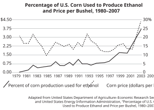

# SAT Practice Test — Reading and Writing Questions

Source: [Kaplan exam review](https://kna.learnwithatom.com/exam-simulator/e/1311055903/sequence/00ec8635-4752-4f15-ae53-09fd478ab15d)

This file contains the 54 Reading/Writing questions only. Math questions are intentionally excluded. Difficulty labels are copied from the review screen except where a nonstandard label has been normalized to Easy, Medium, or Hard.

## Reading/Writing Module 1

### Question 1

- Topic: Craft and Structure
- Subtopic: Words in Context
- Difficulty: Easy

<pre>
As the founding father of the modern Republic of Singapore and its longtime prime minister, Lee Kuan Yew oversaw the city-state’s ______ into a highly developed first-world nation. He promoted infrastructure development, multiracial harmony, and a non-aligned foreign policy during the Cold War that ensured a steady flow of trade.

Which choice completes the text with the most logical and precise word or phrase?

Answer choices
A
degradation
B
movement
C
decline
Correct answer
D
transformation
(Correct)
</pre>

#### Explanation

<pre>
Getting to the Answer: For this Words in Context question use the context of the passage to determine the best strategy for this question. The sentence that contains the blank refers to how “Lee Kuan Yew oversaw” something about the city-state of Singapore. Notice the phrase “into a highly developed first-world nation,” suggesting that there was some kind of positive change. Positive change would be a good prediction, and choice (D) matches that prediction; a “transformation” means the city turned “into” a new form.

Choice (A), “degradation,” meaning reduced in quality, would not logically complete the sentence due to its negative context. Choice (C), “decline,” is incorrect for the same reason. In both cases, the words share a prefix of “de-” which is typically used to refer to something going down or coming off. Choice (B) is incorrect because “movement” is used to refer to physical changes in location, which the city-state could not do; moreover, when plugged into the blank, “movement into a highly developed first-world nation” does not make grammatical sense.
</pre>

### Question 2

- Topic: Craft and Structure
- Subtopic: Words in Context
- Difficulty: Easy

<pre>
The first Native American artist to win the prestigious National Medal of Arts, Chiricahua Apache Allan Haozous was a prolific master of ______ arts, producing almost one thousand sculptures, hundreds of paintings, and the illustrations for several children’s books.

Which choice completes the text with the most logical and precise word or phrase?

Answer choices
A
obvious
B
mechanical
C
utilitarian
Correct answer
D
diverse
(Correct)
</pre>

#### Explanation

<pre>
Getting to the Answer: The blank is an adjective modifying “arts,” so as you read the text from the beginning, identify the clues that define the “arts.” The first phrase describes Allen Haozous, an award-winning Native American artist who was “prolific,” or very productive. The phrase after the blank supports this idea by listing many works of different types that he created. Either of these words, or a word or phrase with a similar meaning would be a good prediction. Choice (D), “diverse,” means varied and is correct.

None of the incorrect choices is supported by the text. There is no evidence the art is “obvious,” or clearly seen (A), “mechanical” (B), or “utilitarian,” or useful.
</pre>

### Question 3

- Topic: Craft and Structure
- Subtopic: Words in Context
- Difficulty: Medium

<pre>
The transition to electric vehicles demands more batteries, which in turn require more of the rare minerals that comprise the lightest and most efficient batteries. Kurt House is using artificial intelligence (AI) technology to ______ this need: by using geological data and historic mining records, House’s AI models are able to better predict the locations of underground deposits, thus reducing the costs of extracting these minerals.

Which choice completes the text with the most logical and precise word or phrase?

Answer choices
Correct answer
A
address
(Correct)
B
circumvent
C
interpret
D
renounce
</pre>

#### Explanation

<pre>
Getting to the Answer: This Words in Context question asks for the verb of what the “technology” is performing. As you read the text from the beginning, put each idea into your own words and focus on the “technology.” The first sentence introduces an increased need for some minerals. The phrase prior to the blank tells you the “technology” is going to do something about that need. Colons, which introduce explanations, are your friend on the SAT! Read the explanation carefully and determine what the “technology” is doing. It “better predict[s]” and is “reducing the costs” of the minerals. Predict that the “technology” is helping to meet the need for the minerals. This prediction matches (A), the correct answer. To “address” a need is to handle or manage it.

Although all of the incorrect choices are possible responses of a “technology” to a need, none of them fits the context of the explanation. The AI technology does not “circumvent,” or avoid, the need (B); rather, the technology responds to the need. Similarly, the technology does not “interpret,” or explain (C), or “renounce,” or deny, (D) the need.
</pre>

### Question 4

- Topic: Craft and Structure
- Subtopic: Words in Context
- Difficulty: Hard

<pre>
Hanspeter Schaub is designing a sweeper spacecraft that would use electrostatic attraction to move space debris out of geostationary orbit, the orbit around Earth’s equator where satellites remain in the same position relative to a location on Earth. Because the locations of the satellites in space and the receivers on Earth are always ______, this orbit is the preferred location for new satellites and could be made much safer by Schaub’s invention.

Which choice completes the text with the most logical and precise word or phrase?

Answer choices
Correct answer
A
corresponding
(Correct)
B
peripheral
C
proximate
D
deviating
</pre>

#### Explanation

<pre>
Getting to the Answer: Start reading this Words in Context question with the phrase before the blank; the correct answer will be an adjective describing “locations of the satellites in space and the receivers on Earth.” Use this clue to focus your reading as you now read the text from the beginning. The first sentence defines “geostationary orbit” as a place where satellites “remain in the same position relative to a location on Earth,” so a good prediction is any word or phrase that means the locations stay the same or do not change. This prediction matches (A), the correct answer. “Corresponding” in this context means matching.

Incorrect choice (B) means at the edge or border, and does not make sense in context. Incorrect choice (C) is not supported by the text; it does not address if the locations are nearby. Incorrect choice (D) is opposite; the text states that the locations are always matching, not changing.
</pre>

### Question 5

- Topic: Craft and Structure
- Subtopic: Words in Context
- Difficulty: Hard

<pre>
The following text is adapted from Henry James’s 1881 novel The Portrait of a Lady.

He had a narrow, clean-shaven face, with features evenly distributed and an expression of placid acuteness. It was evidently a face in which the range of representation was not large, so that the air of contented shrewdness was all the more of a merit. It seemed to tell that he had been successful in life, yet it seemed to tell also that his success had not been exclusive and invidious, but had had much of the inoffensiveness of failure.

As used in the text, what does the word “invidious” most nearly mean?

Answer choices
Incorrect answer
A
Unseen
(Incorrect)
close
Correct answer
B
Malicious
(Correct)
C
Beneficent
D
Extravagant
</pre>

#### Explanation

<pre>
Getting to the Answer: This Words in Context question requires the meaning of “invidious.” If this word is unfamiliar, glance at the phrase containing the underline for clues to focus your reading. Here, “invidious” is an adjective describing a person’s “success.” As you read the text from the beginning, be on the lookout for information about this “success.” The first two sentences describe the appearance of a character, and the keywords “placid” and “contented” set a calm tone. The final sentence describes the “success” as not “invidious,” but “inoffensive.” A good prediction is any word or phrase that is the opposite of “inoffensive,” such as offensive or harmful. Choice (B), “malicious,” means evil or vicious and is correct.

Incorrect choice (A) is not supported by the text. There is no mention that the “success” was not observed, in fact, the third sentence makes it clear that the “success” was very much seen. Choices (C) and (D) are opposite. “Beneficent” means helpful or beneficial, and “extravagant” means extreme or excessive. Neither word matches the context of offensive.
</pre>

### Question 6

- Topic: Craft and Structure
- Subtopic: Structure and Purpose
- Difficulty: Easy

<pre>
The following text is adapted from F. Scott Fitzgerald’s 1925 novel The Great Gatsby.

It was lonely for a day or so until one morning some man, more recently arrived than I, stopped me on the road.

“How do you get to West Egg village?” he asked helplessly.

I told him. And as I walked on I was lonely no longer. I was a guide, a pathfinder, an original settler. He had casually conferred on me the freedom of the neighborhood.

And so with the sunshine and the great bursts of leaves growing on the trees, just as things grow in fast movies, I had that familiar conviction that life was beginning over again with the summer.

Which choice best describes the function of the underlined portion in the text as a whole?

Answer choices
Correct answer
A
It provides an explanation for a shift in the narrator’s feelings.
(Correct)
B
It portrays the calm and serenity of the setting.
C
It contrasts the features of the narrator’s location with those of another village.
D
It describes a second character’s response to the narrator’s question.
</pre>

#### Explanation

<pre>
Getting to the Answer: The question asks for the function of the underlined sentence within the text, and the opening paragraph describes the text as a literary work. As you read the text from the beginning, focus on identifying the overall theme of the text. In a literature excerpt, do this by thinking about the characters, the interactions between the characters, and any emotions that are described. In this text, the narrator describes feeling “lonely . . . until” another man asks for directions, after which the narrator “was lonely no longer.” The next two sentences, including the underlined sentence, explain why this simple encounter changed the narrator’s feelings. The following paragraph describes the narrator’s changed emotion of renewal and expectation. Predict that the text presents a shift in the narrator’s feelings and that the underlined sentence explains or marks this change. This matches (A), the correct answer.

Incorrect choices (B) and (C) are out of scope. Only the last sentence describes any aspect of the setting (B), and it is not portrayed as “calm.” No other town is mentioned in the text (C). Incorrect choice (D) scrambles the narrator, who answers the question, with the second character, the lost man, who asked the question. A key tip when reading literature passages is to keep straight who said what. Use your scratch paper to make notes as needed.
</pre>

### Question 7

- Topic: Craft and Structure
- Subtopic: Structure and Purpose
- Difficulty: Medium

<pre>
In 2006, the International Astronomical Union (IAU) redefined the term “planet” as a celestial body that meets three conditions. First, it must orbit the sun. Second, it must have such mass that it has a roughly spherical shape. Third, it must have “cleared its orbit,” meaning it has cleared away other debris and celestial bodies from its path. Pluto, which had been considered a planet, meets the first two criteria, but it does not meet the third. Not only does Pluto’s orbit cross that of Neptune, but Pluto also shares its orbital neighborhood with icy bodies in the Kuiper Belt. This characteristic led to the controversial decision to reclassify Pluto as a “dwarf planet” rather than a full-fledged planet.

Which choice best describes the overall structure of the text?

Answer choices
A
It reviews the conditions for a celestial body to be considered a planet, then lists all the celestial bodies that do not meet those conditions.
B
It presents an argument for redefining the term “planet,” then gives evidence to support the argument.
Correct answer
C
It discusses a change in the definition of a planet, then describes a consequence of that change.
(Correct)
D
It challenges the reasons given for changing the definition of the term “planet,” then explains how Pluto’s classification is affected by the change.
</pre>

#### Explanation

<pre>
Getting to the Answer: Since the question asks about the structure of the passage, try to determine how the ideas in the passage are organized as you read. The passage begins with describing the three conditions for a celestial body to be considered a planet. The last portion of the passage describes why Pluto, which used to be considered a planet, is now a dwarf planet. Choice (C) is correct because it reflects this flow of ideas.

Eliminate any answer choice that misrepresents any part of the passage. Choice (A) is incorrect because the second part of the passage does not list all of the celestial bodies that do not meet the conditions; it only describes Pluto. Choices (B) and (D) are both incorrect because there is no argument or challenge; the tone of the passage is informative.
</pre>

### Question 8

- Topic: Craft and Structure
- Subtopic: Connections
- Difficulty: Medium

<pre>
Text 1

Migratory birds use Earth’s magnetic field for navigation, but the exact biological mechanism is unknown. Photochemist Peter Hore and his team analyzed the protein cryptochrome 4 (Cry4) in robins’ eyes using computer simulations and spectroscopy. They found that when exposed to certain wavelengths, Cry4 produces radical pairs that react to the light; these radical pairs are highly sensitive to magnetic fields. This suggests the team discovered how birds navigate. 

Text 2

Researchers Roswitha and Wolfgang Wiltschko have approached the problem of bird navigation from a behavioral perspective. They conducted orientation experiments on robins using flickering lights and changing magnetic fields, and their results showed that robins can navigate even in complete darkness. The Wiltschko team proposes that it’s a light-independent mechanism that senses changes in magnetic fields.

Based on the texts, how would the Wiltschko team (Text 2) most likely respond to Peter Hore’s findings (Text 1)?

Answer choices
A
They would recommend that Peter Hore examine the eyes of other animal species to confirm that Cry4 proteins do react to light and further support his conclusions.
Correct answer
B
They would contend that the study’s findings do not provide conclusive proof that Cry4 is responsible for birds’ navigation abilities because this is not consistent with the actual behavior of robins.
(Correct)
C
They would agree with Peter Hore’s findings, as they are consistent with the results of behavioral studies of robins.
D
They would argue that computer simulations and spectroscopy are never valid ways of modeling avian navigation, so the role of Cry4 in the mechanism has not been proved.
</pre>

#### Explanation

<pre>
Getting to the Answer: Since the question asks about the findings described in Text 1, read for that information specifically. In Text 1, Peter Hore’s team used technology to find that “when exposed to certain wavelengths,” the protein found in robins’ eyes “produces radical pairs that react to the light” that are “highly sensitive to magnetic fields.” In Text 2, the Wiltschko team observed the behavior of robins to conclude that a “light-independent mechanism” is responsible for bird navigation ability, which would be the opposite of the light-dependent mechanism suggested by Peter Hore’s research. Predict that the Wiltschko team would be skeptical of Peter Hore’s results. This prediction matches (B), the correct answer.

Eliminate (A) as an out-of-scope answer choice; there is nothing in the passage to support the idea that research about other animal species would help to solve the question about bird navigation. Choice (C) can be eliminated because it is the opposite; the Wiltschkos would not agree that their results are consistent with the results of Peter Hore’s research. To say computer simulations and spectroscopy are “never” valid is too extreme, so eliminate choice (D).
</pre>

### Question 9

- Topic: Information and Ideas
- Subtopic: Detail
- Difficulty: Medium

<pre>
The following text is adapted from Sinclair Lewis’ 1925 novel Arrowsmith. A coupe is a two-seater automobile.

Director Rippleton Holabird had also married money, and when all of his colleagues hinted that since his first intense work in physiology he had done nothing but arrange a few nicely selected flowers on the tables hewn out by other men, it was a satisfaction to him to observe that every one of these rotters came down to the Institute by an unremarkable subway out of necessity, while he drove elegantly in his coupe. But now Martin Arrowsmith, once the poorest of them all, came by limousine with a chauffeur who touched his hat, and Holabird salted his coffee with odious tears.

Based on the text, what is true about Director Holabird?

Answer choices
A
Holabird is criticized for his lack of recent research and he feels ashamed about it.
Correct answer
B
Holabird took comfort in being the richest man at his workplace.
(Correct)
C
Holabird married into a wealthy family to better fund his physiological research.
Incorrect answer
D
Holabird is embarrassed that Arrowsmith is now richer than him.
(Incorrect)
close
</pre>

#### Explanation

<pre>
Getting to the Answer: The entire text is about Holabird, making this question difficult to predict. Summarize the key points as you read, but expect that you will have to work through the choices by elimination. Some key points from this text might include: Holabird married into a wealthy family, he has not done intense work in physiology for some time, he relies on the research of others now, all of his colleagues criticize him for that fact, he likes that he can drive to work while his critics cannot, but now his poorest colleague (Martin Arrowsmith) takes a limo to his workplace. Keeping your summary in mind, review the choices and refer back to the text as needed.

Holabird is said to be criticized by all of this colleagues for doing “nothing but arrange a few nicely selected flowers on the tables hewn out by other men,” meaning he relied on the research of others. Whenever he was criticized in that way, he found “satisfaction” that his colleagues took the subway to work while he drove a coupe. There is no support in the text for saying he feels ashamed about that practice; so, eliminate (A). There are two pieces of evidence that Holabird liked being richer than all of his coworkers. The first is that he drives a car to work while all of his other (poorer) colleagues took the subway; Holabird says “it was a satisfaction” to see “every one of these rotters” needing to take the subway to work. The second is his negative reaction to Arrowsmith being driven to work in a limo. Note the reference to Holabird salting his coffee with odious (hateful) tears, suggesting a negative emotional reaction. This suggests, at the very least, a challenger to his past status as the richest man at the Institute. Choice (B) matches the summary and is correct.

On test day, choose (B) with confidence and move to the next question, but for practice we shall review the remaining answer choice options. Eliminate (C) because it is not supported by the text. Although it is stated that Holabird “married money,” there is no evidence that he married to fund his research. Eliminate the tempting choice (D) because while Holabird is certainly upset about Arrowsmith, there's no information about whether he feels embarrassed, nor is there information to definitively tell which character now has more wealth. This second part might be true, but look for answers that must be true on these types on questions.
</pre>

### Question 10

- Topic: Information and Ideas
- Subtopic: Main Idea
- Difficulty: Medium

<pre>
Czech playwright Václav Havel may be known for the many plays and poems that he wrote, but his nonfiction essay The Power of the Powerless is likely his most influential work. The 1978 essay, related to Havel’s work with the suppressed Charter 77 human rights petition, gradually spread underground through Europe’s communist Eastern Bloc. It described the concept of “living in truth,” in which people lead double lives where they publicly obey the state ideology while inwardly maintaining their own opinions. Havel inspired resistance movements with his notion that by maintaining that inner life, their members would have the strength to resist the state with minor outward displays of non-cooperation, which would help gradually shift public opinion against the state.

Which choice best describes the main idea of the text?

Answer choices
A
Havel’s insightful essay The Power of the Powerless was widely published when it was released in 1978.
B
Havel wrote many different works throughout his life, including plays, poems, and nonfiction political essays.
C
Havel was a talented writer whose work inspired many people to begin publishing their own material.
Correct answer
D
Havel’s essay The Power of the Powerless made an important contribution to resistance movements in the Eastern Bloc.
(Correct)
</pre>

#### Explanation

<pre>
Getting to the Answer: Read the entire paragraph to determine the main idea. Keep in mind that the main idea may entail significant details that appear throughout the passage. The text mentions that Havel was a playwright who wrote a nonfiction political essay, and goes on to discuss the content and consequences of that essay. The correct answer, (D), is the only one that accurately describes that main idea: The Power of the Powerless an important work that made a notable contribution to anti-communist resistance movements.

Incorrect choice (A) distorts a detail from the passage; the essay is said to have “gradually spread underground,” meaning it was published without official approval and became available only slowly. Incorrect choice (B) focuses on a detail to the exclusion of the main idea; while the passage does mention that Havel was a poet and a playwright, the majority of the text deals with one nonfiction essay that he wrote. In other words, the focus is on that essay rather than on the various other works Havel wrote. Incorrect choice (C) is out of context; while Havel wrote several works, including a famous essay, there is no mention that he specifically inspired people to begin publishing their own written material.
</pre>

### Question 11

- Topic: Information and Ideas
- Subtopic: Command of Evidence (Textual)
- Difficulty: Easy

<pre>
“Life” is an 1846 poem by Charlotte Brontë. The poem conveys the speaker’s optimism despite struggles: ______

Which quotation from the poem most effectively illustrates the claim?

Answer choices
A
“Life's sunny hours flit by, / Gratefully, cheerily / Enjoy them as they fly!”
B
“What though Death at times steps in, / And calls our Best away?”
C
“What though sorrow seems to win, / O'er hope, a heavy sway?”
Correct answer
D
“Fearlessly, / The day of trial bear, / For gloriously, victoriously, / Can courage quell despair!”
(Correct)
</pre>

#### Explanation

<pre>
Getting to the Answer: The question asks for the quotation that supports the claim, so, as you read the text, identify that claim and put it into your own words. The phrase before the blank tells you the correct answer will support “optimism” despite “struggles.” Keep these ideas firmly in mind as you evaluate the choices.

Eliminate (A); this choice is optimistic, but makes no mention of any difficulty. Eliminate (B) and (C); these choices mention “Death” and “sorrow,” both of which are “struggles,” but do not include any aspect of “optimism.” Choice (D) must be, and is, correct. On test day, choose it with confidence and move to the next question, but to build your skills, note that this choice includes a “struggle,” a “day of trial,” and closes with a cause for “optimism.”
</pre>

### Question 12

- Topic: Information and Ideas
- Subtopic: Command of Evidence (Quantitative)
- Difficulty: Medium

<pre>
Ethanol, created from plants such as corn, sugarcane, soybeans, and rice, is a popular renewable fuel. While ethanol is a viable energy source, its production and use raise ethical questions because food crops are diverted to fuel production when there are large numbers of malnourished people around the world in dire need of food. In addition, economists claim that the amounts of these crops diverted to ethanol production drives up the demand for them, which, in turn, pushes food prices higher.

Which choice most effectively uses data from the graph to illustrate the claim?

Answer choices
A
In 1998 and 2006, even though corn production was constant, the price of corn continued to increase.
B
In 1983 and 1996, the price of corn reached levels that were not surpassed again until 2007.
C
When the percent of corn production used for ethanol is about 5%, the price of corn stabilizes at about $2.25 per bushel.
Correct answer
D
Since 2005, the price of corn has increased as the percentage of corn produced for ethanol has increased.
(Correct)
</pre>

#### Explanation

<pre>
Getting to the Answer: The question requires information from the graph to support the claim, so scan the text quickly to identify the claim. The economists’ claim appears in the last sentence, so read it carefully and put it into your own words: crops used for ethanol raise food prices. Keep this claim firmly in mind, or jot it on your scratch paper, to focus your reading of the text. The first sentence explains that ethanol is made from crops. The second sentence states that these crops are also used for food, so using them for ethanol raises ethical questions. The economists’ claim closes out the text: using crops for ethanol also raises food prices. Compare each choice to the claim, and eliminate those that do not support this idea.

Eliminate (A); this choice misreads the data and does not relate to ethanol production.

Eliminate (B); this choice correctly summarized information from the graph but does not make any connection to the percent of corn used for ethanol.

Eliminate (C); according to the graph, this statement is not true. In the years 1987 through 2001, when the percent of corn production used for ethanol hovered around 5%, the price of corn fluctuated from about $1.80 to about $3.25 per bushel.

Choice (D) must be, and is, correct. On test day, choose (D) with confidence and move on to the next question, but for the record: starting in 2005, the percent of corn production used for ethanol climbs steadily as the price per bushel skyrockets from about $2 per bushel to almost $4.50.
</pre>

### Question 13

- Topic: Information and Ideas
- Subtopic: Command of Evidence (Textual)
- Difficulty: Medium

<pre>
Wild pigs can be considered an invasive species, due to the destruction they can inflict on crops and native plants. Over a 24-month period, a research team led by Joseph W. Treichler monitored the amount of crop damage, in hectares (ha), that could be attributed to wild pigs on 19 properties in South Carolina. The researchers used cameras baited with food to measure the relative abundance index (RAI) of wild pigs on each property, both at the beginning of the experiment and again every 6 months over the course of a program of wild pig removal. Based on the results, they claim that a wild pig mitigation program can have a positive impact on the extent of crop damage.

Which finding, if true, would most strongly support the researchers’ claim?

Answer choices
A
At both the 12– and 24-month marks, the crop damage in hectares was the highest at the properties that had the lowest RAI measures.
B
At the end of the study, the properties with the highest RAI measures had the lowest amounts of crop damage.
C
The RAI measure on the majority of properties was positively correlated with the number of baited food cameras that had been set up by the researchers.
Correct answer
D
On most of the properties, both the RAI measure and the recorded amount of crop damage decreased over the 24 months of the study.
(Correct)
</pre>

#### Explanation

<pre>
Getting to the Answer: The question asks you to identify which statement supports the researchers’ claim, so begin by identifying this claim, which is found in the last sentence of the passage: wild pig mitigation can have “a positive impact on the extent of crop damage.” In other words, wild pig mitigation reduces crop damage. Keep this claim in mind as you read the rest of the passage for additional context. The first two sentences confirm that wild pigs cause crop damage and introduce a study that was done about such damage. The next sentence describes the process of the study: the researchers used cameras to measure RAI, or the “relative abundance index,” of wild pigs during a “wild pig removal” program. So in this study, RAI refers to the number (abundance) of pigs during a program to remove (mitigate) them. And, again, the last sentence includes the claim that wild pig mitigation reduces crop damage.

Predict that the correct answer will likely reflect a decrease in RAI accompanied by a decrease in crop damage, and evaluate the answer choices. Choice (A) does not support the researchers’ claim because it associates low numbers of wild pigs (low RAI) with high crop damage; eliminate this choice. Also eliminate (B), which associates high numbers of wild pigs with low crop damage. Choice (C) can be eliminated because it does not address crop damage. This leaves choice (D), which is correct. This choice reflects a decrease in RAI with a decrease in crop damage over time.
</pre>

### Question 14

- Topic: Information and Ideas
- Subtopic: Command of Evidence (Quantitative)
- Difficulty: Hard

<pre>
According to the U.S. Census Bureau, approximately 8.7% of Americans moved to a new residence in 2022, and Americans’ most commonly cited reasons for moving in 2022 were related to housing (41.6% of moves), family (26.5%), and employment (16.1%). The Census Bureau also classifies moves by type related to distance, from shorter-distance moves within the same county to medium-distance moves across county boundaries to longer-distance international moves. A researcher was interested in how a person’s primary reason for moving was related to the distance of their relocation. After analyzing the Census Bureau’s data for 2022, the researcher concluded that some reasons for moving were less related to the distance of the move than others. This can be seen most clearly by comparing the percentages of ______

Which choice most effectively uses data from the graph to complete the statement?

Answer choices
A
employment-related reasons for moving within the same U.S. county and housing-related reasons for moving within the same U.S. county.
B
housing-related reasons for moving across the three types of move by distance.
Correct answer
C
family- and housing-related reasons for moving within the same U.S. county with family- and housing-related reasons for moving from a different U.S. county.
(Correct)
D
family-related reasons, employment-related reasons, and housing-related reasons for moving from a different U.S. county.
</pre>

#### Explanation

<pre>
Getting to the Answer: The question stem asks you to use data from the graph to complete the statement at the end of the passage. The last sentence states that something can be “seen most clearly” by comparing percentages, and the previous sentence includes the conclusion that “some reasons for moving were less related to the distance of the move than others.” So the correct answer will compare data from the graph that support the conclusion about reasons and distance for moving. Next, analyze the graph. The title indicates that it shows the primary reasons given for moving by the three types of moves, which range from shorter-distance moves within a county to longer-distance moves from a foreign country, identified on the x-axis. Since you must support the conclusion that some reasons are less related to the distance of the move than others, predict that the correct answer will compare the percentages for a reason for moving that are relatively similar by distance with the percentages for a reason for moving that differ by distance.

Evaluate the answer choices. Choice (A) can be eliminated because it concerns only reasons for moving, not the distances of the moves, since it only compares data for moves within the same U.S. county. On the other hand, (B) can be eliminated because, although it addresses moves of different distances, it does not compare different reasons for moving. Choice (C) supports the conclusion that “some reasons for moving were less related to the distance of the move than others” because it compares the percentages of family-related reasons, which are relatively similar for moves within and from different U.S. counties, with housing-related reasons, which significantly differ for moves within and from different U.S. counties (~50% and ~30%, respectively). Choice (C) is correct. For the record, (D) can be eliminated because, like (A), it concerns only reasons for moving, not the distances of the moves.
</pre>

### Question 15

- Topic: Information and Ideas
- Subtopic: Inference
- Difficulty: Medium

<pre>
Typically featuring a physically isolated protagonist, liminal horror is a popular genre of online video which focuses on an eerie and unsettling atmosphere in abandoned places, such as closed down malls or endless hallways. The genre is especially popular among young people. One possible explanation for its relatability is the increasing use of smartphones and other internet devices, which has resulted in feelings of social isolation; liminal horror ______

Which choice most logically completes the text?

Answer choices
A
alters the relationship between young people and their technological devices.
B
provides comfort to young people who delayed developing romantic relationships.
Correct answer
C
appeals to young people who use online socializing as a substitute for in-person social interaction.
(Correct)
D
encourages a decline in online socializing in favor of in-person theater attendance to watch such horror films.
</pre>

#### Explanation

<pre>
Getting to the Answer: Glance at the phrase in front of the blank before you read the text so you have an idea of the information on which to focus. The question requires an inference about “relatability.” The text opens with a definition of liminal horror, then states that it is especially popular among young people. Slow down and focus starting with “One possibly explanation for this popularity” in the third sentence, and paraphrase the information that follows: “Smartphone usage causes feelings of social isolation.” Since liminal horror protagonists are typically physically isolated from others, you can predict that the popularity of liminal horror is rooted in how audiences feeling similarly isolated. This prediction matches (C), the correct answer.

There is no discussion of how horror “alters the relationship” between young people and their devices (A) or “romantic relationships” (B), rendering those answer choice options incorrect. Choice (D) is incorrect because the text describes liminal horror as a genre of online video; there is no support in the text for the idea that liminal horror films exist for “in-person theater attendance.”
</pre>

### Question 16

- Topic: Information and Ideas
- Subtopic: Inference
- Difficulty: Hard

<pre>
A team of biologists led by Heidi Appel and Reginald Cocroft investigated the effect of vibrations from predatory caterpillars on the protection mechanisms of Arabidopsis thaliana (thale cress) plants. When a thale cress plant is attacked by caterpillars, the surviving leaves produce glucosinolates and anthocyanins, defensive chemicals that make the leaves harder for the caterpillars to eat. The researchers exposed test plants to recordings of the vibrations made by caterpillars when they were eating leaves and compared the leaf composition of the plants to those of two control groups: plants not exposed to vibrations and plants exposed to other vibrations, such those produced by wind or non-predatory insects. Although no caterpillars were present on the test plants, their leaves had much higher levels of glucosinolates and anthocyanins than the control groups, which suggests that ______

Which choice most logically completes the text?

Answer choices
Correct answer
A
although plants do not have ears, some plants are able to respond to stimuli from vibrations.
(Correct)
B
production of chemicals that discourage predatory insect attacks is unique to A. thaliana.
C
A. thaliana produces glucosinolates and anthocyanins regularly, even when not under attack.
Incorrect answer
D
glucosinolates and anthocyanins will be released by A. thaliana as a response to any vibration.
(Incorrect)
close
</pre>

#### Explanation

<pre>
Getting to the Answer: The question asks you to logically complete the text, so first, read the phrase that precedes the blank for clues to focus your reading. Here, you learn you will be reading about an experiment on some “test plants” versus “control groups” and that the experiment involves leaves, caterpillars, and two scientific words—you might call them “g” and “a”. (You’ll never need to correctly pronounce a science word on the SAT, so just make up your own abbreviations.) With this in mind, read the text from the beginning and put each sentence into your own words.

The first sentence provides the aim of the experiment: the caterpillars are “predatory” and produce vibrations, and the experiment will study the effect of these vibrations on a particular plant. The second sentence defines “g” and “a”: these are chemicals that the plant makes to protect itself once attacked. The third sentence provides the details of the experiment: the “test plants” were exposed to recordings of caterpillar vibrations and there were two control groups, one with no vibrations and one with vibrations not from caterpillars. Now you’ve reached the experiment’s results, in the sentence containing the blank. The plants exposed to the caterpillar vibration recordings made “g” and “a” to protect themselves, even though there were no caterpillars on them. Predict that the experiment indicates that the plants are responding to just the vibrations and evaluate the choices.

Choice (A) matches the prediction and is correct. If a prediction did not immediately come to mind, note that “some plants” refers back to “A. thaliana” which “responded” by producing “g” and “a” after exposure to recordings of “vibrations.” On test day, choose (A) with confidence and move to the next question, but today, continue to build your elimination skills by reviewing the incorrect choices.

Eliminate (B) as extreme. The text describes the response of A. thaliana, but never claims this response is “unique” to this plant. Choices (C) and (D) are opposite choices because they contradict the results of the experiment. A. thaliana that was not exposed to vibrations (C) and that was exposed to vibrations that were not caused by caterpillars (D) did not produce the defensive chemicals.
</pre>

### Question 17

- Topic: Standard English Conventions
- Subtopic: Commas, Dashes, and Colons
- Difficulty: Easy

<pre>
Known for his ever-evolving kinetic sculptures called “strandbeests,” Theo _____ drew inspiration for his art from Richard Dawkins’ book The Blind Watchmaker, which includes the idea that complex structures could emerge through an iterative process of variation and selection.

Which choice completes the text so that it conforms to the conventions of Standard English?

Answer choices
A
Jansen—
Correct answer
B
Jansen
(Correct)
C
Jansen,
D
Jansen:
</pre>

#### Explanation

<pre>
Getting to the Answer: The answer choices indicate that the convention being tested is the punctuation needed, if any, after “Jansen.” In this case, “Theo Jansen” is the subject, and it is immediately followed by a verb “drew.” No punctuation is needed between a subject and its verb when there is no parenthetical information present. Choice (B) is correct. All of the other choices incorrectly separate the subject from its verb.
</pre>

### Question 18

- Topic: Standard English Conventions
- Subtopic: Verb Tense
- Difficulty: Easy

<pre>
The áo dài, a long, slitted tunic worn over trousers, has been the national garment of Vietnam since the eighteenth century. Interestingly, today’s Vietnamese fashion designers ______ the áo dài with Gallic influences; Vietnam was a French colony from 1862 until 1954.

Which choice completes the text so that it conforms to the conventions of Standard English?

Answer choices
A
updating
B
to update
Correct answer
C
are updating
(Correct)
D
having updated
</pre>

#### Explanation

<pre>
Getting to the Answer: A quick glance at the choices indicates this question is testing verb usage. As you read the text from the beginning, look for clues that identify the subject and the tense of the “updating.” The first sentence defines the áo dài. The first phrase of the second sentence contains two clues: “today” identifies the tense as present, and “designers,” a plural noun, is the subject. Predict that the correct answer will be a plural verb in the present tense. Only (C) matches this prediction and is correct. All the incorrect choices interrupt the logical flow of the sentence and create fragments.
</pre>

### Question 19

- Topic: Standard English Conventions
- Subtopic: Verb Tense
- Difficulty: Medium

<pre>
Dr. Richard Feynman, who won the Nobel Prize in Physics in 1965, was also known for his charisma and broad interests. Dr. Feynman, whether playing the bongos or demonstrating why a space shuttle exploded on national television, _____ to make science accessible to a diverse audience.

Which choice completes the text so that it conforms to the conventions of Standard English?

Answer choices
A
that helped
B
helping
Correct answer
C
helped
(Correct)
D
help
</pre>

#### Explanation

<pre>
Getting to the Answer: A glance at the choices indicates that this question is testing the correct form of the verb “help.” To identify the subject, ask yourself: Who or what is helping? In this case, “Dr. Feynman” is the subject who is helping, even though the subject and verb are separated by the parenthetical “whether . . . television.” Incorrect choices (A) and (B) cause “. . . to make . . . audience” to be a dependent clause and leave the subject without a main verb, so eliminate them. Eliminate (D) because it is a plural verb, and “Dr. Feynman” is singular. Choice (C) is a singular, past tense verb and is correct.
</pre>

### Question 20

- Topic: Standard English Conventions
- Subtopic: Sentence Structure
- Difficulty: Medium

<pre>
Despite both being single-celled organisms, amoebas and paramecia have significantly different modes of locomotion. Amoebas move by constantly changing their _____ paramecia move using cilia—tiny hair-like structures that aid in their movement.

Which choice completes the text so that it conforms to the conventions of Standard English?

Answer choices
A
shape—while
Correct answer
B
shape, while
(Correct)
C
shape; while
D
shape. While
</pre>

#### Explanation

<pre>
Getting to the Answer: The answer choices show that this question is testing the punctuation required between two words. Read the sentence containing the blank and look for the complete idea(s). “Amoebas . . . shape” is an independent clause. “[W]hile . . . cilia” is a dependent clause that must in some way be joined to the independent clause. Choice (B) correctly joins the independent and dependent clauses with a comma. Eliminate incorrect choices (C) and (D) because both make the second clause a fragment. Choice (A) may be tempting because the dash appears to be paired with another dash to make a parenthetical, but “while . . . cilia” is essential to the meaning of the sentence, not parenthetical information. So (A) is incorrect.
</pre>

### Question 21

- Topic: Standard English Conventions
- Subtopic: Modifiers
- Difficulty: Hard

<pre>
In 1866, the Austrian ironclad SMS Erzherzog Ferdinand Max intentionally rammed the Italian ironclad Re d'Italia, tearing a large hole in her hull and sinking her. The successful ramming was a fluke owing to the poor seamanship of the rival fleets. Nevertheless, encouraged by its success, _______

Which choice completes the text so that it conforms to the conventions of Standard English?

Answer choices
Incorrect answer
A
many warships were equipped with ram bows for decades to come as the potential of ramming was overrated by foreign observers.
(Incorrect)
close
B
ram bows were equipped on many warships for decades to come as the potential of ramming was overrated by foreign observers.
C
the decades to come saw many warships equipped with ram bows as foreign observers overrated ramming’s potential.
Correct answer
D
foreign observers overrated the potential of ramming, leading to many warships being equipped with ram bows for decades to come.
(Correct)
</pre>

#### Explanation

<pre>
Getting to the Answer: The sentence with the blank has a modifier, “encouraged by its success,” which means that the subject of the sentence must be whoever was encouraged by the successful ramming despite it being a fluke. A review of the answer choice options reveals that all the incorrect options create a dangling modifier. Eliminate (A) because the “many warships” could not be encouraged by the ramming. Eliminate (B), “many warships,” and (C), “the decades to come,” for similar reasons. Only (D) correctly assigns the right noun to the modifying phrase: encouraged by ramming working once, the foreign observers overrated its importance.
</pre>

### Question 22

- Topic: Standard English Conventions
- Subtopic: Sentence Structure
- Difficulty: Hard

<pre>
Diocletian, the emperor of the Eastern Roman Empire during the third century CE, has been characterized as despotic because his subjects were impoverished by heavy tax ______ imposed a centralized taxing system, he ensured that wealthier citizens paid a larger share of taxes than poorer citizens, and new archeological evidence indicates that peasants prospered under his rule.

Which choice completes the text so that it conforms to the conventions of Standard English?

Answer choices
Correct answer
A
burdens. Having
(Correct)
B
burdens and having
C
burdens, having
D
burdens having
</pre>

#### Explanation

<pre>
Getting to the Answer: The shifting punctuation in the choices indicates this question is testing sentence structure. As you read the text from the beginning, be attentive to independent clauses; have you just read a subject, predicate verb, and a complete idea? Here, “Diocletian . . . has been characterized . . . because . . .” is an independent clause. The best clue to the structure of the phrase that starts with “[H]aving” is the comma that follows “system”; words ending in -ing or -ed frequently start introductory modifying phrases that end with a comma. That is the case here, “Having . . . system” modifies the pronoun “he” that immediately follows the comma. “he . . . ensured that . . .” is another independent clause that needs to be properly punctuated to separate it from the previous one. Only (A), which uses a period and a capital letter to start another sentence, does so. All the incorrect choices create run-ons.
</pre>

### Question 23

- Topic: Expression of Ideas
- Subtopic: Transitions
- Difficulty: Easy

<pre>
Some people feel that even though lumber is needed for construction, logging of old growth trees—those which are at least 120 years old and have an average diameter of more than 10 inches—should be prohibited. These trees are at their peak potential for carbon storage, which helps mitigate climate change. _______ it can be argued that it is important to cull old growth trees in order to have room for vigorous saplings to grow and to reduce the likelihood that dense forests of old growth trees will provide tinder for disastrous forest fires.

Which choice completes the text with the most logical transition?

Answer choices
A
Therefore,
Correct answer
B
However,
(Correct)
C
Finally,
D
Besides,
</pre>

#### Explanation

<pre>
Getting to the Answer: A brief look at the question stem reveals that this question is testing transitions, so begin by determining the relationship between the two ideas that are connected by the missing transition. The idea before the blank is that cutting down old growth trees should be prohibited. The idea after the missing transition is that it is important to cull old growth trees. Ask yourself how these two ideas might be connected. The first idea contradicts the second, therefore predict that you need a contrast word such as nevertheless or conversely. “However” provides this contrast, so (B) is correct.

Incorrect answer choice (A) is a cause-and-effect word, but there is no such relationship in the passage. Incorrect answer (C) indicates that the second idea is the last step in a process, but there is no process and there are no steps, and (D) is a continuation word but the sentences before and after the blank do not continue with the same idea but rather are in contrast to each other.
</pre>

### Question 24

- Topic: Expression of Ideas
- Subtopic: Transitions
- Difficulty: Easy

<pre>
During the American colonial period, from the 17th to the early 18th centuries, education was mostly informal, focused on parents teaching children the basics of reading, writing, and arithmetic. However, during the Industrial Revolution, when the country began to transition from an agricultural to an industrial economy, it became apparent that the new factory and office workplaces required workers with more than a basic ability to read, write, and add sums. ________ by the 1800s, free, formal public education became available to all.

Which choice completes the text with the most logical transition?

Answer choices
A
Nevertheless,
B
On the other hand,
Correct answer
C
Consequently,
(Correct)
D
Furthermore,
</pre>

#### Explanation

<pre>
Getting to the Answer: A brief look at the question stem reveals that this question is testing transitions, so focus on determining the relationship between the two ideas that are connected by the missing transition. The first sentence provides background information about education in colonial America. Pay special attention to the contrast keyword “however” at the beginning of the second sentence and to what follows both before and after the blank. The idea before the missing transition is that with industrialization, it became imperative for workers to be more educated in reading, writing, and mathematics. The idea after the missing transition is that formal education became available. Ask yourself how these two ideas might be connected. The second idea is a result of the first—there was a need for formal education—so predict that you need a cause-and-effect word or phrase such as therefore or as a result. “Consequently” provides this cause and effect, so (C) is correct.

Incorrect answer choices (A) and (B) are contrast words, but the second idea is not in contrast with the first. Incorrect choice (D) is a continuation word, meaning that the second sentence continues with the same idea as the first, but the second introduces a new idea which is a result of the first.
</pre>

### Question 25

- Topic: Expression of Ideas
- Subtopic: Rhetorical Synthesis
- Difficulty: Easy

<pre>
While researching a topic, a student has taken the following notes:

The word “serendipity” means an unplanned, but fortunate, discovery.
The word's origin derives from the Persian fairy tale The Three Princes of Serendip.
According to Horace Walpole, who is credited with using the word first while writing to his friend, the princes in the story were always finding things out accidentally.
The word “chortle” means to laugh gleefully.
It was coined by author Lewis Carroll in his novel Through the Looking Glass.
“Chortle” is thought to be a combination of the words “chuckle” and “snort.”

The student wants to emphasize a similarity in the origins of the two words. Which choice most effectively uses relevant information from the notes to accomplish this goal?

Answer choices
Correct answer
A
Both “serendipity,” which was derived from a Persian fairy tale, and “chortle,” which was coined in a novel, have literary origins.
(Correct)
B
“Chortle” means to laugh gleefully while “serendipity” means to make an unexpected lucky discovery.
C
Literature, such as fairy tales and novels, has been the origin of new English words throughout the ages.
D
Horace Walpole coined the word “serendipity,” meaning finding a valuable thing by chance, while writing to his friend after reading a Persian fairy tale.
</pre>

#### Explanation

<pre>
Getting to the Answer: Based on the question stem, the correct answer must explicitly compare the origins of two words, so look for information about word origins. The first three bullet points describe the word “serendipity,” which originated in a Persian fairy tale (bullet point 2). Read the last three bullet points about the word “chortle” for how its origin might be similar to that of a Persian fairy tale. The fifth bullet point mentions that it was coined for a novel, which is also a fictional story like a fairy tale. Using this information, predict something like the words “chortle” and “serendipity” both come from fictional writing. Note the keyword “both” in the first choice, which is a clue that (A) is the correct answer.

Choice (B) is incorrect because it specifies a difference between the words' meanings. Choice (C) is incorrect because though it discusses that words can derive from literature, it does not mention the two words in question. Choice (D) is incorrect because it discusses only one word, not both.
</pre>

### Question 26

- Topic: Expression of Ideas
- Subtopic: Rhetorical Synthesis
- Difficulty: Medium

<pre>
While researching a topic, a student has taken the following notes:

Scientists estimate that there are over a thousand potentially active volcanoes worldwide.
Eyjafjallajökull, a volcano in Iceland, is one of the many volcanoes which has changed its profile after eruptive activity.
Eyjafjallajökull was a volcano covered by an ice cap, with a relatively symmetrical shape and a smooth exterior.
After a 2010 eruption, Eyjafjallajökull's summit area was significantly reshaped by the extrusion of lava flows, which built irregular craggy structures as they cooled around a newly created vent.

The student wants to make and support a generalization about the profiles of volcanoes. Which choice most effectively uses relevant information from the notes to accomplish this goal?

Answer choices
A
Scientists estimate the number of potentially active volcanoes to be over a thousand; the volcanoes’ profiles may change after eruptions.
B
Like Mt. Rainier, Mauna Loa, and Vesuvius, hundreds of potentially active volcanoes exist on the Earth.
C
One example of an active volcano is Eyjafjallajökull, whose summit was once symmetrical and relatively smooth, but now it is a rough landscape of solidified lava.
Correct answer
D
Volcanoes’ profiles may change after an eruptive event: the summit of Eyjafjallajökull once was a symmetrical ice cap, but now it features irregular jagged lava formations.
(Correct)
</pre>

#### Explanation

<pre>
Getting to the Answer: Based on the question stem, the correct answer must include both a generalization about the profiles, or shapes, of volcanoes, as well as supporting details. Scan the bullet points for this information. The first bullet point discusses the number of volcanoes. The second bullet point asserts that Eyjafjallajökull is “one of the many” volcanoes that has changed shape. The last two bullet points describe Eyjafjallajökull's changes. Using this information, predict that in general, volcanoes change shape after eruptions, and one example is Eyjafjallajökull.

Choice (A) can be eliminated because though it makes a generalization, it does not support it with an example. Choice (B) does not make a generalization about volcano profiles, just the number of volcanoes, so eliminate it. Choice (C) is incorrect because while it provides an example of a volcano with a transformed profile, it does not make a generalization. Only correct choice (D) both states the generalization that a volcano profile might change after eruption and provides support by describing Eyjafjallajökull.
</pre>

### Question 27

- Topic: Expression of Ideas
- Subtopic: Rhetorical Synthesis
- Difficulty: Hard

<pre>
While researching a topic, a student has taken the following notes:

In 2020, archaeologists uncovered a circle of deep pits around Durrington Walls near the World Heritage site of Stonehenge.
The shafts are estimated to be 4,500 years old.
The careful positioning of the more than 20 structures around a circle of 1.2 miles in diameter would require the tracking of hundreds of footsteps.
This discovery is evidence that the early peoples of Britain had developed a way to count earlier than previously assumed.

The student wants to present the Durrington Walls discovery and its conclusions. Which choice most effectively uses relevant information from the notes to accomplish this goal?

Answer choices
A
Deep pits that were dug in a circle of 1.2 miles in diameter around Durrington Walls were found near Stonehenge in 2020.
B
In 2020, more than 20 pits that are approximately 4,500 years old were found near Stonehenge.
Incorrect answer
C
In 2020, archaeologists uncovered more than 20 pits in a circle around Durrington Walls that have shed light on the timeline of counting systems of the early peoples of Britain.
(Incorrect)
close
Correct answer
D
A 2020 discovery of deep pits around Durrington Walls suggests that humans may have developed a system for counting earlier than scientists originally believed.
(Correct)
</pre>

#### Explanation

<pre>
Getting to the Answer: Since the question stem asks for the answer that both describes the Durrington Walls discovery as well as its conclusions, search for this information as you read the bullet points. The first two bullet points describe the discovery of deep pits around Durrington Walls in 2020. The last two bullet points describe what scientists think about this discovery: the “careful positioning” of these structures over such a large area would need a counting system, which, prior to the discovery, scientists didn't think the early peoples of Britain had when the pits were built. Use a paraphrase like this one as your prediction, and match it to choice (D).

Choices (A) and (B) both describe the discovery, but they leave out the conclusions; they are incorrect. Choice (C) might be tempting, but it is incorrect because it only says that the discovery had conclusions, not what those conclusions were.
</pre>

## Reading/Writing Module 2

### Question 1

- Topic: Craft and Structure
- Subtopic: Words in Context
- Difficulty: Medium

<pre>
Japan has a high population of people 65 years and older, as well as a low birth rate. It is expected that the population will continue to age while the number of people who specialize in the medical concerns of the elderly declines. Because of this growing trend, social theorists predict that a lack of geriatric medical care may be almost ________.

Which choice completes the text with the most logical and precise word or phrase?

Answer choices
Correct answer
A
inevitable
(Correct)
B
impossible
C
inconceivable
D
inconsequential
</pre>

#### Explanation

<pre>
Getting to the Answer: Since the stem indicates that this is a Words in Context question, read the text from the beginning and put the ideas into your own words. Be on the lookout for clues that will provide the definition of the blank. The phrase before the blank introduces the trend that the Japanese population continues to age while the number of physicians taking care of the aged continues to decline. Based on this trend, social theorists anticipate something. Predict that the blank will indicate that in the future, there won't be adequate medical care for senior citizens. (A), “inevitable,” matches this prediction and is correct.

Incorrect choice (B), “impossible,” means that something cannot be done, which runs opposite to the context presented. Incorrect choice (C), “inconceivable,” means that something cannot even be imagined, but the inequality between medical needs and medical availability is not only imagined but also considered likely. Choice (D) indicates that this trend is of little importance, which does not fit the text. If you did not know what “geriatric” means, take a good guess by noting that the population is aging, and thus needs physicians specializing in the care of old people.
</pre>

### Question 2

- Topic: Craft and Structure
- Subtopic: Words in Context
- Difficulty: Medium

<pre>
The monomyth is a literary structure that people across all cultures are familiar and comfortable with to the point that they can picture themselves as the heroes in their own stories. It is because of this that the monomyth will continue to be a ______ story structure moving forward.

Which choice completes the text with the most logical and precise word or phrase?

Answer choices
A
timely
Correct answer
B
prevalent
(Correct)
C
distinguished
D
requisite
</pre>

#### Explanation

<pre>
Getting to the Answer: Read the passage for context clues and predict a word that could logically fit in the blank. The author makes the point that the monomyth is familiar across all cultures and that all people feel comfortable picturing themselves in such stories. Predict that such a literary structure will continue to be popular or widespread; choice (B), “prevalent,” which means widespread, is correct.

The remaining answer choices fail to reflect the idea of the monomyth’s broad appeal: “timely” means appropriate for the time, “distinguished” means dignified, and “requisite” means essential.
</pre>

### Question 3

- Topic: Craft and Structure
- Subtopic: Words in Context
- Difficulty: Hard

<pre>
In Municipal Gum (1966), Aboriginal Australian poet Oodgeroo Noonuccal depicts her ______ the restrictions imposed by new settlers on the native plants of her country. In the poem, she draws a parallel between herself and a “fellow citizen,” a gumtree, noting that in the same way that the gum tree is constricted by a “black grass of bitumen,” or asphalt, laid by the government, so is she similarly constricted and left wondering, “what have they done to us?”

Which choice completes the text with the most logical and precise word or phrase?

Answer choices
Correct answer
A
despondency over
(Correct)
B
affiliation with
C
misapprehension about
D
consolation in
</pre>

#### Explanation

<pre>
Getting to the Answer: To approach this Words in Context question, begin by using clues from the passage to identity what relationship Noonuccal has with the “restrictions imposed on native plants.” Pay attention to the language that the author uses to describe the nuances of those restrictions: “imposed” and “constricted,” asphalt replacing natural grass, and her experience as a “fellow citizen.” This language implies a negative, oppressive relationship between her and the restrictions. Predict that the correct answer will imply that she feels sad or trapped by the restrictions. Choice (A), “despondency over,” signals that Noonuccal feels joyless and gloomy about there restrictions; this matches the prediction and is correct. On test day, select choice (A) with confidence and move on.

For further skill development, note that incorrect choice (B), “affiliation with,” more accurately reflects how Noonuccal feels about the gum tree rather than the restrictions; she does not feel a close association with those. Choice (C) is incorrect because nothing in the text suggests that Noonuccal didn’t understand the restrictions. If the word “misapprehend” is unfamiliar to you, note that it has the common root word “mis-,” as in misspeak or misspell, indicating that an action is being done incorrectly. The second part of the word, “apprehend,” might be familiar; when someone has been apprehended, they have been caught. When an idea has been incorrectly caught, it has been misunderstood or misinterpreted. Incorrect choice (D), “consolation in,” would illogically imply that the restrictions bring comfort to her; this is the opposite of what the text suggests. If “consolation” gives you pause, think on a time that you may have heard of a consolation prize, which is given as a comfort when the hoped-for prize is not won. Additionally, to “console” someone means that you are providing them comfort.
</pre>

### Question 4

- Topic: Craft and Structure
- Subtopic: Words in Context
- Difficulty: Medium

<pre>
Detroit, Michigan, was the wealthiest city in the United States during its ______. Boasting a world-renowned zoological garden, a public aquarium, a leading art museum, and several major institutions of higher education, Detroit was once a nationally acclaimed hub of culture.

Which choice completes the text with the most logical and precise word or phrase?

Answer choices
A
origination
B
drought
Correct answer
C
zenith
(Correct)
D
renaissance
</pre>

#### Explanation

<pre>
Getting to the Answer: For this Words in Context question, begin by identifying clues in the passage that can be used to predict the missing noun. Detroit “was the wealthiest city” and “was once . . . nationally acclaimed.” These clues suggest a city’s high point in its prime. Using this as a prediction, match it to the choice that implies Detroit's peak of success. Choice (C) matches; “zenith” means the peak or highest point.

If a prediction did not readily come to mind, use the roots of unfamiliar words to help with the elimination process. Nothing in the text implies Detroit's success started at its point of origin, so eliminate “origination” (A). Choice (B), “drought,” which can mean a period of shortage (but is probably more familiar as a period of dryness) is the opposite of the text’s context: Detroit was wealthy and a “hub of culture.” Eliminate (B). Choice (D) begins with the prefix “re-,” a signal that this word means to to do something again. Specifically, “renaissance” means rebirth or revival; however, the passage states that Detroit was “once” acclaimed. Thus, it was not a return to period of development; eliminate (D).
</pre>

### Question 5

- Topic: Craft and Structure
- Subtopic: Words in Context
- Difficulty: Hard

<pre>
Some physicists assert that shadows move faster than the speed of light. They argue that by disrupting the passage of light photons, one can create a shadow that moves faster than light because there is nothing that needs to travel. Their theory comes down to this: while something cannot travel more quickly than the speed of light, a shadow is nothing. The _____ of something—photons—forms shadows.

Which choice completes the text with the most logical and precise word or phrase?

Answer choices
A
extension
B
addition
Correct answer
C
inhibition
(Correct)
Incorrect answer
D
acceleration
(Incorrect)
close
</pre>

#### Explanation

<pre>
Getting to the Answer: The stem indicates that this is a Words in Context question. The missing word will explain how doing something to photons will form a shadow. Keep this in mind as you read through the text looking for clues about how shadows are formed. The second sentence explains that the “disrupt[ion] . . . of . . . photons . . . create[s] a shadow.” Use disruption as your prediction for the blank. Choice (C) matches the prediction and is correct: photon “inhibition” would restrict or repress the travel of light, creating shadows in its absence.

Incorrect choices all convey the opposite. The shadows would not form if the photons were extended (A), added to (B), or their speed increased (D).
</pre>

### Question 6

- Topic: Craft and Structure
- Subtopic: Structure and Purpose
- Difficulty: Easy

<pre>
Yoshio Okada, the founder of Olfa Corporation, invented the rotary cutter as a solution to the challenges he and other workers in the textile industry faced when using scissors to cut fabric. The breakthrough came to Okada in 1979. He envisioned a hand-held tool with a circular blade that could roll smoothly across fabric, cutting as it went. To address safety concerns, springs that retracted the blade when not in use were later added. This final design of the rotary cutter allowed for precise cuts, improved efficiency, and reduced strain on the hands compared to using scissors.

Which choice best states the main purpose of the text?

Answer choices
A
To show how popular the rotary cutter has become among textile workers
B
To describe the advantages of the rotary cutter over scissors
C
To call attention to a problem faced by workers in the textile industry
Correct answer
D
To discuss Yoshio Okada’s invention of the rotary cutter
(Correct)
</pre>

#### Explanation

<pre>
Getting to the Answer: The question asks for the purpose of the text, so read for the reason why the author wrote it. The first two sentences describe details around who invented the rotary cutter, as well as when and why it was created. The next sentence provides a description of this tool. The fourth sentence describes a safety modification, and the last sentence discusses why this invention may be a better tool than scissors. Predict that the author wrote the text to describe the invention of the rotary cutter, which matches choice (D), the correct answer.

Incorrect choice (A) is out of scope; the text never mentions the popularity of rotary cutters. Incorrect choice (B) is too narrow; the text only mentions the advantages of the rotary cutter in the final sentence. Choice (C) is incorrect because the problem textile workers faced is a detail mentioned in passing, not the main idea of the text.
</pre>

### Question 7

- Topic: Craft and Structure
- Subtopic: Structure and Purpose
- Difficulty: Hard

<pre>
The following text is adapted from The Love of Antelope, a 1907 short story by Ohiyesa (Charles A. Eastman), a Santee Dakota writer.

Upon a hanging precipice atop of the Eagle Scout Butte there appeared a motionless and solitary figure—almost eagle-like he perched! The people in the camp below saw him, but none looked at him long. They turned their heads quickly away with a nervous tingling, for the height above the plains was great. Almost spirit-like among the upper clouds the young warrior sat immovable.

It was Antelope. He was fasting and seeking a sign from the “Great Mystery,” for such was the first step of the young and ambitious fellow who wished to be a noted warrior among his people.

He is a princely youth, who hunts for his tribe and not for himself! His voice is soft and low at the campfire of his nation, but terror-giving in the field of battle. Such was Antelope’s reputation.

Which choice best describes the function of the underlined sentence in the text as a whole?

Answer choices
Incorrect answer
A
It demonstrates the people’s indifference toward the man’s actions.
(Incorrect)
close
Correct answer
B
It foreshadows the respect the community has for the young warrior.
(Correct)
C
It emphasizes the precariousness of the man’s position.
D
It indicates how the young warrior was striving to impress his community.
</pre>

#### Explanation

<pre>
Getting to the Answer: The question asks for the function of the underlined sentence within the context of the entire text. Determine the theme, or purpose, of the entire text by reading it from the beginning. Then, revisit the underlined sentence and answer the question, “How did this sentence contribute to that theme?”

The first paragraph describes a scene of a young man sitting at the top of a high precipice. The emphasis keywords “eagle-like” and “spirit-like” connote that the young man is someone special. The next paragraphs provide more details. The young man is “ambitious” and wants to become “a noted warrior.” The third paragraph describes him as “princely” because he is generous to his people, hunting for them. He is respectful, with a “voice soft and low” among his people, but fierce, with his voice “terror-giving,” to his opponents in battle; “reputation” in the last phrase makes it clear the members of his community recognize these characteristics in him. A good summation of the entire text is anything like: a favorable portrait of a significant young man.

Now, revisit the underlined sentence with this context in mind. The people below see him, high in a dangerous place, but they do not stop and stare. They likely knew who he is and what he is doing, and they allow him the relative privacy to do it. Keep this idea in mind as you evaluate the choices.

Eliminate (A). The many positive descriptions of the young man indicate that he is well-regarded within his community; his people would not be “indifferent” to his fate in a dangerous location. In addition, the “nervous tingling” the people experience upon seeing him, as described in the sentence following the blank, means the observers are not “indifferent.”

Choice (B) is correct. The people allowing the young warrior his relative privacy connotes the respect they have for him that is explicitly described in the following paragraphs. On test day, choose (B) with confidence and move to the next question. But to learn more about the test, continue on to review the incorrect answer choices to learn how they are crafted.

Eliminate (C) because the focus of the text is on the character of the young man, not the difficulty or danger of the task he is facing.

Eliminate (D). Although the young man aspires to become “a noted warrior,” the last paragraph reveals that his underlying motivation is to help his community, not simply to impress them.
</pre>

### Question 8

- Topic: Information and Ideas
- Subtopic: Detail
- Difficulty: Medium

<pre>
The following text is adapted from The Case of Oscar Slater, a 1912 essay by Arthur Conan Doyle.

By all accounts Miss Gilchrist was a most estimable person, leading a quiet and uneventful life. She was comfortably off, and she had one singular characteristic for a lady of her age and surroundings, in that she had made a collection of jewelry of considerable value. These jewels, which took the form of brooches, rings, pendants, etc., were bought at different times, extending over a considerable number of years, from a reputable jeweler . . . She seldom wore her jewelry save in single pieces, and as her life was a retired one, it is difficult to see how anyone outside a very small circle could have known of her hoard. The value of this treasure was about three thousand pounds. It was a fearful joy which she snatched from its possession, for she more than once expressed apprehension that she might be attacked and robbed.

According to the text, what is true about Miss Gilchrist?

Answer choices
Correct answer
A
Miss Gilchrist experiences both pleasure from and concern about her jewelry.
(Correct)
B
Miss Gilchrist is fond of the frequent compliments she receives on her jewelry.
C
Miss Gilchrist is worried about being robbed of her inheritance.
D
Miss Gilchrist impoverished herself through her frequent jewelry purchases.
</pre>

#### Explanation

<pre>
Getting to the Answer: The question asks about Miss Gilchrist, so summarize her characteristics, feelings, and relationships as you read the text from the beginning. The first sentence describes Miss Gilchrist as “estimable,” or well-respected, leading a “quiet” life. The second sentence continues this theme; she is “comfortably off,” or has enough money. The emphasis keyword phrase “singular characteristic” tells you an important concept will be introduced: she has a “collection of jewelry of considerable value.” The next sentence describes the jewelry, not Miss Gilchrist, so read it quickly, slowing down when the word “She” tells you that the text is returning to your person of interest. Miss Gilchrist only wore her jewelry “in single pieces,” and the narrator emphasizes her “retired,” or quiet life. Read the closing phrase of this sentence and the next sentence quickly; again, the narrator turns away from Miss Gilchrist and discusses aspects of her jewelry collection. The final sentence uses strong emphasis keywords to describe Miss Gilchrist’s feelings about her jewelry. She “snatch[es],” or grabs at, a “fearful joy” from owning it; she “more than once expressed apprehension,” or said she was worried about being “attacked and robbed.”

Since the question does not provide any clues as to which of these many aspects of Miss Gilchrist will be the correct answer, work through the choices by elimination. Compare each choice to your paraphrase and eliminate any that deviate from the text.

Choice (A) is a concise paraphrase of the last sentence and is correct. Her “fearful joy” includes both the “concern” and the “pleasure” mentioned in the choice. On test day, confidently choose (A) and move to the next question. But while practicing, review the incorrect choices to build your skills at recognizing them.

Choice (B) goes beyond the text. If Miss Gilchrist has a “quiet and uneventful life” and “seldom wore her jewelry [except] in single pieces,” there is no evidence that she is “fond of frequent compliments” on her jewelry collection.

Choice (C) is correct . . . until the last word. The text indicates Miss Gilchrist did not “inherit” her jewelry, but “bought [it] . . . over a considerable number of years, from a reputable jeweler.” Although you’ll read the text strategically, moving quickly over sections that are not focused on the question, be sure to read and think about every word in a choice before you pick it.

Choice (D) contradicts the text. If Miss Gilchrist had “impoverished herself,” as the choice states, she would not be “comfortably off,” as the text describes.
</pre>

### Question 9

- Topic: Information and Ideas
- Subtopic: Main Idea
- Difficulty: Hard

<pre>
The authorship of the Homeric epics—namely, The Iliad and The Odyssey—has traditionally been attributed to the eighth-century B.C.E. poet Homer, a blind man from the Greek island of Chios, but contemporary scholarship argues that there was no singular author but rather a widespread oral tradition that was eventually attributed to a single poet. It is not out of the question that the Homeric epics are a consolidation of oral traditions, but privileging that theory over the viewpoint of the ancient Greeks themselves, who widely attributed the epics to a single poet, requires a basis beyond simply the lack of modern surviving evidence for Homer’s existence.

Which choice best states the main idea of the text?

Answer choices
A
Although there is some evidence for the theory that the Homeric epics consolidate an oral tradition with multiple authors, advocates for that view rely upon facts that have been called into question by advocates of singular authorship.
B
Although several scholars have argued that the Homeric epics are the work of multiple authors in an oral tradition, others have argued that doing so requires blindly accepting anti-Persian critiques of Ancient Greece.
C
Although there is a lack of evidence for a singular author of the Homeric epics, there is also a lack of evidence for multiple authors.
Correct answer
D
Although the theory of the Homeric epics being the work of multiple authors is somewhat plausible, its advocates have not compellingly addressed the Ancient Greek belief supporting a singular author.
(Correct)
</pre>

#### Explanation

<pre>
Getting to the Answer: The first sentence introduces the main idea. Namely, the Homeric epics have traditionally been attributed to a single author (Homer), but some contemporary scholars argue that there was a “widespread oral tradition” that was eventually attributed to a single author. The second sentence grants that the Homeric epics may have been a “consolidation” of oral tradition, meaning there was no singular author, but raises a counter-argument. Specifically, the lack of surviving evidence for the existence of Homer should not be privileged (favored) above the ancient Greeks attributing the epics to a singular author. Overall, the passage’s main idea concerns the authorship of the Homeric epics. Although it grants plausibility to the multiple-author theory, it still supports Homer as the sole author. This main idea matches (D), which is correct.

Choice (A) is incorrect because the passage neither offers any specific evidence for the multiple-author theory nor raises critiques of that evidence. Choice (B) is incorrect because it is out of context; the passage does not mention the Persians. Choice (C) is incorrect because it features a distortion; while the passage accepts the possibility that multiple authors may have created the Homeric epics, it also raises the widespread belief among the ancient Greeks that the epics were the work of a singular author as something that must be addressed for the multiple author theory to be accepted.
</pre>

### Question 10

- Topic: Information and Ideas
- Subtopic: Command of Evidence (Textual)
- Difficulty: Medium

<pre>
The oxyhemoglobin dissociation curve shows how many binding sites on blood cells have oxygen atoms attached. At the lower end of the curve, where there's not much oxygen in the blood, the curve slopes up. As more oxygen gets into the blood, the curve levels off. A medical school student claims that since the low end of the curve happens in active muscles that demand oxygen, it makes sense that the upper end of the curve happens under opposite conditions.

Which statement, if true, would most directly support the medical student’s claim?

Answer choices
A
Both resting muscles and active muscles have binding sites where oxygen atoms can attach.
B
The upper end of the curve occurs in the liver, brain, and heart, where oxygen is in demand.
Correct answer
C
The upper end of the curve occurs in the lungs, where there is a surplus of oxygen.
(Correct)
D
The upper end of the curve occurs in the kidneys and skin, which consume less oxygen than the rest of the body.
</pre>

#### Explanation

<pre>
Getting to the Answer: As is true with every Command of Evidence question, everything you need to answer this question is on the page, so don’t worry if biology is not your favorite subject. Break the passage into smaller pieces and summarize each piece quickly. The first two sentences are background information about blood and hemoglobin, and the following two sentences define the oxyhemoglobin dissociation curve.

The final two sentences are the medical student’s claim, which is the focus of the question stem. Take a moment to summarize the medical student’s claim. The lower end of the curve occurs when oxygen is in demand, and the opposite is true for the upper end of the curve.

Look for answer choices that discuss the upper end of the curve. A choice that shows the opposite of oxygen in demand here would support the student’s claim. Choice (A) does not address the idea of the opposite of a demand for oxygen. Eliminate it. Choice (B) is an area where oxygen is likewise in demand, not the opposite. The opposite of demand is a surplus. Choice (C) provides that and is correct. For the record, choice (D) is area of the body that demands less oxygen, but still represents a demand instead of a surplus.
</pre>

### Question 11

- Topic: Information and Ideas
- Subtopic: Command of Evidence (Textual)
- Difficulty: Medium

<pre>
Historians note Easter Island's Rapa Nui indigenous population declined steeply in the 1700s due to a series of devastating events. Scientist Jared Diamond theorizes that the Rapa Nui devastated the island’s environment during the 1600s. Diamond contends that this devastation led to a period of warfare, resulting in the decline of the Rapa Nui people. However, many historians are critical of Diamond’s theory, claiming that other factors were more likely the cause of the decrease in the number of Rapa Nui.

Which historical finding, if true, would most directly weaken Diamond’s theory?

Answer choices
A
In 1871, missionaries helped move many Rapa Nui to Tahiti and Mangareva, leaving only 230 indigenous Rapa Nui on Easter Island.
Correct answer
B
Historians have found that a decline in the Rapa Nui population only occurred after Easter Island’s first European contact in 1722.
(Correct)
C
Analysis of pollen fossils shows that a historic decline in the plant diversity occurred on Easter Island in the early 1600s.
D
Accounts from a logbook from a European ship that visited Easter Island in 1722 recorded the population of Rapa Nui be only 2,000 - 3,000 people.
</pre>

#### Explanation

<pre>
Getting to the Answer: Because this Command of Evidence question asks for the answer that will weaken Diamond’s theory, start by putting his theory in your own words. Diamond claims that the Rapa Nui did something to the environment that led them to fight against one another. The exact type of environmental damage is not specified; however, the time period is—the 1600s. To weaken Diamond’s theory, predict an answer that either suggests that the decline did not happen in the 1600s or that it was not due to ecological devastation. Choice (B) does the first, suggesting that the decline occurred after 1722; it weakens Diamond’s theory.

Incorrect choice (A) does give a reason why the population of the Rapa Nui declined, but it is not specific enough to weaken Diamond’s theory; the emigration referenced in (A) did not occur until after the dates in Diamond's theory. Incorrect choice (C) would strengthen Diamond’s theory: if the plant diversity changed in the 1600s, then this suggests an environmental change consistent with Diamond’s theory. Questions will never require outside knowledge or information to identify the correct answer, all necessary details will be in the passage. Therefore, choice (D) is incorrect because the passage does not provide evidence that 3,000 or fewer people is a decline in the Rapa Nui population.
</pre>

### Question 12

- Topic: Information and Ideas
- Subtopic: Command of Evidence (Quantitative)
- Difficulty: Medium

<pre>
Player retention is a video game’s ability to keep players engaged. The highest possible retention rate six months after launch is ideal as it locks in major profits, as returning players will happily pay subscription fees or make in-game purchases. According to CEO Brennan Shaw of Opabinia Studios, hardware manufacturers want games exclusively published on their consoles, as that boosts console sales. Yet, while hardware manufacturers will pay a lot for exclusivity, being restricted to a single console limits a game’s potential audience. Developers risk losing further money if player retention on that console is poor. Thus, if forced to choose one console, Shaw states that most studios would favor ______

Which choice most effectively uses data from the table to complete the example?

Answer choices
A
the Tempest-5, which on average has the highest player retention both 7 days and 30 days after launch.
B
the Anaconda, which on average has the highest player retention 7 days after launch.
C
the NX, which on average has the consistently highest player retention rate 7, 30, and 180 days after launch.
Correct answer
D
the NX, which on average has the highest player retention rate 180 days after launch.
(Correct)
</pre>

#### Explanation

<pre>
Getting to the Answer: Based on the first two sentences of the passage, the correct answer will be an example that shows which console has the highest player retention rate six months, or 180 days, after launch. The passage describes that point as “ideal” because “major profits” are locked in as returning players will “happily” spend more money on the game. Consider the data presented in the table. The average player retention rate for three different consoles is shown at 7, 30, and 180 days after launch. Analyze the answer choices, looking for one that identifies the console with the highest average player retention rate 180 days after launch. This matches (D), which is correct.

Choice (A) is incorrect because the Temptest-5 only has the mid-ranked average player retention rate after 180 days. Moreover, (A) is factually incorrect, as the Temptest-5 does not have the highest player retention rate after 7 days. Choice (B) is incorrect because the passage describes the “ideal” as a console having the highest player retention rate six months, or 180 days after launch. The retention rate at 7 days is unimportant to the question being asked. Choice (C) lists the correct console, but it is factually incorrect as the data table shows the NX does not have the highest player retention rate at 7 days and 30 days after launch.
</pre>

### Question 13

- Topic: Information and Ideas
- Subtopic: Command of Evidence (Textual)
- Difficulty: Hard

<pre>
Orphan Dinah is a 1920 novel by Eden Phillpotts. In the story, young Dinah has left her village and meets a man whose past weighs heavily upon him. During a conversation with her, he reveals that he welcomes strenuous manual labor to assuage his troublesome thoughts, saying ______

Which quotation from Orphan Dinah most effectively illustrates the claim?

Answer choices
A
“They were not blotted out, but washed away, until the fingers of the rain felt dumbly along the bosom of Buckland Beacon, dimmed the heath and furze to greyness, curled over the uplifted boulder, found and slaked the least thirsty wafer of gold or ebony lichen that clung thereto.”
B
“Get on with they beans, there's a dear; I've been at 'em till my fingers ache; and we'll have a dish to-night for supper if you please. Such things be never so nice as when fresh and soft—far better than boughten beans. And I'll poke round and see if I can pick up a wood-pigeon to go with 'em. 'Tis soft by the feel of it this morning and a little exercise won't do me no harm.”
Correct answer
C
“I hesitated a bit at his offer; but I liked him, somehow, from the first, and I was cruel tired, and the thought of getting to work right away was good to me. Because I knew by then that there was nothing like working your fingers to the bone to dull pain of mind and make you sleep.”
(Correct)
Incorrect answer
D
“It's mournful to keep on like this, and to-day, by the post, there came a very fine offer of work for me to a gentleman's farm nigh Exeter. Everything done regardless, and good money and a cottage. So now's the appointed time to speak, and Susan and me feel very wishful to pleasure you, and we've come by an idea.”
(Incorrect)
close
</pre>

#### Explanation

<pre>
Getting to the Answer: The task is to illustrate a claim with evidence from the text, so this is a Command of Evidence question. Start by looking for the claim. First, scan the text for keywords indicating the claim. In the third sentence, begin reading carefully after the key phrase “he reveals” and paraphrase the claim in your own words. A good paraphrase is anything like he likes hard work because it eases bad thoughts. Next, work through the choices to find a quote that supports that claim. Eliminate (A): it is unclear what “they” are, and nothing makes a connection between work and an eased mind. Choice (B) does reference sore hands (fingers ache) from working (being at) beans and that “a little exercise won’t . . . harm,” but there is no mention of how that labor affects negative thoughts. Eliminate this choice. Note that in choice (C) the quote makes the same connection that the claim does: “working your fingers to the bone to dull pain of mind.” Choice (C) is the correct answer. On test day, select that choice with confidence, and move on to the next question. For further development, note that choice (D) is incorrect because it does not make a connection between hard work and a decrease in troublesome thoughts.
</pre>

### Question 14

- Topic: Information and Ideas
- Subtopic: Inference
- Difficulty: Medium

<pre>
The Sudd Marsh, with its highly dense thicket of vegetation, presented an impenetrable barrier to travelers navigating along the Nile and into the area that is now South Sudan. In 61 CE, the Roman Emperor Nero sent soldiers down the Nile, but they could not pass the Sudd Marsh. This area also hindered later European explorers and prevented them from finding the source of the Nile. Given the difficulty of traveling past the Sudd Marsh, it is not surprising that Europeans could only reach the region of South Sudan once they _____.

Which choice most logically completes the text?

Answer choices
A
found the source of the Nile.
Incorrect answer
B
developed better boats to travel down the Nile.
(Incorrect)
close
C
worked together to find the best method through the Sudd Marsh.
Correct answer
D
developed overland routes that avoided the Sudd Marsh.
(Correct)
</pre>

#### Explanation

<pre>
Getting to the Answer: Look for the passage’s main idea when asked what would logically complete the text. Each sentence develops the idea that the Sudd Marsh was hard to travel through and that it prevented European exploration into the Sudan region. The final sentence starts a claim that Europeans only reached the Sudan when they could do something that fixed the problem.

Start by eliminating answer choices that contradict or are not supported by the text. Choice (A) is incorrect; the third sentence states that Europeans were prevented from finding the source of the Nile by the Sudd Marsh. While choice (B) sounds tempting, nothing in the passage suggests the boats were the issue; instead, it was the thick vegetation. The passage does not suggest that Europeans did not share information, so choice (C) is out of scope. With the other three already eliminated, this leaves choice (D) as the correct answer: If they could not reach the Sudan region via the Nile, Europeans would have needed to find a different way to reach it. Thus, they must have found a different route.
</pre>

### Question 15

- Topic: Information and Ideas
- Subtopic: Inference
- Difficulty: Hard

<pre>
An authentic silver coin depicting Olaf III of Norway (1050-1093) was discovered in Maine in 1957, suggesting more substantial trans-oceanic contact before the 1492 voyage of Columbus than previously believed. Only a single Norse colony in modern-day Newfoundland, Canada, was believed to have been inhabited for a short period of time around the year 1000. Dubbed the Maine Penny, this coin has been the subject of considerable controversy. Vintage coins like the Maine Penny were available on the open market in 1957. Thus, some scholars have concluded that _______

Which choice most logically completes the text?

Answer choices
A
although there was more substantial trans-oceanic contact between Europe and the Americas than once thought, the Maine Penny cannot be taken as evidence of it as it is definitely a hoax.
B
before the voyage of Columbus, the peoples of the Americas were surely in regular contact with Norse sailors and conducted trade with them.
C
the Maine Penny is a non-Norse coin made by American Indians that coincidentally resembles a Norse coin from the eleventh century.
Correct answer
D
while there was some pre-Columbus contact between Europe and the Americas, the Maine Penny should not be taken as indicative of substantial trans-oceanic contact.
(Correct)
</pre>

#### Explanation

<pre>
Getting to the Answer: In this question, the phrase before the blank only states the correct answer is about what “some scholars have concluded.” As you read, summarize the information in your own words and identify any connections between the ideas. If a prediction comes to mind, use it! If not, then work through the choices by elimination. The first sentence provides important information: in 1957, an “authentic Norse silver coin” depicting an eleventh-century Norse king was found in Maine. The age of the coin suggests that the Norse were in North America in the eleventh century, long before the 1492 voyage of Columbus. Only a short-lived Norse colony was believed to have existed in Newfoundland around the year 1000. The next sentence establishes that this coin, the Maine Penny, was the subject of major controversy. It is stated that vintage coins like it were available for purchase in 1957, providing an alternative origin for the coin than it being dug up after roughly a thousand years. It is also mentioned that only a single Norse settlement is known to have existed in the Americas. Predict that this means it is likely that there was no substantial pre-Columbus contact between the Americas and Europe. This prediction best matches (D), which is correct.

Incorrect choice (A) is too extreme. While the possibility of the Maine Penny being a fraud is implied by the coin potentially being purchased on the open market, the passage does not state it is “definitely” a hoax. Incorrect choice (B) distorts ideas from the passage. Although the possibility of more regular contact between the Norse and the peoples of the Americas is discussed, the passage dismisses the idea by providing an alternative origin for the Maine Penny. Incorrect choice (C) is both out of scope and a distortion. There is no discussion in the passage of the coin having been minted by American Indians. It is explicitly stated in the first sentence that the coin is an “authentic Norse silver coin.”
</pre>

### Question 16

- Topic: Standard English Conventions
- Subtopic: Verb Tense
- Difficulty: Easy

<pre>
The photoelectric effect, in which electrons _____ from a material upon exposure to light or electromagnetic radiation, is essential to the functioning of solar panels and electron microscopes.

Which choice completes the text so that it conforms to the conventions of Standard English?

Answer choices
A
emitting
B
to emit
C
having emitted
Correct answer
D
are emitted
(Correct)
</pre>

#### Explanation

<pre>
Getting to the Answer: Based on the answer choices, this question is testing the correct form of the verb “emit.” Relative clauses, such as the one beginning with “which,” require verbs that can function as the main verb of a clause. Gerunds, which are -ing words such as “having” and “emitting,” cannot function as a main verb, so eliminate (A) and (C). Similarly, infinitives (to- words such as “to emit”) cannot function as a main verb, so eliminate (B). Choice (D) is the only verb in a form that can function as a main verb and is correct.
</pre>

### Question 17

- Topic: Standard English Conventions
- Subtopic: Sentence Structure
- Difficulty: Easy

<pre>
Can plants talk to each other? Somewhat surprisingly, the answer to that question might actually be yes. An example of plants communicating through the release of chemicals may be the smell of fresh-cut ______ to other nearby grass plants that danger is coming.

Which choice completes the text so that it conforms to the conventions of Standard English?

Answer choices
A
grass; signaling
B
grass: signaling
Correct answer
C
grass, signaling
(Correct)
D
grass, and signaling
</pre>

#### Explanation

<pre>
Getting to the Answer: The answer choices indicate that this question is testing how to join the two clauses on either side of the blank. Check to see if each clause expresses a complete idea. The word “signaling” starts a modifying phrase describe what the “smell” is doing. Since this information is in a dependent clause, it must be connected to the independent clause with a comma, and (C) is correct.

Incorrect choice (A) uses a semicolon, but a semicolon must connect two independent clauses. Choice (B) improperly uses a colon; a colon introduces a list or explanation. Choice (D) combines a comma with the FANBOYS conjunction “and,” but without a subject, the second clause is a fragment.
</pre>

### Question 18

- Topic: Standard English Conventions
- Subtopic: Parenthetical Elements
- Difficulty: Medium

<pre>
A Scottish tradition for celebrating Hogmanay, the singing of “Auld Lang Syne” has spread across most of the English-speaking world. The song is comprised of the lyrics from a poem written by Robert _____ and a melody from a traditional Scottish folk tune.

Which choice completes the text so that it conforms to the conventions of Standard English?

Answer choices
A
Burns Scotland’s national poet
B
Burns Scotland’s national poet,
C
Burns, Scotland’s national poet
Correct answer
D
Burns, Scotland’s national poet,
(Correct)
</pre>

#### Explanation

<pre>
Getting to the Answer: A quick look at the answer choices shows various comma placement along with the phrase describing Robert Burns. This suggests that this question is testing the use of parenthetical elements. Double-check to see if removing “Scotland’s national poet” from the sentence would change the passage’s meaning. Since removing it does not change the meaning, find the answer that correctly sets off the supplementary information with a set of commas, dashes, or parentheses. Only choice (D) does so, so it is correct.
</pre>

### Question 19

- Topic: Standard English Conventions
- Subtopic: Sentence Structure
- Difficulty: Medium

<pre>
In 1986, the Chernobyl nuclear power plant in Ukraine experienced a catastrophic meltdown in one of its reactors, resulting in a massive release of radioactive materials into the _____ one of the worst nuclear accidents in history, the disaster has had far-reaching environmental and health consequences.

Which choice completes the text so that it conforms to the conventions of Standard English?

Answer choices
A
environment, considered
Correct answer
B
environment. Considered
(Correct)
C
environment considered
D
environment and considered
</pre>

#### Explanation

<pre>
Getting to the Answer: The answer choices show that this question is testing punctuation. Read the sentence containing the blank and look for the complete idea(s). “In 1986 . . . reactors” is an independent clause, and “resulting . . . environment” is a dependent clause that logically follows. “[T]he disaster . . . consequences” is also an independent clause, and “[C]onsidered . . . history” is a dependent clause that logically precedes it (modifying “the disaster”). These two sets of independent and dependent clauses must either be separated into two sentences by a period or be joined with a semicolon, a comma and FANBOYS conjunction, or a dash. Choice (B) correctly separates the two sentences. All the other choices create run-ons and are incorrect.
</pre>

### Question 20

- Topic: Standard English Conventions
- Subtopic: Semicolons
- Difficulty: Hard

<pre>
The U.S. National Library Service for the Blind and Print Disabled—a free nationwide library program that offers downloadable braille and audio readings—serves a diverse set of patrons such as people with reading ______ the deaf, deaf-blind, and visually impaired; and those with a physical disability who require assistance with using physical books.

Which choice completes the text so that it conforms to the conventions of Standard English?

Answer choices
A
disabilities, students and adults,
B
disabilities students and adults,
Correct answer
C
disabilities, students and adults;
(Correct)
D
disabilities; students and adults,
</pre>

#### Explanation

<pre>
Getting to the Answer: The answer choices indicate that this question is testing you on punctuation. So, analyze the structure of the sentence to determine which answer choice contains the correct punctuation. The use of a semicolon with an “and” following it suggests that the sentence contains a complex list—a series that separates items using semicolons because commas appear within the list items themselves. The phrase “students and adults” describes the “people with reading disabilities,” so the phrase should be set off from “disabilities” with a comma; eliminate (B) and (D). A semicolon should follow “adults” to end this category of patrons in the complex list; eliminate (A). Choice (C) is correct.
</pre>

### Question 21

- Topic: Standard English Conventions
- Subtopic: Subject-Verb Agreement
- Difficulty: Hard

<pre>
In 2023, London’s Courtauld Gallery cultivated a captivating installation of forged works. Entitled “Art and Artifice,” this collection of fakes—containing works that had each passed as authentic at one time—_____ assembled by the curators to provoke a dialogue about the intangible value of forgeries.

Which choice completes the text so that it conforms to the conventions of Standard English?

Answer choices
A
are
B
is
C
were
Correct answer
D
was
(Correct)
</pre>

#### Explanation

<pre>
Getting to the Answer: For this question on verbs, begin by determining whether the subject is singular or plural. The subject in this sentence is not the closest nouns; “of fakes” can't be the subject, and the phrase set off by dashes cannot contain the subject of the main clause either. The subject is “the collection,” which is singular and requires a singular verb. Eliminate (A) and (C). Next, consider the tense. Note that the first sentence indicates that collection was “cultivated” (past tense) in 2023. The correct answer choice is the singular, past tense verb “was” in choice (D).

Choice (B) is incorrect because it is present tense.
</pre>

### Question 22

- Topic: Standard English Conventions
- Subtopic: Sentence Structure
- Difficulty: Hard

<pre>
Soda water can be made fizzier by increasing the number of nucleation points in a container. This can be done by adding sugar or salt to the _____ adds nucleation sites that give the CO2 in the soda something to hold onto as it forms bubbles that release and escape the drink.

Which choice completes the text so that it conforms to the conventions of Standard English?

Answer choices
A
glass that addition
Incorrect answer
B
glass. That
(Incorrect)
close
Correct answer
C
glass; this addition
(Correct)
D
glass this
</pre>

#### Explanation

<pre>
Getting to the Answer: Looking over the answer choices shows shifting punctuation and differences in the words after “glass.” The choices contain a semicolon, a period, and choices with no punctuation, so suspect that the question is testing run-ons. The correct answer must properly punctuate independent clauses or make one dependent. Choice (C) is correct because it establishes two independent clauses connected with a semicolon.

Choice (A) is incorrect because it creates two independent clauses without any punctuation. Choice (B) creates two sentences, but the word “that” in the second sentence is ambiguous, making this answer choice nonconforming with standard English conventions. Choice(D) creates a run-on sentence.
</pre>

### Question 23

- Topic: Expression of Ideas
- Subtopic: Transitions
- Difficulty: Medium

<pre>
The framers of the U.S. Constitution created the Electoral College in 1787 as a compromise between Congress electing the president and the president being chosen by popular vote. The College consists of 538 electors usually representing a state’s majority political party rather than the voting public’s preference. ­­­________ it is possible for the elected president to win the required number of Electoral College votes but lose the popular vote. Indeed, between 1787 and 2016, there have been five presidents who were elected by the Electoral College but lost the popular vote.

Which choice completes the text with the most logical transition?

Answer choices
A
Finally,
B
However,
Correct answer
C
Thus,
(Correct)
D
Nevertheless,
</pre>

#### Explanation

<pre>
Getting to the Answer: The phrase “logical transition” indicates that this is a Transitions question. To determine the correct transition word to use in context, first determine the relationship between the ideas it must connect. The first two sentences describe the Electoral College. The third sentence, with the blank, describes the possibility that a person who loses the popular vote could still be elected president. Since the action in the third sentence is a result of the action in the second, a cause-and-effect transition, such as consequently or therefore is needed. “Thus” is a cause-and-effect transition, making (C) correct.

Incorrect choices (B) and (D) signal contrast. (A) is incorrect because “finally” is only a logical transition word at the end of a sequence.
</pre>

### Question 24

- Topic: Expression of Ideas
- Subtopic: Transitions
- Difficulty: Hard

<pre>
The tardigrade is well-known for being an extremophile—a creature that can survive in seemingly uninhabitable conditions—but it is not the only such organism. ______ certain species of halophilic fungi have been observed thriving in hypersaline environments that would be lethal to other microorganisms.

Which choice completes the text with the most logical transition?

Answer choices
A
By contrast,
Correct answer
B
In fact,
(Correct)
C
Nevertheless,
D
Besides,
</pre>

#### Explanation

<pre>
Getting to the Answer: The question stem indicates that you are being tested on the use of transitions. Since transitions connect two ideas, begin by identifying what those two ideas are. The idea before the blank could be paraphrased as the tardigrade isn’t the only creature that can live in extreme conditions. The idea after the blank could be paraphrased as there’s a fungus that can survive lethal salt levels. Now, the task is to identify how these ideas are connected: tardigrades are similar to the fungi because both survive in extreme places. Therefore, the second idea adds to or elaborates on the first idea by providing a specific instance of another organism that survive extreme environments. A good prediction would be a transition word that reflects that the second idea continues the first.

Choice (B), “In fact,” is a complex transition word that can be used to emphasize or continue an idea; in this passage, the fungi example emphasizes the idea that more than one extremophile exists. This matches your prediction and is correct. You could also eliminate incorrect choices. Eliminate (A), “By contrast,” because the two ideas do not logically contrast: the fungi continues the idea of inhabitants of “seemingly uninhabitable conditions.” Choice (C), “Nevertheless,” is incorrect because it illogically signals that the second idea contrasts with the first idea. Choice (D), “Besides,” indicates that the second idea is separate but additional to the first idea.
</pre>

### Question 25

- Topic: Expression of Ideas
- Subtopic: Rhetorical Synthesis
- Difficulty: Medium

<pre>
While researching a topic, a student has taken the following notes:

Andrea Palladio was a Renaissance architect who designed villas, or houses, in the Veneto region of Italy.
Palladio relied on mathematical relationships to achieve harmony, using squares, rectangles, and circles as primary forms in his buildings.
La Rotonda is the most famous Palladian villa, known for its square base, round interior central hall topped by a dome, and four striking classical facades.
Villa Cornaro is another example of a classic Palladian villa, celebrated for the bilateral symmetry of squares and rectangles that make up its floor plan around a rectangular central hall.
Thomas Jefferson’s design of the University of Virginia’s library was inspired by La Rotonda, and the design of Jefferson's home at Monticello was based in part on Villa Cornaro.

The student wants to illustrate similarities and differences between Palladio’s villas. Which choice most effectively uses relevant information from the notes to accomplish this goal?

Answer choices
Correct answer
A
While both villas showcase Palladio’s devotion to symmetrical forms, Villa Cornaro is organized around a rectangular central hall while La Rotonda has a circular central hall.
(Correct)
B
Both La Rotonda and Villa Cornaro are organized around a central hall in symmetrical ways as is common in Palladio’s work.
C
Palladio used only squares and rectangles in the design Villa Cornaro while La Rotonda featured a round interior hall in its floor plan.
D
Palladio’s villas were the inspiration for many architectural designs, including the University of Virginia’s library, which was based on La Rotonda, and Monticello, which was based on Villa Cornaro.
</pre>

#### Explanation

<pre>
Getting to the Answer: Since the question stems asks for both similarities and differences between Palladio’s villas, read the passage with both qualities as your focus. The first and second bullet points describe background information about Palladio and his designs. The third bullet point describes La Rotonda, and the fourth describes Villa Cornaro; pay close attention to the details here about how the villas are the same and different. The last bullet point describes how each villa inspired a different Jefferson building design. Notice the similarities: both villas have symmetrical forms, incorporate squares in the floor plan, and inspired Jefferson. However, each villa has a different interior hall shape, and each inspired a different Jefferson building. Choice (A) mentions both a similarity (symmetry) and a difference (interior hall shape) and is correct.

Eliminate incorrect choice (B) as it only describes a similarity; eliminate incorrect choice (C) because it only describes a difference. Choice (D) may be tempting, but it is incorrect because its focus is not on the villas but on how Palladio inspired future architectural designs.
</pre>

### Question 26

- Topic: Expression of Ideas
- Subtopic: Rhetorical Synthesis
- Difficulty: Medium

<pre>
While researching a topic, a student has taken the following notes:

Betty Muffler is an Anangu/Pitjantjatjara spiritual healer and artist with roots in Aboriginal Australian culture.
In 2020, Vogue magazine commissioned Muffler to make a work for a future cover.
Muffler applied acrylic paints to a large linen canvas to create Ngangkari Ngura (Healing Country).
The work appeared on the cover of Vogue’s September 2020 issue.
Muffler uses the same title for many of her paintings, as they all depict her Country and the connections within it.

The student wants to introduce Betty Muffler and the work she created for Vogue magazine to a new audience. Which choice most effectively uses relevant information from the notes to accomplish this goal?

Answer choices
A
Ngangkari Ngura (Healing Country), which appeared on the cover of Vogue magazine in 2020, depicts the artist’s Country and the connections within it.
B
Betty Muffler painted the work Ngangkari Ngura (Healing Country) that appeared on the cover of Vogue magazine in September 2020.
C
Anangu/Aboriginal Pitjantjatjara spiritual healer and artist Betty Muffler uses the same title, Ngangkari Ngura, for many of her paintings.
Correct answer
D
In 2020, Vogue magazine commissioned Anangu/Pitjantjatjara artist Betty Muffler to paint Ngangkari Ngura (Healing Country), which portrays the artist’s Country and its interconnections.
(Correct)
</pre>

#### Explanation

<pre>
Getting to the Answer: The question stem indicates that both information about Betty Muffler and information about the work she made for Vogue must be the focus of the correct answer. The first bullet point contains background information about Betty Muffler; she is an Australian Aboriginal artist and spiritual healer. The second, third, and fourth bullet points describe how she was commissioned by Vogue magazine for the acrylic painting Ngangkari Ngura (Healing Country) that appeared on its cover in 2020. The last bullet point contains the interesting fact that Muffler uses the same title over and over again because her pieces are about her “Country and the connections within it.” Predict using your own words about what you would expect to see in a correct answer and match or eliminate wrong answers. Choice (D) is correct because it contains both information on Muffler (that she is an Aboriginal artist) and contains the title and description of the piece she painted for Vogue magazine.

Eliminate choice (A) because it describes the painting but never describes the artist. Choices (B) and (C) are incorrect as they each introduce the artist, but neither describes the work.
</pre>

### Question 27

- Topic: Expression of Ideas
- Subtopic: Rhetorical Synthesis
- Difficulty: Hard

<pre>
While researching a topic, a student has taken the following notes:

It has been suspected that ants may prey on the eggs and hatchlings of loggerhead sea turtles as they do the young of other reptiles, but interactions between loggerhead sea turtle hatchlings or eggs with any ant species have not been documented.
In 2021, a team led by Charles Braman of the University of California at Santa Barbara investigated whether the presence of ants was linked to lower hatchling survival of loggerhead sea turtles.
Braman’s team obtained 116 sand samples from sea turtle nests on eight sites and tracked hatchling survival rates of those nests.
They used logistic modeling techniques with this data to analyze how ant predation may impact hatchlings.
Ant presence was not correlated with lower hatching rates, but when other known factors were removed, correlated with significantly lower hatchling survival rates.

The student wants to emphasize the aim of the research study. Which choice most effectively uses relevant information from the notes to accomplish this goal?

Answer choices
A
We now know that the presence of fourteen ant species is correlated with significantly lower hatchling survival rates, which implies that ants do prey on the eggs or hatchlings of loggerhead sea turtles.
B
Researchers collected sand samples and hatchling survival data from loggerhead sea turtle nests on eight sites and analyzed the data with logistical models.
C
Upon analyzing sand samples and hatchling survival data from sea turtle nests at eight sites, researchers concluded that the presence of ant species correlated with diminished hatchling survival rates.
Correct answer
D
Researchers wanted to know whether the presence of ants was linked to lower hatching survival of loggerhead sea turtles to help determine whether ants prey on these young as they do the young of other reptiles.
(Correct)
</pre>

#### Explanation

<pre>
Getting to the Answer: Based on the question stem, the correct answer will describe the aim, or goal, of the study, so read for this information. The first bullet point contains background information about how it is “suspected” that ants may prey on loggerhead sea turtle eggs and hatchlings. The second bullet point states that the researchers “investigated” the question of “whether the presence of ants was linked to lower hatching survival.” Answering this question is the goal of the research study. Skim the rest of the bullet points describing the methodology and findings of the study if you wish, but a prediction like the team's aim was to find out whether ants being present was associated with lower baby turtle survival can be made without reading those bullet points. Note that choice (D) includes the key phrase “[r]esearchers wanted to know . . .” which is a strong indication of an aim being described; choice (D) is correct.

Eliminate choices (A) and (C) because they describe the findings of the study, not the aim. Eliminate choice (B) because it describes the methodology.
</pre>
